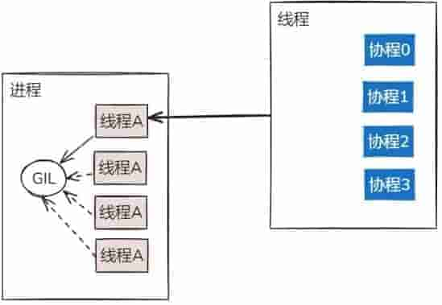
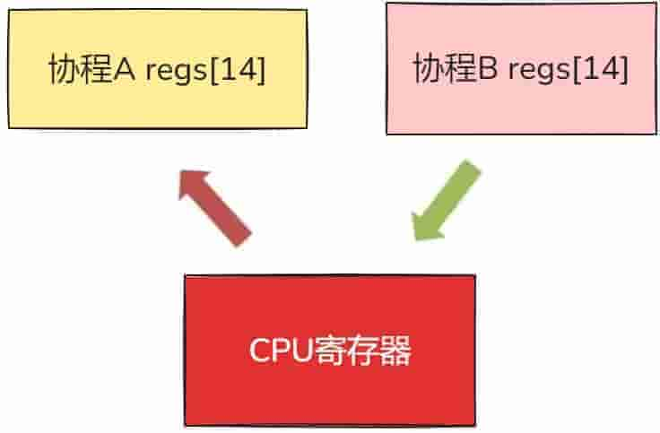
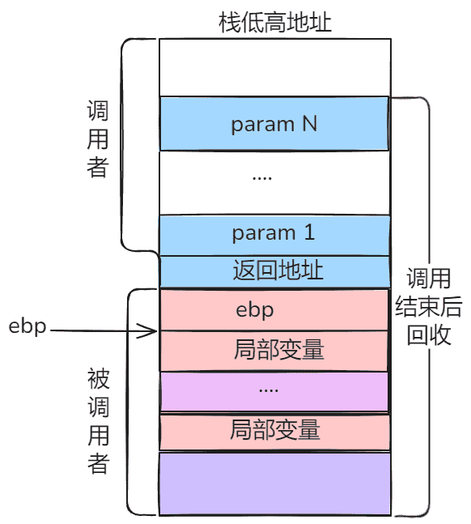
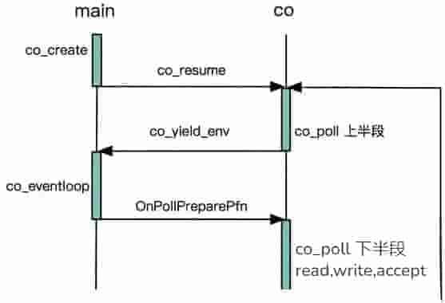

# C/C++协程

>   原文：https://zhuanlan.zhihu.com/p/1919754917599507064



在 C/C++ 编程的广袤天地中，高并发一直是开发者们追求的圣杯。传统的多线程、多进程编程模式，在带来强大并发能力的同时，也伴随着高昂的资源开销与复杂的同步问题。想象一下，一个庞大的服务器程序，需要同时处理成千上万的客户端请求，若采用传统方式，光是线程的频繁切换与资源竞争，就可能让程序陷入性能瓶颈的泥沼。

此时，协程宛如一颗璀璨新星，照亮了高并发编程的新路径。协程，这一轻量级的并发编程模型，可在单线程内实现多任务的高效协作。它就像一位训练有素的舞者，在舞台上优雅地暂停、恢复，巧妙地避开资源争夺，使得程序在处理 I/O 密集型任务时，效率得到质的飞跃。

在接下来的内容中，让我们一起从 0 到 1 吃透 C/C++ 协程。我们将深入剖析协程的底层原理，手把手教你如何在代码中巧妙运用协程，解锁高并发编程的新姿势，让你的程序性能更上一层楼。

## 协程(Coroutine)简介

协程，又称微线程，纤程。英文名Coroutine。

协程的概念很早就提出来了，但直到最近几年才在某些语言（如Lua）中得到广泛应用。

子程序，或者称为函数，在所有语言中都是层级调用，比如A调用B，B在执行过程中又调用了C，C执行完毕返回，B执行完毕返回，最后是A执行完毕。所以子程序调用是通过栈实现的，一个线程就是执行一个子程序。

子程序调用总是一个入口，一次返回，调用顺序是明确的。而协程的调用和子程序不同，协程看上去也是子程序，但执行过程中，在子程序内部可中断，然后转而执行别的子程序，在适当的时候再返回来接着执行(注意，在一个子程序中中断，去执行其他子程序，不是函数调用，有点类似CPU的中断)。

比如子程序A、B：

```c++
def A():
    print '1'
    print '2'
    print '3'
def B():
    print 'x'
    print 'y'
    print 'z'
```

假设由协程执行，在执行A的过程中，可以随时中断，去执行B，B也可能在执行过程中中断再去执行A，结果可能是：

```c++
1
2
x
y
3
z
```

但是在A中是没有调用B的，所以协程的调用比函数调用理解起来要难一些。

**看起来A、B的执行有点像多线程，但协程的特点在于是一个线程执行，那和多线程比，协程有何优势？**

最大的优势就是协程极高的执行效率。因为子程序切换不是线程切换，而是由程序自身控制，因此，没有线程切换的开销，和多线程比，线程数量越多，协程的性能优势就越明显。

第二大优势就是不需要多线程的锁机制，因为只有一个线程，也不存在同时写变量冲突，在协程中控制共享资源不加锁，只需要判断状态就好了，所以执行效率比多线程高很多。

因为协程是一个线程执行，那怎么利用多核CPU呢？最简单的方法是多进程+协程，既充分利用多核，又充分发挥协程的高效率，可获得极高的性能。

Python对协程的支持还非常有限，用在generator中的yield可以一定程度上实现协程。虽然支持不完全，但已经可以发挥相当大的威力了。

**来看例子：**

传统的生产者-消费者模型是一个线程写消息，一个线程取消息，通过锁机制控制队列和等待，但一不小心就可能死锁。

如果改用协程，生产者生产消息后，直接通过yield跳转到消费者开始执行，待消费者执行完毕后，切换回生产者继续生产，效率极高：

```python
import time


def consumer():
    r = ''
    while True:
        n = yield r
        if not n:
            return
        print('[CONSUMER] Consuming %s...' % n)
        time.sleep(1)
        r = '200 OK'


def produce(c):
    next(c)
    for n in range(1, 5):
        print('[PRODUCER] Producing %s...' % n)
        r = c.send(n)
        print('[PRODUCER] Consumer return: %s' % r)
    c.close()


if __name__ == '__main__':
    c = consumer()
    produce(c)
```

执行结果：

```c++
[PRODUCER] Producing 1...
[CONSUMER] Consuming 1...
[PRODUCER] Consumer return: 200 OK
[PRODUCER] Producing 2...
[CONSUMER] Consuming 2...
[PRODUCER] Consumer return: 200 OK
[PRODUCER] Producing 3...
[CONSUMER] Consuming 3...
[PRODUCER] Consumer return: 200 OK
[PRODUCER] Producing 4...
[CONSUMER] Consuming 4...
[PRODUCER] Consumer return: 200 OK
```

注意到consumer函数是一个generator（生成器），把一个consumer传入produce后：

-   首先调用c.next()启动生成器；
-   然后，一旦生产了东西，通过c.send(n)切换到consumer执行；
-   consumer通过yield拿到消息，处理，又通过yield把结果传回；
-   produce拿到consumer处理的结果，继续生产下一条消息；
-   produce决定不生产了，通过c.close()关闭consumer，整个过程结束。

整个流程无锁，由一个线程执行，produce和consumer协作完成任务，所以称为“协程”，而非线程的抢占式多任务。

## C/C++ 协程

c++做为一个相对古老的语言，曾经是步履蹒跚，直到c++11才奋起直追，但是对新技术的整体演进，其实c++仍然是保守的。现在c++20的标准虽然已经实现了协程，但目前能比较好支持c++20的编译器几乎都和整体的环境不太兼容。换句话说，还需要继续等待整个c++的迭代版本，可能到了c++23，整体的环境就会跟上去，协程才会真正的飞入程序员的“寻常百姓家”。

正如前面提到的，协程一般来说是不需要锁的，但是如果协程的底层操作是跨越线程动态操作，仍然是需要锁的存在的。这也是为什么要求尽量把协和的调度放到一个线程中去的原因。

与 Python 不同，C/C++ 语言本身是不能天然支持协程的。现有的 C++ 协程库 均基于两种方案：利用汇编代码控制协程上下文的切换，以及利用操作系统提供的 API 来实现协程上下文切换。

典型的例如：

1.  libco，Boost.context：基于汇编代码的上下文切换
2.  phxrpc：基于 ucontext/Boost.context 的上下文切换
3.  libmill：基于 setjump/longjump 的协程切换

一般而言，基于汇编的上下文切换要比采用系统调用的切换更加高效，这也是为什么 phxrpc 在使用 Boost.context 时要比使用 ucontext 性能更好的原因。关于 phxrpc 和 libmill 具体的协程实现方式，以后有时间再详细介绍。

### 2.1协程和线程之间区别

在了解了协程的基本概念之后，很多人可能会将它与线程混淆，毕竟它们都和程序的并发执行有关。那么，协程和线程到底有什么区别呢？接下来，我们就来深入探讨一下。

**(1)线程：操作系统的宠儿**

线程，是操作系统能够进行运算调度的最小单位。它被包含在进程之中，是进程中的实际运作单位。打个比方，如果把进程看作是一个工厂，那么线程就是工厂里的工人，每个工人都可以独立执行任务，但又共享着工厂的资源。

线程的创建、调度和切换都由操作系统内核负责。当我们在程序中创建一个线程时，操作系统会为它分配一系列的资源，包括独立的栈空间、程序计数器（PC）等。线程的调度采用的是抢占式调度策略，也就是说，操作系统会根据一定的算法，在适当的时候剥夺当前正在执行的线程的 CPU 使用权，将其放入就绪队列，然后从就绪队列中选择一个新的线程来执行。这种调度方式可以保证多个线程能够公平地竞争 CPU 资源，实现并发执行。

**(2)协程：轻量级的后起之秀**

协程则是一种用户态的轻量级线程，它的调度完全由用户控制，而不是操作系统。这就好比一个小组里的成员，他们可以自行决定任务的执行顺序和时间，不需要外部的强制干预。

在 C/C++ 中，协程通常通过函数库或者语言特性来实现。创建协程时，系统只会为其分配少量的资源，比如一个很小的栈空间，用于保存协程的执行状态和局部变量。协程的调度是协作式的，也就是说，只有当一个协程主动让出执行权时，其他协程才有机会执行。比如，当一个协程遇到 I/O 操作、调用特定的挂起函数或者执行时间过长时，它可以主动暂停自己的执行，将执行权交给其他协程。

**(3)二者之间的区别**

调度方式：线程由操作系统内核调度，采用抢占式调度策略；而协程由用户控制调度，采用协作式调度策略。这就导致了线程的调度是被动的，而协程的调度是主动的。

上下文切换：线程的上下文切换涉及到用户态和内核态的切换，需要保存和恢复寄存器、栈指针等大量的状态信息，开销较大；而协程的上下文切换只在用户态进行，只需要保存和恢复少量的寄存器和栈信息，开销非常小，甚至可以忽略不计。

资源占用：线程的创建和销毁需要操作系统分配和回收大量的资源，每个线程都有自己独立的栈空间，通常栈空间较大，所以线程占用的资源较多；而协程的创建和销毁开销小，占用的资源也很少，一个线程中可以创建成百上千个协程。

适用场景：线程适用于需要充分利用多核 CPU 资源、处理计算密集型任务的场景；而协程适用于 I/O 密集型任务，比如网络请求、文件读写等，因为在这些场景中，大量的时间都花费在等待 I/O 操作完成上，协程可以在等待时主动让出执行权，提高程序的整体效率。

为了更直观地感受线程和协程的区别，我们来看下面这个表格：

| 比较项         | 线程           | 协程           |
| -------------- | -------------- | -------------- |
| 调度者         | 操作系统内核   | 用户程序       |
| 上下文切换开销 | 大             | 小             |
| 资源占用       | 多             | 少             |
| 适用场景       | 计算密集型任务 | I/O 密集型任务 |

### 2.2协程的原理

既然协程如此厉害，那么它实现的原理到底是什么呢？协程最重要的应用方式就是把线程在内核上的开销转到了应用层的开销，避开或者屏蔽（对应用者）线程操作的难度。那多线程操作的复杂性在哪儿呢？线程切换的随机性和线程Context的跟随，出入栈的保存和恢复，相关数据的锁和读写控制。这才是多线程的复杂性，如果再加异步引起的数据的非连续性和事件的非必然性操作，就更加增强了多线程遇到问题的判别和断点的准确。

好，既然是这样，那么上框架，封装不就得了。

协程和线程一样，同样需要做好两个重点：第一个是协程的调度；第二是上下文的切换。而这两点在OS的相关书籍中的介绍海了去了，这里就不再赘述，原理基本都是一样的。

如果以协程的关系来区分，协程也可以划分为对称和非对称协程两种。协程间是平等关系的，就是对称的；反之为非对称的。名字越起越多，但事儿还是那么两下子，大家自己体会即可。

只要能保证上面所说的对上下文数据的安全性保证又能够实现协程在具体线程上的操作（某一个线程上执行的所有协程是串行的），那么锁的操作，从理论上讲是不需要的（但实际开发中，因为协程的应用还是少，所以还需要具体的问题具体分析）。协程的动作集中在应用层，而把复杂的内核调度的线程屏蔽在下层框架上（或者以后会不会出现OS进行封装），从而大幅的降低了编程的难度，但却拥有了线程快速异步调用的效果。

### 2.3协程实现机制

**协程的实现有以下几种机制：**

①基于汇编的实现：这个对汇编编程得要求有两下子，这个网上也有不少例子，就不再这里搬门弄斧了。

②基于switch-case来实现：这个其实更像是一个C语言的技巧，利用不同的状态Case来达到目的，或者说大家认知中的对编程语言的一种内卷使用，网上有一个开源的项目：

```c++
https://github.com/georgeredinger/protothreads
```

③基于操作系统提供的接口：Linux的ucontext，Windows的Fiber

Fiber可能很多人都不熟悉，这其实就是微软原来提供的纤程，有兴趣的可以去网上查找一下，有几年这个概念炒得还是比较火的。ucontext是Linux上的一种操作，这两个都可以当作是一种类似特殊的应用存在。游戏界的大佬云风（《游戏之旅：我的编程感悟》作者）的coroutine就是类似于这种。兴趣是编程的动力，大家如果对这些有兴趣可以看看这本书，虽然其中很多的东西都比较老了，但是整体的思想还是非常有借鉴的。

④基于接口 setjmp 和 longjmp同时使用 static local 的变量来保存协程内部的数据

这两个函数是C语言的一个非常有意思的应用，一般写C好长时间的人，都没接触过这两个API函数，这个函数的定义是：

```c++
int setjmp(jmp_buf envbuf);
void longjmp(jmp_buf envbuf, int val);
```

它们两个的作用，前者是用来将栈桢（上下文）保存在jmp_buf这个数据结构中，然后可以通过后者 longjmp在指定的位置恢复出来。这就类似于使用goto语句跳转到任意的地方，然后再把相关的数据恢复出来。看一下个《C专家编程》中的例子：

```c++
#include <stdio.h>
#include <setjmp.h>

jmp_buf buf;

banana()
{
    printf("in banana() \n");
    longjmp(buf,1);
    printf("you'll never see this,because i longjmp'd");
}

main()
{
    if(setjmp(buf))
        printf("back in main\n");
    else
    {
        printf("first time through\n");
        banana();
    }
}
```

看完了上述的几种方法，其实网上还有几种实现的方式，但都是比较刻板，有兴趣的可以搜索一下，这里就不提供链接了。

协程的实现，按理说还是OS搞定最好，其实是框架底层，但C/C++的复杂性，以及不同的平台和不同编译器、库之间的长期差异，导致这方面能做好的可能性真心是觉得不会太大。

## 协程核心原理机制

### 3.1libco协程的创建和切换

在介绍 coroutine 的创建之前，我们先来熟悉一下 libco 中用来表示一个 coroutine 的数据结构，即定义在 co_routine_inner.h 中的 stCoRoutine_t:

```c++
struct stCoRoutine_t
{
    stCoRoutineEnv_t *env; // 协程运行环境
    pfn_co_routine_t pfn; // 协程执行的逻辑函数
    void *arg; // 函数参数
    coctx_t ctx; // 保存协程的下文环境
    ...
    char cEnableSysHook; // 是否运行系统 hook，即非侵入式逻辑
    char cIsShareStack; // 是否在共享栈模式
    void *pvEnv;
    stStackMem_t* stack_mem; // 协程运行时的栈空间
    char* stack_sp; // 用来保存协程运行时的栈空间
    unsigned int save_size;
    char* save_buffer;
};
```

我们暂时只需要了解表示协程的最简单的几个参数，例如协程运行环境，协程的上下文环境，协程运行的函数以及运行时栈空间。后面的 stack_sp，save_size 和 save_buffer 与 libco 共享栈模式相关，有关共享栈的内容我们后续再说。

### 3.2协程的执行流程

为了更直观地理解协程的执行流程，我们来看一个简单的 C++ 代码示例：

```c++
#include <iostream>
#include <coroutine>

struct Task {
    struct promise_type;
    using handle_type = std::coroutine_handle<promise_type>;
    handle_type coro;

    Task(handle_type h) : coro(h) {}

    ~Task() {
        if (coro) coro.destroy();
    }

    bool resume() {
        if (!coro.done()) {
            coro.resume();
            return true;
        }
        return false;
    }

    struct promise_type {
        Task get_return_object() {
            return Task{handle_type::from_promise(*this)};
        }

        std::suspend_never initial_suspend() { return {}; }
        std::suspend_never final_suspend() noexcept { return {}; }

        void return_void() {}
        void unhandled_exception() { std::terminate(); }
    };

    // 协程函数
    static Task simple_coroutine() {
        std::cout << "Coroutine started" << std::endl;
        // 暂停协程
        co_await std::suspend_always{};
        std::cout << "Coroutine resumed" << std::endl;
    }
};

int main() {
    // 创建协程
    Task t = Task::simple_coroutine();
    std::cout << "Main function" << std::endl;
    // 恢复协程执行
    t.resume();
    return 0;
}
```

在这个示例中，我们定义了一个Task结构体来表示一个协程任务。simple_coroutine函数是一个协程函数，它内部使用了co_await关键字来暂停协程的执行。

当main函数中调用Task::simple_coroutine()时，协程开始创建，但并不会立即执行，而是返回一个Task对象。此时，协程处于挂起状态。

接着，main函数继续执行，输出Main function。然后调用t.resume()，协程从上次暂停的地方（即co_await处）恢复执行，输出Coroutine resumed。

从这个示例中，我们可以清晰地看到协程的执行流程：创建协程时，协程函数并不会立即执行完，而是可以通过co_await暂停执行，将执行权交回给调用者；当调用者调用resume方法时，协程又可以从暂停的地方恢复执行。在协程暂停时，其内部的局部变量等状态信息都会被保存下来，以便恢复执行时能够继续之前的操作。

### 3.3实现方式面面观

在 C/C++ 中，实现协程主要有以下几种常见方式：

**⑴利用汇编代码控制上下文切换**

这是一种比较底层的实现方式。通过汇编代码，我们可以直接操作 CPU 寄存器和栈，实现协程上下文的保存和恢复。例如，在 x86 架构下，我们需要保存和恢复rsp（栈指针）、rbp（栈基址指针）、rbx、r12 - r15（数据寄存器）以及rip（程序运行的下一个指令地址）等寄存器的值。因为协程的切换本质上就是上下文的切换，通过精确控制这些寄存器，我们能够实现协程在暂停和恢复时的状态一致性。

这种方式的优点是性能极高，因为直接操作硬件资源，避免了操作系统 API 调用的开销。然而，它的缺点也很明显，代码编写难度大，需要对汇编语言和 CPU 架构有深入的了解，而且可移植性差，不同的 CPU 架构可能需要编写不同的汇编代码。

**⑵使用操作系统提供的 API**

一些操作系统提供了用于上下文切换的 API，比如 Unix 系统中的ucontext和 Windows 系统中的fiber。以ucontext为例，它提供了getcontext、setcontext、makecontext和swapcontext等函数来管理上下文。getcontext用于获取当前上下文，setcontext用于设置上下文，makecontext用于创建一个新的上下文，swapcontext则用于交换两个上下文。

使用这些 API，我们可以相对容易地实现协程的上下文切换。这种方式的优点是实现相对简单，不需要深入了解汇编语言，而且具有较好的可移植性，只要操作系统支持相应的 API。但是，由于涉及到系统调用，性能相对较低，因为系统调用会带来一定的开销，包括用户态和内核态的切换等。

**⑶利用 C 语言的setjmp和longjmp函数**

setjmp函数用于保存当前的调用环境，包括寄存器的值和栈指针等，它会返回一个整数值。longjmp函数则用于恢复之前由setjmp保存的调用环境，并跳转到setjmp调用的位置继续执行。通过这两个函数的配合，我们可以实现协程的暂停和恢复。例如，在协程需要暂停时，调用setjmp保存当前环境，然后在需要恢复时，调用longjmp恢复环境。这种方式的优点是代码实现相对简洁，不需要复杂的汇编知识。但它也有局限性，它要求函数里面使用static local变量来保存协程内部的数据，因为setjmp和longjmp并不会自动保存和恢复局部变量，而且这种方式在处理复杂的函数调用和嵌套时可能会出现问题。

## 协程的实现与原理剖析

### 4.1协程的起源

**问题：协程存在的原因？协程能够解决哪些问题？**

在我们现在CS，BS开发模式下，服务器的吞吐量是一个很重要的参数。其实吞吐量是IO处理时间加上业务处理。为了简单起见，比如，客户端与服务器之间是长连接的，客户端定期给服务器发送心跳包数据。客户端发送一次心跳包到服务器，服务器更新该新客户端状态的。心跳包发送的过程，业务处理时长等于IO读取（RECV系统调用）加上业务处理（更新客户状态）。吞吐量等于1s业务处理次数。

业务处理（更新客户端状态）时间，业务不一样的，处理时间不一样，我们就不做讨论。

那如何提升recv的性能。若只有一个客户端，recv的性能也没有必要提升，也不能提升。若在有百万计的客户端长连接的情况，我们该如何提升。以Linux为例，在这里需要介绍一个“网红”就是epoll。服务器使用epoll管理百万计的客户端长连接，代码框架如下：

```c++
while (1) {
    int nready = epoll_wait(epfd, events, EVENT_SIZE, -1);

    for (i = 0;i < nready;i ++) {

        int sockfd = events[i].data.fd;
        if (sockfd == listenfd) {
            int connfd = accept(listenfd, xxx, xxxx);

            setnonblock(connfd);

            ev.events = EPOLLIN | EPOLLET;
            ev.data.fd = connfd;
            epoll_ctl(epfd, EPOLL_CTL_ADD, connfd, &ev);

        } else {
            handle(sockfd);
        }
    }
}
```

对于响应式服务器，所有的客户端的操作驱动都是来源于这个大循环。来源于epoll_wait的反馈结果。

对于服务器处理百万计的IO。Handle(sockfd)实现方式有两种。

第一种，handle(sockfd)函数内部对sockfd进行读写动作。代码如下

```c++
int handle(int sockfd) {
    recv(sockfd, rbuffer, length, 0);
    parser_proto(rbuffer, length);
    send(sockfd, sbuffer, length, 0);
}
```

handle的io操作（send,recv）与epoll_wait是在同一个处理流程里面的。这就是IO同步操作。

优点：

1.   sockfd管理方便。

2.   操作逻辑清晰。

缺点：

1.   服务器程序依赖epoll_wait的循环响应速度慢。

2.   程序性能差

第二种，handle(sockfd)函数内部将sockfd的操作，push到线程池中，代码如下：

```c++
int thread_cb(int sockfd) {
    // 此函数是在线程池创建的线程中运行。
    // 与handle不在一个线程上下文中运行
    recv(sockfd, rbuffer, length, 0);
    parser_proto(rbuffer, length);
    send(sockfd, sbuffer, length, 0);
}

int handle(int sockfd) {
    //此函数在主线程 main_thread 中运行
    //在此处之前，确保线程池已经启动。
    push_thread(sockfd, thread_cb); //将sockfd放到其他线程中运行。
}
```

Handle函数是将sockfd处理方式放到另一个已经其他的线程中运行，如此做法，将io操作（recv，send）与epoll_wait 不在一个处理流程里面，使得io操作（recv,send）与epoll_wait实现解耦。这就叫做IO异步操作。

优点：

1.  子模块好规划。
2.  程序性能高。

缺点：

正因为子模块好规划，使得模块之间的sockfd的管理异常麻烦。每一个子线程都需要管理好sockfd，避免在IO操作的时候，sockfd出现关闭或其他异常。

上文有提到IO同步操作，程序响应慢，IO异步操作，程序响应快。

下面来对比一下IO同步操作与IO异步操作。

代码如下：

```c++
https://github.com/wangbojing/c1000k_test/blob/master/server_mulport_epoll.c
```

在这份代码的486行，#if 1, 打开的时候，为IO异步操作。关闭的时候，为IO同步操作。

接下来把我测试接入量的结果粘贴出来。

-   IO异步操作，每1000个连接接入的服务器响应时间（900ms左右）。
-   IO同步操作，每1000个连接接入的服务器响应时间（6500ms左右）。
-   IO异步操作与IO同步操作

对比项

-   IO同步操作
-   IO异步操作

Sockfd管理

-   管理方便
-   多个线程共同管理

代码逻辑

-   程序整体逻辑清晰
-   子模块逻辑清晰

程序性能

-   响应时间长，性能差
-   响应时间短，性能好

有没有一种方式，有异步性能，同步的代码逻辑。来方便编程人员对IO操作的组件呢？有，采用一种轻量级的协程来实现。在每次send或者recv之前进行切换，再由调度器来处理epoll_wait的流程。

就是采用了基于这样的思考，写了NtyCo，实现了一个IO异步操作与协程结合的组件。

### 4.2协程的案例

**问题：协程如何使用？与线程使用有何区别？**

在做网络IO编程的时候，有一个非常理想的情况，就是每次accept返回的时候，就为新来的客户端分配一个线程，这样一个客户端对应一个线程。就不会有多个线程共用一个sockfd。每请求每线程的方式，并且代码逻辑非常易读。但是这只是理想，线程创建代价，调度代价就呵呵了。

先来看一下每请求每线程的代码如下：

```c++
while(1) {
    socklen_t len = sizeof(struct sockaddr_in);
    int clientfd = accept(sockfd, (struct sockaddr*)&remote, &len);

    pthread_t thread_id;
    pthread_create(&thread_id, NULL, client_cb, &clientfd);
}
```

这样的做法，写完放到生产环境下面，如果你的老板不打死你，你来找我。我来帮你老板，为民除害。

如果我们有协程，我们就可以这样实现。参考代码如下：

```c++
https://github.com/wangbojing/NtyCo/blob/master/nty_server_test.c

while (1) {
    socklen_t len = sizeof(struct sockaddr_in);
    int cli_fd = nty_accept(fd, (struct sockaddr*)&remote, &len);

    nty_coroutine *read_co;
    nty_coroutine_create(&read_co, server_reader, &cli_fd)；
}
```

这样的代码是完全可以放在生成环境下面的。如果你的老板要打死你，你来找我，我帮你把你老板打死，为民除害。

线程的API思维来使用协程，函数调用的性能来测试协程。

NtyCo封装出来了若干接口，一类是协程本身的，二类是posix的异步封装

协程API：while

1.   协程创建

```c++
int nty_coroutine_create(nty_coroutine **new_co, proc_coroutine func, void *arg)
```

2.   协程调度器的运行

```c++
void nty_schedule_run(void)
```

POSIX异步封装API：

```c++
int nty_socket(int domain, int type, int protocol)
int nty_accept(int fd, struct sockaddr *addr, socklen_t *len)
int nty_recv(int fd, void *buf, int length)
int nty_send(int fd, const void *buf, int length)
int nty_close(int fd)
```

### 4.3协程的实现之工作流程

**问题：协程内部是如何工作呢？**

先来看一下协程服务器案例的代码，代码参考：

```c++
https://github.com/wangbojing/NtyCo/blob/master/nty_server_test.c
```

分别讨论三个协程的比较晦涩的工作流程。第一个协程的创建；第二个IO异步操作；第三个协程子过程回调

**(1)创建协程**

当我们需要异步调用的时候，我们会创建一个协程。比如accept返回一个新的sockfd，创建一个客户端处理的子过程。再比如需要监听多个端口的时候，创建一个server的子过程，这样多个端口同时工作的，是符合微服务的架构的。

**创建协程的时候，进行了如何的工作？**

创建API如下：

```c++
int nty_coroutine_create(nty_coroutine **new_co, proc_coroutine func, void *arg)
```

-   参数1：nty_coroutine **new_co，需要传入空的协程的对象，这个对象是由内部创建的，并且在函数返回的时候，会返回一个内部创建的协程对象。
-   参数2：proc_coroutine func，协程的子过程。当协程被调度的时候，就会执行该函数。
-   参数3：void *arg，需要传入到新协程中的参数。

协程不存在亲属关系，都是一致的调度关系，接受调度器的调度。调用create API就会创建一个新协程，新协程就会加入到调度器的就绪队列中。

创建的协程具体步骤会在《协程的实现之原语操作》来描述。

**(2)实现IO异步操作**

大部分的朋友会关心IO异步操作如何实现，在send与recv调用的时候，如何实现异步操作的。

先来看一下一段代码：

```c++
while (1) {
    int nready = epoll_wait(epfd, events, EVENT_SIZE, -1);

    for (i = 0;i < nready;i ++) {

        int sockfd = events[i].data.fd;
        if (sockfd == listenfd) {
            int connfd = accept(listenfd, xxx, xxxx);

            setnonblock(connfd);

            ev.events = EPOLLIN | EPOLLET;
            ev.data.fd = connfd;
            epoll_ctl(epfd, EPOLL_CTL_ADD, connfd, &ev);

        } else {

            epoll_ctl(epfd, EPOLL_CTL_DEL, sockfd, NULL);
            recv(sockfd, buffer, length, 0);

            //parser_proto(buffer, length);

            send(sockfd, buffer, length, 0);
            epoll_ctl(epfd, EPOLL_CTL_ADD, sockfd, NULL);
        }
    }
}
```

在进行IO操作（recv，send）之前，先执行了 epoll_ctl的del操作，将相应的sockfd从epfd中删除掉，在执行完IO操作（recv，send）再进行epoll_ctl的add的动作。这段代码看起来似乎好像没有什么作用。

如果是在多个上下文中，这样的做法就很有意义了。能够保证sockfd只在一个上下文中能够操作IO的。不会出现在多个上下文同时对一个IO进行操作的。协程的IO异步操作正式是采用此模式进行的。

把单一协程的工作与调度器的工作的划分清楚，先引入两个原语操作 resume，yield会在《协程的实现之原语操作》来讲解协程所有原语操作的实现，yield就是让出运行，resume就是恢复运行。

**调度器与协程的上下文切换如下图所示：**



在协程的上下文IO异步操作（nty_recv，nty_send）函数，步骤如下：

1.  将sockfd 添加到epoll管理中。
2.  进行上下文环境切换，由协程上下文yield到调度器的上下文。
3.  调度器获取下一个协程上下文。Resume新的协程

IO异步操作的上下文切换的时序图如下：


**(3)回调协程的子过程**

在create协程后，何时回调子过程？何种方式回调子过程？

首先来回顾一下x86_64寄存器的相关知识。汇编与寄存器相关知识还会在《协程的实现之切换》继续深入探讨的。x86_64 的寄存器有16个64位寄存器，分别是：

```c++
%rax, %rbx,%rcx, %esi, %edi, %rbp, %rsp, %r8, %r9, %r10, %r11, %r12, %r13, %r14, %r15。
```

-   %rax 作为函数返回值使用的。
-   %rsp 栈指针寄存器，指向栈顶
-   %rdi, %rsi, %rdx, %rcx, %r8, %r9 用作函数参数，依次对应第1参数，第2参数。。。
-   %rbx, %rbp, %r12, %r13, %r14, %r15 用作数据存储，遵循调用者使用规则，换句话说，就是随便用。调用子函数之前要备份它，以防它被修改
-   %r10, %r11 用作数据存储，就是使用前要先保存原值

以NtyCo的实现为例，来分析这个过程。CPU有一个非常重要的寄存器叫做EIP，用来存储CPU运行下一条指令的地址。我们可以把回调函数的地址存储到EIP中，将相应的参数存储到相应的参数寄存器中。实现子过程调用的逻辑代码如下：

```c++
void _exec(nty_coroutine *co) {
    co->func(co->arg); //子过程的回调函数
}

void nty_coroutine_init(nty_coroutine *co) {
    //ctx 就是协程的上下文
    co->ctx.edi = (void*)co; //设置参数
    co->ctx.eip = (void*)_exec; //设置回调函数入口
    //当实现上下文切换的时候，就会执行入口函数_exec , _exec 调用子过程func
}
```

### 4.4协程的实现之原语操作

**问题：协程的内部原语操作有哪些？分别如何实现的？**

协程的核心原语操作：create, resume, yield。协程的原语操作有create怎么没有exit？以NtyCo为例，协程一旦创建就不能有用户自己销毁，必须得以子过程执行结束，就会自动销毁协程的上下文数据。以_exec执行入口函数返回而销毁协程的上下文与相关信息。co->func(co->arg) 是子过程，若用户需要长久运行协程，就必须要在func函数里面写入循环等操作。所以NtyCo里面没有实现exit的原语操作。

create：创建一个协程。

1.   调度器是否存在，不存在也创建。调度器作为全局的单例。将调度器的实例存储在线程的私有空间pthread_setspecific。

2.   分配一个coroutine的内存空间，分别设置coroutine的数据项，栈空间，栈大小，初始状态，创建时间，子过程回调函数，子过程的调用参数。

3.   将新分配协程添加到就绪队列 ready_queue中

实现代码如下：

```c++
int nty_coroutine_create(nty_coroutine **new_co, proc_coroutine func, void *arg) {

    assert(pthread_once(&sched_key_once, nty_coroutine_sched_key_creator) == 0);
    nty_schedule *sched = nty_coroutine_get_sched();

    if (sched == NULL) {
        nty_schedule_create(0);

        sched = nty_coroutine_get_sched();
        if (sched == NULL) {
            printf("Failed to create schedulern");
            return -1;
        }
    }

    nty_coroutine *co = calloc(1, sizeof(nty_coroutine));
    if (co == NULL) {
        printf("Failed to allocate memory for new coroutinen");
        return -2;
    }

    //
    int ret = posix_memalign(&co->stack, getpagesize(), sched->stack_size);
    if (ret) {
        printf("Failed to allocate stack for new coroutinen");
        free(co);
        return -3;
    }

    co->sched = sched;
    co->stack_size = sched->stack_size;
    co->status = BIT(NTY_COROUTINE_STATUS_NEW); //
    co->id = sched->spawned_coroutines ++;
co->func = func;

    co->fd = -1;
co->events = 0;

    co->arg = arg;
    co->birth = nty_coroutine_usec_now();
    *new_co = co;

    TAILQ_INSERT_TAIL(&co->sched->ready, co, ready_next);

    return 0;
}
```

yield：让出CPU。

```c++
void nty_coroutine_yield(nty_coroutine *co)
```

参数：当前运行的协程实例

调用后该函数不会立即返回，而是切换到最近执行resume的上下文。该函数返回是在执行resume的时候，会有调度器统一选择resume的，然后再次调用yield的。resume与yield是两个可逆过程的原子操作。

resume：恢复协程的运行权

```c++
int nty_coroutine_resume(nty_coroutine *co)
```

参数：需要恢复运行的协程实例

调用后该函数也不会立即返回，而是切换到运行协程实例的yield的位置。返回是在等协程相应事务处理完成后，主动yield会返回到resume的地方。

### 4.5协程的实现之切换

**问题：协程的上下文如何切换？切换代码如何实现？**

首先来回顾一下x86_64寄存器的相关知识。x86_64 的寄存器有16个64位寄存器，分别是：

```c++
%rax, %rbx, %rcx, %esi, %edi, %rbp, %rsp, %r8, %r9, %r10, %r11, %r12,%r13, %r14, %r15。
```

-   %rax 作为函数返回值使用的。
-   %rsp 栈指针寄存器，指向栈顶
-   %rdi, %rsi, %rdx, %rcx, %r8, %r9 用作函数参数，依次对应第1参数，第2参数。。。
-   %rbx, %rbp, %r12, %r13, %r14, %r15 用作数据存储，遵循调用者使用规则，换句话说，就是随便用。调用子函数之前要备份它，以防它被修改
-   %r10, %r11 用作数据存储，就是使用前要先保存原值。

上下文切换，就是将CPU的寄存器暂时保存，再将即将运行的协程的上下文寄存器，分别mov到相对应的寄存器上。此时上下文完成切换。如下图所示：

切换_switch函数定义：

```c++
int _switch(nty_cpu_ctx *new_ctx, nty_cpu_ctx *cur_ctx);
```

-   参数1：即将运行协程的上下文，寄存器列表
-   参数2：正在运行协程的上下文，寄存器列表

我们nty_cpu_ctx结构体的定义，为了兼容x86，结构体项命令采用的是x86的寄存器名字命名。

```c++
typedef struct _nty_cpu_ctx {
void *esp; //
void *ebp;
void *eip;
void *edi;
void *esi;
void *ebx;
void *r1;
void *r2;
void *r3;
void *r4;
void *r5;
} nty_cpu_ctx;
```

_switch返回后，执行即将运行协程的上下文，是实现上下文的切换；

_switch的实现代码：

```c++
0: __asm__ (
1: "    .text                                  n"
2: "       .p2align 4,,15                                   n"
3: ".globl _switch                                          n"
4: ".globl __switch                                         n"
5: "_switch:                                                n"
6: "__switch:                                               n"
7: "       movq %rsp, 0(%rsi)      # save stack_pointer     n"
8: "       movq %rbp, 8(%rsi)      # save frame_pointer     n"
9: "       movq (%rsp), %rax       # save insn_pointer      n"
10: "       movq %rax, 16(%rsi)                              n"
11: "       movq %rbx, 24(%rsi)     # save rbx,r12-r15       n"
12: "       movq %r12, 32(%rsi)                              n"
13: "       movq %r13, 40(%rsi)                              n"
14: "       movq %r14, 48(%rsi)                              n"
15: "       movq %r15, 56(%rsi)                              n"
16: "       movq 56(%rdi), %r15                              n"
17: "       movq 48(%rdi), %r14                              n"
18: "       movq 40(%rdi), %r13     # restore rbx,r12-r15    n"
19: "       movq 32(%rdi), %r12                              n"
20: "       movq 24(%rdi), %rbx                              n"
21: "       movq 8(%rdi), %rbp      # restore frame_pointer  n"
22: "       movq 0(%rdi), %rsp      # restore stack_pointer  n"
23: "       movq 16(%rdi), %rax     # restore insn_pointer   n"
24: "       movq %rax, (%rsp)                                n"
25: "       ret                                              n"
26: );
```

按照x86_64的寄存器定义，%rdi保存第一个参数的值，即new_ctx的值，%rsi保存第二个参数的值，即保存cur_ctx的值。X86_64每个寄存器是64bit，8byte。

1.  Movq %rsp, 0(%rsi) 保存在栈指针到cur_ctx实例的rsp项
2.  Movq %rbp, 8(%rsi)
3.  Movq (%rsp), %rax #将栈顶地址里面的值存储到rax寄存器中。Ret后出栈，执行栈顶
4.  Movq %rbp, 8(%rsi) #后续的指令都是用来保存CPU的寄存器到new_ctx的每一项中
5.  Movq 8(%rdi), %rbp #将new_ctx的值
6.  Movq 16(%rdi), %rax #将指令指针rip的值存储到rax中
7.  Movq %rax, (%rsp) # 将存储的rip值的rax寄存器赋值给栈指针的地址的值。
8.  Ret # 出栈，回到栈指针，执行rip指向的指令。

上下文环境的切换完成。

### 4.6协程的实现之定义

**问题：协程如何定义? 调度器如何定义？**

先来一道设计题：设计一个协程的运行体R与运行体调度器S的结构体

1.   运行体R：包含运行状态{就绪，睡眠，等待}，运行体回调函数，回调参数，栈指针，栈大小，当前运行体

2.   调度器S：包含执行集合{就绪，睡眠，等待}

这道设计题拆分两个个问题，一个运行体如何高效地在多种状态集合更换。调度器与运行体的功能界限。

**(1)运行体如何高效地在多种状态集合更换**

新创建的协程，创建完成后，加入到就绪集合，等待调度器的调度；协程在运行完成后，进行IO操作，此时IO并未准备好，进入等待状态集合；IO准备就绪，协程开始运行，后续进行sleep操作，此时进入到睡眠状态集合。

-   就绪(ready)，睡眠(sleep)，等待(wait)集合该采用如何数据结构来存储？
-   就绪(ready)集合并不没有设置优先级的选型，所有在协程优先级一致，所以可以使用队列来存储就绪的协程，简称为就绪队列（ready_queue）。
-   睡眠(sleep)集合需要按照睡眠时长进行排序，采用红黑树来存储，简称睡眠树(sleep_tree)红黑树在工程实用为<key, value>, key为睡眠时长，value为对应的协程结点。
-   等待(wait)集合，其功能是在等待IO准备就绪，等待IO也是有时长的，所以等待(wait)集合采用红黑树的来存储，简称等待树(wait_tree)，此处借鉴nginx的设计。

Coroutine就是协程的相应属性，status表示协程的运行状态。sleep与wait两颗红黑树，ready使用的队列，比如某协程调用sleep函数，加入睡眠树(sleep_tree)，status |= S即可。比如某协程在等待树(wait_tree)中，而IO准备就绪放入ready队列中，只需要移出等待树(wait_tree)，状态更改status &= ~W即可。有一个前提条件就是不管何种运行状态的协程，都在就绪队列中，只是同时包含有其他的运行状态。

**(2)调度器与协程的功能界限**

每一协程都需要使用的而且可能会不同属性的，就是协程属性。每一协程都需要的而且数据一致的，就是调度器的属性。比如栈大小的数值，每个协程都一样的后不做更改可以作为调度器的属性，如果每个协程大小不一致，则可以作为协程的属性。

用来管理所有协程的属性，作为调度器的属性。比如epoll用来管理每一个协程对应的IO，是需要作为调度器属性。

按照前面几章的描述，定义一个协程结构体需要多少域，我们描述了每一个协程有自己的上下文环境，需要保存CPU的寄存器ctx；需要有子过程的回调函数func；需要有子过程回调函数的参数 arg；需要定义自己的栈空间 stack；需要有自己栈空间的大小 stack_size；需要定义协程的创建时间 birth；需要定义协程当前的运行状态 status；需要定当前运行状态的结点（ready_next, wait_node, sleep_node）；需要定义协程id；需要定义调度器的全局对象 sched。

协程的核心结构体如下：

```c++
typedef struct _nty_coroutine {

    nty_cpu_ctx ctx;
    proc_coroutine func;
    void *arg;
    size_t stack_size;

    nty_coroutine_status status;
    nty_schedule *sched;

    uint64_t birth;
    uint64_t id;

    void *stack;

    RB_ENTRY(_nty_coroutine) sleep_node;
    RB_ENTRY(_nty_coroutine) wait_node;

    TAILQ_ENTRY(_nty_coroutine) ready_next;
    TAILQ_ENTRY(_nty_coroutine) defer_next;

} nty_coroutine;
```

调度器是管理所有协程运行的组件，协程与调度器的运行关系。

调度器的属性，需要有保存CPU的寄存器上下文 ctx，可以从协程运行状态yield到调度器运行的。从协程到调度器用yield，从调度器到协程用resume以下为协程的定义。

```c++
typedef struct _nty_coroutine_queue nty_coroutine_queue;

typedef struct _nty_coroutine_rbtree_sleep nty_coroutine_rbtree_sleep;
typedef struct _nty_coroutine_rbtree_wait nty_coroutine_rbtree_wait;

typedef struct _nty_schedule {
    uint64_t birth;
nty_cpu_ctx ctx;

    struct _nty_coroutine *curr_thread;
    int page_size;

    int poller_fd;
    int eventfd;
    struct epoll_event eventlist[NTY_CO_MAX_EVENTS];
    int nevents;

    int num_new_events;

    nty_coroutine_queue ready;
    nty_coroutine_rbtree_sleep sleeping;
    nty_coroutine_rbtree_wait waiting;

} nty_schedule;
```

### 4.7协程的实现之调度器

**问题：协程如何被调度？**

调度器的实现，有两种方案，一种是生产者消费者模式，另一种多状态运行。

**(1)生产者消费者模式**

逻辑代码如下：

```c++
while (1) {

        //遍历睡眠集合，将满足条件的加入到ready
        nty_coroutine *expired = NULL;
        while ((expired = sleep_tree_expired(sched)) != ) {
            TAILQ_ADD(&sched->ready, expired);
        }

        //遍历等待集合，将满足添加的加入到ready
        nty_coroutine *wait = NULL;
        int nready = epoll_wait(sched->epfd, events, EVENT_MAX, 1);
        for (i = 0;i < nready;i ++) {
            wait = wait_tree_search(events[i].data.fd);
            TAILQ_ADD(&sched->ready, wait);
        }

        // 使用resume回复ready的协程运行权
        while (!TAILQ_EMPTY(&sched->ready)) {
            nty_coroutine *ready = TAILQ_POP(sched->ready);
            resume(ready);
        }
    }
```

**(2)多状态运行**

实现逻辑代码如下：

```c++
while (1) {

        //遍历睡眠集合，使用resume恢复expired的协程运行权
        nty_coroutine *expired = NULL;
        while ((expired = sleep_tree_expired(sched)) != ) {
            resume(expired);
        }

        //遍历等待集合，使用resume恢复wait的协程运行权
        nty_coroutine *wait = NULL;
        int nready = epoll_wait(sched->epfd, events, EVENT_MAX, 1);
        for (i = 0;i < nready;i ++) {
            wait = wait_tree_search(events[i].data.fd);
            resume(wait);
        }

        // 使用resume恢复ready的协程运行权
        while (!TAILQ_EMPTY(sched->ready)) {
            nty_coroutine *ready = TAILQ_POP(sched->ready);
            resume(ready);
        }
    }
```

### 4.8协程性能测试

测试环境：4台VMWare 虚拟机

-   1台服务器 6G内存，4核CPU
-   3台客户端 2G内存，2核CPU

操作系统：ubuntu 14.04

-   服务器端测试代码：[https://github.com/wangbojing/NtyCo](https://link.zhihu.com/?target=https%3A//github.com/wangbojing/NtyCo)
-   客户端测试代码：[https://github.com/wangbojing/c1000k_test/blob/master/client_mutlport_epoll.c](https://link.zhihu.com/?target=https%3A//github.com/wangbojing/c1000k_test/blob/master/client_mutlport_epoll.c)
-   按照每一个连接启动一个协程来测试。每一个协程栈空间 4096byte
-   6G内存 –> 测试协程数量100W无异常。并且能够正常收发数据。

## 协程创建和运行

由于多个协程运行于一个线程内部的，因此当创建线程中的第一个协程时，需要初始化该协程所在的环境 stCoRoutineEnv_t，这个环境是线程用来管理协程的，通过该环境，线程可以得知当前一共创建了多少个协程，当前正在运行哪一个协程，当前应当如何调度协程：

```c++
struct stCoRoutineEnv_t
{
stCoRoutine_t *pCallStack[ 128 ]; // 记录当前创建的协程
int iCallStackSize; // 记录当前一共创建了多少个协程
stCoEpoll_t *pEpoll; // 该线程的协程调度器
// 在使用共享栈模式拷贝栈内存时记录相应的 coroutine
stCoRoutine_t* pending_co;
stCoRoutine_t* occupy_co;
};
```

上述代码表明 libco 允许一个线程内最多创建 128 个协程，其中 pCallStack[iCallStackSize-1] 也就是栈顶的协程表示当前正在运行的协程。当调用函数 co_create 时，首先检查当前线程中的 coroutine env 结构是否创建。这里 libco 对于每个线程内的 stCoRoutineEnv_t 并没有使用 thread-local 的方式（例如gcc 内置的 __thread，phxrpc采用这种方式）来管理，而是预先定义了一个大的数组，并通过对应的 PID 来获取其协程环境。

```c++
static stCoRoutineEnv_t* g_arrCoEnvPerThread[204800]
stCoRoutineEnv_t *co_get_curr_thread_env()
{
return g_arrCoEnvPerThread[ GetPid() ];
}
```

初始化 stCoRoutineEnv_t 时主要完成以下几步：

为 stCoRoutineEnv_t 申请空间并且进行初始化，设置协程调度器 pEpoll。

创建一个空的 coroutine，初始化其上下文环境( 有关 coctx 在后文详细介绍 )，将其加入到该线程的协程环境中进行管理，并且设置其为 main coroutine。这个 main coroutine 用来运行该线程主逻辑。

当初始化完成协程环境之后，调用函数 co_create_env 来创建具体的协程，该函数初始化一个协程结构 stCoRoutine_t，设置该结构中的各项字段，例如运行的函数 pfn，运行时的栈地址等等。需要说明的就是，如果使用了非共享栈模式，则需要为该协程单独申请栈空间，否则从共享栈中申请空间。栈空间表示如下：

```c++
struct stStackMem_t
{
stCoRoutine_t* occupy_co; // 使用该栈的协程
int stack_size; // 栈大小
char* stack_bp; // 栈的指针，栈从高地址向低地址增长
char* stack_buffer; // 栈底
};
```

使用 co_create 创建完一个协程之后，将调用 co_resume 来将该协程激活运行：

```c++
void co_resume( stCoRoutine_t *co )
{
stCoRoutineEnv_t *env = co->env;
// 获取当前正在运行的协程的结构
stCoRoutine_t *lpCurrRoutine = env->pCallStack[ env->iCallStackSize - 1 ];
if( !co->cStart )
{
// 为将要运行的 co 布置上下文环境
coctx_make( &co->ctx,(coctx_pfn_t)CoRoutineFunc,co,0 );
co->cStart = 1;
}
env->pCallStack[ env->iCallStackSize++ ] = co; // 设置co为运行的线程
co_swap( lpCurrRoutine, co );
}
```

函数 co_swap 的作用类似于 Unix 提供的函数 swapcontext：将当前正在运行的 coroutine 的上下文以及状态保存到结构 lpCurrRoutine 中，并且将 co 设置成为要运行的协程，从而实现协程的切换。co_swap 具体完成三项工作：

记录当前协程 curr 的运行栈的栈顶指针，通过 char c; curr_stack_sp=&c 实现，当下次切换回 curr时，可以从该栈顶指针指向的位置继续，执行完 curr 后可以顺利释放该栈。

处理共享栈相关的操作，并且调用函数 coctx_swap 来完成上下文环境的切换。注意执行完 coctx_swap之后，执行流程将跳到新的 coroutine 也就是 pending_co 中运行，后续的代码需要等下次切换回 curr 时才会执行。

当下次切换回 curr 时，处理共享栈相关的操作。

对应于 co_resume 函数，协程主动让出执行权则调用 co_yield 函数。co_yield 函数调用了 co_yield_env，将当前协程与当前线程中记录的其他协程进行切换：

```c++
void co_yield_env( stCoRoutineEnv_t *env )
{
stCoRoutine_t *last = env->pCallStack[ env->iCallStackSize - 2 ];
stCoRoutine_t *curr = env->pCallStack[ env->iCallStackSize - 1 ];
env->iCallStackSize--;
co_swap( curr, last);
}
```

前面我们已经提到过，pCallStack 栈顶所指向的即为当前正在运行的协程所对应的结构，因此该函数将 curr 取出来，并将当前正运行的协程上下文保存到该结构上，并切换到协程 last 上执行。接下来我们以 32-bit 的系统为例来分析 libco 是如何实现协程运行环境的切换的。

## 协程上下文的创建和切换

libco 使用结构 struct coctx_t 来表示一个协程的上下文环境：

```c++
struct coctx_t
{
    if defined(__i386__)
        void *regs[ 8 ];
    else
    	void *regs[ 14 ];
    endif
    size_t ss_size;
    char *ss_sp;
};
```



结合上图，我们需要知道关键的几点：

函数调用栈是调用者和被调用者共同负责布置的。Caller 将其参数从右向左反向压栈，再将调用后的返回地址压栈，然后将执行流程交给 Callee。

典型的编译器会将 Callee 函数汇编成为以 push %ebp; move %ebp, %esp; sub $esp N; 这种形式开头的汇编代码。这几句代码主要目的是为了方便 Callee 利用 ebp 来访问调用者提供的参数以及自身的局部变量（如下图）。

当调用过程完成清除了局部变量以后，会执行 pop %ebp; ret，这样指令会跳转到 RA 也就是返回地址上面执行。这一点也是实现协程切换的关键：我们只需要将指定协程的函数指针地址保存到 RA 中，当调用完 coctx_swap 之后，会自动跳转到该协程的函数起始地址开始运行。

了解了这些，我们就来看一下协程上下文环境的初始化函数 coctx_make：

```c++
int coctx_make( coctx_t ctx, coctx_pfn_t pfn, const void s, const void *s1 )
{
    char *sp = ctx->ss_sp + ctx->ss_size - sizeof(coctx_param_t);
    sp = (char*)((unsigned long)sp & -16L);
    coctx_param_t param = (coctx_param_t)sp ;
    param->s1 = s;
    param->s2 = s1;
    memset(ctx->regs, 0, sizeof(ctx->regs));
    ctx->regs[ kESP ] = (char)(sp) - sizeof(void);
    ctx->regs[ kEIP ] = (char*)pfn;
    return 0;
}
```

这段代码应该比较好理解，首先为函数 coctx_pfn_t 预留 2 个参数的栈空间并对其到 16 字节，之后将实参设置到预留的栈上空间中。最后在 ctx 结构中填入相应的，其中记录 reg[kEIP] 返回地址为函数指针 pfn，记录 reg[kESP] 为获得的栈顶指针 sp 减去一个指针长度，这个减去的空间是为返回地址 RA 预留的。当调用 coctx_swap 时，reg[kEIP] 会被放到返回地址 RA 的位置，待 coctx_swap 执行结束，自然会跳转到函数 pfn 处执行。

coctx_swap(ctx1, ctx2) 在 coctx_swap.S 中实现。这里可以看到，该函数并没有使用 push %ebp; move %ebp, %esp; sub $esp N; 开头，因此栈空间分布中不会出现 ebp 的位置。coctx_swap 函数主要分为两段，其首先将当前的上下文环境保存到 ctx1 结构中：

```c++
leal 4(%esp), %eax // eax = old_esp + 4
movl 4(%esp), %esp // 将 esp 的值设为 &ctx1（即ctx1的地址）
leal 32(%esp), %esp // esp = (char*)&ctx1 + 32
pushl %eax // ctx1->regs[EAX] = %eax
pushl %ebp // ctx1->regs[EBP] = %ebp
pushl %esi // ctx1->regs[ESI] = %esi
pushl %edi // ctx1->regs[EDI] = %edi
pushl %edx // ctx1->regs[EDX] = %edx
pushl %ecx // ctx1->regs[ECX] = %ecx
pushl %ebx // ctx1->regs[EBX] = %ebx
pushl -4(%eax) // ctx1->regs[EIP] = RA，注意：%eax-4=%old_esp
```

这里需要注意指令 leal 和 movl 的区别。leal 将 eax 的值设置成为 esp 的值加 4，而 movl 将 esp 的值设为 esp+4 所指向的内存上的值，也就是参数 ctx1 的地址。之后该函数将 ctx2 中记录的上下文恢复到 CPU 寄存器中，并跳转到其函数地址处运行：

```c++
movl 4(%eax), %esp // 将 esp 的值设为 &ctx2（即ctx2的地址）
popl %eax // %eax = ctx1->regs[EIP]，也就是 &pfn
popl %ebx // %ebx = ctx1->regs[EBP]
popl %ecx // %ecx = ctx1->regs[ECX]
popl %edx // %edx = ctx1->regs[EDX]
popl %edi // %edi = ctx1->regs[EDI]
popl %esi // %esi = ctx1->regs[ESI]
popl %ebp // %ebp = ctx1->regs[EBP]
popl %esp // %esp = ctx1->regs[ESP]，即(char)(sp) - sizeof(void)
pushl %eax // RA = %eax = &pfn，注意此时esp已经指向了新的esp
xorl %eax, %eax // reset eax
ret
```

上面的代码看起来可能有些绕：

首先 line 1 将 esp 设置为参数 ctx2 的地址，后续的 popl 操作均在 ctx2 的内存空间上执行。

line 2-9 将 ctx2->regs[] 中的内容恢复到相应的寄存器中。还记得在前面 coctx_make 中设置了 regs[EIP] 和 regs[ESP] 吗？这里刚好就对应恢复了相应的值。

当执行完 line 9 之后，esp 已经指向了 ctx2 中新的栈顶指针，由于在 coctx_make 中预留了一个指针长度的 RA 空间，line 10 刚好将新的函数指针 &pfn 设置到该 RA 上。

最后执行 ret 指令时，函数流程将跳到 pfn 处执行。这样，整个协程上下文的切换就完成了。

## 如何使用 libco

我们首先以 libco 提供的例子 example_echosvr.cpp 来介绍应用程序如何使用 libco 来编写服务端程序。在 example_echosvr.cpp 的 main 函数中，主要执行如下几步：

创建 socket，监听在本机的 1024 端口，并设置为非阻塞；

主线程使用函数 readwrite_coroutine 创建多个读写协程，调用 co_resume 启动协程运行直到其挂起。这里我们忽略掉无关的多进程 fork 的过程；

主线程继续创建 socket 接收协程 accpet_co，同样调用 co_resume 启动协程直到其挂起；

主线程调用函数 co_eventloop 实现事件的监听和协程的循环切换；

函数 readwrite_coroutine 在外层循环中将新创建的读写协程都加入到队列 g_readwrite 中，此时这些读写协程都没有具体与某个 socket 连接对应，可以将队列 g_readwrite 看成一个 coroutine pool。当加入到队列中之后，调用函数 co_yield_ct 函数让出 CPU，此时控制权回到主线程。

主线程中的函数 co_eventloop 监听网络事件，将来自于客户端新进的连接交由协程 accept_co 处理，关于 co_eventloop 如何唤醒 accept_co 的细节我们将在后续介绍。accept_co 调用函数 accept_routine 接收新连接，该函数的流程如下：

检查队列 g_readwrite 是否有空闲的读写 coroutine，如果没有，调用函数 poll 将该协程加入到 Epoll 管理的定时器队列中，也就是 sleep(1000) 的作用；

调用 co_accept 来接收新连接，如果接收连接失败，那么调用 co_poll 将服务端的 listen_fd 加入到 Epoll 中来触发下一次连接事件；

对于成功的连接，从 g_readwrite 中取出一个读写协程来负责处理读写；

再次回到函数 readwrite_coroutine 中，该函数会调用 co_poll 将新建立的连接的 fd 加入到 Epoll 监听中，并将控制流程返回到 main 协程；当有读或者写事件发生时，Epoll 会唤醒对应的 coroutine，继续执行 read 函数以及 write 函数。

上面的过程大致说明了控制流程是如何在不同的协程中切换，接下来我们介绍具体的实现细节，即如何通过 Epoll 来管理协程，以及如何对系统函数进行改造以满足 libco 的调用。

## 通过 Epoll 管理和唤醒协程

Epoll监听FD

上一章节中介绍了协程可以通过函数 co_poll 来将 fd 交由 Epoll 管理，待 Epoll 的相应的事件触发时，再切换回来执行 read 或者 write 操作，从而实现由 Epoll 管理协程的功能。co_poll 函数原型如下：

```c++
int co_poll(stCoEpoll_t *ctx, struct pollfd fds[],
nfds_t nfds, int timeout_ms)
```

stCoEpoll_t 是为 libco 定制的 Epoll 相关数据结构，fds 是 pollfd 结构的文件句柄，nfds 为 fds 数组的长度，最后一个参数表示定时器时间，也就是在 timeout 毫秒之后触发处理这些文件句柄。这里可以看到，co_poll 能够同时将多个文件句柄同时加入到 Epoll 管理中。我们先看 stCoEpoll_t 结构：

```c++
struct stCoEpoll_t
{
    int iEpollFd; // Epoll 主 FD
    static const int _EPOLL_SIZE = 1024 * 10; // Epoll 可以监听的句柄总数
    struct stTimeout_t *pTimeout; // 时间轮定时器
    struct stTimeoutItemLink_t *pstTimeoutList; // 已经超时的时间
    struct stTimeoutItemLink_t *pstActiveList; // 活跃的事件
    co_epoll_res *result; // Epoll 返回的事件结果
};
```

以 stTimeout_ 开头的数据结构与 libco 的定时器管理有关，我们在后面介绍。co_epoll_res 是对 Epoll 事件数据结构的封装，也就是每次触发 Epoll 事件时的返回结果，在 Unix 和 MaxOS 下，libco 将使用 Kqueue 替代 Epoll，因此这里也保留了 kevent 数据结构。

```c++
struct co_epoll_res
{
int size;
struct epoll_event *events; // for linux epoll
struct kevent *eventlist; // for Unix or MacOs kqueue
};
```

co_poll 实际是对函数 co_poll_inner 的封装。我们将 co_epoll_inner 函数的结构分为上下两半段。在上半段中，调用 co_poll 的协程 CC 将其需要监听的句柄数组 fds 都加入到 Epoll 管理中，并通过函数 co_yield_env 让出 CPU；当 main 协程的事件循环 co_eventloop 中触发了 CC 对应的监听事件时，会恢复 CC的执行。此时，CC 将开始执行下半段，即将上半段添加的句柄 fds 从 epoll 中移除，清理残留的数据结构，下面的流程图简要说明了控制流的转移过程：



有了上面的基本概念，我们来看具体的实现细节。co_poll 首先在内部将传入的文件句柄数组 fds 转化为数据结构 stPoll_t，这一步主要是为了方便后续处理。该结构记录了 iEpollFd，ndfs，fds 数组，以及该协程需要执行的函数和参数。有两点需要说明的是：

1、对于每一个 fd，为其申请一个 stPollItem_t 来管理对应 Epoll 事件以及记录回调参数。libco 在此做了一个小的优化，对于长度小于 2 的 fds 数组，直接在栈上定义相应的 stPollItem_t 数组，否则从堆中申请内存。这也是一种比较常见的优化，毕竟从堆中申请内存比较耗时；

2、函数指针 OnPollProcessEvent 封装了协程的切换过程。当传入指定的 stPollItem_t 结构时，即可唤醒对应于该结构的 coroutine，将控制权交由其执行；

co_poll 的第二步，也是最关键的一步，就是将 fd 数组全部加入到 Epoll 中进行监听。协程 CC 会将每一个 epoll_event 的 data.ptr 域设置为对应的 stPollItem_t 结构。这样当事件触发时，可以直接从对应的 ptr中取出 stPollItem_t 结构，然后唤醒指定协程。

如果本次操作提供了 Timeout 参数，co_poll 还会将协程 CC 本次操作对应的 stPoll_t 加入到定时器队列中。这表明在 Timeout 定时触发之后，也会唤醒协程 CC 的执行。当整个上半段都完成后，co_poll 立即调用 co_yield_env 让出 CPU，执行流程跳转回到 main 协程中。

从上面的流程图中也可以看出，当执行流程再次跳回时，表明协程 CC 添加的读写等监听事件已经触发，即可以执行相应的读写操作了。此时 CC 首先将其在上半段中添加的监听事件从 Epoll 中删除，清理残留的数据结构，然后调用读写逻辑。

## 定时器实现

协程 CC 在将一组 fds 加入 Epoll 的同时，还能为其设置一个超时时间。在超时时间到期时，也会再次唤醒 CC 来执行。libco 使用 Timing-Wheel 来实现定时器。关于 Timing-Wheel 算法，可以参考，其优势是 O(1) 的插入和删除复杂度，缺点是只有有限的长度，在某些场合下不能满足需求。

回过去看 stCoEpoll_t 结构，其中 pTimeout 代表时间轮，通过函数 AllocateTimeout 初始化为一个固定大小（60 1000）的数组。根据 Timing-Wheel 的特性可知，libco 只支持最大 60s 的定时事件。而实际上，在添加定时器时，libco 要求定时时间不超过 40s。成员 pstTimeoutList 记录在 co_eventloop 中发生超时的事件，而 pstActiveList 记录当前活跃的事件，包括超时事件。这两个结构都将在 co_eventloop 中进行处理。

下面我们简要分析一下加入定时器的实现：

```c++
int AddTimeout( stTimeout_t apTimeout, stTimeoutItem_t apItem,
unsigned long long allNow )
{
if( apTimeout->ullStart == 0 ) // 初始化时间轮的基准时间
{
apTimeout->ullStart = allNow;
apTimeout->llStartIdx = 0; // 当前时间轮指针指向数组0
}
// 1. 当前时间不可能小于时间轮的基准时间
// 2. 加入的定时器的超时时间不能小于当前时间
if( allNow < apTimeout->ullStart || apItem->ullExpireTime < allNow )
{
return __LINE__;
}
int diff = apItem->ullExpireTime - apTimeout->ullStart;
if( diff >= apTimeout->iItemSize ) // 添加的事件不能超过时间轮的大小
{
return __LINE__;
}
// 插入到时间轮盘的指定位置
AddTail( apTimeout->pItems +
(apTimeout->llStartIdx + diff ) % apTimeout->iItemSize, apItem );
return 0;
}
```

定时器的超时检查在函数 co_eventloop 中执行。

## EPOLL 事件循环

main 协程通过调用函数 co_eventloop 来监听 Epoll 事件，并在相应的事件触发时切换到指定的协程执行。有关 co_eventloop 与 应用协程的交互过程在上一节的流程图中已经比较清楚了，下面我们主要介绍一下 co_eventloop 函数的实现：

上文中也提到，通过 epoll_wait 返回的事件都保存在 stCoEpoll_t 结构的 co_epoll_res 中。因此 co_eventloop 首先为 co_epoll_res 申请空间，之后通过一个无限循环来监听所有 coroutine 添加的所有事件：

```c++
for(;;)
{
int ret = co_epoll_wait( ctx->iEpollFd,result,stCoEpoll_t::_EPOLL_SIZE, 1 );
...
}
```

对于每一个触发的事件，co_eventloop 首先通过指针域 data.ptr 取出保存的 stPollItem_t 结构，并将其添加到 pstActiveList 列表中；之后从定时器轮盘中取出所有已经超时的事件，也将其全部添加到 pstActiveList 中，pstActiveList 中的所有事件都作为活跃事件处理。

对于每一个活跃事件，co_eventloop 将通过调用对应的 pfnProcess 也就是上图中的OnPollProcessEvent 函数来切换到该事件对应的 coroutine，将流程跳转到该 coroutine 处执行。

最后 co_eventloop 在调用时也提供一个额外的参数来供调用者传入一个函数指针 pfn。该函数将会在每次循环完成之后执行；当该函数返回 -1 时，将会终止整个事件循环。用户可以利用该函数来控制 main 协程的终止或者完成一些统计需求。
