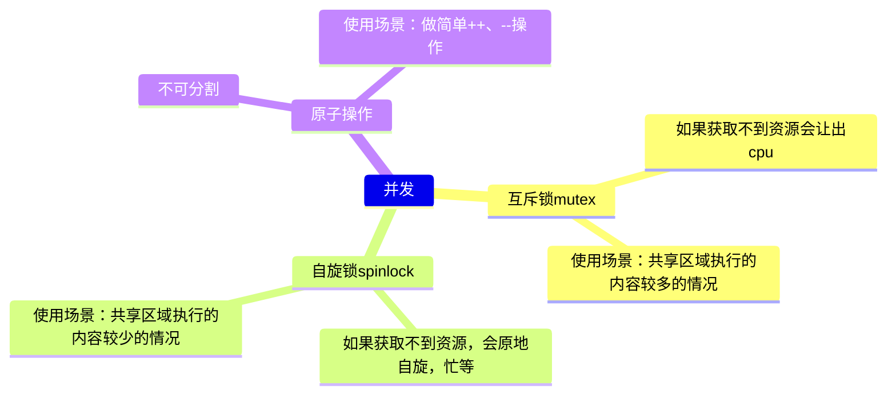

# 异步编程

## 锁的种类

在多线程编程中，使用锁（Locks）来控制对共享资源的访问是常见的做法。不同类型的锁有不同的特性、性能和适用场景。下面是几种常见锁的区别：

### 互斥锁（Mutex）

-   特点：互斥锁用于保护临界区，使得同一时间只能有一个线程访问某个资源。
-   优点：简单易用，广泛支持。
-   缺点：如果线程持有互斥锁时发生阻塞，其他等待该锁的线程将一直被挂起。

适用于**锁住的内容多**，（例如红黑数的增加节点操作），切换线程的代价小于等待的代价

### 读写锁（Read-Write Lock）

-   特点：同时允许多个线程读取，但只允许一个线程写入。即在没有写入操作时，多个读操作可以并行进行。
-   优点：在读多写少的场景下，可以提高并发性。
-   缺点：写操作会导致所有读操作都被阻塞，从而可能影响系统响应时间。

### 自旋锁（Spinlock）

-   特点：当一个线程试图获取自旋锁时，如果发现该锁已经被占用，它会不断循环检查（不断的查看这个资源是否可用，如果可用，就进去访问临界资源，如果不可用，则继续循环访问），而不是让出 CPU 控制权，相当于是一个 **while(1)**
-   优点：在短时间内竞争资源时，自旋锁可以减少上下文切换的开销。
-   缺点：占用CPU时间，在长时间等待时效率低下，不适合于大多数情况。

**适用于锁住的内容少，**（例如就执行++操作），切换线程的代价大于等待的代价

### 递归锁（Recursive Lock）

-   特点：可以由同一个线程多次获得，而不会造成死锁。如果同一个线程已经持有了递归锁，则再次获得该锁不会阻塞。
-   优点：对于复杂函数调用非常有用，可避免死锁问题。
-   缺点：比较消耗资源，需要额外维护状态信息。

### 条件变量（Condition Variable）

-   特点：条件变量通常与互斥量配合使用，让一个或多个线程在某个条件未满足时进入等待状态，并在条件满足时通过通知唤醒它们。
-   优点：可以有效地控制线程间同步，通过事件驱动机制提高系统性能。
-   缺点：编程模型相对复杂，需要仔细管理信号和等待状态，以防止虚假唤醒等问题。

### CAS

CAS：compare and swap

cpu有这样一条指令`cmpxchg(a,b,c)`，(其实就是原子操作的原理)。

它的意思是

```c
if(a == b) {
	a = c;
}
```

下面例子中，instance就是a，NULL是b，c是malloc(sizeof(object))

```c
if(instance == NULL) {
	instance = malloc(sizeof(object));
}
```

使用cas实现求和

```c++
#include <stdio.h>
#include <unistd.h>
#include <pthread.h>


#define CAS(a_ptr, a_oldVal, a_newVal) __sync_bool_compare_and_swap(a_ptr, a_oldVal, a_newVal)
// #define AtomicAdd(a_ptr,a_count) __sync_fetch_and_add (a_ptr, a_count)
#define THREAD_COUNT 10


void *callback(void *arg) {
    int *p_count = (int *) arg;
    for (int i = 0; i < 100000; i++) {
        while (1) {
            int current = (*p_count);
            if (CAS(p_count, current, current + 1)) {
                break;
            }
        }
        usleep(1);
    }
    return NULL;
}

int main(int argc, char **argv) {
    pthread_t thread_id[THREAD_COUNT] = {0};
    int count = 0;
    for (int i = 0; i < THREAD_COUNT; i++) {//创建10个线程
        pthread_create(&thread_id[i], NULL, callback, &count);
    }
    for (int i = 0; i < 100; i++) {
        printf("count: %d\n", count);
        sleep(1);//单位秒
    }
}
```

## 原子操作

执行的操作完全不可分割，要么全部成功，要么全部失败

**最好的方式就是适用原子操作**

## 互斥锁和自旋锁的对比

使用场景：

-   当锁的内容很少的时候，继续等待的时间代价比线程切换的时间代价更小的时候，选择使用自旋锁（因为互斥锁会切换线程，等待重新调度请求，判断锁是否被占用，如果占用，继续阻塞，并切换到其他线程。
-   如果切换线程的代价比等待的代价大，可以使用自旋锁。否则使用互斥锁）。

锁的内容比较多的时候，使用互斥锁。（比如，线程安全的红黑树，可以使用mutex）

也就是说：

-   锁的内容少/没有系统调用，等待的时间代价少 -> 用自旋锁
-   锁的内容多，等待时间代价大 -> 用互斥锁

## 实操

需求场景：

1、用10个线程分别对 count 加 100000 次，看看结果是否是 10*100000

-   main 函数中创建 10 个线程
-   线程函数中调用 inc 做数据的增加
-   分别使用 互斥锁，自旋锁，和原子操作，来进行控制

```c
#include <stdio.h>
#include <pthread.h>
#include <unistd.h>

#define PTHREAD_NUM 10


pthread_mutex_t mutex;
pthread_spinlock_t spin;


int inc(int *v, int add) {
    int old;
    // 汇编，做一个原子操作
    __asm__ volatile(
            "lock;xaddl %2, %1;"
            :"=a" (old)
            :"m"(*v), "a"(add)
            :"cc", "memory"
            );
    return old;
}

void *thread_callback(void *arg) {
    int *count = (int *) arg;

    int i = 100000;

    while (i--) {
#if 0
        //互斥锁
        pthread_mutex_lock(&mutex);
        (*count)++;
        pthread_mutex_unlock(&mutex);
#elif 0
        //自旋锁
        pthread_spin_lock(&spin);
        (*count)++;
        pthread_spin_unlock(&spin);
#else
        //原子操作
        inc(count, 1);
#endif
        usleep(1);
    }
}

int main() {
    pthread_t thread[PTHREAD_NUM] = {0};
    pthread_mutex_init(&mutex, NULL);
    pthread_spin_init(&spin, 0);

    int count = 0;

    for (int i = 0; i < PTHREAD_NUM; i++) {
        pthread_create(&thread[i], NULL, thread_callback, &count);
    }

    for (int i = 0; i < 100; i++) {
        printf("count == %d\n", count);
        sleep(1);
    }

    return 0;
}
```

2、mutex、lock、atomic 性能对比



思路还是和上面的思路类型，咱们可以通过下面的代码来实际初步看看 **mutex、lock、atomic**  各自的性能

locktest.c：

```c
#include <stdio.h>
#include <pthread.h>
#include <time.h>

#define MAX_PTHREAD 2
#define LOOP_LEN    1000000000
#define LOOP_ADD    10000

int count = 0;

pthread_mutex_t mutex;
pthread_spinlock_t spin;

typedef void *(*functhread)(void *arg);

void do_add(int num) {
    int sum = 0;
    for (int i = 0; i < num; i++) {
        sum += i;
    }
}

int atomic_add(int *v, int add) {
    int old;

    __asm__ volatile(
            "lock;xaddl %2, %1;"
            :"=a" (old)
            :"m"(*v), "a"(add)
            :"cc", "memory"
            );

    return old;
}

void *atomicthread(void *arg) {

    for (int i = 0; i < LOOP_LEN; i++) {
        atomic_add(&count, 1);
    }
}


void *spinthread(void *arg) {
    for (int i = 0; i < LOOP_LEN; i++) {

        pthread_spin_lock(&spin);
        count++;
        //do_add(LOOP_ADD);
        pthread_spin_unlock(&spin);

    }
}

void *mutexthread(void *arg) {
    for (int i = 0; i < LOOP_LEN; i++) {

        pthread_mutex_lock(&mutex);
        count++;

        //do_add(LOOP_ADD);
        pthread_mutex_unlock(&mutex);

    }
}

int test_lock(functhread thre, void *arg) {

    clock_t start = clock();
    pthread_t tid[MAX_PTHREAD] = {0};

    for (int i = 0; i < MAX_PTHREAD; i++) {
        //创建线程
        int ret = pthread_create(&tid[i], NULL, thre, NULL);
        if (0 != ret) {
            printf("pthread create rror\n");
            return -1;
        }
    }

    for (int i = 0; i < MAX_PTHREAD; i++) {
        // 回收线程
        pthread_join(tid[i], NULL);
    }

    clock_t end = clock();

    printf("spec lock is  -- %ld\n", (end - start) / CLOCKS_PER_SEC);

}


int main() {
    pthread_mutex_init(&mutex, NULL);
    pthread_spin_init(&spin, 0);

    // 测试spin
    count = 0;
    printf("use spin ------ \n");
    test_lock(spinthread, NULL);
    printf("count == %d\n", count);


    // 测试mutex
    count = 0;
    printf("use mutex ------ \n");
    test_lock(mutexthread, NULL);
    printf("count == %d\n", count);

    // 测试atomic
    count = 0;
    printf("use automic ------ \n");
    test_lock(atomicthread, NULL);
    printf("count == %d\n", count);

    return 0;
}
```

结果：

```c
$ gcc locktest.c
$ ./a.out
use spin ------
spec lock is  -- 121
count == 2000000000
use mutex ------
spec lock is  -- 101
count == 2000000000
use automic ------
spec lock is  -- 54
count == 2000000000
```

通过上述结果，我们可以看到，加互斥锁，自旋锁，原子操作，数据都能如愿的累加正确，在时间上面他们还是有一定的差异：自旋锁和互斥锁在此处的案例性能差不多，但是原子操作相对就快了很多
