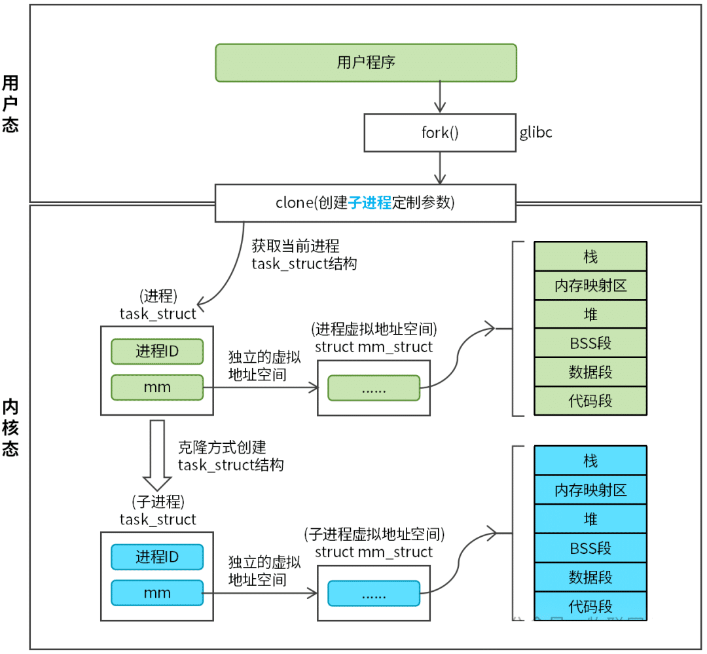
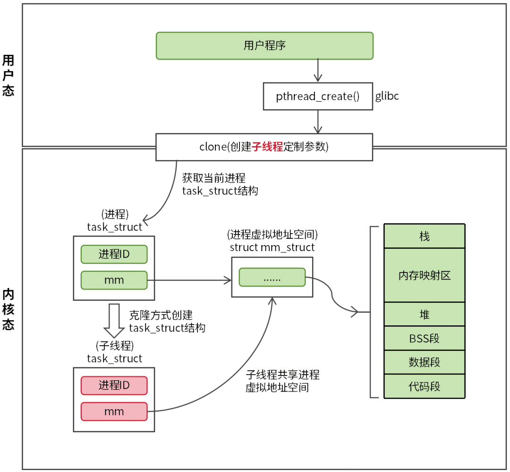
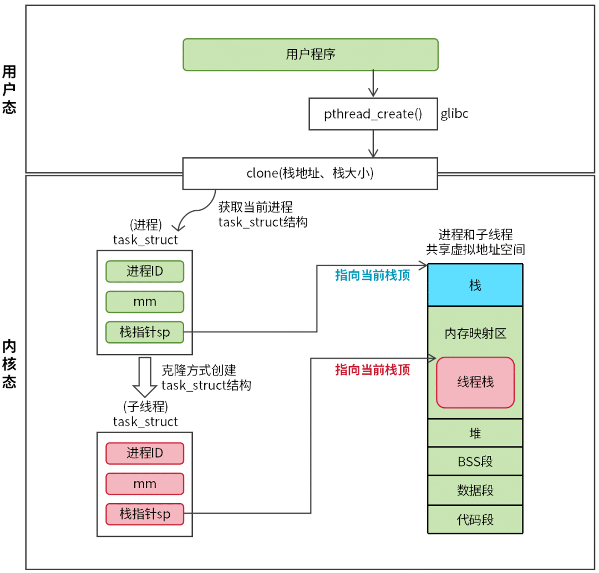
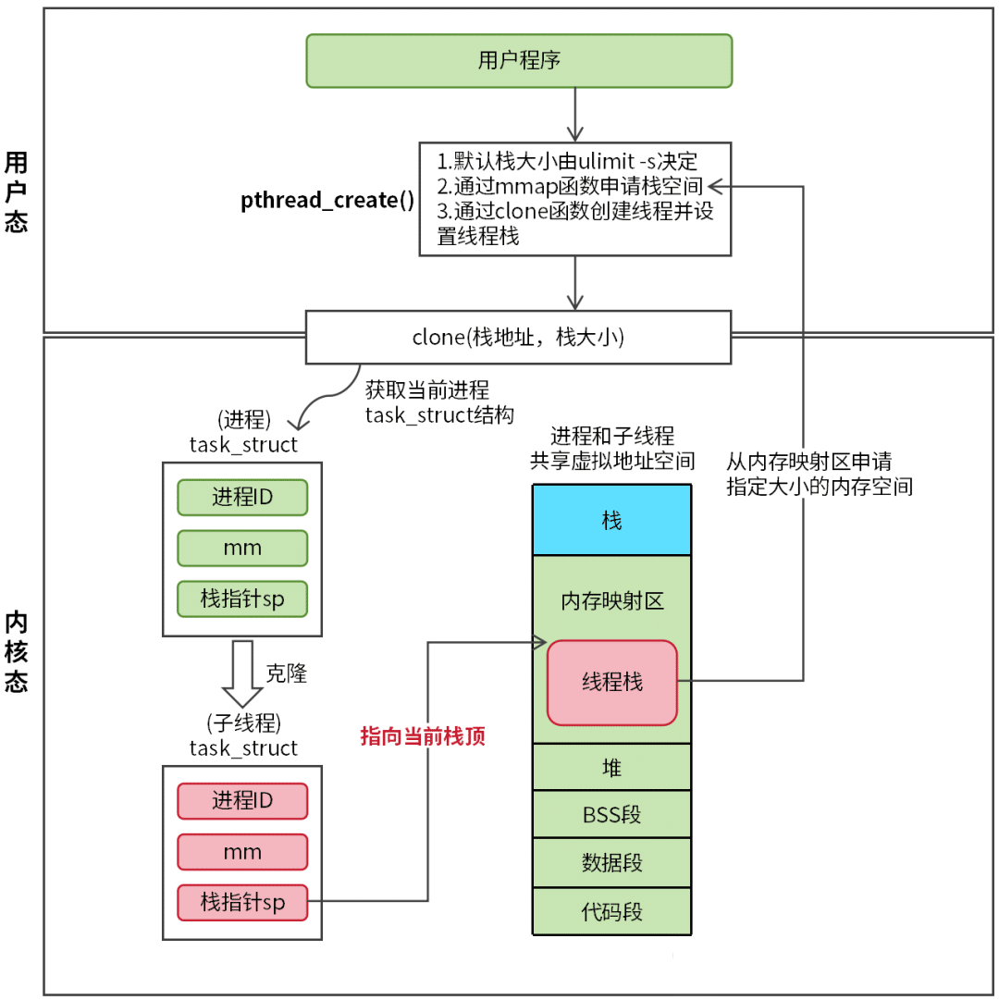
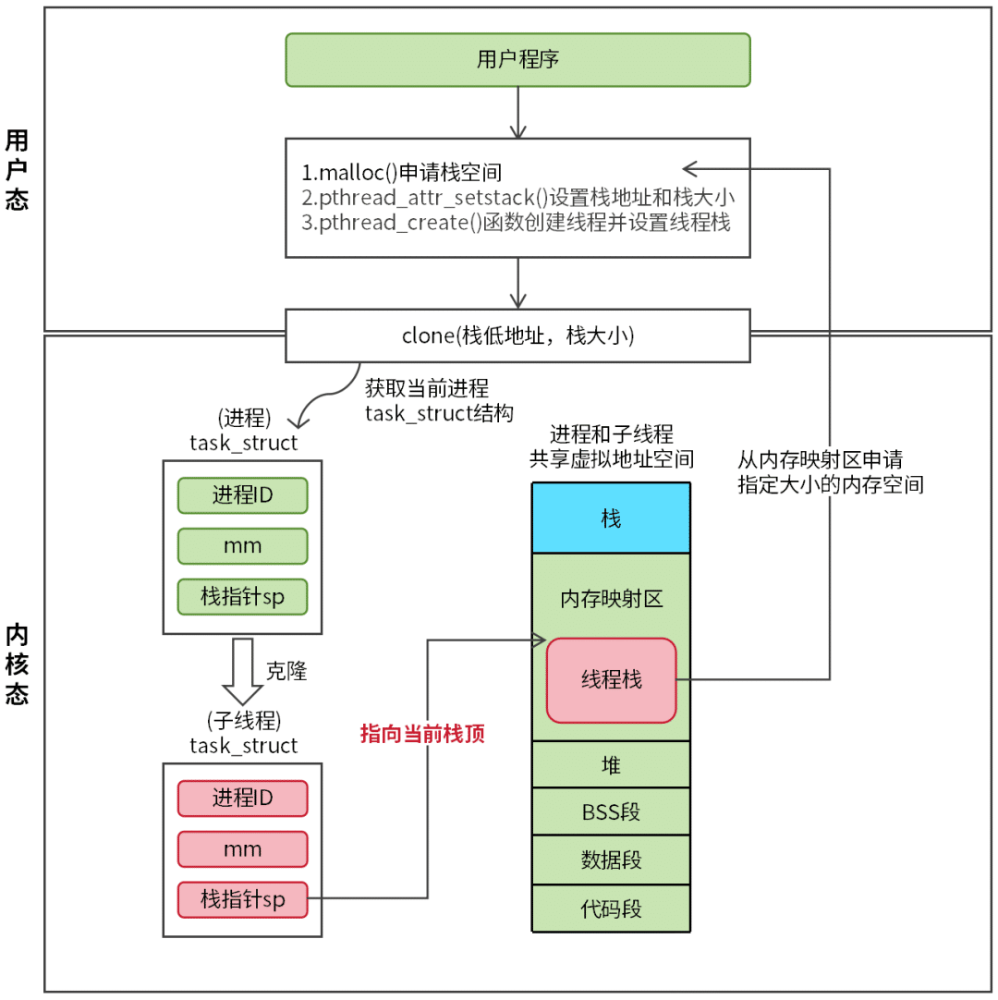

# 进程栈和线程栈

## 进程和线程的区别

对于 Linux 内核来说，进程和线程都是 `task_struct` 对象，并没有本质区别。

区分进程和线程的关键点在于：**进程有独立的虚拟地址空间，线程共享主线程（进程）的虚拟地址空间**。

如何理解这句话呢？我们通过两个图来讲解。

### 进程的创建过程



Linux 创建进程或线程的方式都是采用克隆方式，子进程或子线程会直接继承父进程的信息。从内核的角度来看，内核会创建一个新的 `task_struct` 对象，并将父进程的 `task_struct` 对象的成员信息复制给新的 `task_struct` 对象。

`task_struct` 对象有很多成员，进程和线程的复制过程存在差异。注意，这里所说的父进程指的是当前正在执行的用户程序。创建进程和线程都是通过 `clone` 系统调用完成，具体是创建进程还是线程，需要根据传入的函数参数区分。

如图 1 所示，用户程序通过 `fork` 函数创建进程，`fork` 函数是 glibc 库中的一个函数，其底层依赖 `clone` 系统调用。

调用 `fork` 函数后，内核首先会获取父进程的 `task_struct` 对象，然后，内核会创建一个新的 `task_struct` 对象（子进程），接着，内核会将父进程 `task_struct` 对象的成员直接复制给子进程 `task_struct` 对象。

整个复制过程其实很复杂，我们需要关注的点是 `task_struct` 结构的 `mm` 成员（虚拟地址空间），`mm` 成员是一个指针成员（`struct mm_struct *`）。创建子进程时，需要创建一个新的 `mm_struct` 对象，然后将父进程 `mm_struct` 对象的信息复制给子进程 `mm_struct` 对象，子进程 `mm` 成员指向新的 `mm_struct` 对象。

**子进程为什么需要创建新的 mm_struct 对象呢？**

子进程想要脱离父进程独立运行，子进程必须有独立的内存区域（物理内存），创建新的 `mm_struct` 对象是独立的基础。我们可以简单的认为，拥有独立的 `mm_struct` 对象，父进程和子进程就能访问不同的物理内存了。

### 线程的创建过程

聊完了进程，我们再来聊聊线程的创建过程，如图 2 所示。



Linux 通过 `pthread_create` 函数来创建线程，`pthread_create` 函数底层同样是依赖 `clone` 系统调用。线程的创建过程和进程的创建过程基本类似，不同点在于复制 `mm` 成员（虚拟地址空间）。创建线程时，内核会直接将 `mm`（指针成员）指向父进程的 `mm_struct` 对象，这样子线程就会共享父进程的 `mm_struct` 对象了。

**线程为什么被称为轻量级进程？** 原因在于子线程通常会直接共享父进程的资源，不会单独创建新的资源。

父进程和子线程共享虚拟空间，意味着二者访问的是相同的物理内存（数据和代码都是用的同一份）。这种方式虽然比较高效和节约系统资源，但是存在数据安全和资源竞争问题。多线程开发需要通过锁机制来保证数据安全和顺序访问。

值得注意的是，父进程和子线程有一块内存区域是不能共享，那就是栈。栈用于存储函数调用时的局部变量、函数参数和返回地址等信息。如果父进程和子线程共用一个栈，那么父进程和子线程的函数调用链将会被破坏，程序将会跑飞。怎么解决这个问题呢？我们得给每个线程单独分配一个栈，这就是线程栈。

## 线程栈

线程栈是操作系统为每个线程分配的私有内存区域，用于存储函数调用时的**局部变量、参数、返回地址及临时数据**。其数据结构遵循后进先出（LIFO）原则，确保函数调用链的顺序执行。

子线程共享父进程的虚拟地址空间，虚拟地址空间能够用来分配线程栈的区域就只有内存映射区和堆了。

如图所示，`task_struct` 结构（进程或线程）中有一个 `sp`（栈指针），`sp` 用于记录当前栈顶地址，`sp` 指向的地址就是进程栈或线程栈所在的位置。



创建进程时，内核会将父进程的 `sp` 直接复制给子进程，所以子进程使用的进程栈就是虚拟地址空间的栈。而通过 `clone` 系统调用创建子线程时，需要传入栈地址和栈大小，内核会根据传入的参数设置 `sp` 和栈大小。**也就是说线程栈是由用户程序来设置。**

### 默认线程栈

默认线程栈的申请工作由 `pthread_create` 函数完成，具体过程如图 4 所示。



用户程序调用 `pthread_create` 函数创建线程时，`pthread_create` 函数内部会调用 `mmap` 函数从内存映射区分配一块内存当做线程栈，线程栈的默认大小为 8 MB，可通过 `ulimit -s` 命令查看或修改。线程栈申请成功后，通过调用 `clone` 系统调用（传入栈地址和栈大小）就能够创建线程并设置线程栈了。

### 自定义线程栈

自定义线程栈方式相对来说就比较复杂。采用自定义线程栈方式，用户程序需要提前申请栈内存并设置栈大小，再将栈地址和栈大小以属性的方式传入 `pthread_create` 函数，`pthread_create` 函数直接使用用户申请的栈内存来创建线程，具体过程如图所示。



用户程序需显式调用 `malloc` 或 `posix_memalign` 函数来申请栈内存。申请完毕后，调用 `pthread_attr_setstack` 函数设置栈地址和栈大小，最后通过 `pthread_create` 函数创建线程。

示例代码如下：

```c
#include <stdlib.h>
#define STACK_SIZE (1024 * 1024) // 设置栈大小为 1 MB

int main() {
    pthread_attr_t attr;
    // 初始化线程属性
    pthread_attr_init(&attr);
    // 分配自定义栈空间
    void *stack = malloc(STACK_SIZE);
    if (stack == NULL) {
        return -1;
    }
    // 设置线程栈地址和大小
    pthread_attr_setstack(&attr, stack, STACK_SIZE);
    // 创建线程
    pthread_t thread;
    if (pthread_create(&thread, &attr, thread_function, NULL) != 0) {
        free(stack);
        return -1;
    }
    // 等待线程结束
    pthread_join(thread, NULL);
    // 销毁线程属性
    pthread_attr_destroy(&attr);
    // 释放自定义栈空间
    free(stack);
    return 0;
}
```

**示例代码中是通过 malloc 来分配栈内存，是否意味着线程栈是从堆内存分配的？**

答案是否定的。`malloc` 有一个特殊的机制：如果申请的内存超过 128 KB，`malloc` 不会从堆上分配内存，而是通过 `mmap` 从内存映射区分配内存。用户自定义线程栈的最小值不能低于 128 KB，所以线程栈不会从堆内存分配。线程栈最小值定义如下：

```c
#define PTHREAD_STACK_MIN 131072 // 单位字节，128 KB
```

## 线程栈测试

关于线程栈，有几个问题读者可能比较关心，问题如下：

- **问题 1**：用户自定义的线程栈是否生效？
- **问题 2**：一台主机最多创建多少个线程？

在验证这些问题之前，我们先来看一下线程栈测试程序，代码如下：

```c
#include <string.h>
#include <stdlib.h>

#define STACK_SIZE (20 * 1024 * 1024) // 自定义线程栈大小
#define ONCE_SIZE (1024 * 1024)       // 每次分配的栈内存大小
#define MAX_NUM (5000)                // 测试线程数量
#define STACK_OVERFLOW_TEST (0)       // 是否开启线程栈溢出测试，0：关闭；1：开启

int count = 0; // 统计递归调用次数

void do_test() {
    char data[ONCE_SIZE]; // 分配栈内存
    memset(data, 'a', ONCE_SIZE); // 确保栈内存已经分配
    float once_size = (ONCE_SIZE * 1.0) / 1024;
    float total_size = (once_size * count) / 1024;
    // 统计线程栈使用情况
    printf("once size:%.2f KB, count:%d, total size:%.2f MB\n", once_size, count++, total_size);
    do_test();
}

void *run(void *arg) {
    char data[ONCE_SIZE]; // 分配栈内存
    memset(data, 'a', ONCE_SIZE); // 确保栈内存已经分配
    while (1) {
#if STACK_OVERFLOW_TEST
        do_test();
#else
        sleep(1);
#endif
    }
}

int create_threads() {
    pthread_t ths[MAX_NUM] = {0};
    void *stacks[MAX_NUM] = {0};

    int real_num = 0;
    for (int i = 0; i < MAX_NUM; i++) {
        pthread_attr_t attr;
        stacks[i] = malloc(STACK_SIZE);
        if (!stacks[i]) {
            break;
        }

        if (pthread_attr_init(&attr) != 0) {
            break;
        }

        if (pthread_attr_setstack(&attr, stacks[i], STACK_SIZE) != 0) {
            pthread_attr_destroy(&attr);
            break;
        }

        pthread_attr_t *pattr = NULL;
        pattr = &attr;
        int ret = pthread_create(&ths[i], pattr, run, NULL);
        if (ret != 0) {
            pthread_attr_destroy(&attr);
            break;
        }
        pthread_attr_destroy(&attr);
        printf("real_num:%d\n", real_num++);
    }

    for (int i = 0; i < real_num; i++) {
        pthread_join(ths[i], NULL);
        if (stacks[i]) free(stacks[i]);
    }
    return 0;
}

int main(int argc, char *argv[]) {
    create_threads();
    return 0;
}
```

测试程序将测试两个项目：

- 测试线程实际使用的栈空间大小。
- 测试一台主机创建线程的数量。

### 验证自定义线程栈是否生效

想要确认自定义线程栈是否生效，最好的方式是确认实际使用的栈大小和自定义的栈大小是否相匹配。

测试程序通过栈溢出的方式来统计实际使用的栈大小。具体过程为：通过递归调用不断地从线程栈分配内存（如：每次递归调用分配 1 KB 栈内存），程序出现栈溢出错误时，统计递归调用的总次数，总次数和每次分配的栈内存大小的乘积就是实际使用的栈内存大小。

本次测试相关参数如下：

```c
#define STACK_SIZE (20 * 1024 * 1024) // 线程栈大小为 20 MB
#define ONCE_SIZE (1024)              // 每次递归调用分配 1 KB 内存
#define MAX_NUM (1)                   // 线程数量 1
#define STACK_OVERFLOW_TEST (1)       // 启线程栈溢出测试
```

测试程序输出结果：

```
once size:1.00 KB, count:19844, total size:19.38 MB
once size:1.00 KB, count:19845, total size:19.38 MB
once size:1.00 KB, count:19846, total size:19.38 MB
once size:1.00 KB, count:19847, total size:19.38 MB
once size:1.00 KB, count:19848, total size:19.38 MB
once size:1.00 KB, count:19849, total size:19.38 MB
Segmentation fault
```

递归调用总次数为 19849 次，每次递归调用分配 1 KB 内存，总共分配的栈内存大小为 19.38 MB，与自定义的 20 MB 栈内存相匹配。自定义线程栈设置成功。

### 验证一台主机创建线程的数量

这里需要提前说明一下，一台主机能够创建多少线程由很多因素决定。本次测试仅仅是从线程栈的角度来考虑可以创建多少线程。

本次测试的主机内存大小为 4 GB，测试相关参数如下：

```c
#define STACK_SIZE (20 * 1024 * 1024) // 自定义线程栈大小为 20 MB
#define ONCE_SIZE (1024 * 1024)       // 每个线程分配 1 MB 栈内存
#define MAX_NUM (5000)                // 测试线程数量 5000
#define STACK_OVERFLOW_TEST (0)       // 关闭线程栈溢出测试
```

测试结果如下：

```
real_num:3783
real_num:3784
real_num:3785
real_num:3786
real_num:3787
Killed
```

4 GB 主机总共创建 3787 个线程，每个线程分配 1 MB 栈内存，全部线程占用的内存空间近 4 GB。当内存使用完后，用户程序不能再创建新的线程，程序异常退出。
