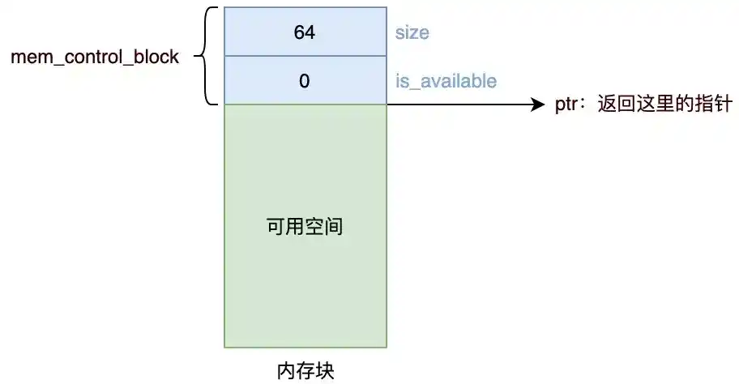
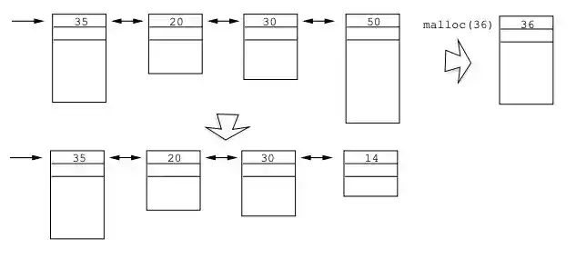
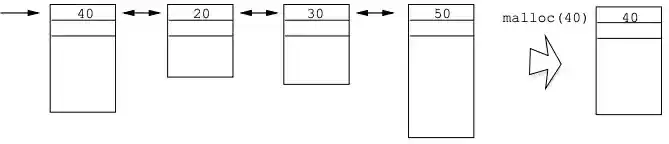
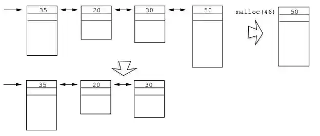

# malloc与free原理分析

## 函数原型

malloc 用于从堆上分配一块内存给用户，分配成功的话返回这段内存的首地址。free 则释放用户传入的动态分配的内存地址。

这两个函数的原型如下：

```c
#include <stdlib.h>
void *malloc(size_t size) /* 成功时返回指向已分配内存的指针，错误时返回null */
void free(void *ptr)
```

`malloc`分配指定大小的内存空间，大小以字节为单位，返回一个指向该空间的`void*`指针。

`free`释放一个由`malloc`所分配的内存空间。`ptr`指向一个要释放内存的内存块，该指针应当是`malloc`的返回值。

## malloc 是如何分配内存的？

>   使用 C 标准库的 `malloc()` 或者 `mmap()`，就可以分别在堆和文件映射段动态分配内存。

malloc() 并不是系统调用，而是 C 库里的函数，用于动态分配内存。

动态分配的内存都在堆中，堆从低地址向高地址增长：


Linux 提供了两个系统调用 `brk` 和 `sbrk`：

```cc
int brk(void *addr);
void *sbrk(intptr_t increment);
```

`brk` 用于返回堆的顶部地址；`sbrk` 用于扩展堆，通过参数 `increment` 指定要增加的大小，如果扩展成功，返回 `brk` 的旧值。如果 `increment` 为零，返回 `brk` 的当前值。

malloc 申请内存的时候，会有两种方式向操作系统申请堆内存。

- 方式一：通过 brk() 系统调用从堆分配内存
- 方式二：通过 mmap() 系统调用在文件映射区域分配内存；

### brk 系统调用分配

当用户分配的内存小于 128KB 时，malloc 会通过 brk () 系统调用从堆分配内存。实现方式是通过 brk() 函数将「堆顶」指针向高地址移动，获得新的内存空间。如下图：


这种分配方式适用于较小内存的分配场景。在使用 free () 释放堆内存时，若要释放的内存不在堆顶，内核不会立即释放内存，而是进行内存回收，标记这部分内存为空闲，且不会取消已经建立好的内存映射。这样做的目的是下次 malloc 时可以直接使用这块空闲内存，从而减少系统调用次数。例如，在一些频繁申请和释放较小内存块的程序中，brk 分配方式可以提高内存分配的效率。但是，这种方式也存在问题，回收但没有释放的内存会产生内存碎片。

### mmap 系统调用分配

当用户分配的内存大于 128KB 时，malloc 会通过 mmap () 系统调用在文件映射区域分配内存。mmap () 分配方式不管申请的内存多大，只要在其可用虚拟地址空间内，内核都会分配给进程。

mmap() 系统调用通过「私有匿名映射」的方式，在文件映射区分配一块内存，也就是从文件映射区“偷”了一块内存。如下图：


这种方式的优势在于，当 free () 释放内存后，会完全归还给操作系统，取消已建立的内存映射，避免了内存的长期占用。然而，由于 mmap () 分配方式没有内存池缓存机制，每次分配的内存，当进程进行读写时都会触发缺页中断，内核会从文件映射区划分一块物理内存映射到虚拟内存上。同时，mmap 是系统调用，每次执行时都会发生用户态和内核态的切换，这对于 CPU 性能影响较大。

> 什么场景下 malloc()  会通过 brk() 分配内存？又是什么场景下通过 mmap() 分配内存？

malloc() 源码里默认定义了一个阈值：

- 如果用户分配的内存小于 128 KB，则通过 brk() 申请内存；
- 如果用户分配的内存大于 128 KB，则通过 mmap()  申请内存；

>   注意，不同的 glibc 版本定义的阈值也是不同的。128 KB的大小可能会随着gcc的版本而变化。

我们不会直接通过 `brk` 或 `sbrk` 来分配堆内存，而是先通过 `sbrk` 扩展堆，将这部分空闲内存空间作为缓冲池，然后通过`malloc/free`管理缓冲池中的内存。这是一种池化思想，能够避免频繁的系统调用，提高程序性能。

### 分配内存的特性

malloc 分配的是虚拟内存。如果分配后的虚拟内存没有被访问，是不会将虚拟内存映射到物理内存的，这样就不会占用物理内存。只有在访问已分配的虚拟地址空间时，操作系统通过查找页表，发现虚拟内存对应的页没有在物理内存中，才会触发中断，然后操作系统会建立虚拟内存和物理内存之间的映射关系。对于 brk 分配方式，堆区内存在 free () 后还在，并没有归还给操作系统，而是缓存在了内存池中供下次使用。对于 mmap 分配方式，free () 后内存会归还给操作系统，得到真正的释放。

## 内存分配的原理

-   操作系统接口：`malloc`底层通过系统调用（如`sbrk`或`mmap`）向操作系统申请大块内存（通常以页为单位，如4KB）。运行时库（如glibc）管理这些内存块，避免频繁的系统调用。
-   内存池管理：运行时库将大块内存切割为更小的块，维护一个“空闲链表”记录哪些内存块可用。链表中每个节点包含：
    -   元数据：块大小、是否空闲、指向相邻块的指针等。

    -   用户数据区：实际分配给用户的内存。

`malloc`的工作流程：

1. 查找空闲块：遍历空闲链表，寻找第一个足够大的空闲块（首次适应算法），或最小足够大的块（最佳适应算法）。
2. 分割内存块：如果找到的块比需求大，将其分割为“已分配块”和剩余的空闲块。
3. 更新元数据：标记已分配块的元数据（如`size`和`free`标志）。
4. 返回用户指针：返回用户数据区的起始地址（跳过元数据部分）。
5. 扩展堆（若需）：若没有足够空闲块，通过`sbrk`或`mmap`申请更多内存。

`free`的工作流程：

1. 定位元数据：用户调用`free(ptr)`时，实际释放的地址是`ptr-sizeof(metadata)`，通过指针回退找到元数据。
2. 标记为空闲：将块的`free`标志设为可用。
3. 合并相邻空闲块：检查物理相邻的前后块是否空闲。如果是，合并成更大的块，减少内存碎片。

关键技术与挑战

-   内存对齐：`malloc`返回的地址需满足对齐要求（如8字节对齐），以提高访问效率。

-   碎片问题：
    -   外部碎片：大量小空闲块分散导致无法分配大块内存。通过合并相邻块缓解。
    -   内部碎片：分配块略大于用户需求，剩余部分无法利用。合理的分配策略可减少浪费。
-   性能优化：
    -   显式空闲链表：用双向链表直接管理空闲块，提高查找速度。
    -   分离空闲链表：按块大小分类管理，例如小块分配和大块分配分开处理。

## malloc / free 实现思路

`malloc` 使用空闲链表组织堆中的空闲区块，空闲链表有时也用双向链表实现。每个空闲区块都有一个相同的首部，称为“内存控制块” `mem_control_block`，其中记录了空闲区块的元信息，比如指向下一个分配块的指针、当前分配块的长度、或者当前区块是否已经被分配出去。这个首部对于程序是不可见的，`malloc`返回的是紧跟在首部后面的地址，即可用空间的起始地址。

`malloc` 分配时会搜索空闲链表，根据匹配原则，找到一个大于等于所需空间的空闲区块，然后将其分配出去，返回这部分空间的指针。如果没有这样的内存块，则向操作系统申请扩展堆内存。注意，返回的指针是从可用空间开始的，而不是从首部开始的：



malloc 所实际使用的内存匹配算法有很多，执行时间和内存消耗各有不同。到底使用哪个匹配算法，取决于实现。常见的内存匹配算法有：

-   最佳适应法
-   最差适应法
-   首次适应法
-   下一个适应法

>   free 会将区块重新插入到空闲链表中。free 只接受一个指针，却可以释放恰当大小的内存，这是因为在分配的区域的首部保存了该区域的大小。

所以，当使用 malloc 分配给我们的内存时，一定要小心别越界。一旦越界，你可能踩了其他进程的内存块，或者破坏了原本用于维护内存块的数据结构，引发段错误（segment fault）。

## malloc实现方式

### 显式空闲链表 + 整块分配

最简单的方法是使用一个链表来管理所有已分配和未分配的内存块，在每个内存块的首部记录当前块的大小、当前区块是否已经被分配出去。首部对应这样的结构体：

```c
struct mem_control_block {
    int is_available; // 是否可用（如果还没被分配出去，就是 1）
    int size;         // 实际空间的大小
};
```

使用首次适应法进行分配：遍历整个链表，找到第一个未被分配、大小合适的内存块；如果没有这样的内存块，则向操作系统申请扩展堆内存。

下面是这种实现方式的代码：

```c
int has_initialized = 0;     // 初始化标志
void *managed_memory_start;  // 指向堆底（内存块起始位置）
void *last_valid_address;    // 指向堆顶

struct mem_control_block {
    int is_available; // 是否可用（如果还没被分配出去，就是 1）
    int size;         // 实际空间的大小
};

void malloc_init() {
// 这里不向操作系统申请堆空间，只是为了获取堆的起始地址
    last_valid_address = sbrk(0);
    managed_memory_start = last_valid_address;
    has_initialized = 1;
}

void *malloc(long numbytes) {
    void *current_location;  // 当前访问的内存位置
    struct mem_control_block *current_location_mcb;  // 只是作了一个强制类型转换
    void *memory_location;  // 这是要返回的内存位置。初始时设为0，表示没有找到合适的位置
    if (!has_initialized) { malloc_init(); }  // 要查找的内存必须包含内存控制块，所以需要调整 numbytes 的大小
    numbytes = numbytes + sizeof(struct mem_control_block);
    // 初始时设为 0，表示没有找到合适的位置
    memory_location = 0;  /* Begin searching at the start of managed memory */
    // 从被管理内存的起始位置开始搜索
    // managed_memory_start 是在 malloc_init 中通过 sbrk() 函数设置的
    current_location = managed_memory_start;
    while (current_location != last_valid_address) {
        // current_location 是一个 void 指针，用来计算地址；
        // current_location_mcb 是一个具体的结构体类型
        // 这两个实际上是一个含义
        current_location_mcb = (struct mem_control_block *) current_location;

        if (current_location_mcb->is_available) {
            if (current_location_mcb->size >= numbytes) {
                // 找到一个可用、大小适合的内存块
                current_location_mcb->is_available = 0;  // 设为不可用
                memory_location = current_location;      // 设置内存地址
                break;
            }
        }
        // 否则，当前内存块不可用或过小，移动到下一个内存块
        current_location = current_location + current_location_mcb->size;
    }  // 循环结束，没有找到合适的位置，需要向操作系统申请更多内存
    if (!memory_location) {
        // 扩展堆
        sbrk(numbytes);
        // 新的内存的起始位置就是 last_valid_address 的旧值
        memory_location = last_valid_address;    // 将 last_valid_address 后移 numbytes，移动到整个内存的最右边界
        last_valid_address = last_valid_address + numbytes;    // 初始化内存控制块 mem_control_block
        current_location_mcb = memory_location;
        current_location_mcb->is_available = 0;
        current_location_mcb->size = numbytes;
    }
    // 最终，memory_location 保存了大小为 numbyte的内存空间，并且在空间的开始处包含了一个内存控制块，记录了元信息
    // 内存控制块对于用户而言应该是透明的，因此返回指针前，跳过内存分配块
    memory_location = memory_location + sizeof(struct mem_control_block);
    // 返回内存块的指针
    return memory_location;
}
```

这种方法的缺点是：

1.  已分配和未分配的内存块位于同一个链表中，每次分配都需要从头到尾遍历
2.  采用首次适应法，内存块会被整体分配，容易产生较多内部碎片

### 显式空闲链表 + 按需分配

这种实现方式维护一个空闲块链表，只包含未分配的内存块。malloc 分配时会搜索空闲链表，找到第一个大于等于所需空间的空闲区块，然后从该区块的尾部取出所需要的空间，剩余空间还是存在空闲链表中；如果该区块的剩余部分不足以放下首部信息，则直接将其从空闲链表摘除。最后返回这部分空间的指针。

下面是这种实现方式的几个示例：







通过 free 释放内存时，会将内存块加入到空闲链表中，并将前后相邻的空闲内存合并，这时使用双向链表管理空闲链表就很有用了。

和第一种方式相比，这种方式的优点主要是：

-   空闲链表中只包含未被分配的内存块，节省遍历开销
-   只分配必须大小的空间，避免内存浪费

这种方式的缺点是：多次调用 malloc 后，空闲内存被切成很多的小内存片段，产生较多外部碎片，会导致用户在申请内存使用时，找不到足够大的内存空间。这时需要进行内存整理，将连续的空闲内存合并，但是这会降低函数性能。

注意：内存紧凑在这里一般是不可用的，因为这会改变之前 malloc 返回的空间的地址。

上面的两种分配方法，分配时间都和空闲块的数量成线性关系。

另一种实现方式是分离存储，即维护多个空闲链表，其中每个链表中的块有大致相等或者相同的大小。一般常见的是根据 2 的幂来划分块大小。分配时，可以直接在某个空闲链表里搜索合适的块。如果没有找到合适的块与之匹配，就搜索下一个链表，以此类推。

### 简单分离存储

每个大小类的空闲链表包含大小相等的块。分配时，从某个空闲链表取下一块，或者向操作系统请求内存片并分割成大小相等的块，形成新的链表。释放时，只需要简单的将块插入到相应空闲链表的前面。

优点一是分配和释放只需要在链表头进行操作，都是常数时间，二是因为每个块大小都是固定的，所以只需要一个 next 指针，不需要额外的控制信息，节省空间。缺点是容易造成内部碎片和外部碎片。内部碎片显而易见，因为每个块都是整体分配的，不会被分割。外部碎片在这样的模式下很容易产生：应用频繁地申请和释放较小大小的内存块，由于这些内存块不会合并，所以系统维护了大量小内存块形成的空闲链表，而没有多余空间来分配大内存块，导致产生外部碎片。

### 分离适配

这种方法同样维护了多个空闲链表，只不过每个链表中的块是大致相等的大小，比如每个链表中的块大小范围可能是：

-   1
-   2
-   3~4
-   5~8
-   …
-   1025~2048
-   2049~4096
-   4097~∞

在分配的时候，需要先根据申请内存的大小选择适当的空闲链表，然后遍历该链表，根据匹配算法（如首次适应）寻找合适的块。如果找到一个块，将其分割（可选），并将剩余部分插入到适当的空闲链表中。如果找不到合适的块，则查找下一个更大的大小类的空闲链表，以此类推，直到找到或者向操作系统申请额外的堆内存。在释放一个块时，合并前后相邻的空闲块，并将结果放到相应的空闲链表中。

分离适配方法是一种常见的选择，C 标准库中提供的 GNU malloc 包就是采用的这种方法。这种方法既快速，对内存的使用也很有效率。由于搜索被限制在堆的某个部分而不是整个堆，所以搜索时间减少了。内存利用率也得到了改善，避免大量内部碎片和外部碎片。

### 伙伴系统

伙伴系统是分离适配的一种特例。它的每个大小类的空闲链表包含大小相等的块，并且大小都是 2 的幂。最开始时，全局只有一个大小为 $2^m$ 字的空闲块，$2^m$ 是堆的大小。

假设分配的块的大小都是 2 的幂，为了分配一个大小为 $2^k$ 的块，需要找到大小恰好是 $2^k$ 的空闲块。如果找到，则整体分配。如果没有找到，则将刚好比它大的块分割成两块，每个剩下的半块（也叫做伙伴）被放置在相应的空闲链表中，以此类推，直到得到大小恰好是 $2^k$ 的空闲块。释放一个大小为 $2^k$ 的块时，将其与空闲的伙伴合并，得到新的更大的块，以此类推，直到伙伴已分配时停止合并。

伙伴系统分配器的主要优点是它的快速搜索和快速合并。主要缺点是要求块大小为 2 的幂可能导致显著的内部碎片。因此，伙伴系统分配器不适合通用目的的工作负载。然而，对于某些特定应用的工作负载，其中块大小预先知道是 2 的幂，伙伴系统分配器就很有吸引力了。

## free的释放原理

### 确定释放空间大小

在 C 语言中，free 函数只需要传入一个指针参数就能释放掉所分配的内存，它是通过以下方式确定要释放的空间大小的。很多内存分配函数会在一个称为头部指针的地方保存一些额外的信息，头部指针通常在返回的内存块之前。例如，当申请一块 20 个字节的内存空间，代码可以写成ptr = malloc(20)，在所返回给用户的指针ptr上，还有一小块内存用于保存该内存块的信息。

用户在进行释放时，库会通过一些简单的指针运算得到头部指针的位置，获得头部指针后，程序先检查是否符合预期的值，然后简单地运算下得出要释放的空间大小，进行内存释放。值得注意的是实际释放的空间是头部指针的大小加上分配给用户使用的空间大小，而不是单纯地释放用户使用的内存空间。

### 释放后的内存处理

free 释放内存后，内存的状态会因不同的分配方式而有所不同。

对于通过 brk 系统调用分配的内存，当使用 free () 释放堆内存时，若要释放的内存不在堆顶，内核不会立即释放内存，而是进行内存回收，标记这部分内存为空闲，且不会取消已经建立好的内存映射。这样下次 malloc 时可以直接使用这块空闲内存，从而减少系统调用次数，但也会产生内存碎片。

对于通过 mmap 系统调用分配的内存，free () 释放后会完全归还给操作系统，取消已建立的内存映射，避免了内存的长期占用。释放后的内存空间的值将变得不确定，不应再被访问。同时，释放内存后，指针仍然指向分配的内存空间，指针指向的地址没有变化，地址内的内容也没有发生变化，变化的是这块内存的可使用权限。需要注意的是，free 函数并不会清空被释放的内存空间中的数据，在释放内存之前，我们需要手动清空内存中的敏感数据，以防止数据泄露的风险。

## 其他知识点

### malloc是系统调用吗？

malloc是C语言库函数不是系统函数调用。

### 查询已分配空间大小

如果我们有一片分配好的动态内存，想知道之前到底分配了多大的空间时，我们可以使用_msize（Windows）和`malloc_usable_size`（Linux）函数来查询：

```c
#include <stdlib.h>    //或者malloc.h
size_t _msize( void *memblock );
size_t malloc_usable_size(void *_Nullable ptr);
```

这两个函数都可以返回参数指针所对应的动态内存空间实际分配的大小。

`malloc_usable_size`函数在Linux下用于获取malloc实际分配的内存大小，其实现与内存管理机制相关。在glibc中，malloc分配内存时会使用一些额外的空间来存储管理信息，如块大小等。`malloc_usable_size`函数会返回实际可用的内存大小，这个大小通常比用户请求的分配大小要大，因为其中包含了这些管理信息占用的空间。

### malloc(0) 等于多少

翻阅 C17 标准草案 N2176，在 `7.22.3` 节里，有如下说法：

>   The order and contiguity of storage allocated by successive calls to the aligned_alloc, calloc, malloc, and realloc functions is unspecified. The pointer returned if the allocation succeeds is suitably aligned so that it may be assigned to a pointer to any type of object with a fundamental alignment requirement and then used to access such an object or an array of such objects in the space allocated (until the space is explicitly deallocated). The lifetime of an allocated object extends from the allocation until the deallocation. Each such allocation shall yield a pointer to an object disjoint from any other object. The pointer returned points to the start (lowest byte address) of the allocated space. If the space cannot be allocated, a null pointer is returned. If the size of the space requested is zero, the behavior is implementation-defined: either a null pointer is returned to indicate an error, or the behavior is as if the size were some nonzero value, except that the returned pointer shall not be used to access an object.
>
>   翻译：
>
>   连续调用aligned_alloc、calloc、malloc和realloc函数所分配的存储的顺序和连续度是未指定的。如果分配成功，返回的指针将被适当地对齐，这样它就可以被赋值给具有基本对齐要求的任何类型对象的指针，然后用于访问分配的空间中这样的对象或这样的对象数组（直到空间被显式释放）。已分配对象的生存期从分配开始一直延伸到解除分配。每个这样的分配都应该产生一个指向与任何其他对象不相交的对象的指针。返回的指针指向已分配空间的起始（最低字节地址）。如果不能分配空间，则返回空指针。如果请求的空间大小为零，则行为是由实现定义的：要么返回空指针以指示错误，要么行为就像大小是非零值一样，只是返回的指针不能用于访问对象。

其中标准委员会明确规定了：当 `malloc` 接到的参数为 0 时，其行为是由实现定义的（implementation-defined）。

“由实现定义的行为”这个词就提醒我们，在实际编程时如果要考虑到程序在多个运行环境下进行运行时，不能对 `malloc` 返回的数值进行任何假设。

通过查阅 `glibc` 的源代码，依此了解在 `glibc` 下`mallloc(0)` 的行为。

在 `glibc2.27/malloc/malloc.c` 中，有如下注释：

```c
/*
  malloc(size_t n)
  Returns a pointer to a newly allocated chunk of at least n bytes, or null
  if no space is available. Additionally, on failure, errno is
  set to ENOMEM on ANSI C systems.

  If n is zero, malloc returns a minumum-sized chunk. (The minimum
  size is 16 bytes on most 32bit systems, and 24 or 32 bytes on 64bit
  systems.)  On most systems, size_t is an unsigned type, so calls
  with negative arguments are interpreted as requests for huge amounts
  of space, which will often fail. The maximum supported value of n
  differs across systems, but is in all cases less than the maximum
  representable value of a size_t.
*/
```

注释已经说得很清楚了，当我们执行 `malloc(0)` 时，我们实际会拿到一个指向一小块内存的指针，这个指针指向的（分配给我们的）内存的大小是由机器决定的。

细读代码，可以发现，将读入的内存大小进行转换是由宏 `checked_request2size` 实现的。

相关的宏定义如下：

```c
/* pad request bytes into a usable size -- internal version */
#define request2size(req)                                         \
  (((req) + SIZE_SZ + MALLOC_ALIGN_MASK < MINSIZE)  ?             \
   MINSIZE :                                                      \
   ((req) + SIZE_SZ + MALLOC_ALIGN_MASK) & ~MALLOC_ALIGN_MASK)

/* Same, except also perform an argument and result check.  First, we check
   that the padding done by request2size didn't result in an integer
   overflow.  Then we check (using REQUEST_OUT_OF_RANGE) that the resulting
   size isn't so large that a later alignment would lead to another integer
   overflow.  */

#define checked_request2size(req, sz) \
({				    \
  (sz) = request2size (req);	    \
  if (((sz) < (req))		    \
      || REQUEST_OUT_OF_RANGE (sz)) \
    {				    \
      __set_errno (ENOMEM);	    \
      return 0;			    \
    }				    \
})
```

也就是说，我们能申请到的数值最小为 `MINSIZE`，这个 `MINSIZE` 的相关定义如下：

```c
/* The smallest possible chunk */
#define MIN_CHUNK_SIZE        (offsetof(struct malloc_chunk, fd_nextsize))
/* The smallest size we can malloc is an aligned minimal chunk */
#define MINSIZE  \
  (unsigned long)(((MIN_CHUNK_SIZE+MALLOC_ALIGN_MASK) & ~MALLOC_ALIGN_MASK))/* The corresponding bit mask value.  */
#define MALLOC_ALIGN_MASK (MALLOC_ALIGNMENT - 1)
/* MALLOC_ALIGNMENT is the minimum alignment for malloc'ed chunks.  It
   must be a power of two at least 2 * SIZE_SZ, even on machines for
   which smaller alignments would suffice. It may be defined as larger
   than this though. Note however that code and data structures are
   optimized for the case of 8-byte alignment.  */
#define MALLOC_ALIGNMENT (2 * SIZE_SZ < __alignof__ (long double) \
			  ? __alignof__ (long double) : 2 * SIZE_SZ)

#ifndef INTERNAL_SIZE_T
# define INTERNAL_SIZE_T size_t
#endif

/* The corresponding word size.  */
#define SIZE_SZ (sizeof (INTERNAL_SIZE_T))

/*
  This struct declaration is misleading (but accurate and necessary).
  It declares a "view" into memory allowing access to necessary
  fields at known offsets from a given base. See explanation below.
*/

struct malloc_chunk
{

  INTERNAL_SIZE_T      mchunk_prev_size;  /* Size of previous chunk (if free).  */
  INTERNAL_SIZE_T      mchunk_size;       /* Size in bytes, including overhead. */

  struct malloc_chunk* fd;         /* double links -- used only if free. */
  struct malloc_chunk* bk;

  /* Only used for large blocks: pointer to next larger size.  */
  struct malloc_chunk* fd_nextsize; /* double links -- used only if free. */
  struct malloc_chunk* bk_nextsize;
};

// GCC 提供
/* Offset of member MEMBER in a struct of type TYPE. */

#define offsetof(TYPE, MEMBER) __builtin_offsetof (TYPE, MEMBER)
```

至此，我们就可以根据这些计算出使用 `glibc` 在我们的电脑上运行时 `malloc` 出的最小空间的大小了。

计算完后，还可以根据 `malloc_usable_size` 判断自己的计算是否正确，样例代码如下：

```c
#include <stdio.h>
#include <malloc.h>

struct malloc_chunk {

    size_t mchunk_prev_size;  /* Size of previous chunk (if free).  */
    size_t mchunk_size;       /* Size in bytes, including overhead. */

    struct malloc_chunk *fd;         /* double links -- used only if free. */
    struct malloc_chunk *bk;

    /* Only used for large blocks: pointer to next larger size.  */
    struct malloc_chunk *fd_nextsize; /* double links -- used only if free. */
    struct malloc_chunk *bk_nextsize;
};

int main(void) {
    char *p = malloc(0);
    size_t mchunk_size = ((struct malloc_chunk *) (((unsigned long long int) p) - 2*sizeof(size_t)))->mchunk_size;
    printf("malloc(0) Address: 0x%x.\n", p);
    printf("mchunk_size: %ld.\n", mchunk_size);
    printf("Length: %ld.\n", malloc_usable_size(p));
    free(p);
    return 0;
}
```

输出：

```v
Address: 0x27e3a2a0.Length: 24.
```

因此，我们知道了，在 `glibc` 下，执行 `malloc` 会得到一个指向分配给我们的大小为 `24` 字节的内存空间的指针。

但这只是在 `glibc` 下的结果，在其他 C 标准库实现内，可能你会得到一个空指针。

因为标准中提到了，对于 `malloc(0)` 这种故意挑事的代码，实现时可以返回一个空指针作为回礼。

### malloc分配的是物理内存吗？

答案：不是物理内存，是虚拟内存。

现在的操作系统，内存管理通常是基于虚拟内存的，所以应用程序看到的内存地址（虚拟地址）与实际的物理内存地址（物理地址）是不同的。操作系统通过内存管理单元（MMU）来将虚拟地址转换为物理地址。

当应用程序首次访问这块内存时，操作系统发现对应的物理内存尚未分配，它会从可用的物理内存中分配相应的空间，并更新页表项以完成虚拟地址到物理地址的映射。

如果这块内存从来没有被访问，那么就不会分配实际的物理内存，节约了内存。

### free 释放内存，会归还给操作系统吗？

free 内存后堆内存还存在，是针对 malloc 通过 brk() 方式申请的内存的情况。

如果 malloc 通过 mmap 方式申请的内存，free 释放内存后就会归归还给操作系统。

我们做个实验验证下，通过 malloc 申请 128 KB 字节的内存，来使得 malloc 通过 mmap 方式来分配内存。

```c
#include <stdio.h>
#include <malloc.h>
#include <unistd.h>

int main() {
    //申请 1 字节的内存
    void *addr = malloc(128 * 1024);
    printf("此 128KB 字节的内存起始地址：%x\n", addr);
    printf("使用 cat /proc/%d/maps查看内存分配\n", getpid());

    //将程序阻塞，当输入任意字符时才往下执行
    getchar();

    //释放内存
    free(addr);
    printf("释放了 128KB 字节的内存，内存也归还给了操作系统\n");

    getchar();
    return 0;
}
```

执行代码：

```apl
$ ./malloc_test
此 128KB 字节的内存起始地址：1ebb2a0
使用 cat /proc/466085/maps查看内存分配

```

查看进程的内存的分布情况，可以发现最右边没有 [head] 标志，说明是通过 mmap 以匿名映射的方式从文件映射区分配的匿名内存。

```apl
[root@localhost ~]# cat /proc/466085/maps | grep 1ebb
01b21000-01b42000 rw-p 00000000 00:00 0
```

然后我们释放掉这个内存看看：

```apl
释放了 128KB 字节的内存，内存也归还给了操作系统
```

再次查看该 128 KB 内存的起始地址，可以发现已经不存在了，说明归还给了操作系统。

```oz
[root@localhost Ctest]# cat /proc/482409/maps  | grep a290
[root@localhost Ctest]# cat /proc/482409/maps  | grep a290
cat: /proc/482409/maps: No such file or directory
```

总结：

- malloc 通过 `brk()` 方式申请的内存，free 释放内存的时候，并不会把内存归还给操作系统，而是缓存在 malloc 的内存池中，待下次使用；
- malloc 通过 `mmap()` 方式申请的内存，free 释放内存的时候，**会把内存归还给操作系统，内存得到真正的释放**。

### 为什么不全部使用 mmap 来分配内存？

因为向操作系统申请内存，是要通过系统调用的，执行系统调用是要进入内核态的，然后在回到用户态，运行态的切换会耗费不少时间。

所以，申请内存的操作应该避免频繁的系统调用，如果都用 mmap 来分配内存，等于每次都要执行系统调用。

另外，因为 mmap 分配的内存每次释放的时候，都会归还给操作系统，于是每次 mmap 分配的虚拟地址都是缺页状态的，然后在第一次访问该虚拟地址的时候，就会触发缺页中断。

也就是说，频繁通过 mmap 分配的内存话，不仅每次都会发生运行态的切换，还会发生缺页中断（在第一次访问虚拟地址后），这样会导致 CPU 消耗较大。

为了改进这两个问题，malloc 通过 brk() 系统调用在堆空间申请内存的时候，由于堆空间是连续的，所以直接预分配更大的内存来作为内存池，当内存释放的时候，就缓存在内存池中。

等下次在申请内存的时候，就直接从内存池取出对应的内存块就行了，而且可能这个内存块的虚拟地址与物理地址的映射关系还存在，这样不仅减少了系统调用的次数，也减少了缺页中断的次数，这将大大降低 CPU 的消耗。

### 既然 brk 那么牛逼，为什么不全部使用 brk 来分配？

前面我们提到通过 brk 从堆空间分配的内存，并不会归还给操作系统，那么我们那考虑这样一个场景。

如果我们连续申请了 10k，20k，30k 这三片内存，如果 10k 和 20k 这两片释放了，变为了空闲内存空间，如果下次申请的内存小于 30k，那么就可以重用这个空闲内存空间。


但是如果下次申请的内存大于 30k，没有可用的空闲内存空间，必须向 OS 申请，实际使用内存继续增大。

因此，随着系统频繁地 malloc 和 free，尤其对于小块内存，堆内将产生越来越多不可用的碎片，导致“内存泄露”。而这种“泄露”现象使用 valgrind 是无法检测出来的。

所以，malloc 实现中，充分考虑了 brk 和 mmap 行为上的差异及优缺点，默认分配大块内存 (128KB) 才使用 mmap 分配内存空间。

