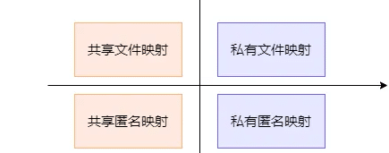
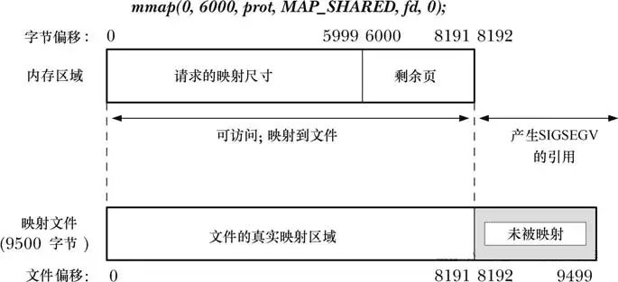
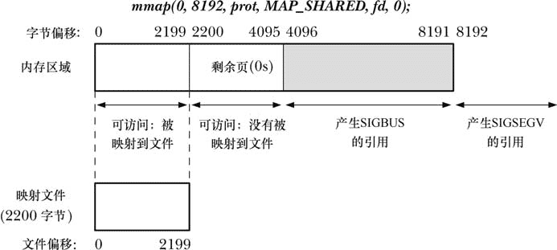

# mmap内存映射IO

## 初识 mmap

什么是 mmap？在 Linux 的命令行输入 mmap，你会看到这样的介绍：

```c
mmap, munmap - map or unmap files or devices into memory
```

也就是说有这么一对儿函数 mmap/munmap，是用来把文件或者设备映射到内存的。那么问题来了，为啥要把文件或者设备映射到内存呢？mmap 解决了什么问题？什么情况下该使用它？使用过程中又有哪些注意点呢？本文笔者将试图解答这几个问题，让大家对 mmap 知其然，更知其所以然。

## mmap/munmap 函数原型

```c
#include <sys/mman.h>
void *mmap(void *addr, size_t length, int prot, int flags, int fd, off_t offset);
int munmap(void *addr, size_t length);
```

从函数原型中可以看到，mmap 接受 6 个参数，下面一一分析下：

-   addr：这个值如果是 NULL，那么操作系统会自动选择一块合适的空闲的地址返回，也就是一段连续的虚拟空间起始地址；如果不为 NULL，相当于向操作系统提出建议，就是用户希望映射的虚拟地址起始是 addr，但是操作系统会综合考虑进程空闲地址区间的情况和对齐策略，不保证一定按照用户的期望实现。
-   length：这个参数其实应该和后面的 offset 一起理解，也就是说要映射的区间是从 offset 开始的 length 长度。
-   prot: 表示要映射的这段内存赋予什么权限，可能是 PROT_EXEC、PROT_READ、PROT_WRITE 或者 PROT_NONE。这几个标志位也可以有机组合，比如 PROT_EXEC | PROT_READ，这通常意味着可读可执行，一般进程地址空间中的码段就是这个属性。
-   flags：一些附加的属性标志，详细的可以参考手册。常用的设置包括共享映射还是私有映射，文件映射还是匿名映射。
-   fd：一个文件句柄。比如你要映射某个文件到内存中，那么得先通过 open 打开这个文件获取一个 fd 才行。
-   offset：偏移量。比如你要映射一个文件从中间开始的一部分，那么此时 offset 就发挥了作用。

如果调用成功，mmap 就会返回映射区间的起始地址，失败会返回 MAP_FAILED，也就是（void *）-1。munmap，顾名思义，就是把 mmap 返回的地址和区间长度传给它，它负责解除映射。

## 玩转 mmap：四种常见的用法

如果哪天你去面试，面试官让你讲讲 mmap，你能脱口而出这四种使用方法，一定会被刮目相看。这里我根据 flag 的不同，划分了四种使用方式：



根据映射的内容是否进程间共享分为共享映射和私有映射；根据映射有无实际的文件对应又分为文件映射和匿名映射。下面依次介绍每种方式的适用场景：

### 私有文件映射：加载动态链接库

简单的说，就是把文件只映射到进程自己的虚拟地址空间，其他进程看不到。咦，动态链接库不是说内存中只有一份，比如 libcxxx.so，然后所有进程共享的吗？这怎么算作私有映射呢？这里私有的意思是说，进程对于映射的这一份内容的修改不会影响到源文件。其实对于动态库来说，一般有代码段和数据段，代码段各个进程肯定是共享的，而且通常是只读的，私有映射属性并不妨碍每个进程映射动态库到同一个物理页面上；数据段中可修改的部分，肯定是每个进程映射一份副本，你改你的，我改我的，互不影响。私有恰好满足这一点，要修改的时候就 copy 一份进程自己的数据副本，不影响其他进程对共享库数据的读取。

### 共享文件映射：进程间通信

上面讨论了私有文件映射，那么共享文件映射就很清楚了：就是进程要修改共享文件的可写页面时，不单独拷贝一份副本，直接在文件页上修改，这样其它映射了这个文件页的进程也能看到对应的修改。下面给出两个示例程序 1.c 和 2.c，来尝试使用 mmap 在两个进程间通信。

```c
/*
* 1.c
*/
#include <stdio.h>
#include <string.h>
#include <unistd.h>
#include <sys/mman.h>
#include <fcntl.h>
#include <errno.h>

int main() {
    int fd = open("hello.txt", O_RDWR);
    if (fd == -1) {
        printf("failed to open file! err is %s\n", strerror(errno));
        return 1;
    }

    off_t file_size = lseek(fd, 0, SEEK_END);
    if (file_size == (off_t) -1) {
        printf("lseek failed! err is %s\n", strerror(errno));
        (void) close(fd);
        return 1;
    }

    void *mapped_memory = mmap(NULL, file_size, PROT_READ | PROT_WRITE, MAP_SHARED, fd, 0);
    if (mapped_memory == MAP_FAILED) {
        printf("mmap failed! err is %s\n", strerror(errno));
        close(fd);
        return 1;
    }

    if (close(fd) == -1) {
        printf("close fd failed! err is %s\n", strerror(errno));
        return 1;
    }

    char *str = (char *) mapped_memory;
    printf("%s\n", str);

    (void) sprintf(str, "%s", "54321");
    printf("%s\n", str);

    sleep(15);

    if (munmap(mapped_memory, file_size) == -1) {
        printf("munmap failed! err is %s\n", strerror(errno));
        (void) close(fd);
        return 1;
    }

    return 0;
}
```

```c
/*
* 2.c
*/
#include <stdio.h>
#include <string.h>
#include <unistd.h>
#include <sys/mman.h>
#include <fcntl.h>
#include <errno.h>

int main() {
    int fd = open("hello.txt", O_RDWR);
    if (fd == -1) {
        printf("failed to open file! err is %s\n", strerror(errno));
        return 1;
    }

    off_t file_size = lseek(fd, 0, SEEK_END);
    if (file_size == (off_t) -1) {
        printf("lseek failed! err is %s\n", strerror(errno));
        (void) close(fd);
        return 1;
    }

    void *mapped_memory = mmap(NULL, file_size, PROT_READ | PROT_WRITE, MAP_SHARED, fd, 0);
    if (mapped_memory == MAP_FAILED) {
        printf("mmap failed! err is %s\n", strerror(errno));
        close(fd);
        return 1;
    }

    if (close(fd) == -1) {
        printf("close fd failed! err is %s\n", strerror(errno));
        return 1;
    }

    char *str = (char *) mapped_memory;
    printf("%s\n", str);

    if (munmap(mapped_memory, file_size) == -1) {
        printf("munmap failed! err is %s\n", strerror(errno));
        (void) close(fd);
        return 1;
    }

    return 0;
}
```

在示例中，首先提前通过 echo "12345" > hello.txt 来创建共享文件。然后进程 1 映射该文件并改变文件内容，接着睡眠等待进程 2 读取共享文件的修改。尽管内核会自动将发生在一个 MAP_SHARED 映射内容上的变更反应到底层文件上，但它不保证何时会完成这个操作。进程可以使用 msync()系统调用来显式地控制一个映射的内容何时与映射文件进行同步。

### 共享匿名映射：父子进程间通信

Linux 上可以通过 fork 创建子进程。我们知道，fork 的时候，子进程其实只是拷贝了父进程的进程控制块，对于 Linux 来说也就是 task_struct 结构体。这时子进程还没有分配真实的物理内存，依然和父进程共享相同的物理页面。那父子进程对内存操作不会互相干扰吗？不会的，操作系统会把对应的页表权限改成只读，物理页面的引用计数会加 1。这样当父子进程的某一个试图修改内存时，就会触发一个权限异常（虚拟地址区域的属性可写，但是页表项却是只读），操作系统会负责分配一个新的物理页，并把进程试图修改的页的内容拷贝过去，然后重新建立页表映射，把页表项的属性改成可写。这就是常说的 fork 调用过程中所谓的 COW（copy on write）写时复制技术。这块的内容后面会单独出文章分析，此处就不详细展开了。如果是共享映射，那么父子进程修改这块虚拟地址上的内容时，其实对应的是相同的物理页面，而且不会触发这种 COW 机制，因此也就实现了通信的效果。示例代码如下：

```c
#include <sys/mman.h>
#include <stdlib.h>
#include <stdio.h>
#include <unistd.h>

int main() {
    pid_t pid;
    // 这里可以试试把 MAP_SHARED改成MAP_PRIVATE，看看输出有什么不同
    char *shm = (char *) mmap(0, 4096, PROT_READ | PROT_WRITE,
                              MAP_SHARED | MAP_ANONYMOUS, -1, 0);
    if (!(pid = fork())) {
        sleep(1);
        printf("child got a message: %s\n", shm);
        sprintf(shm, "%s", "hello, this is child.");
        exit(0);
    }
    sprintf(shm, "%s", "hello, this is parent");
    sleep(2);
    printf("parent got a message: %s\n", shm);
    return 0;
}
```

### 私有匿名映射：分配堆空间

malloc 申请大于 128K 的内存时会使用 mmap，这里用到的其实就是私有匿名映射。

## mmap 的原理：从内核角度理解内存映射

到现在为止，我们知道 mmap 可以把文件映射到一段连续的虚拟内存中。但其实调用 mmap 返回的时候，操作系统只是在进程的 VMA（vm_aera_struct）列表里加了这么一段区间(进程可能有多段 VMA，可以通过/proc/pid/maps 查看)，并没有分配实际的物理内存出来。当进程尝试去访问这段虚拟地址时，就会触发缺页异常（page fault）。这时操作系统的异常处理逻辑才会真正的分配物理页给进程。如果有对应的实际文件，那么这个文件的被映射部分才会被读取到物理页中，和进程虚拟地址空间的 VMA 真正的对应起来。

一个例外情况是，如果设置了 VM_LOCKED，或者通过系统调用的标志参数显式传递进来，或者通过 mlock/mlockall 机制隐式设置，内核会主动依次扫描映射中的各个虚拟页，对每一页触发缺页异常读入对应的数据。这样 mmap 就是在映射建立完成后，所有需要的物理页都在内存中了。

## mmap 的边界：细节是魔鬼

不知道大家有没有想过，我们能不能通过 mmap 向映射的文件末尾追加内容呢？感兴趣的同学可以动手操作一下。

先说结论，不可以。操作系统的内存一般都是按页分配的，假设一个页的大小是 4KB，也就意味着哪怕要映射的文件只有 1 个 byte，操作系统也会分配一个页来做映射。这就是说，用户传入的 length 会被系统根据页的倍数做向上取整。举个例子，就`mmap(NULL, 6000, prot, MAP_SHARED, fd, 0)`这个调用来说，请求映射的大小为 6000byte，文件实际大小为 9500byte，我们看看会发生什么。如下图所示：



虽然我们请求映射的部分是文件的前 6000byte，但实际上文件的前 8192byte（正好是 2 个 4K 页）都被映射到了内存中。6000-8192 之间的地址也可以访问，并且有实际的文件内容对应；进程访问超出 8192byte 的虚拟地址会触发 SIGSEGV 错误。

如果请求映射的 length 比文件的实际长度还大，会怎么样呢？比如`mmap(NULL, 8192, prot, MAP_SHARED, fd, 0)`，请求映射的 length 为 8192byte，实际文件大小 2200byte。如下图所示：



系统会分配 2 个 4K 页来做映射，但是 0-2199byte 是有实际文件对应的，这部分内容进程可以访问，所做的修改在 munmap 之后也会刷新到文件上。2200-4095 这部分是一个映射页的剩余部分，这部分内容进程可以访问，但是没有实际的文件内容对应。默认被操作系统填充 0.也就是说读取这部分地址范围内的数据会得到 0。如果尝试往这段区间写入内容，那么不会报错，但是写入的内容也不会追加到真实的文件里。当然，这些字节也不会与映射同一个文件的其他进程共享，即使它们指定了足够大的 length 参数。4096-8192 之间的内容，相当于是无效的，直接访问会触发 SIGBUS 错误。超出 8192 的范围访问，会触发 SIGSEGV 错误。

综上所述，创建一个超出文件大小的映射可能毫无意义。除非进程使用 ftruncate 或者 write 等调用扩充了文件的大小，就上述例子而言，如果文件被扩充到 5000byte，那么再去访问 4096-5000 之间的内容就不会报错了。
