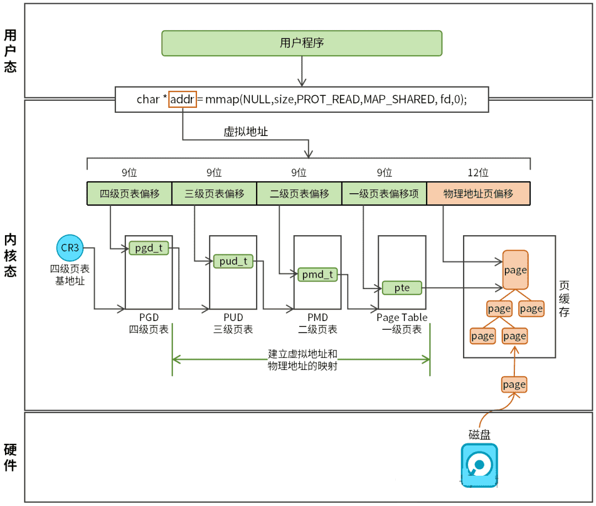
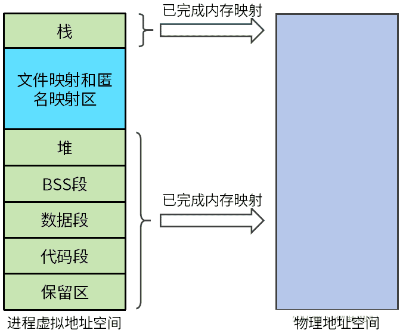

# mmap实现原理

`mmap`是 Linux系统的一种内存映射机制，允许将文件或设备直接映射到进程的虚拟地址空间。进程通过操作内存指针即可读写文件，无需调用`read`/`write` 等系统调用。mmap内存映射在Linux系统中广泛被使用，如：内存分配、零拷贝网络传输、进程间通信、大文件处理等。

## mmap内存映射

mmap的作用是将文件或设备映射到进程的地址空间，从而减少内核与用户空间的数据拷贝次数。

函数原型如下：

```c
void* mmap(void* addr, size_t length, int prot, int flags, int fd, off_t offset);
```

 参数说明：

-   addr：由用户设置的映射地址。通常设置为NULL，表示让操作系统选择合适的地址。
-   length：映射的内存长度。
-   prot：内存区域的保护标志，如PROT_READ（可读）、PROT_WRITE（可写）、PROT_EXEC（可执行）。
-   flags：映射标志，如MAP_SHARED（共享映射）、MAP_PRIVATE（私有映射）、MAP_ANONYMOUS（匿名映射）。
-   fd：文件描述符，用于文件映射。如果是匿名映射，可以设置为-1。
-   offset：文件的偏移量，指定从文件的哪个位置开始映射。

mmap函数调用成功后，我们将获得一块虚拟内存地址空间，通过这块虚拟内存我们就能够直接操作物理内存或外部设备了。

那么，mmap是如何实现这个功能的呢？

## mmap内核实现原理

学习mmap要抓住两个重点：第一，虚拟内存是如何访问物理内存的；第二，mmap要达到的目的是什么。带着这两个问题，我们来学习mmap内核实现原理（简化逻辑），如图1所示。



对于一个64位的操作系统来说，虚拟地址长度为48位，被分为5个部分：四级页表偏移（9位）、三级页表偏移（9位）、二级页表偏移（9位）、一级页表偏移（9位）、物理地址页偏移（12位）。

虚拟地址采用四级页表机制映射物理地址，四级页表层级下表。

| 层级                               | 缩写 | 作用                                                  |
| ---------------------------------- | ---- | ----------------------------------------------------- |
| 页全局目录(Page Global Directory)  | PGD  | 四级页表，顶级页表，存储pgd_t表项（指向PUD物理基地址) |
| 页上级目录(PageUpper Directory)    | PUD  | 三级页表，存储pud_t表项（指向PMD物理基地址）          |
| 页中间目录 (Page Middle Directory) | PMD  | 二级页表，存储pmt_t表项（指向PT物理基地址）           |
| 页表 (Page Table)                  | PT   | 一级页表，末级页表，存储页表项pte。                   |

虚拟地址映射物理地址的过程如下：

-   步骤1：CPU的CR3寄存器记录了进程PGD页表的物理基地址，该地址用于查找PGD表所在物理内存的起始位置。创建进程时，内核会为进程分配一个PGD页表物理基地址并记录在task_struct->mm->pgd成员。进程被CPU选中后，内核会将CR3寄存器修改为pgd记录的基地址。每个进程分配的地址是不一样的，所以进程之间是隔离的，不能访问相同的物理内存，由于这种隔离，进程间需要通过特定的方式才能够通信。

-   步骤2：通过虚拟地址中四级页表偏移（9位）查询PGD页表获取pgd_t表项，pgd_t记录了PUD页表物理基地址，指向PUD页表物理内存起始地址。

-   步骤3：通过虚拟地址中三级页表偏移（9位）查询PUD页表获取pud_t表项，pud_t记录了PMD页表物理基地址，指向PMD页表物理内存起始地址。

-   步骤4：通过虚拟地址中二级页表偏移（9位）查询PMD页表获取pmd_t表项，pmd_t记录了PT页表物理基地址，指向PT页表物理内存起始地址。

-   步骤5：通过虚拟地址中一级页表偏移（9位）查询PT页表获取pte表项，pte记录了物理页（4KB）物理基地址，指向物理内存起始地址。

-   步骤6：物理页基地址加虚拟地址中物理地址页偏移（12位）就是最后虚拟地址映射的物理地址了。

mmap的作用是完成虚拟地址到物理地址的映射，即填充四级页表中的页表项，打通内存映射的链路。



mmap从文件映射和匿名映射区指定一段虚拟地址空间进行内存映射，完成内存映射后，用户程序就能够访问这段虚拟地址空间。mmap可以分为文件映射和匿名映射，文件映射和匿名映射并没有本质的区别，二者的区别在于映射的目的物理页不同而已。

文件映射是指mmap映射的物理地址指向文件，即文件的页缓存。前面我们已经介绍过了，页可以表示物理内存。Linux为了加快文件读写，通常会将磁盘文件预读取至文件页缓存。访问文件的页缓存等同于访问磁盘文件。通过mmap完成文件映射后，就可以直接通过虚拟地址访问文件了。
