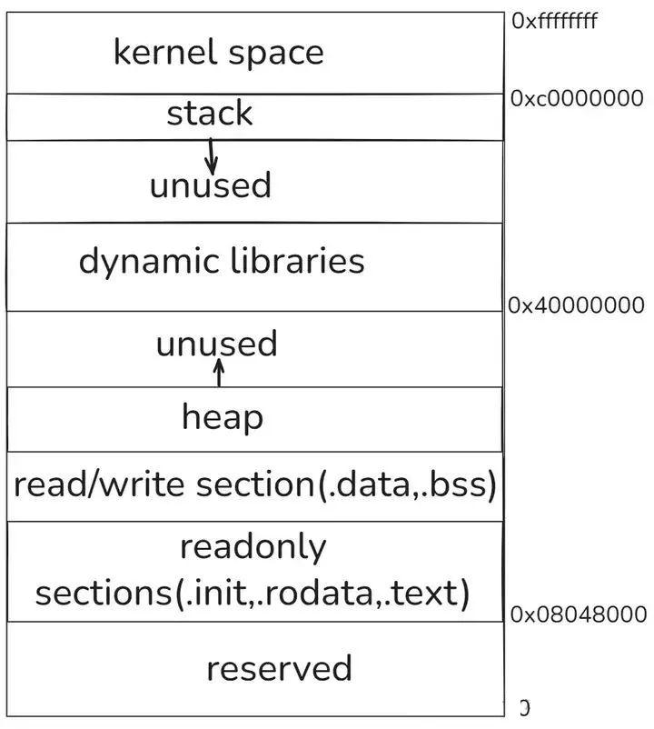

# 为何栈的内存分配比堆更快？

栈和堆是两种主要的内存分配区域，而栈的内存分配速度常常优于堆，这背后蕴含着诸多缘由。栈内存的分配方式相对简洁。当程序调用一个函数时，栈会迅速为该函数的局部变量、参数等分配内存空间，这一过程仅需移动栈指针即可完成，就像在书架上为新的书籍腾出连续的位置，简单直接。而堆内存的分配，例如在 C 语言中使用malloc函数时，操作系统需要在堆空间中搜索足够大小的空闲内存块，这一搜索过程复杂且耗时，如同在杂乱无章的仓库中寻找特定大小的空位。

栈内存的释放机制同样高效。函数执行完毕后，栈上为该函数分配的内存会自动释放，栈指针回退，这一操作一气呵成。与之对比，堆内存需要开发者手动调用free（C 语言）函数来释放，不仅繁琐，若操作不当还容易引发内存泄漏等问题。此外，栈内存通常是连续存储的，这使得 CPU 缓存能够更高效地工作，访问速度大幅提升，而堆内存由于分配的随机性，内存地址往往不连续，对缓存利用不利，访问速度也就相对较慢。

## 栈和堆基础概述

栈：由编译器自动分配释放，存放函数的参数值、局部变量的值等。其操作方式类似于数据结构中的栈。每当一个函数被调用，该函数返回地址和一些关于调用的信息，比如某些寄存器的内容，被存储到栈区。然后这个被调用的函数再为它的自动变量和临时变量在栈区上分配空间，这就是C实现函数递归调用的方法。每执行一次递归函数调用，一个新的栈框架就会被使用，这样这个新实例栈里的变量就不会和该函数的另一个实例栈里面的变量混淆。用于维护函数调用的上下文，离开了栈函数调用就没法实现。栈通常在用户空间的最高地址分配，通常有数兆字节大小。

堆：是用来容纳应用程序动态分布的内存区域，当程序使用malloc或new分配内存时，得到的内存来自堆里，一般由程序员分配和释放，若程序员不释放，程序结束时有可能由OS回收。堆通常在栈的下方（低地址方向），在某些时候，堆一般比栈大很多，可以有几十至数百兆字节的容量。

在进程地址布局（如下图），可见地址的分布情况，栈和堆所在的位置区域。



栈（Stack）和堆（Heap）就像是一对形影不离却又性格迥异的伙伴，它们默默支撑着程序的运行，却常常让开发者们在性能优化的道路上陷入沉思。让我们先通过一段简单的 C++代码，来直观感受一下栈和堆的存在。

```cpp
#include <iostream>
#include <string>

int main() {
    // 栈上分配的局部变量
    int number = 10;

    // 堆上分配的对象（使用new关键字）
    std::string* message = new std::string("Hello, World!");

    // 在C++中，堆上分配的内存需要手动释放
    delete message;

    return 0;
}
```

在这段代码里，int 类型的变量 number 是在栈上分配的，它就像是一个被临时安置在栈这个 “小阁楼” 里的小物件，随着 main 函数的执行而快速入驻，又在函数结束时迅速撤离。而用 new 创建的 std::string 对象 message 则是在堆上分配的，堆就像是一个广阔的 “大仓库”，对象们在这里被创建并长期驻扎，直到通过 delete 手动释放，否则会一直占用内存。

栈内存的分配和释放就像一场快节奏的舞蹈，由操作系统自动掌控。当一个方法被调用时，栈帧会被迅速创建，其中包含了方法的局部变量、参数等信息，就像在栈这个舞台上迅速搭建起一个表演区域。而当方法执行完毕，栈帧又会像表演结束后的舞台道具一样被快速拆除，内存被瞬间释放。这种高效的自动化管理方式，使得栈内存的操作速度极快，就像闪电一般。

相比之下，堆内存的分配和释放则像是一场精心策划的大型活动。当需要创建一个对象时，程序会在堆这个大仓库里寻找合适的存储空间，这个过程就像在仓库里挑选一个合适的空位放置物品。而当对象不再被使用时，垃圾回收机制并不会立刻将其清理，而是要等到合适的时机，这就像仓库管理员不会随时清理仓库，而是会定期进行整理。这种管理方式使得堆内存的分配和释放相对较慢，就像一场按部就班的活动。

栈和堆在内存分配上的这些差异，就像是两种不同的工作方式，栈以其快速高效的特点，适合处理那些需要迅速响应的任务；而堆则以其灵活的空间管理，能够容纳各种复杂的数据结构和长期存在的对象。那么，究竟是什么原因导致了栈的内存分配比堆快呢？让我们带着这个疑问，继续深入探索栈和堆的奥秘。

### 栈内存分配的注意事项与常见问题

**（1）栈溢出：小心栈内存的 “超载”**

栈溢出就像是栈内存这座 “小仓库” 遭遇了 “超载” 危机，是一个不容忽视的严重问题。其主要成因在于递归调用过深或者局部变量占用空间过大。

递归函数在执行过程中，每一次递归调用都会在栈内存中创建一个新的栈帧，用于存放该次调用的局部变量、参数以及返回地址等信息。如果递归调用没有合理的终止条件，或者递归的深度超出了栈内存的承载能力，就会导致栈内存中堆积的栈帧越来越多，最终耗尽栈内存空间，引发栈溢出错误。比如下面这个简单的递归函数示例：

```
void recursiveFunction() {
    recursiveFunction(); // 无限递归调用，没有终止条件
}

int main() {
    recursiveFunction();
    return 0;
}
```

在这个recursiveFunction函数中，由于没有设置递归终止条件，它会无休无止地递归调用自身。随着递归调用的不断进行，栈内存中会持续不断地创建新的栈帧，栈内存被迅速消耗，最终导致栈内存被耗尽，程序抛出栈溢出错误，就像一个不断被塞进物品却没有出口的仓库，最终被塞得满满当当，无法再容纳任何新的物品 。

除了递归调用过深，定义过大的局部变量也可能引发栈溢出问题。当在函数内部定义一个非常大的数组或者复杂的结构体时，这些局部变量需要占用大量的栈内存空间。如果栈内存无法满足它们的需求，就会发生栈溢出。例如：

```
int main() {
    int largeArray[1000000]; // 定义一个包含100万个元素的大型数组
    // 其他操作
    return 0;
}
```

在这个例子中，largeArray数组的大小非常大，可能会超过栈内存的可用空间。当程序尝试为这个数组分配栈内存时，就可能会因为栈内存不足而导致栈溢出错误，就好比一个仓库的空间有限，却要强行放入一个超大尺寸的物品，最终导致仓库被撑爆 。

为了避免栈溢出问题，我们需要采取一系列有效的措施。在编写递归函数时，一定要仔细检查并确保递归调用有明确的终止条件，这就像给一个循环设置退出条件一样重要。可以通过设置一个计数器或者检查某个特定的条件来控制递归的深度，确保递归不会无限制地进行下去。例如：

```
void recursiveFunction(int count) {
    if (count == 0) {
        return; // 递归终止条件
    }
    recursiveFunction(count - 1);
}

int main() {
    recursiveFunction(10); // 合法调用，递归深度为10
    return 0;
}
```

在这个改进后的recursiveFunction函数中，增加了if (count == 0)的递归终止条件。每次递归调用时，count的值会减 1，当count为 0 时，递归就会停止，从而避免了栈溢出的风险 。

另外，在函数内部定义局部变量时，要谨慎考虑变量的大小和必要性。尽量避免定义过大的数组或结构体，如果确实需要处理大量数据，可以考虑使用堆内存分配，将数据存储在堆上，而不是栈上。堆内存的大小相对灵活，理论上只受限于系统内存，这样可以有效避免栈内存因无法满足大内存需求而发生溢出。同时，一些编程语言和开发环境提供了调整栈内存大小的参数，我们可以根据实际需求适当增大栈内存的大小，但这只是一种临时的缓解措施，并不能从根本上解决问题，因为栈内存的大小总是有限的 。

当遇到栈溢出错误时，调试工作至关重要。我们可以借助开发工具提供的调试功能，如设置断点、查看调用栈信息等，来逐步分析程序的执行过程，找出导致栈溢出的具体位置和原因。通过查看调用栈信息，我们可以清晰地看到递归调用的层次和顺序，以及各个函数中局部变量的使用情况，从而有针对性地进行问题排查和修复 。

**（2）内存泄漏：栈内存中的 “隐形漏洞”**

尽管栈内存通常由编译器自动管理，在函数结束时会自动释放局部变量占用的内存，从而有效避免了大部分内存泄漏问题，但在某些复杂情况下，栈内存中仍可能潜藏着内存泄漏的隐患，就像一个看似坚固的城堡，却可能存在一些不易察觉的隐形漏洞。

在 C++ 中，当在栈上创建对象时，如果对象的构造函数中分配了堆内存，但在对象的析构函数中没有正确释放这些堆内存，就会导致内存泄漏。例如：

```
class Example {
public:
    Example() {
        data = new int[100]; // 在构造函数中分配堆内存
    }
    ~Example() {
        // 这里没有释放data指向的堆内存，会导致内存泄漏
    }
private:
    int* data;
};

void function() {
    Example obj;
    // 函数结束时，obj的析构函数被调用，但data指向的堆内存未被释放
}
```

在这个例子中，Example类的构造函数使用new分配了一块包含 100 个整数的堆内存，并将指针data指向这块内存。然而，在析构函数中，没有使用delete[]来释放这块内存。当function函数结束时，obj的析构函数被调用，但由于析构函数中没有正确释放内存，这块在构造函数中分配的堆内存就会一直占用，从而造成内存泄漏 。

另外，在使用智能指针时，如果对其特性和使用方法理解不当，也可能导致栈内存泄漏。智能指针是 C++ 中用于自动管理内存的工具，它通过 RAII（Resource Acquisition Is Initialization，资源获取即初始化）机制来确保在对象生命周期结束时自动释放所管理的内存。但如果在使用智能指针时，出现循环引用的情况，就会导致内存无法被正确释放。例如：

```
#include <memory>

class Node {
public:
    std::shared_ptr<Node> next;
    ~Node() {
        std::cout << "Node destroyed" << std::endl;
    }
};

void circularReference() {
    std::shared_ptr<Node> node1 = std::make_shared<Node>();
    std::shared_ptr<Node> node2 = std::make_shared<Node>();
    node1->next = node2;
    node2->next = node1;
    // 这里node1和node2之间形成了循环引用，导致内存无法释放
}
```

在这个例子中，node1和node2通过next指针相互引用，形成了循环引用。由于std::shared_ptr使用引用计数来管理内存，在这种循环引用的情况下，node1和node2的引用计数都不会变为 0，从而导致它们所指向的内存无法被释放，即使circularReference函数结束，这部分内存仍然会被占用，造成栈内存泄漏 。

为了排查栈内存中的内存泄漏问题，我们可以使用一些专业的内存分析工具，如 Valgrind（在 Linux 系统中常用）、AddressSanitizer（Clang 和 GCC 编译器支持的内存检测工具）等。这些工具能够在程序运行时动态监测内存的分配和释放情况，帮助我们准确地定位内存泄漏的位置和原因。以 Valgrind 为例，它可以详细地报告内存泄漏的具体行号、调用栈信息以及泄漏的内存块大小等，让我们能够快速地找到问题所在，并进行修复 。

在编写代码时，我们要养成良好的编程习惯，遵循正确的内存管理原则。对于手动分配的内存，一定要确保在不再使用时及时释放，特别是在对象的析构函数中，要仔细检查是否有未释放的资源。同时，要深入理解智能指针等内存管理工具的工作原理，避免出现循环引用等导致内存泄漏的情况。通过代码审查和单元测试，也可以提前发现潜在的内存泄漏问题，提高代码的质量和稳定性 。

## 堆的内存分配详解

内存就像是一个繁忙的大仓库，所有正在运行的程序和数据都存放在这里。程序要执行，数据要处理，都得先从这个仓库里取出来。而在这个大仓库中，堆内存又是极为重要的一部分，它掌管着程序运行时动态分配的内存，对程序的性能和稳定性有着关键影响。接下来，就让我们一起深入堆内存的神秘世界，探索它的分配机制吧！

### 堆内存的独特地位

**（1）内存家族成员介绍**

在计算机的内存体系中，有着不同层次的 “成员”。CPU 缓存位于最顶端，它是离 CPU 最近的内存，速度极快，但容量相对较小，就像是 CPU 的 “贴身小助手”，能快速提供 CPU 急需的数据和指令，基于局部性原理，将 CPU 近期频繁访问的数据和指令预先放入其中，大大加快了访问速度。再往下是随机存取存储器（RAM），也就是我们常说的内存，它用于存放当前正在运行的程序和数据，访问速度较快，但容量有限，且数据断电后就会消失，是计算机中直接供 CPU 访问的存储器，如同一个繁忙的中转站。而硬盘等外部存储设备，容量大且数据可永久保存，但访问速度相对较慢，主要用于长期存储大量数据和程序，就像一个大型仓库。

堆内存处于内存中的堆区，与栈内存有着明显区别。栈内存主要用于存储局部变量、函数参数和返回地址等信息，它的分配和释放由系统自动管理，速度很快，就像一个高效的自动售货机，取货和退货都很迅速，但大小通常有限。而堆内存是用于动态分配内存的区域，程序可以在运行时根据需要申请和释放内存，其大小仅受限于系统的可用内存，更加灵活，如同一个可以按需租用摊位的大集市。

**（2）堆内存特性**

堆内存最显著的特性就是动态分配和释放。当程序运行过程中需要额外的内存空间来存储数据时，就可以从堆中申请内存，例如在 C++ 中使用new关键字，在 C 语言中使用malloc函数。当这些数据不再需要时，程序员需要手动释放这些内存，如在 C++ 中使用delete关键字，C 语言中使用free函数 。如果忘记释放，就会造成内存泄漏，就好比租了房子却一直不归还，导致资源浪费。

堆内存中的数据生命周期较长，只要程序员不释放，它就会一直存在于内存中。这与栈内存中数据随着函数结束就被自动释放不同，堆内存可以用于存储那些需要在程序不同部分共享或长期使用的数据，像一个长期租赁的仓库，物品可以长时间存放。

此外，堆内存的大小还可以动态调整。当程序需要更多内存时，它可以向操作系统申请扩展堆内存；当某些内存不再使用时，又可以归还给操作系统，这一特性使得程序在处理不同规模的数据时更加从容，如同一个可以根据需求随时扩建或缩减的工厂。

**（3）在程序世界的关键作用**

在处理大量数据和复杂逻辑的应用中，堆内存发挥着不可替代的重要作用。比如在数据库管理系统中，需要存储和处理海量的数据，堆内存可以为这些数据提供足够的存储空间，并且能够根据数据量的变化动态调整内存使用，确保系统高效运行。在图形处理软件中，处理高分辨率图像和复杂的图形渲染时，也需要大量的内存来存储图像数据和中间计算结果，堆内存的灵活性使得这些操作得以顺利进行。

堆内存的使用情况还对程序性能和稳定性有着直接影响。合理分配和管理堆内存，可以减少内存碎片，提高内存利用率，从而提升程序的运行速度。相反，如果堆内存管理不善，频繁出现内存泄漏、内存分配失败等问题，就会导致程序运行缓慢，甚至崩溃，就像一个管理混乱的仓库，货物随意堆放，通道被堵塞，最终导致整个仓库无法正常运作。

### 堆内存分配的底层逻辑

**（1）内存中的神秘结构**

堆内存从逻辑上看，是一片连续的地址空间，但在实际的物理内存中，它可能是不连续的，通过操作系统的内存管理机制来实现逻辑上的连续。它就像一个可以不断扩建的大楼，随着程序运行时不断申请内存，大楼会不断向上增长，地址也随之增大。

在 Java 虚拟机（JVM）中，堆内存有着精细的区域划分。新生代是新对象诞生的地方，其中伊甸园区（Eden Space）是对象优先分配的区域，就像一个热闹的新生儿病房 。当伊甸园区空间不足时，会触发 Minor GC，将存活的对象复制到幸存者区（Survivor Space），幸存者区又分为 From 区和 To 区，它们就像两个相邻的康复病房，对象在这两个区域之间来回转移，每经历一次转移，年龄就增加 1，当年龄达到一定阈值（默认 15 次），对象就会晋升到老年代（Old Generation），老年代存放着生命周期较长的对象，如同一个经验丰富的长者的聚集地。在 JDK 8 之前，还有永久代（Permanent Generation），用于存放类的元数据、常量池等信息，就像一个知识宝库；从 JDK 8 开始，永久代被元空间（Metaspace）取代，元空间使用本地内存，不再受 JVM 堆内存大小的限制，更加灵活自由。

**（2）分配策略解析**

固定大小分配策略就像提前划分好固定大小的房间，每个房间只能放特定大小的物品。例如，在一些嵌入式系统中，由于内存资源有限且应用场景相对固定，会预先将堆内存划分为若干个固定大小的内存块，当程序需要内存时，直接分配一个合适大小的内存块。这种策略的优点是分配和释放速度快，因为不需要进行复杂的查找和计算，就像直接找到对应的房间入住。缺点是灵活性差，如果程序需要的内存大小与预先划分的内存块大小不匹配，就会造成内存浪费，比如一个小物品占用了一个大房间。

对象池化策略则是将常用的对象提前创建好，放入对象池中，当程序需要时直接从对象池中获取，使用完后再放回池中。以数据库连接池为例，在一个频繁访问数据库的应用中，提前创建好一定数量的数据库连接对象并放入连接池中，当程序需要连接数据库时，直接从池中获取一个连接，使用完毕后再归还到池中。这样可以减少对象创建和销毁的开销，提高性能，就像在一个工具房中提前准备好常用工具，需要时直接取用，用完放回，节省了制作工具的时间。但它也存在缺点，对象池的大小需要合理设置，如果设置过小，可能无法满足程序的需求；如果设置过大，又会浪费内存资源，就像工具房准备的工具过多或过少都会带来问题。

按需分配策略是根据程序的实际需求，动态地从堆内存中分配内存空间，当不再需要时再释放。这是最常见的一种分配策略，在 C++ 中使用new关键字申请内存就是按需分配的

体现。它优点是灵活性高，能充分利用内存资源，满足各种不同大小的内存需求，就像一个可以根据顾客需求定制大小摊位的集市。然而，频繁的分配和释放操作可能会导致内存碎片的产生，降低内存的使用效率，就像集市摊位被随意划分和收回，导致出现很多零散的小空间无法有效利用。

**（3）经典分配算法详解**

①首次适应算法

首次适应算法的工作方式很直接，就像在一排商店中找一个合适大小的空店铺。它从内存的起始位置开始，顺序查找空闲内存块链表，当遇到第一个能够满足请求大小的空闲分区时，就将这个分区分配给请求者。如果该分区大于请求的大小，就会将其分割，剩余部分作为新的空闲分区保留在链表中。例如，内存中有空闲分区大小分别为 10KB、20KB、15KB、5KB（按地址顺序排列），当有一个进程请求 12KB 内存时，首次适应算法会从第一个分区 10KB 开始检查，发现不够，继续检查下一个 20KB 的分区，发现足够，于是将 20KB 的分区分配 12KB 给进程，剩余 8KB 作为新的空闲分区。

这种算法的优点是速度快，平均时间复杂度为\(O(n/2)\)，因为一旦找到合适的分区就停止查找，就像很快找到了合适的店铺。但它也容易在低地址部分产生外部碎片，随着时间的推移，低地址区域会出现许多难以利用的小空闲分区，可能影响大进程的分配，就像街道前面出现了很多小的零散店铺，大商家无法入驻。

②最佳适应算法

最佳适应算法像是一个追求完美匹配的购物者，它的目标是找到最适合的内存块。在分配内存时，它会遍历整个空闲分区链表，选择能够满足请求大小的最小空闲分区进行分配，以尽量减少剩余空间，也就是选择最接近请求大小的分区。同样以上述内存分区为例，当进程请求 12KB 内存时，最佳适应算法会遍历所有分区，发现 10KB 不够，20KB 和 15KB 都够，但 15KB 是满足条件的最小分区，所以选择 15KB 的分区进行分配，分配后剩余 3KB。这种算法理论上可以减少大分区被切碎，尽量保留大块内存，就像在众多商品中挑选出最合身的那件，避免浪费。

但它容易产生大量难以利用的小碎片，每次分配都需要扫描所有可用内存块，搜索时间长，当内存块数量较多时，效率会明显降低，就像在众多商品中挑选最合身的花费了大量时间，而且还可能剩下很多零碎的布料难以再利用。

③快速适应算法

快速适应算法采用了一种更高效的管理方式，它就像一个分类整理的仓库管理员。将空闲分区根据其容量大小进行分类，对于每一类具有相同容量的所有分区，单独设立一个空闲分区链表，这样系统中就存在多个空闲分区链表。同时，在内存中设立一张管理索引表，其中的每一个索引表项对应了一种空闲分区类型。当搜索可分配空闲分区时，第一步根据进程的长度，从索引表中去寻找能容纳它的最小空闲区链表；第二步是从链表中取下第一块进行分配即可。

这种算法的响应速度快，因为不需要遍历整个内存空间，而是直接通过索引表快速定位到合适的链表，就像仓库管理员通过索引快速找到所需物品所在的货架。但它的维护开销大，需要管理多个链表和索引表，当内存分配和释放操作频繁时，管理这些数据结构的成本较高，就像仓库管理员需要花费很多精力整理和维护各个货架的物品。

**（4）性能影响因素剖析**

内存碎片是影响堆内存分配性能的重要因素，它分为内部碎片和外部碎片。内部碎片是指分配给程序的内存块中，未被使用的部分。例如，使用固定大小分配策略时，程序申请的内存小于预先划分的内存块大小，就会产生内部碎片，就像一个大箱子装了一个小物品，剩下的空间浪费了。外部碎片是指由于频繁的内存分配和释放，导致内存中出现许多不连续的小空闲分区，这些小分区无法满足大的内存请求，就像城市中出现了很多零散的小空地，无法建造大型建筑。内存碎片会降低内存的利用率，增加内存分配失败的概率，因为当需要分配较大内存块时，可能找不到连续的足够大的空闲空间，从而影响程序性能。

内存分配速度与效率对程序性能也起着关键作用。如果内存分配速度快，程序就能迅速获取所需的内存资源，快速响应各种任务，就像一个高效的物流配送中心，能及时将货物送到客户手中。相反，如果分配效率低下，程序在等待内存分配的过程中会浪费大量时间，导致整体运行速度变慢，就像物流配送缓慢，客户要等很久才能收到货物。在一些对实时性要求较高的应用中，如游戏、实时通信等，内存分配的速度和效率直接影响用户体验，快速的内存分配能保证游戏画面的流畅和通信的及时响应，而缓慢的分配则可能导致游戏卡顿、通信延迟。

### 优化与问题解决之道

**（1）解析优化策略**

在实际编程中，选择合适的内存分配算法是优化堆内存分配的关键一步。不同的应用场景对内存分配有着不同的需求，例如在实时性要求极高的游戏开发中，快速适应算法能够快速响应内存分配请求，减少卡顿现象，让游戏画面更加流畅，就像游戏中的快速补给站，能迅速提供所需资源 。而在一些对内存利用率要求较高的大数据处理场景中，最佳适应算法能更好地利用内存空间，减少内存浪费，如同精打细算的管家，合理分配每一寸空间。

减少内存碎片也是提高堆内存使用效率的重要策略。可以采用内存紧缩技术，定期将内存中的数据进行整理，将分散的空闲内存块合并成连续的大内存块，就像整理书架，把零散的书籍摆放整齐，腾出更大的空间 。还可以在分配内存时，尽量按照内存块的大小顺序进行分配和释放，避免小内存块分散在大内存块之间，从而减少外部碎片的产生。

使用对象池是优化堆内存分配的又一有效方法。在频繁创建和销毁对象的场景中，如游戏中的子弹、怪物等对象，使用对象池可以避免重复创建和销毁对象带来的开销。当需要使用对象时，直接从对象池中获取；使用完毕后，再将对象放回对象池，就像在一个工具房中循环使用工具，节省了制作新工具的时间和材料 。通过合理设置对象池的大小和管理策略，可以显著提高程序的性能和内存利用率。

**（2）常见问题及解决方案**

内存泄漏是堆内存管理中常见的问题之一，它就像一个无声的小偷，悄悄偷走内存资源。在 C++ 中，如果使用new分配了内存，但忘记使用delete释放，随着程序的运行，泄漏的内存会越来越多，最终导致系统内存耗尽，程序崩溃。内存泄漏通常是由于程序员的疏忽，如忘记释放内存、对象之间的循环引用等原因造成的。例如，在一个图形渲染程序中，可能会创建大量的图形对象，如果在对象不再使用时没有正确释放相关的内存资源，就会逐渐耗尽系统内存，导致程序运行缓慢甚至死机。

内存溢出则是当程序申请的内存超过了系统所能提供的可用内存时发生的问题，就像一个容器已经装满了水，却还在不断往里倒水。在 Java 中，如果创建了一个非常大的数组或对象，超出了堆内存的限制，就会抛出OutOfMemoryError异常。这可能是因为程序设计不合理，对内存需求估计不足，或者在处理大量数据时没有进行有效的内存管理。比如在一个图像处理程序中，当处理高分辨率图像时，如果没有合理分配内存，可能会因为图像数据过大而导致内存溢出。

为了检测和解决这些问题，有许多实用的工具可供使用。Valgrind 是一款强大的内存调试工具，它可以帮助检测 C/C++ 程序中的内存泄漏、使用未初始化的内存、内存越界等问题。通过在 Valgrind 环境下运行程序，它会详细报告内存使用情况和潜在问题，就像一个专业的医生，能准确诊断出内存中的各种 “病症”。例如，在一个 C++ 项目中，使用 Valgrind 检测到了一处内存泄漏，通过查看 Valgrind 的报告，定位到了泄漏的具体代码行，原来是在一个函数中分配了内存，但在函数结束时没有释放，修复这个问题后，程序的内存使用变得更加健康。

## 两者之间性能差异根源

### 分配和释放机制

栈内存的分配和释放堪称简洁高效的典范。当一个函数被调用时，栈内存分配的大幕迅速拉开，就像一场精心编排的快闪表演。系统会毫不犹豫地在栈顶为函数的局部变量、参数等所需元素快速分配内存空间，这个过程仅仅是将栈指针向低地址方向移动一个固定的距离，这个距离取决于要分配的内存大小 。

这个操作简单直接，就像在一个已经规划好的书架上，按照顺序快速摆放书籍，不需要额外的寻找和整理动作，所以速度极快，几乎可以在瞬间完成，时间复杂度为常数级别的 O (1)。而当函数执行完毕，栈内存释放的环节紧随其后，栈指针又会迅速向高地址方向移动，将刚才分配的内存空间轻松回收，就像快速把书架上的书籍清理掉，为下一次的摆放腾出空间。这种自动且高效的分配和释放机制，使得栈内存的操作如同闪电一般迅速，为程序的快速运行提供了有力支持 。

反观堆内存的分配和释放，就像是一场复杂的大型工程。在堆内存中，没有像栈那样预先规划好的整齐布局，内存块的分布就像杂乱无章的仓库，大小和位置都毫无规律。当程序需要在堆上分配内存时，就如同在这个杂乱的仓库里寻找一件特定大小的物品，内存分配器必须花费大量的时间和精力，仔细地遍历堆内存中的各个空闲块，试图找到一个大小足够且合适的内存块来满足分配请求。这个查找过程就像在迷宫中寻找出口，可能需要经过多次比较和判断，涉及到复杂的算法和数据结构操作，例如常见的首次适配算法、最佳适配算法等 。

这些算法虽然各有优劣，但都不可避免地增加了内存分配的时间开销，使得堆内存的分配速度相对较慢，时间复杂度通常为 O (n) 或更复杂。而且，堆内存的释放也同样复杂，当一个内存块被释放后，它并不会像栈内存那样自动被回收，而是会留在堆中，成为一个空闲块。为了提高内存利用率，内存分配器还需要对这些空闲块进行管理和维护，例如合并相邻的空闲块，防止内存碎片化问题的加剧，这又进一步增加了释放操作的复杂性和时间成本 。

### 内存访问特性

栈内存就像是一个排列整齐的有序队列，具有连续的内存地址。这一特性使得栈内存的数据访问速度极快，就像在一条笔直的高速公路上行驶，畅通无阻。当 CPU 需要访问栈上的数据时，由于数据在内存中是紧密相连的，它们很容易被 CPU 缓存命中 。CPU 缓存就像是一个高速的临时存储区域，它可以快速地提供 CPU 所需的数据，大大减少了 CPU 访问内存的时间。

例如，当我们在一个函数中连续访问多个栈上的局部变量时，这些变量的数据很可能已经被预先加载到 CPU 缓存中，CPU 可以直接从缓存中读取数据，而无需再去较慢的主内存中获取，这就使得栈内存的访问速度得到了极大的提升 。就像在一个图书馆里，如果你要找的几本书都放在相邻的书架上，那么你可以很快地找到它们，而不需要在整个图书馆里四处寻找。

而堆内存的数据存储则像是散落在各个角落的物品，缺乏连续性。当 CPU 需要访问堆上的数据时，由于数据存储的分散性，它们很难被 CPU 缓存命中 。这就意味着 CPU 在访问堆内存时，往往需要多次访问主内存，才能获取到所需的数据，这无疑大大增加了内存访问的时间开销。

例如，当我们在一个链表结构中存储数据时，由于链表的节点是在堆上动态分配的，它们的内存地址可能相隔甚远，CPU 在访问链表中的节点时，就需要不断地在主内存中寻找不同的地址，这就导致了堆内存的访问速度相对较慢 。就像在一个大型商场里，你要找的几件商品分别放在不同的楼层和区域，你需要花费很多时间和精力才能找到它们。

### 内存碎片化影响

栈内存的分配和释放严格遵循后进先出的原则，就像一个有条不紊的队列，这使得栈内存不会产生内存碎片化的问题。在栈中，新的数据总是从栈顶开始添加，当数据不再需要时，又从栈顶开始移除，就像在一个栈状的容器中，物品按照放入的顺序依次取出，不会出现中间有空位的情况 。这种有序的操作方式保证了栈内存始终保持连续和紧凑，每一次的内存分配和释放都不会破坏内存的连续性，使得内存空间得到了高效的利用 。就像一个整齐排列的书架，每一本书都按照顺序摆放，当你取出一本书时，不会留下一个空洞，而是会自动调整其他书的位置，保持书架的整齐。

堆内存的分配和释放则充满了随机性，就像在一个杂乱无章的仓库里随意存放和取出物品，这使得堆内存极易产生内存碎片化的问题。随着程序的运行，堆内存中不断地进行着内存的分配和释放操作，由于每次分配和释放的内存块大小和位置都不固定，就会导致堆内存中出现许多零散的空闲块，这些空闲块就像仓库里的零散空位，无法被有效地利用 。例如，我们先分配了一个较大的内存块，使用完后释放它，然后又分配了几个较小的内存块，这些小内存块可能会占据原来大内存块的部分空间，使得原本连续的空闲空间变得零散 。

当再次需要分配较大内存块时，虽然总的空闲内存可能足够，但由于碎片化，可能无法找到一块连续的、大小合适的内存块，这就不得不再次进行复杂的内存查找和合并操作，以满足分配需求，从而大大降低了内存分配的速度和效率 。就像在一个杂乱的仓库里，虽然仓库里有很多空位，但由于这些空位都很小且分散，当你需要存放一个大型物品时，却很难找到一个合适的位置。

## 栈和堆相关面试题解析

### 为何栈的内存分配比堆更快？

栈的内存分配比堆更快，主要原因在于其内存管理机制的简单性和高效性。栈采用后进先出（LIFO）的分配策略，通过移动栈指针即可快速分配或释放内存，无需复杂的空间查找或碎片整理；而堆需要动态管理不同大小的内存块，涉及分配算法（如空闲链表管理）、碎片处理及可能的系统调用（如brk或mmap），开销显著更高。此外，栈分配仅需线程内局部操作，而堆可能涉及全局锁或并发控制机制，进一步降低了效率。因此，栈的固定顺序分配模式在速度和确定性上均优于堆的灵活但复杂的管理方式。

### 栈帧是什么？它包含哪些主要内容？

栈帧是栈中存储单个函数调用数据的区域。函数调用时会创建栈帧并压栈，返回时栈帧出栈。其主要包含：局部变量表，存放函数局部变量；操作数栈，执行指令时用于临时存数据，支持计算；动态链接，指向运行时常量池中对应方法引用，助实现多态；返回地址，记录函数返回后需继续执行的调用方代码位置。

### 堆内存泄漏和栈内存泄漏，哪种更易出现？为什么？

堆内存泄漏更易出现。栈内存随函数调用结束自动释放，按 LIFO 模式管理，除非用非标准手段故意破坏，否则不易泄漏。而堆内存靠程序员用对应函数或操作符手动释放。代码复杂或遇异常等情况，易忘释放，或因对象循环引用等致垃圾回收器无法回收（高级语言场景），进而引发泄漏。

### 栈溢出是什么，如何避免

**解析**：栈溢出指栈空间被耗尽的状况，常因递归调用层数过深或定义过多 / 过大局部数组等引发。避免方式包含控制递归深度、减少大尺寸局部变量使用、必要时改用堆分配大内存数据等。

### 不同线程的栈之间是独立的，那它们能访问对方栈中的数据吗？

通常不能直接访问。各线程栈独立为保证线程安全与隔离，防一个线程意外修改其他线程执行依赖的数据。若需共享数据，可把数据放堆或其他共享内存区域，借助线程同步机制合理访问。通过特定非安全底层技术或有访问权限漏洞等极端情况，可能破坏规则访问他线程栈，但这常是程序错误行为，易引发崩溃等严重问题。

### 在内存不足时，先释放堆内存还是栈内存更有效？

通常释放堆内存更有效。栈内存释放随函数执行结束自动进行，其空间有限且多存短期局部数据，主动释放操作场景少。堆存大且生命周期灵活的数据，内存不足时，堆大概率有不少可回收的空闲内存。释放堆内存或能获取可观连续内存块，供程序分配大对象或数组。且堆是垃圾回收重点区域，主动释放或触发回收机制清理更多垃圾数据，缓解内存压力。

### C/C++ 中，局部指针变量指向堆内存，函数返回后会怎样

局部指针在函数结束后其栈内存被释放，但它指向的堆内存若未用 `delete` 或 `free` 释放则依旧存在，易引发内存泄漏。后续若失去其他合法指针引用，对应堆内存将无法访问。

### 能否在栈上动态分配大小可变的内存空间

通常栈内存分配于编译期确定大小，难动态变。虽部分语言或编译器有栈上动态分配机制（如 C 的 `alloca`），但其空间仍受栈大小限制，相较堆动态分配，适用场景较少。

### 堆内存碎片化如何产生，有何处理策略

其因频繁分配和释放不同大小堆内存块所致，使大量小空闲内存块零散分布，难以满足大内存块分配请求。处理可借由内存池技术提前分配一批定长内存块，或依靠操作系统特定碎片整理机制，不过多数通用操作系统无强制堆碎片整理功能。

### 栈中的数据存储顺序是怎样的

按后进先出（LIFO）顺序存储。如连续调用多个函数，最后调用的函数栈帧位于栈顶，它也最早被释放。
