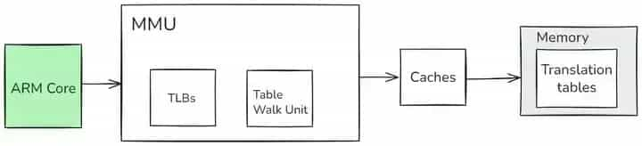
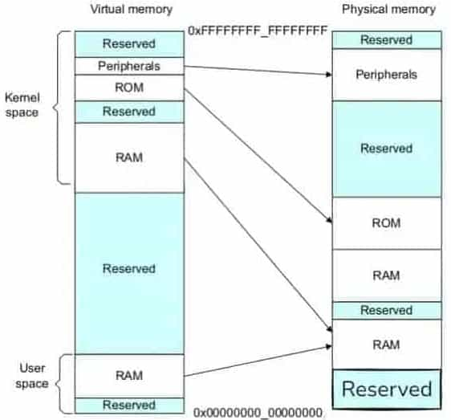
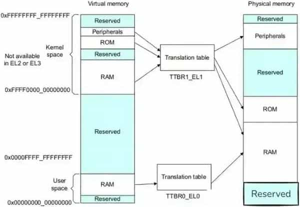

# 内存管理

## 怎么理解 Linux 下的内存管理

在 Linux 中，为充分利用和管理系统内存资源，采用了虚拟内存管理技术，每个进程都有 4 GB / 256 T 互不干涉的虚拟地址空间，只有当进程需要实际访问内存资源时才会建立虚拟地址和物理地址的映射，调入物理内存页。

对于用户空间，每个进程都有自己独立的用户空间，虚拟地址范围从 `0x00000000` 至 `0xBFFFFFFF`，总容量 3 G / 128 T。用户进程通常只能访问用户空间的虚拟地址，只有在执行内陷操作或系统调用时才能访问内核空间。用户进程能访问的空间按照 "访问属性一致的地址空间存放在一起" 的原则，划分成 5 个不同的内存区域，包括代码段、数据段、BSS 段、堆和栈。

此外，Linux 的内存管理还涉及内存分配、回收和使用情况监控等方面。系统提供了多种内存分配函数，如 `malloc()`、`calloc()`、`realloc()` 等，使用 `free()` 函数来回收内存。可以使用命令行工具 `top` 或者通过 `/proc` 文件系统来监控内存使用情况。内存管理还解决了效率问题、进程地址隔离问题和重定位问题，通过分段机制和分页机制实现从虚拟地址映射到物理地址。分段机制解决了进程间隔离和重定位问题，分页机制采用四级页表实现线性地址到物理地址的转化。

### Linux 虚拟内存管理技术如何实现

Linux 虚拟内存管理是操作系统内存管理的关键组成部分。它允许操作系统有效地管理系统内存资源，以便多个进程可以共享系统内存而不会相互干扰。虚拟内存允许操作系统将物理内存与磁盘空间相结合，以扩展可用内存。

在实现上，每个进程的代码都有它的地址，这些机器指令序列是分页存储的，一般是 4 KB。就这样一页一页地排在外存中。然后要运行的页面就加载进内存中，不运行的就放在外存中。然后在每个进程的内核空间里都存在着页表，页表里存储此进程的程序页的编号、是否在内存、程序页的在此进程中的虚拟地址、程序页的物理内存地址、程序页的外存地址。如果该程序页在内存中，就没有外存地址。

当 CPU 运行一个进程的时候，要去取下一条指令的地址。这时候它收到的地址是进程传过来的进程的虚拟地址，也就是说指令地址寄存器 PC 存放的是虚拟地址，然后经过 MMU（Memory Management Unit）内存管理单元，MMU 先通过该进程的页表检查指令所在页是否在内存中，如果是，则直接去内存中去页表里的内存地址取出指令，然后执行。如果不在内存中，就去外存中找到该指令，把指令先加载到内存中，再将虚拟地址转为内存地址，再从内存中取出指令执行。

虚拟内存管理涉及许多高级操作，以确保系统运行稳定，性能优越。这些操作包括内存映射、透明大页、内存压缩和 NUMA 管理。内存映射是 Linux 虚拟内存管理的强大功能，它允许将文件映射到进程的地址空间，使文件内容可以像内存一样访问。

### Linux 内核如何划分物理内存管理区

Linux 内核对物理内存进行层级区划，采用类似我国行政区划管理的方式。物理内存被划分为节点（node）、区域（zone）、页面（page）三个层级，对应到省、县、乡。系统首先把整个物理内存划分为 N 个节点，每个节点都有一个节点描述符，相当于省长。节点下面再划分区域，每个区域都有区域描述符，相当于县长。区域下面再划分页面，每个页面都有页面描述符，相当于乡长。页面再下面就是字节了，相当于个人。

Linux 对内存采取分区策略，主要将内存分成 3 个区：

- **ZONE_DMA**：包含 0 MB 至 16 MB 之间的内存页框，可由老式基于 ISA 的设备通过 DMA 使用，直接映射到内核的地址空间；
- **ZONE_NORMAL**：包含 16 MB 至 896 MB 之间的内存页框，是常规页框，也直接映射到内核的地址空间；
- **ZONE_HIGHMEM**：包含 896 MB 以上的内存页框，不进行直接映射，可通过永久映射和临时映射进行访问。

因为 32 位 Linux 虚拟内存空间为 0 - 4 G，其中 0 - 3 G 用于用户态，3 G - 4 G 用于内核态。这意味着内核只有 1 G 的虚拟地址空间，如果物理内存超过 1 G，内核就无法映射了。Linux 采取的策略是，内核地址空间的前 896 M 采用固定映射，映射方法是：虚拟地址 - 3 G = 物理地址，只能映射到物理地址的前 896 M。也就是说内核虚拟地址空间的 3 G 到 3 G + 896 M 这部分，页表的映射是固定的，系统初始化时就建立起来。而虚拟地址空间的最后 128 M，也就是 3 G + 896 M 到 4 G 部分采用动态映射，也就是说页表映射的物理地址是可变的。

### Linux 用户空间内存区域有哪些

在 Linux 系统中，进程的用户空间按照 "访问属性一致的地址空间存放在一起" 的原则，划分成 5 个不同的内存区域。访问属性指的是 "可读、可写、可执行等"。

首先是程序文件段，包括二进制可执行代码；其次是已初始化数据段，包括静态常量；接着是未初始化数据段，包括未初始化的静态变量；然后是堆段，包括动态分配的内存，从低地址开始向上增长；最后是栈段，包括局部变量和函数调用的上下文等。栈的大小是固定的，一般是 8 MB。当然系统也提供了参数，以便我们自定义大小。

### Linux 内存分配与回收方式

在 Linux 中，内存分配与回收有多种方式。

对于内存分配，进程分配内存有两种方式，分别由两个系统调用完成：`brk` 和 `mmap`。

- **情况一**：`malloc` 小于 128 K 的内存，使用 `brk` 分配内存，将数据段（`.data`）的最高地址指针 `_edata` 往高地址推。只分配虚拟空间，不对应物理内存（因此没有初始化），第一次读 / 写数据时，引起内核缺页中断，内核才分配对应的物理内存，然后虚拟地址空间建立映射关系。
- **情况二**：`malloc` 大于 128 K 的内存，使用 `mmap` 分配内存，在堆和栈之间找一块空闲内存分配（对应独立内存，而且初始化为 0）。这样做主要是因为 `brk` 分配的内存需要等到高地址内存释放以后才能释放，而 `mmap` 分配的内存可以单独释放。

当进程在用户态通过调用 `free` 释放内存时，如果这块内存是通过 `mmap` 分配，则调用 `munmap` 直接返回给系统。否则内存是先返回给内存分配器，然后由内存分配器统一返还给系统。当整个进程退出之后，这个进程占用的内存都会归还给系统。

Linux 虚拟内存管理的一个核心任务是为进程分配内存页。Linux 通过使用页面表和页表项来实现这一点。每个进程都有自己的地址空间，其中包含虚拟地址，操作系统通过将虚拟地址映射到物理内存页来分配内存。这个过程通常包括当进程请求分配内存时，内核会查找可用的物理内存页。如果没有足够的可用页，操作系统会选择一个页进行替换，将其写回磁盘以腾出空间。然后，内核将虚拟地址映射到选定的物理页，更新页面表。

### Linux 如何监控内存使用情况

在 Linux 系统中，可以通过多种方式监控内存使用情况。

一种方法是使用 `free` 命令，它用于显示系统内存的使用情况，包括总内存、已使用内存、空闲内存等，是对 `/proc/meminfo` 收集到的信息的一个概述。例如，使用 `free -h` 可以以更易读的方式显示内存信息。

`top` 命令可以实时查看系统的各项资源使用情况，包括内存、CPU、进程等。可以直接使用 `top` 命令后，查看 `%MEM` 的内容。可以选择按进程查看或者按用户查看，如想查看 oracle 用户的进程内存使用情况的话可以使用 `top -u oracle`。`top` 命令是 Linux 下常用的性能分析工具，能够实时显示系统中各个进程的资源占用状况，类似于 Windows 的任务管理器。

`vmstat` 命令用于显示系统的虚拟内存使用情况，包括内存、磁盘、CPU 等。

`sar` 命令可以收集、报告和保存系统的性能数据，包括内存、CPU、磁盘等方面的信息。例如，`sar -r` 可以查看内存的相关信息。

`/proc/meminfo` 文件包含了系统的内存信息，可以通过查看该文件来获取内存使用情况。例如，`cat /proc/meminfo` 可以输出内存的详细信息。

`pmap` 命令用于显示进程的内存映射信息，包括进程占用的内存地址、权限、大小等。

GNOME System Monitor 是一个显示最近一段时间内的 CPU、内存、交换区及网络的使用情况的视图工具。

`atop` 命令是一个终端环境的监控命令。它显示的是各种系统资源（CPU，memory，network，I/O，kernel）的综合，并且在高负载的情况下进行了彩色标注。

## malloc 分配内存的过程

`malloc` 是 C 语言中用于动态分配内存的函数。它的主要作用是在程序运行时从堆（heap）中分配指定大小的连续内存块。当程序需要一块不确定大小的内存来存储数据，比如根据用户输入的数据量来分配空间时，就会使用 `malloc`。

### 分配小于 128 K 内存的情况（使用 brk 系统调用）

**虚拟空间分配**：当 `malloc` 请求分配小于 128 K 的内存时，使用 `brk` 系统调用来分配内存。`brk` 会将数据段（`.data`）的最高地址指针 `_edata` 往高地址推。这个过程实际上只是分配了虚拟空间，并没有立即对应物理内存。也就是说，此时这块内存只是在虚拟地址空间中有了位置，还没有真正在物理内存中占据空间。

**物理内存分配**：当程序第一次读 / 写这块数据时，会引起内核缺页中断。就好像程序走到这部分内存地址时，发现这里是 "空地"，于是向内核发出信号。内核收到缺页中断信号后，才会分配对应的物理内存，然后在虚拟地址空间和物理内存之间建立映射关系。例如，一个程序分配了一个小的字符数组，在向数组元素赋值时就可能触发这个过程。

### 分配大于 128 K 内存的情况（使用 mmap 系统调用）

当 `malloc` 请求分配大于 128 K 的内存时，使用 `mmap` 系统调用在堆和栈之间找一块空闲内存进行分配。这种分配方式分配的是独立内存，而且会初始化为 0。这和 `brk` 分配方式有所不同，`mmap` 分配的内存有自己的优势，因为 `brk` 分配的内存需要等到高地址内存释放以后才能释放，而 `mmap` 分配的内存可以单独释放。例如，当程序需要动态分配一个较大的结构体数组或者缓存区时，可能会使用 `mmap` 来分配内存。

### 与操作系统的交互

`malloc` 函数实际上是通过系统调用与操作系统内核进行交互来完成内存分配的。在 Linux 系统中，这些系统调用（如 `brk` 和 `mmap`）会操作内存管理相关的数据结构，如页表。页表用于记录虚拟地址和物理地址之间的映射关系。当内存分配完成后，`malloc` 函数会返回分配的内存块的起始地址，这个地址是在虚拟地址空间中的地址。如果分配失败（例如系统内存不足），则会返回 `NULL`。

### 内存释放与回收

当进程在用户态通过调用 `free` 释放内存时，如果这块内存是通过 `mmap` 分配的，则调用 `munmap` 直接将内存返回给系统。否则，内存是先返回给内存分配器，然后由内存分配器统一返还给系统。并且当整个进程退出之后，这个进程占用的内存都会归还给系统。这确保了内存资源能够被合理地回收和再利用。

## 内存映射区

Linux 通过将一个 **"虚拟内存区域"** 与一个 **"文件对象"** 关联起来，以初始化这个虚拟内存区域的内容，这个过程叫——内存映射（memory mapping）。

### 内存映射普通文件

**原理**：将磁盘上的一个普通文件（如 `data.txt`）的全部或一部分映射到进程的虚拟地址空间。

**工作流程**：

- 当进程访问该内存区域时，如果数据不在物理内存中，CPU 会触发一个缺页中断。
- 操作系统捕获这个中断，负责将文件对应的数据块（页）从磁盘加载到物理内存页中。
- 然后更新进程的页表，建立虚拟地址到物理地址的映射。
- 此后，进程对该内存的读写就相当于对文件的读写。

**写回时机**：被修改的"脏页"会由操作系统内核线程在后台定期刷回磁盘，也可以由程序主动通过 `msync()` 强制立即写回。

### 内存映射匿名文件

内存映射匿名文件，就是程序 A 想申请一块物理内存使用。

**原理**：没有文件与之关联的映射。它映射的内存区域会被初始化为零。

**工作流程**：

- 操作系统分配新的物理内存页来满足映射需求。
- 这些页不与任何文件关联，只用于进程间的共享或作为动态堆的替代分配方式（如 `malloc` 可能在某些场景下使用 `mmap` 来分配大块内存）。

**主要用途**：

- **进程间共享内存**：`fork()` 后的父子进程可以通过匿名映射共享一块内存区域。
- **分配大块内存**：比传统的 `malloc`/`brk` 更高效，且分配的内存是页面对齐的。

## 交换空间

### 交换空间的类型

交换空间主要有两种类型：交换分区和交换文件，它们各自有不同的特点。

**交换分区：** 交换分区是硬盘上专门划分出来用于交换空间的独立分区，在系统安装过程中就可以进行设置。比如在安装 Linux 系统时，通过分区工具（如 fdisk、parted 等）将硬盘的一部分空间指定为交换分区，其分区类型一般为 "Linux swap"。它独立于系统的主文件系统运行，就像一个独立的小仓库，专门用来存放从物理内存中换出的内存页。

- **优点**：交换分区的效率相对较高，因为它在硬盘上是连续的空间，没有文件系统的额外开销。而且在安装阶段创建时，通常会被放置在硬盘驱动器的较快区域（更靠近外边缘），这使得数据的访问和写入速度更快。同时，它与主文件系统分开，能有效防止碎片化，减少对系统文件的干扰，就像一个独立的小房间，不会和其他杂物混在一起。
- **缺点**：一旦创建，交换分区的大小就相对固定，如果想要更改其大小，就需要对磁盘进行重新分区。这是一个比较复杂且有风险的操作，可能会导致数据丢失或系统故障，就好比你要扩大一个房间的面积，需要对整个房子的结构进行大改造，很容易出问题。另外，如果交换分区设置得过大，而实际使用量很少，就会浪费磁盘空间；反之，如果设置得过小，在内存需求高峰期可能无法满足系统的需求，限制系统性能。

**交换文件**：交换文件是在系统现有文件系统中的一种特殊文件，其作用和交换分区相同。可以通过命令（如 `dd` 命令创建文件，再用 `mkswap` 命令将其设置为交换文件）在需要时创建。例如，使用 `dd if=/dev/zero of=/swapfile bs=1024 count=8192` 命令创建一个大小约为 8 MB 的交换文件 `/swapfile`，然后使用 `mkswap /swapfile` 将其初始化为交换文件。

- **优点**：交换文件具有很高的灵活性。它可以根据系统的实际需求随时调整大小、删除或移动。比如，当系统内存需求突然增加时，可以增大交换文件的大小；当内存需求减少时，又可以减小或删除交换文件，这使得它非常适合内存需求不断变化的系统，就像一个可以随时调整大小的收纳箱。此外，交换文件使用现有文件系统中的空间，在不使用时不会浪费磁盘空间，并且可以根据内存需求动态增长。
- **缺点**：由于交换文件存在于文件系统中，文件系统的管理和维护会带来一些额外的开销，而且可能会产生碎片化问题。在传统的文件系统中，交换文件的性能通常比交换分区慢。不过，随着现代文件系统（如 ext4、Btrfs 等）的发展，这些问题得到了很大程度的缓解，现在交换文件和交换分区的性能差异已经不是很明显。但在高负载情况下，大量的交换操作仍可能对文件系统的正常文件操作产生干扰。

### Swappiness 参数

Swappiness 是 Linux 操作系统中一个非常重要的参数，它控制着内核将内存页交换到磁盘（也就是使用交换空间）的倾向程度。其取值范围是 0 - 100，代表的是一个百分比。

当 Swappiness 的值为 0 时，意味着内核尽可能地避免使用交换空间，即使物理内存非常紧张，也会优先尝试其他方式来满足内存需求，比如回收缓存等。而当 Swappiness 的值为 100 时，则表示内核总是倾向于使用交换空间，即使物理内存还有较多的空闲空间，也可能会将内存页交换到磁盘。Swappiness 参数的调整对于系统性能有着直接且显著的影响。

在系统内存紧张时，合理设置 Swappiness 值可以帮助优化系统的反应速度和整体性能。例如，对于高负载的数据库服务器，由于数据库操作对内存的读写速度要求极高，频繁的磁盘 I/O 操作会严重影响性能，因此通常会将 Swappiness 值设置得很低（如 10 - 20），以减少交换的使用频率，避免因频繁访问交换空间（磁盘）导致的性能瓶颈。而在一些内存较大且对内存使用不太敏感的系统中，适当提高 Swappiness 值（如设置为 30 - 50），可以有效利用系统资源，将一些暂时不用的内存页交换到磁盘，减少因内存资源闲置而造成的浪费。

**调整方法**：查看当前系统的 Swappiness 值，可以使用命令 `cat /proc/sys/vm/swappiness`。如果想要临时修改 Swappiness 值（重启后失效），可以使用 `sysctl` 命令，例如将 Swappiness 值临时设置为 10，命令为 `sysctl vm.swappiness=10`。如果希望永久修改 Swappiness 值，则需要编辑 `/etc/sysctl.conf` 文件，在文件中添加或修改 `vm.swappiness = 10` 这一行，然后执行 `sysctl -p` 使修改生效。在调整 Swappiness 参数时，需要谨慎操作，因为不合适的设置可能会带来一些问题。

如果设置得过小，虽然减少了交换空间的使用，但可能会导致物理内存被过度使用，当物理内存耗尽时，系统可能会触发 "内存不足（OOM，Out-Of-Memory）" 杀手机制，强制杀掉一些进程来释放内存，这可能会影响系统的正常运行。而如果设置得过大，系统会频繁地进行内存页的交换操作，由于磁盘 I/O 速度远低于内存速度，会导致系统性能大幅下降，用户会明显感觉到系统变得卡顿。所以，在调整 Swappiness 参数之前，需要对系统的内存使用情况、应用程序的特点等进行充分的了解和分析，并且在调整后密切监控系统的性能指标，如内存使用率、磁盘 I/O 情况、系统响应时间等，以确保调整后的参数能够使系统达到最佳的性能状态。

## 内存管理单元（MMU）

### MMU 的功能

内存管理单元（Memory Management Unit，MMU）是计算机硬件中负责处理中央处理器（CPU）内存访问请求的关键组件，在虚拟内存管理中扮演着核心角色。



它的首要功能是**地址转换**，这是实现虚拟内存机制的基础。在现代操作系统中，每个进程都拥有自己独立的虚拟地址空间，程序在运行时使用的是虚拟地址。而 MMU 的职责就是将这些虚拟地址转换为实际的物理地址，以便 CPU 能够正确访问内存中的数据。例如，在 x86 架构的计算机中，当一个进程尝试访问虚拟地址 `0x12345678` 时，MMU 会通过查询页表（Page Table），将这个虚拟地址映射到对应的物理地址上，如 `0x87654321`，从而实现进程对内存的访问。

MMU 还承担着**内存保护**的重要任务。它通过硬件机制来确保进程只能访问被授权的内存区域，防止进程间的非法内存访问。比如，MMU 可以为每个内存页面设置访问权限，如只读、读写、执行等。当一个进程试图以不被允许的方式访问内存时，MMU 会触发异常，通知操作系统进行处理。假设一个进程尝试写入一个被设置为只读的内存页面，MMU 就会检测到这个非法操作，并产生一个内存访问错误异常，操作系统可以根据这个异常来采取相应的措施，如终止该进程，以保护系统的稳定性和安全性。这种内存保护机制对于多任务操作系统来说至关重要，它使得多个进程能够在同一台计算机上安全、稳定地运行，避免了因一个进程的错误而导致整个系统崩溃的情况。

**MMU 开启以后会有以下特点：**

1. 多个程序独立运行
2. 虚拟地址是连续的（物理内存可以有碎片）
3. 允许操作系统管理内存

下图显示的系统说明了内存的虚拟和物理视图。单个系统中的不同处理器和设备可能具有不同的虚拟地址映射和物理地址映射。操作系统编写程序，使 MMU 在这两个内存视图之间进行转换：



要做到这一点，虚拟内存系统中的硬件必须提供地址转换，即将处理器发出的虚拟地址转换为主内存中的物理地址。MMU 使用虚拟地址中最重要的位来索引转换表中的条目，并确定正在访问哪个块。MMU 将代码和数据的虚拟地址转换为实际系统中的物理地址。该转换将在硬件中自动执行，并且对应用程序是透明的。除了地址转换之外，MMU 还可以控制每个内存区域的内存访问权限、内存顺序和缓存策略。

MMU 对执行的任务或应用程序可以不了解系统的物理内存映射，也可以不了解同时运行的其他程序。每个程序可以使用相同的虚拟内存地址空间。即使物理内存是碎片化的，还可以使用一个连续的虚拟内存映射。此虚拟地址空间与系统中内存的实际物理映射分开的。应用程序被编写、编译和链接，以在虚拟内存空间中运行。



如上图所示，TLB 是 MMU 中最近访问的页面翻译的缓存。对于处理器执行的每个内存访问，MMU 将检查转换是否缓存在 TLB 中。如果所请求的地址转换在 TLB 中导致命中，则该地址的翻译立即可用。TLB 本质是一块高速缓存。数据 cache 缓存地址（虚拟地址或者物理地址）和数据。TLB 缓存虚拟地址和其映射的物理地址。TLB 根据虚拟地址查找 cache，它没得选，只能根据虚拟地址查找。所以 TLB 是一个虚拟高速缓存。

每个 TLB entry 通常不仅包含物理地址和虚拟地址，还包含诸如内存类型、缓存策略、访问权限、地址空间 ID（ASID）和虚拟机 ID（VMID）等属性。如果 TLB 不包含处理器发出的虚拟地址的有效转换，称为 TLB Miss，则将执行外部转换页表查找。MMU 内的专用硬件使它能够读取内存中的转换表。

然后，如果翻译页表没有导致页面故障，则可以将新加载的翻译缓存在 TLB 中，以便进行后续的重用。简单概括一下就是：硬件存在 TLB 后，虚拟地址到物理地址的转换过程发生了变化。虚拟地址首先发往 TLB 确认是否命中 cache，如果 cache hit 直接可以得到物理地址。否则，一级一级查找页表获取物理地址。并将虚拟地址和物理地址的映射关系缓存到 TLB 中。

如果操作系统修改了可能已经缓存在 TLB 中的转换的 entry，那么操作系统就有责任使这些未更新的 TLB entry invalid。当执行 A64 代码时，有一个 TLBI，它是一个 TLB 无效的指令：

```asm
TLBI <type><level>{IS} {, <Xt>}
```

TLB 可以保存固定数量的 entry。可以通过由转换页表遍历引起的外部内存访问次数和获得高 TLB 命中率来获得最佳性能。ARMv8-A 体系结构提供了一个被称为连续块 entry 的特性，以有效地利用 TLB 空间。转换表每个 entry 都包含一个连续的位。当设置时，这个位向 TLB 发出信号，表明它可以缓存一个覆盖多个块转换的单个 entry。查找可以索引到连续块所覆盖的地址范围中的任何位置。因此，TLB 可以为已定义的地址范围缓存一个 entry 从而可以在 TLB 中存储更大范围的虚拟地址。

### MMU 与 TLB（转译后备缓冲器）

转译后备缓冲器（Translation Lookaside Buffer，TLB）是 MMU 中的一个高速缓存，它在虚拟内存管理中与 MMU 协同工作，极大地提高了地址转换的效率。

TLB 中存储了最近使用的页表项（Page Table Entry，PTE），这些页表项记录了虚拟地址到物理地址的映射关系。当 CPU 需要进行地址转换时，MMU 首先会在 TLB 中查找对应的虚拟地址。如果在 TLB 中找到了匹配的页表项（即 TLB 命中），MMU 就可以直接获取到对应的物理地址，而无需访问内存中的页表，这大大缩短了地址转换的时间。例如，假设 CPU 需要访问虚拟地址 `0x12345678`，MMU 会先在 TLB 中查找这个虚拟地址。如果 TLB 中已经缓存了该虚拟地址对应的页表项，MMU 就能立即得到物理地址，直接从内存中读取数据，整个过程非常快速。

然而，如果在 TLB 中没有找到匹配的页表项（即 TLB 未命中），MMU 就需要从内存中的页表中读取相应的页表项。这个过程相对较慢，因为内存访问的速度远低于 TLB 的访问速度。在从内存中读取到页表项后，MMU 会将其存入 TLB 中，以便下次访问相同的虚拟地址时能够快速命中。假设在上述例子中，TLB 未命中，MMU 就会访问内存中的页表，找到虚拟地址 `0x12345678` 对应的物理地址。然后，MMU 会把这个页表项存入 TLB 中，当下次 CPU 再次访问这个虚拟地址时，就可以在 TLB 中快速找到对应的物理地址，提高了地址转换的效率。

**TLB 的原理如下：**

1. 当 CPU 访问一个虚拟地址时，首先检查 TLB 中是否有对应的页表项。
2. 如果 TLB 中有对应的页表项（即命中），则直接从 TLB 获取物理地址。
3. 如果 TLB 中没有对应的页表项（即未命中），则需要访问内存来获取正确的页表项。
4. 在未命中情况下，操作系统会进行相应处理，从主存中获取正确的页表项，并将其加载到 TLB 中以供后续使用。
5. 一旦正确的页表项加载到 TLB 中，CPU 再次访问相同虚拟地址时就可以直接在 TLB 中找到映射关系，提高了转换效率。

TLB 具有快速查找和高效缓存机制，能够极大地减少查询页表所需的时间。然而，由于 TLB 是有限容量的，在大型程序或多任务环境下可能无法完全覆盖所有需要转换的页面。当发生 TLB 未命中时，则会导致额外的内存访问开销；操作系统会负责管理和维护 TLB，包括缓存策略、TLB 的刷新机制等。常见的缓存策略有全相联、组相联和直接映射等。可以说，TLB 就像是 MMU 的"高速助手"，通过缓存常用的页表项，减少了 MMU 访问内存中页表的次数，从而显著提高了虚拟地址到物理地址的转换速度，进而提升了整个系统的性能。

## 内存相关工具与命令

### 查看内存使用情况的命令

**free**：这是一个非常基础且常用的命令，用于快速查看系统内存的使用情况，它的输出结果是对 `/proc/meminfo` 文件信息的一个简洁概述。执行 `free` 命令后，会得到如下格式的输出（以字节为单位）：

```
              total        used        free      shared  buff/cache   available
Mem:      16355940352  2766014464 12694421504    126959616  909540432  13069271040
Swap:     2097147904    53391360  2043756544
```

其中，`total` 表示总内存大小；`used` 表示已使用的内存大小；`free` 表示空闲内存大小；`shared` 表示共享内存大小；`buff/cache` 表示缓冲区和缓存所占用的内存大小；`available` 表示系统可用于分配给新进程的内存大小。通过这些信息，我们可以快速了解系统内存的整体使用状况，判断是否存在内存不足或内存使用不合理的情况。如果 `used` 接近或超过 `total`，且 `available` 较小，可能意味着系统内存紧张，需要进一步排查和优化。

**top：** 是一个动态显示系统资源使用情况的命令，类似于 Windows 系统中的任务管理器。它不仅能实时展示内存使用情况，还能查看 CPU 使用率、每个进程的资源占用等详细信息。在终端中输入 `top` 命令后，会进入一个交互式界面，不断实时更新系统状态。界面的主要部分包括：

```
top - 14:20:12 up 2 days,  1:23,  2 users,  load average: 0.00, 0.01, 0.05
Tasks: 152 total,   1 running, 151 sleeping,   0 stopped,   0 zombie
%Cpu(s):  0.3 us,  0.3 sy,  0.0 ni, 99.3 id,  0.0 wa,  0.0 hi,  0.0 si,  0.0 st
KiB Mem :  8161844 total,  7433924 free,   149744 used,   578176 buff/cache
KiB Swap:  2097148 total,  2097148 free,        0 used.  7663360 avail Mem

  PID USER      PR  NI    VIRT    RES    SHR S  %CPU %MEM     TIME+ COMMAND
    1 root      20   0   12844   7448   4564 S   0.0  0.1   0:02.33 systemd
    2 root      20   0       0      0      0 S   0.0  0.0   0:00.00 kthreadd
```

- **系统状态信息**：如系统当前时间、系统已运行时间、当前登录用户数、系统负载（1 分钟、5 分钟、15 分钟的平均负载）。例如，`top - 15:32:45 up 2 days, 3:12, 1 user, load average: 0.05, 0.03, 0.01`，这里显示了系统在 15:32:45 时的状态，已运行 2 天 3 小时 12 分钟，有 1 个用户登录，1 分钟、5 分钟、15 分钟的平均负载分别为 0.05、0.03、0.01。
- **进程状态信息**：展示所有进程的总数、正在运行的进程数、睡眠的进程数、停止的进程数和僵尸进程数。比如，`Tasks: 200 total, 2 running, 198 sleeping, 0 stopped, 0 zombie`，表示共有 200 个进程，2 个正在运行，198 个处于睡眠状态，没有停止和僵尸进程。
- **CPU 使用情况**：显示用户空间（us）、内核空间（sy）、改变过优先级的进程（ni）、空闲（id）、等待 I/O（wa）、硬中断（hi）、软中断（si）、虚拟 CPU 等待实际 CPU（st）等各部分占用 CPU 的百分比。例如，`%Cpu(s): 0.5 us, 0.3 sy, 0.0 ni, 99.1 id, 0.0 wa, 0.0 hi, 0.0 si, 0.0 st`，表示用户空间占用 CPU 0.5%，内核空间占用 0.3%，空闲 CPU 为 99.1% 等。
- **内存使用情况**：呈现物理内存（Mem）和交换内存（Swap）的总量、已使用量、空闲量等。例如，`KiB Mem :16355940 total, 12694421 free, 2766014 used, 909540 buff/cache`，`KiB Swap:2097148 total, 2043756 free, 53391 used`。在 `top` 命令的交互界面中，还可以通过一些按键操作进行更多的功能设置。比如按 `M` 键可以根据驻留内存大小对进程进行排序，方便快速找到占用内存较大的进程；按 `P` 键可以根据 CPU 使用百分比对进程排序；按 `1` 键可以显示各个逻辑 CPU 的使用情况等。

**htop**：是 `top` 命令的增强版本，提供了更直观、更丰富的信息展示。它以彩色界面显示，并且支持鼠标操作，使得用户交互更加便捷。在 `htop` 界面中，不仅可以看到每个进程的内存实时使用率，还能详细了解每个进程的常驻内存大小（RES）、程序总内存大小（VIRT）、共享库大小（SHR）等信息。与 `top` 相比，`htop` 的进程列表可以水平及垂直滚动，方便查看更多进程的详细信息。例如，在处理大量进程的服务器环境中，`htop` 能够更轻松地定位到需要关注的进程，并且其直观的界面设计使得内存使用情况一目了然，对于系统管理员来说是一个非常实用的工具。

### 内存分析工具

**Valgrind**：是一款功能强大的内存调试、内存泄漏检测以及性能分析工具。它主要用于检测 C 和 C++ 程序中的内存错误，包括内存泄漏、非法内存访问（如越界访问、使用未初始化的内存等）。例如，在一个 C 语言程序中，如果使用 `malloc` 分配了内存，但在程序结束时没有调用 `free` 释放内存，就会导致内存泄漏。使用 Valgrind 可以很容易地检测到这种问题。假设我们有一个简单的 C 程序 `test.c`：

```c
#include <stdio.h>
#include <stdlib.h>

int main() {
    int *p = (int *)malloc(10 * sizeof(int));
    // 这里没有释放 p 指向的内存
    return 0;
}
```

编译该程序后，使用 Valgrind 运行：`valgrind ./test`，Valgrind 会输出详细的错误信息，指出内存泄漏的位置和大小，类似如下内容：

```
==12345== Memcheck, a memory error detector
==12345== Copyright (C) 2002-2017, and GNU GPL'd, by Julian Seward et al.
==12345== Using Valgrind-3.15.0 and LibVEX; rerun with -h for copyright info
==12345== Command:./test
==12345==
==12345== HEAP SUMMARY:
==12345==     in use at exit: 40 bytes in 1 blocks
==12345==   total heap usage: 1 allocs, 0 frees, 40 bytes allocated
==12345==
==12345== 40 bytes in 1 blocks are definitely lost in loss record 1 of 1
==12345==    at 0x4C2FB0F: malloc (in /usr/lib/valgrind/vgpreload_memcheck-amd64-linux.so)
==12345==    by 0x10918F: main (test.c:6)
==12345==
==12345== LEAK SUMMARY:
==12345==    definitely lost: 40 bytes in 1 blocks
==12345==    indirectly lost: 0 bytes in 0 blocks
==12345==      possibly lost: 0 bytes in 0 blocks
==12345==    still reachable: 0 bytes in 0 blocks
==12345==         suppressed: 0 bytes in 0 blocks
==12345==
==12345== For lists of detected and suppressed errors, rerun with: -s
==12345== ERROR SUMMARY: 1 errors from 1 contexts (suppressed: 0 from 0)
```

通过这些信息，我们可以清楚地知道在 `test.c` 的第 6 行分配的 40 字节内存没有被释放，从而能够及时修复代码中的内存泄漏问题。除了检测内存泄漏，Valgrind 还能检测其他内存错误，如数组越界访问：

```c
#include <stdio.h>

int main() {
    int arr[5];
    arr[10] = 100; // 越界访问
    return 0;
}
```

使用 Valgrind 运行该程序，它会输出类似如下的错误提示：

```
==12345== Memcheck, a memory error detector
==12345== Copyright (C) 2002-2017, and GNU GPL'd, by Julian Seward et al.
==12345== Using Valgrind-3.15.0 and LibVEX; rerun with -h for copyright info
==12345== Command:./test
==12345==
==12345== Invalid write of size 4
==12345==    at 0x10919D: main (test.c:5)
==12345==  Address 0x4c38050 is 20 bytes after a block of size 20 alloc'd
==12345==    at 0x4C2FB0F: malloc (in /usr/lib/valgrind/vgpreload_memcheck-amd64-linux.so)
==12345==    by 0x10918F: main (test.c:4)
==12345==
==12345== ERROR SUMMARY: 1 errors from 1 contexts (suppressed: 0 from 0)
```

提示在 `test.c` 的第 5 行发生了无效的写操作，因为访问的数组下标超出了数组的范围。Valgrind 的这些功能对于提高程序稳定性和可靠性非常重要，特别是在开发大型项目时，能够帮助开发者及时发现和解决内存相关的问题。

## 实际问题与案例分析

### 内存泄漏问题

内存泄漏是指程序在申请内存后，无法释放已申请的内存空间，导致这些内存被持续占用，无法被其他程序或进程使用。从进程的角度来看，当一个进程不断地分配内存，但没有及时释放不再使用的内存，随着时间的推移，进程占用的内存会越来越多，而系统中可用于分配的内存则会逐渐减少。例如，在一个长时间运行的服务器程序中，如果存在内存泄漏问题，可能会导致服务器的内存被逐渐耗尽，最终影响整个系统的稳定性和性能。

在 Linux 系统中，可以使用 Valgrind 工具来检测内存泄漏。假设我们有一个简单的 C 程序 `leak.c`：

```c
#include <stdio.h>
#include <stdlib.h>

int main() {
    int *p = (int *)malloc(10 * sizeof(int));
    // 这里没有释放 p 指向的内存
    return 0;
}
```

编译该程序后，使用 Valgrind 运行：`valgrind --leak-check=full ./leak`，Valgrind 会输出详细的内存泄漏信息，如下：

```
==1234== Memcheck, a memory error detector
==1234== Copyright (C) 2002-2017, and GNU GPL'd, by Julian Seward et al.
==1234== Using Valgrind-3.15.0 and LibVEX; rerun with -h for copyright info
==1234== Command:./leak
==1234==
==1234== HEAP SUMMARY:
==1234==     in use at exit: 40 bytes in 1 blocks
==1234==   total heap usage: 1 allocs, 0 frees, 40 bytes allocated
==1234==
==1234== 40 bytes in 1 blocks are definitely lost in loss record 1 of 1
==1234==    at 0x4C2FB0F: malloc (in /usr/lib/valgrind/vgpreload_memcheck-amd64-linux.so)
==1234==    by 0x10918F: main (leak.c:6)
==1234==
==1234== LEAK SUMMARY:
==1234==    definitely lost: 40 bytes in 1 blocks
==1234==    indirectly lost: 0 bytes in 0 blocks
==1234==      possibly lost: 0 bytes in 0 blocks
==1234==    still reachable: 0 bytes in 0 blocks
==1234==         suppressed: 0 bytes in 0 blocks
==1234==
==1234== For lists of detected and suppressed errors, rerun with: -s
==1234== ERROR SUMMARY: 1 errors from 1 contexts (suppressed: 0 from 0)
```

从输出中可以看出，在 `leak.c` 的第 6 行分配了 40 字节的内存，但没有释放，导致内存泄漏。

一旦检测到内存泄漏，就需要及时处理。对于简单的内存泄漏问题，如上述例子，只需要在合适的位置添加内存释放的代码即可。在上述程序中，我们可以在 `return 0;` 之前添加 `free(p);` 来释放分配的内存。但在实际的大型项目中，内存泄漏的排查和处理可能会比较复杂，需要仔细分析代码逻辑，找出内存分配和释放的不合理之处。有时候，内存泄漏可能是由于复杂的数据结构或函数调用关系导致的，这就需要借助调试工具和技术，逐步跟踪内存的分配和使用情况，以定位和解决内存泄漏问题。

### OOM（Out Of Memory）问题

OOM 即内存溢出，是指程序在申请内存时，没有足够的内存空间供其使用。在 Linux 系统中，当系统内存严重不足时，内核有两种主要的应对策略：一是直接触发系统崩溃（panic），这是一种极端情况，通常只有在系统内存极度匮乏且无法通过其他方式解决时才会发生；二是启动 OOM Killer（内存不足杀手）机制，内核会根据一定的算法选择并杀掉一些占用内存较大的进程，以释放内存，保证系统的基本运行。

OOM Killer 在选择要杀掉的进程时，会为每个进程计算一个 `oom_score` 值。`oom_score` 的计算涉及多个因素，包括进程占用的物理内存页数、交换区页数以及页表（Page Table）数量等。例如，一个进程占用了大量的物理内存，且频繁地进行内存交换操作，它的 `oom_score` 值就会相对较高，也就更容易被 OOM Killer 选中杀掉。此外，每个进程还有一个 `oom_score_adj` 参数，用户可以通过调整这个参数来改变进程被 OOM Killer 杀掉的优先级。当 `oom_score_adj` 的值为 -1000 时，表示该进程不会被 OOM Killer 杀掉；而值越大，进程被 OOM Killer 杀掉的可能性就越高。

**为了避免 OOM 问题的发生，可以采取以下措施：**

- **优化程序内存使用**：仔细检查程序代码，避免内存泄漏问题，及时释放不再使用的内存。合理设计数据结构和算法，减少不必要的内存占用。例如，在处理大数据集时，可以采用分块处理的方式，避免一次性加载过多数据到内存中。
- **监控内存使用情况**：使用如 `top`、`htop`、`free` 等命令实时监控系统和进程的内存使用情况。通过监控数据，可以及时发现内存使用异常的进程，提前采取措施，如调整进程的内存分配或优化其算法。
- **合理设置系统参数**：根据系统的实际需求，合理调整 Swappiness 参数，平衡物理内存和交换空间的使用。同时，也可以根据需要调整其他与内存管理相关的系统参数，如 `/proc/sys/vm/overcommit_memory`。该参数用于控制内存分配的策略，取值为 0 时，内核会尽量检查是否有足够的内存可供分配，只有在确定有足够内存时才会分配；取值为 1 时，内核允许分配超过实际物理内存大小的内存，这可能会导致内存不足的风险增加，但在某些情况下可以提高系统的性能；取值为 2 时，内核会严格按照系统的物理内存和交换空间大小来分配内存，不允许超过这个范围。在实际应用中，需要根据系统的负载和内存需求，谨慎选择合适的 `overcommit_memory` 值。
