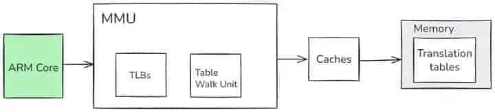
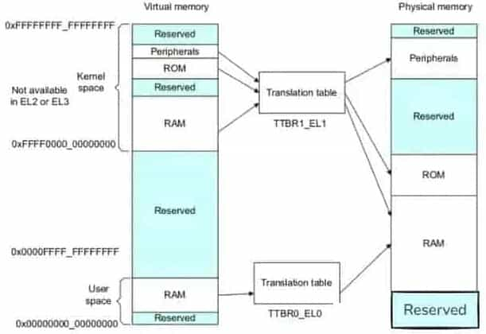

# 内存管理单元 MMU 解析

- 地址映射
- 内存分配和回收
- 内存保护
- 内存扩充

## 内存管理单元简介

MMU 是 Memory Management Unit 的缩写，中文名是内存管理单元，有时称作分页内存管理单元（英语：paged memory management unit，缩写为 PMMU）。它是一种负责处理中央处理器（CPU）的内存访问请求的计算机硬件。它的功能包括虚拟地址到物理地址的转换（即虚拟内存管理）、内存保护、中央处理器高速缓存的控制，在较为简单的计算机体系结构中，负责总线的仲裁以及存储体切换（bank switching，尤其是在 8 位的系统上）。

内存管理单元（MMU）的一个重要功能是使系统能够运行多个任务，作为独立程序在自己的私有虚拟内存空间中运行。它们不需要了解系统的物理内存映射，即硬件实际使用的地址，也不需要了解可能同时执行的其他程序。



## MMU 的核心功能

### 虚拟地址与物理地址的转换

MMU 是如何将虚拟地址转换为物理地址的呢？这就要借助页表了。页表就像是一本详细的地址翻译字典，记录着虚拟地址和物理地址之间的映射关系。当 CPU 发出一个虚拟地址请求时，MMU 就会像查字典一样，在页表中查找对应的物理地址。

具体来说，虚拟地址会被划分成页号和页内偏移两部分。页号就像是字典的索引，通过它可以快速定位到页表中对应的条目，而这个条目里就存储着对应的物理页号。然后，将物理页号和页内偏移组合起来，就得到了最终的物理地址，从而能够准确地访问到内存中的数据。

举个例子，假设我们有一个程序要访问虚拟地址 `0x12345678`。MMU 首先会提取出页号，比如是 `0x1234`，然后在页表中查找这个页号对应的条目。假设找到的条目显示对应的物理页号是 `0x5678`，而页内偏移是 `0x9ABC`，那么最终的物理地址就是 `0x56789ABC`。通过这样的转换，程序就能够顺利地访问到它所需要的数据，就好像我们通过地图上的路线规划找到了实际的目的地一样。

**MMU 开启以后会有以下特点：**

1. 多个程序独立运行
2. 虚拟地址是连续的（物理内存可以有碎片）
3. 允许操作系统管理内存

下图显示的系统说明了内存的虚拟和物理视图。单个系统中的不同处理器和设备可能具有不同的虚拟地址映射和物理地址映射。操作系统编写程序，使 MMU 在这两个内存视图之间进行转换：


要做到这一点，虚拟内存系统中的硬件必须提供地址转换，即将处理器发出的虚拟地址转换为主内存中的物理地址。MMU 使用虚拟地址中最重要的位来索引转换表中的条目，并确定正在访问哪个块。MMU 将代码和数据的虚拟地址转换为实际系统中的物理地址。该转换将在硬件中自动执行，并且对应用程序是透明的。除了地址转换之外，MMU 还可以控制每个内存区域的内存访问权限、内存顺序和缓存策略。

MMU 对执行的任务或应用程序可以不了解系统的物理内存映射，也可以不了解同时运行的其他程序。每个程序可以使用相同的虚拟内存地址空间。即使物理内存是碎片化的，还可以使用一个连续的虚拟内存映射。此虚拟地址空间与系统中内存的实际物理映射分开的。应用程序被编写、编译和链接，以在虚拟内存空间中运行。



如上图所示，TLB 是 MMU 中最近访问的页面翻译的缓存。对于处理器执行的每个内存访问，MMU 将检查转换是否缓存在 TLB 中。如果所请求的地址转换在 TLB 中导致命中，则该地址的翻译立即可用。TLB 本质是一块高速缓存。数据 cache 缓存地址（虚拟地址或者物理地址）和数据。TLB 缓存虚拟地址和其映射的物理地址。TLB 根据虚拟地址查找 cache，它没得选，只能根据虚拟地址查找。所以 TLB 是一个虚拟高速缓存。

每个 TLB entry 通常不仅包含物理地址和虚拟地址，还包含诸如内存类型、缓存策略、访问权限、地址空间 ID（ASID）和虚拟机 ID（VMID）等属性。如果 TLB 不包含处理器发出的虚拟地址的有效转换，称为 TLB Miss，则将执行外部转换页表查找。MMU 内的专用硬件使它能够读取内存中的转换表。

然后，如果翻译页表没有导致页面故障，则可以将新加载的翻译缓存在 TLB 中，以便进行后续的重用。简单概括一下就是：硬件存在 TLB 后，虚拟地址到物理地址的转换过程发生了变化。虚拟地址首先发往 TLB 确认是否命中 cache，如果 cache hit 直接可以得到物理地址。否则，一级一级查找页表获取物理地址，并将虚拟地址和物理地址的映射关系缓存到 TLB 中。

如果操作系统修改了可能已经缓存在 TLB 中的转换的 entry，那么操作系统就有责任使这些未更新的 TLB entry invalid。当执行 A64 代码时，有一个 TLBI，它是一个 TLB 无效的指令：

```asm
TLBI <type><level>{IS} {, <Xt>}
```

TLB 可以保存固定数量的 entry。可以通过由转换页表遍历引起的外部内存访问次数和获得高 TLB 命中率来获得最佳性能。ARMv8-A 体系结构提供了一个被称为连续块 entry 的特性，以有效地利用 TLB 空间。转换表每个 entry 都包含一个连续的位。当设置时，这个位向 TLB 发出信号，表明它可以缓存一个覆盖多个块转换的单个 entry。查找可以索引到连续块所覆盖的地址范围中的任何位置。因此，TLB 可以为已定义的地址范围缓存一个 entry 从而可以在 TLB 中存储更大范围的虚拟地址。

### 内存保护的坚固防线

MMU 不仅是地址转换的高手，还是内存保护的坚固防线。在多任务的操作系统环境下，多个进程同时运行，就像一个热闹的大社区里住着许多户人家。如果没有有效的管理，这些进程可能会互相干扰，就像邻居之间随意闯入对方的房子一样。

MMU 通过硬件机制实现了内存访问授权，为每个进程分配了独立的地址空间，就像给每个家庭都分配了独立的房子，互不干扰。当一个进程试图访问内存时，MMU 会检查该进程是否有权限访问目标内存区域。只有当进程具有相应的访问权限时，MMU 才会允许这次访问，否则就会阻止访问，并向操作系统报告，就像保安会阻止没有权限的人进入特定区域一样。

例如，一个进程 A 正在运行，它只能访问属于自己地址空间内的内存。如果进程 A 试图访问进程 B 的内存区域，MMU 会立即发现这个非法访问行为，并阻止它，从而保证了系统的稳定性和安全性。这种内存保护机制有效地防止了进程之间的非法访问，避免了因一个进程的错误而导致整个系统崩溃的情况，就像坚固的围墙保护着每个家庭的安全，让整个社区能够和谐稳定地运转。

## 地址转换全解析

### 分页机制的奥秘

分页机制是 Linux 内存管理的核心机制之一，它就像是一个巧妙的拼图游戏，将虚拟内存和物理内存都划分成固定大小的块，这些块就被称为页面（page）和页帧（page frame）。

对于虚拟地址空间而言，它被划分成一个个大小相等的单元，每个单元就是一页，我们用 VPN（Virtual Page Number，虚拟页面号）来标识每一页。而在物理地址空间，同样被分为固定大小的单元，每个单元就是一个页帧，用 PFN（Physical Frame Number，物理页帧号）来标识。

分页管理内存的核心，就是建立起虚拟地址页到物理地址页帧的映射关系。这就好比制作一份详细的地图，地图上标记着每个虚拟页面（VPN）应该对应到哪个物理页帧（PFN），而这份"地图"就是页表。通过页表，MMU 能够快速准确地找到虚拟地址对应的物理地址，实现数据的高效访问。

例如，在一个 32 位的系统中，假设页面大小为 4 KB（2 的 12 次方字节），那么虚拟地址空间（4 GB，即 2 的 32 次方字节）就可以被划分为 2 的 20 次方个页面。每个页面都有一个唯一的 VPN，从 0 开始编号。当程序访问一个虚拟地址时，MMU 会根据这个地址计算出对应的 VPN，然后在页表中查找该 VPN 对应的 PFN，从而找到数据所在的物理页帧。

### 地址转换的详细步骤

当处理器发出 64 位虚拟地址进行指令获取或数据访问时，MMU 硬件将虚拟地址转换为相应的物理地址。对于一个虚拟地址，前 16 位 [63:47] 必须全部为 0 或 1，否则该地址将引发故障。通过使用低位来给出选定部分内的偏移量，以便 MMU 将来自块表 entry 的物理地址位与来自原始地址的低位组合起来，以生成最终地址。

当 CPU 发出一个虚拟地址请求时，MMU 就开始了它紧张而有序的工作，将虚拟地址转换为物理地址，这个过程就像是一场精密的接力赛，每一步都至关重要。

1. **虚拟地址的拆分**：虚拟地址首先会被拆分成两部分，一部分是虚拟页面号（VPN），另一部分是虚拟地址偏移（VA offset）。VPN 就像是一个房间号，用于确定虚拟地址所在的页面；而 VA offset 则是房间内的具体位置，即页内偏移。
2. **页表的查找**：MMU 根据计算得到的 VPN，在页表中查找对应的物理页帧号（PFN）。页表就像是一本地址字典，存储着 VPN 和 PFN 的映射关系。MMU 会以 VPN 作为索引，在页表中快速定位到对应的条目，从而获取到 PFN。
3. **物理地址的生成**：得到 PFN 后，MMU 将 PFN 和虚拟地址偏移（VA offset）组合起来，就得到了最终的物理地址。因为页帧的大小和页面大小相同，所以页内偏移在虚拟地址和物理地址中是一致的。通过这种方式，MMU 成功地将虚拟地址转换为物理地址，使得 CPU 能够准确地访问内存中的数据。

例如，假设虚拟地址为 `0x12345678`，页面大小为 4 KB。首先，将虚拟地址拆分为 VPN 和 VA offset，VPN = `0x12345`，VA offset = `0x678`。然后，MMU 在页表中查找 VPN = `0x12345` 对应的 PFN，假设找到的 PFN 为 `0x56789`。最后，将 PFN 和 VA offset 组合起来，得到物理地址为 `0x56789678`。这样，CPU 就可以通过这个物理地址访问到内存中的数据了。

### 多级页表的优化策略

在早期的计算机系统中，使用的是一级页表，它就像是一本简单的地址簿，直接记录着所有虚拟地址和物理地址的映射关系。然而，随着计算机技术的发展和内存需求的不断增大，一级页表逐渐暴露出了它的不足。

假设在一个 32 位的系统中，虚拟地址空间为 4 GB，页面大小为 4 KB，如果使用一级页表，那么页表项的数量将达到 1 M（4 GB / 4 KB = 1 M）个。每个页表项假设占用 4 个字节，那么整个页表就需要占用 4 MB（1 M * 4 B = 4 MB）的内存空间。而且，每个进程都需要有自己独立的页表，如果系统中有多个进程，那么页表所占用的内存将是一个巨大的开销，这就好比一个小书架要放下所有的书籍，显然是不现实的。

为了解决一级页表的这些问题，多级页表应运而生，其中以二级页表最为常见。二级页表就像是一个更智能的图书馆管理系统，将地址映射关系分层管理。

在二级页表中，虚拟地址被划分为三个部分：最高位部分作为一级页表（也称为页目录）的索引，中间部分作为二级页表（真正的页表）的索引，最低位部分则是页内偏移。当进行地址转换时，MMU 首先根据虚拟地址的最高位部分，在一级页表中找到对应的二级页表的起始地址；然后，再根据虚拟地址的中间部分，在找到的二级页表中查找对应的物理页帧号（PFN）；最后，将 PFN 和页内偏移组合起来，得到物理地址。

例如，在一个 32 位系统中，使用二级页表，虚拟地址 32 位被划分为：高 10 位用于一级页表索引，中间 10 位用于二级页表索引，低 12 位为页内偏移。假设虚拟地址为 `0x12345678`，首先提取高 10 位（假设为 `0x123`），在一级页表中找到对应的二级页表起始地址；然后提取中间 10 位（假设为 `0x456`），在找到的二级页表中查找对应的 PFN；最后将 PFN 和低 12 位的页内偏移（`0x678`）组合，得到物理地址。

通过这种方式，二级页表大大减少了页表所占用的内存空间。因为一级页表只需要存储二级页表的起始地址，而不需要存储所有的物理地址映射关系，只有当需要访问某个二级页表时，才会将其加载到内存中，就像图书馆只在需要某本书时才从仓库中取出放到书架上，大大节省了书架的空间。同时，多级页表也提高了地址转换的效率，使得计算机系统能够更加高效地管理内存。

## TLB 与缓存

### TLB 加速地址转换的神器

在 MMU 进行地址转换的过程中，有一个得力的小助手——TLB（Translation Lookaside Buffer，地址转换后备缓冲器），它就像是一个高效的"记忆小能手"，大大加速了地址转换的过程。

我们知道，页表通常存放在内存中，而内存访问速度相对较慢。如果每次地址转换都要访问内存中的页表，那将会极大地影响系统性能，就好比每次找东西都要去很远的仓库里翻找，效率会非常低。

而 TLB 作为页表的高速缓存，存储了近期最常访问的页表项。它的存在基于一个重要的原理——局部性原理。局部性原理指出，程序在执行过程中，往往会在一段时间内集中访问某些特定的内存区域，就像我们在日常生活中，经常会反复使用某些常用物品，而很少去碰那些不常用的东西。

当 CPU 需要进行地址转换时，会首先在 TLB 中查找对应的页表项。如果 TLB 中存在所需的页表项，即发生 TLB 命中（TLB Hit），那么 MMU 就可以直接从 TLB 中获取物理页帧号（PFN），而不需要再去内存中查询页表，这就大大减少了地址转换的时间，提高了转换效率，就像我们在自己身边的小抽屉里就能找到常用物品，而不用跑去远处的大仓库。

例如，假设一个程序频繁访问某个虚拟页面，当第一次访问时，MMU 会在内存中的页表中查找对应的物理页帧号，并将这个页表项缓存到 TLB 中。当程序再次访问这个虚拟页面时，TLB 就能够快速响应，直接提供物理页帧号，使得地址转换能够快速完成。

只有当 TLB 中没有找到所需的页表项，即发生 TLB 失效（TLB Miss）时，MMU 才会去内存中查询页表，获取物理页帧号，并将这个页表项更新到 TLB 中，以备下次使用，就像我们在小抽屉里找不到东西时，才会去大仓库找，找到后会把它放在小抽屉里方便下次使用。

### 缓存与 MMU 的协同工作

缓存（Cache）和 MMU 在数据访问中紧密协同，共同为提高内存访问速度而努力，它们就像是一对默契十足的搭档；缓存是一种高速的存储设备，位于 CPU 和内存之间，它存储着 CPU 近期可能会频繁访问的数据和指令，就像一个随时待命的小仓库，里面存放着常用物资，能够快速响应 CPU 的需求。

当 CPU 需要读取数据时，它会首先向缓存发送请求，查找所需的数据。如果缓存中存在该数据，即发生缓存命中（Cache Hit），CPU 就可以直接从缓存中读取数据，这比从内存中读取数据要快得多，因为缓存的访问速度比内存快很多倍，就像我们从身边的小仓库里取东西，比从远处的大仓库取东西要快得多。

如果缓存中没有找到所需的数据，即发生缓存未命中（Cache Miss），CPU 就会向 MMU 发送请求，将虚拟地址转换为物理地址，然后从内存中读取数据。在这个过程中，MMU 负责将虚拟地址准确地转换为物理地址，就像一个精准的导航仪，指引着 CPU 找到数据在内存中的实际位置。

当数据从内存中读取出来后，不仅会被返回给 CPU，还会被缓存到缓存中，以备下次 CPU 访问，这就像我们从大仓库取完东西后，会把它放在身边的小仓库里，方便下次使用。

例如，当一个程序运行时，CPU 需要读取某个变量的值。首先，CPU 会在缓存中查找这个变量，如果缓存命中，就可以立即获取变量的值并继续执行程序。如果缓存未命中，CPU 会通过 MMU 将虚拟地址转换为物理地址，从内存中读取变量的值，然后将这个变量及其相邻的数据一起缓存到缓存中，这样当下次 CPU 再次访问这个变量或者其相邻的数据时，就可以直接从缓存中获取，大大提高了内存访问速度。

通过缓存和 MMU 的协同工作，计算机系统能够更高效地访问内存，减少内存访问延迟，提高程序的执行效率，就像一个高效的物流系统，通过合理的调配和协作，让物资能够快速、准确地送达目的地。

## MMU 在 Linux 系统中的实战应用

### 进程内存管理实例

在 Linux 系统中，当我们启动一个进程时，就像是在内存这个大舞台上为这个进程开辟了一个专属的小天地，而 MMU 在其中扮演着至关重要的角色。

**以一个简单的 C 程序为例，假设我们有如下代码：**

```c
#include <stdio.h>
#include <stdlib.h>

int main() {
    int *ptr = (int *)malloc(10 * sizeof(int));
    if (ptr == NULL) {
        perror("malloc failed");
        return 1;
    }

    for (int i = 0; i < 10; i++) {
        ptr[i] = i;
        printf("ptr[%d] = %d\n", i, ptr[i]);
    }

    free(ptr);
    return 0;
}
```

当这个程序被执行，也就是进程被创建时，Linux 内核会为该进程分配一个独立的虚拟地址空间，这个空间就像是进程自己的"私人仓库"，里面包含了代码段、数据段、堆、栈等不同的区域，每个区域都有其特定的用途。

在这个例子中，当执行 `malloc(10 * sizeof(int))` 时，程序向系统申请了一块内存。如果申请的内存小于 128 K（这个阈值可以通过 `M_MMAP_THRESHOLD` 选项调节），系统会使用 `brk` 系统调用分配内存，它会将数据段的最高地址指针 `_edata` 往高地址推，也就是在进程的堆区域分配虚拟内存空间。

此时，仅仅是分配了虚拟内存，还没有分配物理内存。只有当程序第一次访问这块内存，比如执行 `ptr[i] = i;` 时，会引发内核缺页中断。这时，MMU 就开始发挥作用了，它会根据进程的页表，查找对应的物理页帧号（PFN），如果没有找到，就会触发一系列操作，如查找 / 分配一个物理页，填充物理页内容（可能是读取磁盘，或者直接置 0，或者啥也不干），然后建立虚拟地址到物理地址的映射关系，这样程序就可以顺利访问物理内存中的数据了。

当程序执行完不再需要这块内存时，调用 `free(ptr)` 释放内存。对于 `brk` 分配的内存，只有当高地址内存释放以后，低地址内存才有可能被释放，这就可能导致内存碎片的产生。例如，如果后续还有内存分配请求，而这些内存碎片又无法满足新的请求，就会影响内存的使用效率。

如果 `malloc` 申请的内存大于 128 K，系统则会使用 `mmap` 系统调用在进程的虚拟地址空间中（堆和栈中间，称为文件映射区域的地方）找一块空闲的虚拟内存进行分配。与 `brk` 不同的是，`mmap` 分配的内存可以单独释放，这在一定程度上减少了内存碎片的问题。

通过这个简单的例子，我们可以看到 MMU 在进程内存管理中的关键作用，它为每个进程提供了独立的虚拟内存空间，使得进程之间的内存访问相互隔离，同时通过地址转换和页表管理，实现了虚拟地址到物理地址的映射，保证了进程能够高效、安全地访问内存。

### 内存分配与回收机制

在 Linux 系统中，内存的分配与回收是一个复杂而有序的过程，就像是一个繁忙的物流中心，不断地接收和处理各种内存请求；从操作系统的角度来看，进程分配内存主要有两种方式，分别由 `brk` 和 `mmap` 这两个系统调用完成（这里不考虑共享内存）。

当申请小于 128 K 的内存时，系统会使用 `brk` 分配内存。它就像是一个"空间拓展者"，将数据段（`.data`）的最高地址指针 `_edata` 向高地址移动，从而增加堆的有效区域来申请新的内存空间。不过，此时分配的仅仅是虚拟内存空间，并没有对应的物理内存，就像是画了一个"大饼"，还没有真正把"饼"做出来。只有在第一次读 / 写数据时，才会引起内核缺页中断，这时内核才会去分配对应的物理内存，并建立虚拟内存空间和物理内存空间的映射关系。

而当申请大于 128 K 的内存时，系统会采用 `mmap` 分配内存。`mmap` 会在进程的文件映射区（堆和栈中间的区域）找一块空闲存储空间来分配虚拟内存。这种方式分配的内存可以单独释放，具有更高的灵活性；

在内存回收方面，Linux 系统有着一套完善的机制。当系统内存不足时，就需要回收一部分内存，以满足新的内存请求。内存回收主要包括页面回收、页面交换、内存压缩和匿名页面丢弃等机制。

**页面回收**是当系统内存不足时，Linux 通过页面回收机制释放不再使用的页面。这其中会用到 LRU（最近最少使用）算法，就像是一个"淘汰筛选器"，它会选择最近最少使用的页面，并将其交换到磁盘上的交换分区（Swap）或丢弃页面的内容，这样就可以释放出更多的内存供其他应用程序使用；

**页面交换**则是将不活跃的页面移出物理内存，以释放内存空间。当系统内存不足时，操作系统会将长时间未被访问的页面交换到磁盘上的交换分区。当需要访问这些页面时，操作系统又会将其重新调入内存。

为了避免频繁进行页面交换，Linux 还引入了**内存压缩机制**。它就像是一个"空间压缩大师"，通过使用压缩算法将不活跃的页面压缩存储在内存中，从而减少内存占用。当需要访问被压缩的页面时，操作系统会将其解压缩并重新放置在内存中。

在某些情况下，Linux 还可以通过丢弃匿名页面（不属于文件系统缓存的页面，通常是由进程使用的堆栈和堆分配的匿名页面）来释放内存。当系统内存不足时，操作系统可以选择丢弃这些页面以释放内存；

在这个过程中，MMU 始终发挥着重要作用。它通过维护页表和地址转换，确保内存的分配和回收过程能够准确无误地进行，保证了系统内存的高效利用和稳定运行。
