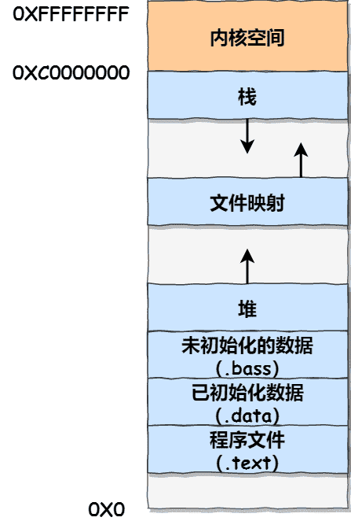

# 内存结构Overview

程序的内存分区或内存模型是计算机科学中的一个重要概念，它描述了程序在运行过程中如何管理和使用内存。

## 内存分区/内存模型

### 内存分区的基本概念

C程序运行之前，操作系统会为其分配内存，并将C程序的二进制代码、程序数据装载到内存。

内存一般可以分为四个区域：堆区、栈区、全局区（包括静态区）、代码区。对于一个程序的编译而言，编译程序还会占用一个文字常量区。

C程序在内存的存储结构如下图所示：



从图中可以看出，C程序内存结构由程序代码区、常量区、全局数据区、堆区和栈区构成，内存地址由低到高。

-   程序代码区存储C程序的二进制代码，程序从代码区的第1条指令开始执行。
-   常量区存储程序中定义的常量数据。
-   全局数据区存储程序中定义的全局变量和静态变量。
-   堆区为程序在运行过程中动态分配的内存，申请的内存由程序使用和释放。
-   栈区内存由编译器负责申请和释放，用于调用函数时存储函数内部的局部变量、传递的参数、返回值等数据。

### 各个内存区域的功能和特点

代码区`.text`

-   功能：存放编译后的可执行二进制代码，即机器指令。
-   特点：该区域在运行中为只读，目的是防止程序意外地修改了它的指令。代码区是共享的，对于频繁被执行的程序，内存中只需要有一份代码即可。

文字常量区`.rodata`

-   功能：存放常量字符串。
-   特点：该区域在编译时已经确定，所以运行中为只读。

全局区（静态区）

-   功能：存放全局变量、static修饰的全局或局部变量以及函数。
-   全局区通常分为两个子区：data区和bss区。
    -   data区：存放已经初始化的全局变量、静态变量（包括static修饰的全局或局部变量）。这些变量在程序启动时需要有明确的初始值，所以它们被存储在data区中，运行中为可读可写。
    -   bss区：存放未初始化的全局或静态变量。这些变量在程序开始执行之前会被系统初始化为0或NULL（对于指针而言），运行中可读可写。

栈区（stack）

-   功能：存放函数的参数值、局部变量的值、返回地址以及用于管理函数调用的其他信息。
-   特点：由编译器自动分配和释放，运行时可读可写。栈区的生命周期为函数的调用到释放。栈区内存由编译器管理，因此不需要程序员手动释放。但需要注意的是，不要返回局部变量的地址，因为栈区开辟的数据由编译器自动释放，返回局部变量的地址会导致程序的不稳定和安全问题。

堆区（heap）

-   功能：用于动态内存分配的区域。
-   特点：由程序员分配和释放，若程序员不释放，程序结束时由操作系统回收。堆区内存的管理需要程序员自行负责，因此在使用完堆区内存后，应及时释放以避免内存泄漏。堆区开辟的数据由程序员手动释放，使用delete操作符（在C++中）或free函数（在C中）。

#### 程序代码区

程序代码区用于存储C程序的二进制代码（C源代码编译后的程序指令），该内存区域只能读取不能写入。程序在运行期间不能改写程序指令，因为修改程序指令可能会导致程序发生不可预测的行为或崩溃。

程序代码区的大小是固定的，其占用的内存区域基本没有变化，因为程序编译后其大小不会发生变化。

程序代码区存储的程序指令可以被其它程序调用。例如当多个进程运行相同的程序时，它们可能都使用相同的代码区，而不是每个进程都有自己的副本，这有助于节省内存。

下面是一段C程序代码：

```c
#include <stdio.h>

int main() {
    printf("Hello, World!\n");
    return 0;
}
```

当上述代码段被编译和链接成一个可执行文件时，main 函数和其他必要的函数（如 printf）的程序指令将被放置在代码区中。当程序运行时，这些指令会被CPU执行。

#### 常量区

常量区用于存储程序中定义的常量，定义的常量可以是整型、浮点型、字符型或字符串等数据类型。存储在常量区的数据大小固定且不允许修改。例如，程序内定义的全局常量、使用const关键字修饰的变量、字符串常量等都存储在常量区。

在常量区存储的数据初始化后，在程序运行期间不能修改，其生命周期与程序的生命周期相同。

下面是一段C程序代码：

```c
#include <stdio.h>

int main() {
    const int a = 10;
    // a 是一个常量，存储在常量区
    int *p = &a;
    // 定义一个指针p指向a
    *p = 20; // 试图修改a的值，但这是不允许的
    printf("a = %d\n", a); // 输出a的值，应该是10而不是20
    return 0;
}
```

当上述代码段被编译和链接成一个可执行文件时，整型常量a被存储到常量区。程序运行后，程序试图通过指针p修改常量a的值，但C语言编译器会阻止这种操作，因为常量区的数据是不允许修改的。

**注意：**不同的C编译器可能会对C程序内存结构和常量区的实现有不同的细节。例如，有些编译器可能会将字符串常量（如"Hello, World!"）直接嵌入到代码段中，而不是放在常量区。

#### 全局数据区

全局数据区通常用于存储需要在整个程序生命周期中存在的数据，或者需要在多个函数之间共享的数据。

全局数据区用于存储程序中定义的全局变量和静态变量。全局数据区的数据在程序开始执行时就被初始化，并且在整个程序的执行过程中一直存在，直到程序结束；在整个程序运行过程中，任何程序指令都可以访问全局区的数据；若程序没有显示地初始化全局区的数据，数据会被自动初始化为零或空指针。

下面是一段C程序代码：

```c
#include <stdio.h>

// 全局变量
int global_counter = 0;

void increment_counter() {
    // 在函数内部访问全局变量
    global_counter++;
}

int main() {
    // 输出初始的全局变量值
    printf("Initial global counter: %d\n", global_counter);
    // 调用函数修改全局变量
    increment_counter();
    increment_counter();
    // 输出修改后的全局变量值
    printf("Updated global counter: %d\n", global_counter);
    return 0;
}
```

当上述代码段被编译和链接成一个可执行文件时，全局变量global_counter被存储到全局数据区。global_counter在代码内都可以被访问或修改。

全局变量比较适用于数据在不同函数之间的共享，但不必要的过度使用，会导致代码难以理解和维护，而且全局变量可以在任何位置被修改，这可能导致程序出现不可预料的错误。

#### 栈区

栈区主要用于存储函数内定义的局部变量和函数调用时的上下文信息。当函数被调用时，系统会为其在栈上分配一块内存，用于存储该函数的局部变量。同时，函数的参数也会通过栈传递。当函数执行完毕返回时，这些局部变量和参数所占用的栈内存会被自动释放。

栈区的特点：

-   **自动分配和释放：**栈区的内存分配和释放是自动进行的。当函数被调用时，其所需的局部变量空间会在栈上自动分配；当函数返回时，这些空间又会自动被释放。
-   **后进先出（LIFO）结构：**栈区的内存是按照后进先出（Last In, First Out）的原则进行管理的。这意味着最后一个进入栈的数据项将是第一个被取出的。

-   **大小有限：**栈区的大小通常是有限的，这意味着如果程序尝试使用超过栈容量的内存，可能会导致栈溢出（Stack Overflow）错误。

下面是一段C程序代码：

```c
#include <stdio.h>

void foo(int a, int b) {
    int c = a + b; // 局部变量c存储在栈区
    printf("The sum is: %d\n", c);
}

int main() {
    int x = 5; // 局部变量x存储在栈区
    int y = 10; // 局部变量y存储在栈区
    foo(x, y); // 调用函数foo，函数参数和局部变量通过栈传递和存储
    return 0;
}
```

当上述代码段被编译和链接成一个可执行文件并执行后，main 函数中的局部变量 x 和 y，以及 foo 函数中的局部变量 c，都存储在栈区。当 foo 函数被调用时，它的参数 a 和 b 以及局部变量 c 都会在栈上分配内存，当 foo 函数执行完毕返回时，这些栈内存会被自动释放。

#### 堆区

堆区是由程序在运行期间进行管理的内存区域，堆区内存空间的大小取决于操作系统和可用的物理内存。在32位系统上，堆区最大约为2GB的空间，这是由于32位系统使用32位指针，指针的最大值限制了其能够寻址的内存范围。在64位系统上，堆区的大小可以非常大，通常受系统内存总量的限制。

### 内存分区的变化

程序运行前

-   代码区：存放了编译后的二进制指令，该区域为只读。
-   data区：存放了已经初始化的全局变量、静态变量。
-   bss区：存放未初始化的全局、静态变量，在加载到内存中时由操作系统初始化为0或NULL。

程序运行后

-   代码区、data区、bss区保持不变。
-   栈区：随着函数的调用和释放，栈区会动态地分配和释放内存。
-   堆区：程序员可以根据需要在堆区动态地分配和释放内存。

## 栈区 VS 堆区

栈区和堆区是程序内存模型中的两个重要区域，它们在内存分配、管理方式、空间大小、缓存方式以及数据结构等方面都存在显著的差异。以下是对这两个区域的详细比较：

### 内存分配方式

栈区
-   由编译器自动分配和释放内存。
-   在函数调用时，栈区会分配空间存放函数的局部变量、参数以及函数调用信息。
-   当函数调用结束时，栈区会自动释放之前分配的内存。

堆区
-   由程序员手动分配和释放内存。
-   程序员可以使用malloc、calloc、realloc等函数（在C中）或new运算符（在C++中）进行内存分配。
-   使用完毕后，程序员需要手动调用free函数（在C中）或delete运算符（在C++中）释放内存。

### 管理方式

栈区
-   内存管理由编译器自动完成，程序员无需干预。
-   遵循“后进先出”的原则，即最后被推入栈中的数据会最先被取出。

堆区
-   内存管理由程序员显式控制。
-   程序员需要负责在适当的时候分配和释放内存，以避免内存泄漏。

### 空间大小

栈区
-   空间相对较小，通常用于存放局部变量和函数调用信息。
-   栈的大小在编译时就已经确定，如果申请的空间超过栈的剩余空间，将提示栈溢出。

堆区
-   空间相对较大，可以动态地分配内存。
-   堆的大小受限于计算机系统中有效的虚拟内存，因此可以灵活地分配大块内存。

### 缓存方式

栈区
-   通常使用一级缓存，调用速度快。
-   栈区的数据在函数调用结束后会立即释放，因此不会长期占用缓存资源。

堆区
-   通常使用二级缓存，调用速度相对较慢。
-   堆区的数据需要程序员手动释放，如果忘记释放，可能会导致内存泄漏，长期占用缓存资源。

### 哪个更适合用来存放动态数据结构？

在存放动态数据结构时，堆区通常比栈区更适合。理由如下：

**栈区的限制**

1.  空间大小：栈区的空间相对较小，通常用于存放局部变量和函数调用信息。栈的大小在编译时就已经确定，如果申请的空间超过栈的剩余空间，将提示栈溢出。因此，对于需要动态增长的数据结构，栈区可能无法满足需求。
2.  管理方式：栈区的内存管理由编译器自动完成，遵循“后进先出”的原则。这种管理方式虽然简化了内存管理，但也限制了数据结构的灵活性。对于需要随机访问或插入删除操作的数据结构，栈区可能不是最佳选择。

**堆区的优势**

1.  空间大小：堆区的空间相对较大，可以动态地分配内存。这使得堆区能够容纳更大规模的数据结构，并适应数据结构的动态增长。
2.  管理方式：堆区的内存管理由程序员显式控制。程序员可以根据需要随时分配和释放内存，从而灵活地管理数据结构。这种灵活性使得堆区更适合用于存放复杂的动态数据结构。

