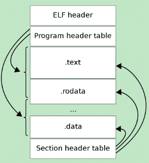

# ELF文件格式

ELF（Executable and Linkable Format）是一种用于二进制文件、可执行文件、目标代码、共享库和核心转储的格式，由 UNIX 系统实验室作为应用程序二进制接口（ABI）开发并发布，也是 Linux 的主要可执行文件格式。

## ELF 文件类型

| 类型 | 扩展名 | 说明 |
|------|--------|------|
| 可执行文件 | `.out` | 包含可执行的机器代码和数据，可直接运行。代码和数据具有固定地址或基地址偏移，系统据此加载程序 |
| 可重定位文件 | `.o` | 机器代码和数据地址相对，需重定位才能运行，通常用于编译过程 |
| 共享目标文件 | `.so` | 动态链接库，包含可共享代码和数据，可在运行时被多个进程共享。数据在链接时被链接器（`ld`）和运行时动态链接器（`ld.so`、`libc.so`、`ld-linux.so`）使用 |
| 内核转储 | `core dump` | 存放当前进程的执行上下文；程序崩溃或异常终止时生成，包含内存状态和寄存器信息，用于调试 |

## ELF 文件格式视图

ELF 文件格式提供两种视图：

- **链接视图**：链接时使用，以**节（Section）**为单位
- **执行视图**：执行时使用，以**段（Segment）**为单位

## ELF 文件构成

ELF 文件由以下部分组成：

- **ELF 头（ELF Header）**
  - 定义全局属性信息，如魔数、目标体系结构、节头表地址偏移等
  - 描述体系结构和操作系统等基本信息，指出 Section Header Table 和 Program Header Table 在文件中的位置
- **程序头表（Program Header Table）**
  - 从运行角度描述 ELF 文件，给出各个 Segment 的信息和属性
  - 加载器根据此表将文件中的节映射到虚拟内存；对于可链接文件，程序头表可能为空
- **节区（Section Table）**
  - ELF 文件中的数据和代码以节区形式存储，不同类型节区包含不同信息，如代码区、数据区、符号表区等
- **节头表（Section Header Table）**
  - 包含对节（Section）的描述，记录各节的起始偏移、大小、标志等信息
  - 从编译和链接角度描述 ELF 文件

> **注意**：一个文件不一定包含全部内容，且位置未必按固定顺序排列。**只有 ELF 头的位置是固定的**，其余各部分的位置、大小等信息由 ELF 头中的各项值决定。
>
> `.o` 文件没有程序头表，ELF 文件并不一定有程序头表。

### 典型节区

ELF 文件格式如下图，位于 ELF Header 和 Section Header Table 之间的都是段（Section）。



一个典型的 ELF 文件包含以下节区：

| 节名 | 说明 |
|------|------|
| `.text` | 已编译程序的指令代码段 |
| `.rodata` | 只读数据（Read Only Data），如 `const` 常量 |
| `.data` | 已初始化的 C 程序全局变量和静态局部变量 |
| `.bss` | 未初始化的 C 程序全局变量和静态局部变量 |
| `.debug` | 调试符号表，调试器用此段信息帮助调试 |

> **段（Segment）和节（Section）的区别**
>
> 节是 ELF 文件的基本单位，包含程序的代码、数据等信息。Linux 系统为高效加载 ELF 文件，将多个节划分为一个组（段），段是节的集合，Linux 系统通过段加载代码和数据。

## ELF 头

ELF 头是整个 ELF 文件的起始部分，位置固定，包含识别和解释文件内容的关键信息。

Linux 定义了两种标准：32 位和 64 位，内容结构基本一致，仅存储宽度不同。

### 数据结构（`/usr/include/elf.h`）

```c
#define EI_NIDENT 16

typedef struct {
    unsigned char e_ident[EI_NIDENT];  /* ELF 标识信息，固定值 */
    Elf32_Half    e_type;              /* 目标文件类型：1=可重定位，2=可执行，3=共享目标文件 */
    Elf32_Half    e_machine;           /* 目标体系结构：3=Intel 80386 */
    Elf32_Word    e_version;           /* 目标文件版本：1=当前版本 */
    Elf32_Addr    e_entry;             /* 程序入口虚拟地址，无入口可为 0 */
    Elf32_Off     e_phoff;             /* 程序头表偏移量，无表可为 0 */
    Elf32_Off     e_shoff;             /* 节头表偏移量，无表可为 0 */
    Elf32_Word    e_flags;             /* 处理器特定标志 */
    Elf32_Half    e_ehsize;            /* ELF 头大小（字节） */
    Elf32_Half    e_phentsize;         /* 程序头表每项大小（字节） */
    Elf32_Half    e_phnum;             /* 程序头表项数 */
    Elf32_Half    e_shentsize;         /* 节头表每项大小（字节） */
    Elf32_Half    e_shnum;             /* 节头表项数 */
    Elf32_Half    e_shstrndx;          /* 节名字符串表索引 */
} Elf32_Ehdr;

typedef struct {
    unsigned char e_ident[EI_NIDENT];
    Elf64_Half    e_type;
    Elf64_Half    e_machine;
    Elf64_Word    e_version;
    Elf64_Addr    e_entry;
    Elf64_Off     e_phoff;
    Elf64_Off     e_shoff;
    Elf64_Word    e_flags;
    Elf64_Half    e_ehsize;
    Elf64_Half    e_phentsize;
    Elf64_Half    e_phnum;
    Elf64_Half    e_shentsize;
    Elf64_Half    e_shnum;
    Elf64_Half    e_shstrndx;
} Elf64_Ehdr;
```

### 查看 ELF 头信息

```bash
readelf -h <ELF文件>
```

### ELF 头字段解析

| 字段 | 说明 |
|------|------|
| Magic | 魔数，ELF 文件识别信息 |
| Class | 文件类型，32 位或 64 位 |
| Data | 编码方式，大端或小端 |
| Version | ELF 版本 |
| OS/ABI | 操作系统信息 |
| ABI Version | ABI 版本 |
| Type | 文件类型：REL（可重定位）、EXEC（可执行）、DYN（共享对象/可执行）、CORE（核心转储） |
| Machine | 机器类型，如 x86、AArch64 等 |
| Entry point address | 程序入口地址 |
| Start of program headers | 程序头表偏移量 |
| Start of section headers | 节头表偏移量 |
| Flags | 标志 |
| Size of this header | ELF 头大小 |
| Size of program headers | 程序头表条目大小 |
| Number of program headers | 程序头表条目数 |
| Size of section headers | 节头表条目大小 |
| Number of section headers | 节头表条目数 |

## 程序头表

程序头表（Program Header Table）用于描述文件中的段（Segment）信息，指导操作系统加载程序。

- 由多个程序头组成，每个头对应一个段，包含段类型、文件偏移、映射虚拟地址、大小及权限等
- 一个段可包含一个或多个节，不同段可能重合（即一个节可在不同段中）
- 程序头表是结构体数组，元素类型为 `Elf64_Phdr`（64 位）或 `Elf32_Phdr`（32 位）
- ELF 头中的 `e_phentsize` 和 `e_phnum` 指定数组元素大小和个数

### 数据结构

```c
typedef struct {
    Elf64_Word  p_type;     /* Segment type：段类型 */
    Elf64_Word  p_flags;    /* Segment flags：段相关标记 */
    Elf64_Off   p_offset;   /* Segment file offset：从文件开始到该段开头的偏移 */
    Elf64_Addr  p_vaddr;    /* Segment virtual address：该段在内存中的虚拟地址 */
    Elf64_Addr  p_paddr;    /* Segment physical address：物理地址（仅用于物理寻址系统） */
    Elf64_Xword p_filesz;   /* Segment size in file：文件镜像中该段大小，可能为 0 */
    Elf64_Xword p_memsz;    /* Segment size in memory：内存镜像中该段大小，可能为 0 */
    Elf64_Xword p_align;    /* Segment alignment：可加载段的 p_vaddr 和 p_offset 必须是页大小的整数倍 */
} Elf64_Phdr;
```

### 查看程序头表信息

```bash
readelf -l <ELF文件>
```

### 程序头表字段解析

| 字段 | 说明 |
|------|------|
| **TYPE** | 段类型 |
| | `PT_PHDR` | 程序头表本身在文件中的位置和大小 |
| | `PT_LOAD` | 可加载段，包含实际代码和数据，需加载到内存执行 |
| | `PT_DYNAMIC` | 动态链接信息，包含动态库路径、依赖库列表、符号表等 |
| | `PT_INTERP` | 程序解释器路径，通常是动态链接器路径 |
| | `PT_NOTE` | 附加信息 |
| Offset | 文件偏移，段在文件中的偏移量 |
| VirtAddr | 虚拟地址，段加载至内存后的虚拟地址 |
| PhysAddr | 物理地址 |
| FileSiz | 文件大小，段在文件中的大小 |
| MemSiz | 内存大小，段在内存中的大小 |
| Flags | 段属性：R（只读）、W（只写）、E（可执行） |
| Align | 对齐方式 |

## 节头表

节头表（Section Header Table）用于描述文件中各个节（Section）的属性和信息。

每个节对应一个节表头，包含节名称、类型、大小、偏移量等关键数据，为链接器和加载器提供必要信息。

节头表位于 ELF 文件尾部，具体位置由 ELF 头中的 `e_shoff` 给出偏移；`e_shnum` 表示节头表项数；`e_shentsize` 表示每项字节大小（64 位系统为 64 字节）。

### 数据结构

```c
typedef struct {
    Elf64_Word    sh_name;       /* 节名称索引（节区头字符串表中的索引） */
    Elf64_Word    sh_type;       /* 节类型 */
    Elf64_Xword   sh_flags;      /* 标志位 */
    Elf64_Addr    sh_addr;       /* 节在进程内存映像中的地址，不映射则为 0 */
    Elf64_Off     sh_offset;     /* 节第一个字节与文件开头的偏移 */
    Elf64_Xword   sh_size;       /* 节大小（字节） */
    Elf64_Word    sh_link;       /* 节头表索引链接，解释依赖于节类型 */
    Elf64_Word    sh_info;       /* 附加信息，解释依赖于节类型 */
    Elf64_Xword   sh_addralign;  /* 地址对齐约束：sh_addr % sh_addralign = 0 */
    Elf64_Xword   sh_entsize;    /* 固定大小表项的表（如符号表）中每项的字节大小 */
} Elf64_Shdr;
```

### 成员说明

| 成员 | 说明 |
|------|------|
| `sh_name` | 节名称，是节区头字符串表（Section Header String Table）中的索引，实际为数值，字符串以 NULL 结尾 |
| `sh_type` | 根据节的内容和语义进行分类 |
| `sh_flags` | 每比特代表不同标志，描述节是否可写、可执行、需分配内存等 |
| `sh_addr` | 节在进程内存映像中的首字节位置，不映射则为 0 |
| `sh_offset` | 节首字节与文件开头的偏移。`SHT_NOBITS` 类型节不占用文件空间，其 `sh_offset` 为概念性偏移 |
| `sh_size` | 节大小（字节）。`SHT_NOBITS` 类型长度可能非零但不占用文件空间 |
| `sh_link` | 节头表索引链接，解释依赖于节类型 |
| `sh_info` | 附加信息，解释依赖于节类型 |
| `sh_addralign` | 地址对齐约束。仅允许为 0 或 2 的正整数幂，0 和 1 表示无对齐约束 |
| `sh_entsize` | 固定大小表项的表中每项字节大小，无表项则为 0 |

### 查看节头表信息

```bash
readelf -S <ELF文件>
```

### 节头表字段解析

| 字段 | 说明 |
|------|------|
| Name | 节名 |
| Type | 节类型 |
| Address | 虚拟地址 |
| Offset | 文件偏移量 |
| Size | 节大小 |
| EntSize | 节条目大小 |
| Flags | 节属性：R（只读）、W（只写）、E（可执行） |
| Link | 关联的符号表或字符串表 |
| Info | 节信息 |
| Align | 对齐方式 |

## 常见节区

### 系统预定固定节区

| 节名 | 类型 | 说明 |
|------|------|------|
| `.text` | `SHT_PROGBITS` | 代码段，包含程序的可执行指令 |
| `.data` | `SHT_PROGBITS` | 包含已初始化数据，将出现在程序内存映像中 |
| `.bss` | `SHT_NOBITS` | 未初始化数据，仅含符号，不占用文件空间 |
| `.rodata` | `SHT_PROGBITS` | 包含只读数据 |
| `.comment` | `SHT_PROGBITS` | 包含版本控制信息 |
| `.dynsym` | `SHT_DYNSYM` | 动态链接符号表 |
| `.shstrtab` | `SHT_STRTAB` | Section Header String Table，存放节名 |
| `.strtab` | `SHT_STRTAB` | 字符串表 |
| `.symtab` | `SHT_SYMTAB` | 符号表 |

### 查看符号表

通过查看 ELF 文件符号表，可协助排查程序 bug：

```bash
readelf -s <ELF文件>
```

