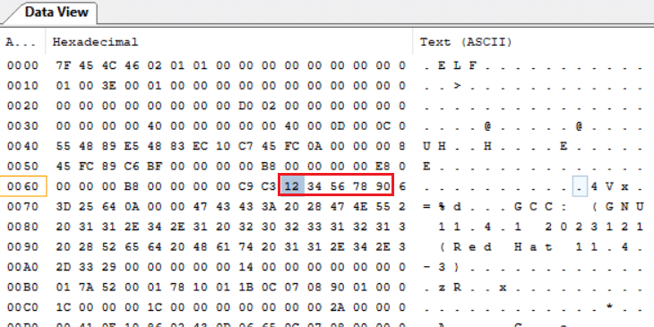

# ELF 文件分析

## GCC 生成 ELF 文件

使用 GCC 生成 ELF（Executable and Linkable Format）文件需要经过编译和链接两个阶段。

### 基本步骤

1. 使用 GCC 编译源代码文件，生成目标文件（`.o`）
2. 使用 GCC 链接目标文件，生成 ELF 可执行文件

### 示例

假设有 `test.c`：

```c
#include <stdio.h>

int main() {
    printf("Hello, World!\n");
    return 0;
}
```

生成并运行 ELF 文件：

```bash
# 编译：生成目标文件
gcc -c test.c -o test.o

# 链接：生成可执行文件
gcc test.o -o test.elf

# 运行
./test.elf
```

输出：

```
Hello, World!
```

**说明**：
- `-c` 选项仅编译不链接，生成目标文件 `test.o`
- 第二条命令链接 `test.o`，生成 ELF 可执行文件 `test.elf`

## 分析工具

### readelf

**功能**：显示 ELF 文件的详细信息，包括头部信息、段表、符号表、重定位表等。

**常用场景**：快速查看 ELF 文件的元数据和结构。

#### 查看 ELF 头

```bash
readelf -h ./test.elf
```

输出示例：

```
ELF Header:
  Magic:   7f 45 4c 46 02 01 01 00 00 00 00 00 00 00 00 00
  Class:                             ELF64
  Data:                              2's complement, little endian
  Version:                           1 (current)
  OS/ABI:                            UNIX - System V
  ABI Version:                       0
  Type:                              EXEC (Executable file)
  Machine:                           Advanced Micro Devices X86-64
  Version:                           0x1
  Entry point address:               0x401040
  Start of program headers:          64 (bytes into file)
  Start of section headers:          15392 (bytes into file)
  Flags:                             0x0
  Size of this header:               64 (bytes)
  Size of program headers:           56 (bytes)
  Number of program headers:         13
  Size of section headers:           64 (bytes)
  Number of section headers:         32
  Section header string table index: 31
```

#### 查看节头表

```bash
readelf -S test.elf
```

输出示例：

```
There are 32 section headers, starting at offset 0x3c20:

Section Headers:
  [Nr] Name              Type             Address           Offset
       Size              EntSize          Flags  Link  Info  Align
  [ 0]                   NULL             0000000000000000  00000000
       0000000000000000  0000000000000000           0     0     0
  [ 1] .interp           PROGBITS         0000000000400318  00000318
       000000000000001c  0000000000000000   A       0     0     1
  ...
  [31] .shstrtab         STRTAB           0000000000000000  00003ae4
       000000000000013b  0000000000000000           0     0     1
Key to Flags:
  W (write), A (alloc), X (execute), M (merge), S (strings), I (info),
  L (link order), O (extra OS processing required), G (group), T (TLS),
  C (compressed), x (unknown), o (OS specific), E (exclude),
  l (large), p (processor specific)
```

### objdump

**功能**：显示二进制文件的反汇编、段信息、符号表等，支持机器码、汇编指令或源代码多种表示形式。

**常用场景**：调试、性能分析或理解程序编译链接过程。

#### 反汇编代码

```bash
objdump -dS ./test.elf
```

#### 完整反汇编（含数据段）

```bash
objdump -D ./test.elf
```

#### 混合显示源码与汇编

```bash
objdump -S ./test.elf
```

> **说明**：`-S` 选项需要编译时添加 `-g` 生成调试信息，才能混合显示 C 源码。

### ldd

**功能**：列出可执行文件依赖的共享库。

**常用场景**：检查二进制文件的库依赖关系，确保所有依赖项可用。

```bash
ldd ./test.elf
```

输出示例：

```
linux-vdso.so.1 (0x00007fff64587000)
libc.so.6 => /lib64/libc.so.6 (0x00007f2647a00000)
/lib64/ld-linux-x86-64.so.2 (0x00007f2647d1e000)
```

### nm

**功能**：列出目标文件中的符号表，显示变量、函数等名称引用及其地址。

**常用场景**：查找二进制文件中的特定符号或函数。

```bash
nm ./test.elf
```

输出示例：

```
0000000000403e10 d _DYNAMIC
0000000000404000 d _GLOBAL_OFFSET_TABLE_
0000000000402000 R _IO_stdin_used
                 w _ITM_deregisterTMCloneTable
0000000000401126 T main
                 U puts@GLIBC_2.2.5
```

**符号类型说明**：

| 类型 | 含义 |
|------|------|
| `T` / `t` | 代码段符号（全局 / 局部） |
| `D` / `d` | 已初始化数据段符号（全局 / 局部） |
| `B` / `b` | 未初始化数据段符号（全局 / 局部） |
| `R` / `r` | 只读数据段符号（全局 / 局部） |
| `U` | 未定义符号（外部引用） |
| `W` / `w` | 弱符号（全局 / 局部） |

### strings

**功能**：从二进制文件中提取可打印字符串。

**常用场景**：快速浏览二进制文件中的文本信息，查找关键字符串。

```bash
strings ./test.elf | grep "keyword"
```

### gdb

**功能**：GNU 调试器，提供断点设置、单步执行、变量查看等丰富调试功能。

**常用场景**：调试运行时错误、性能问题等。

```bash
gdb ./test.elf
```

常用 GDB 命令：

| 命令 | 说明 |
|------|------|
| `break main` | 在 main 函数设置断点 |
| `run` | 运行程序 |
| `next` / `step` | 单步执行（不进入 / 进入函数） |
| `print <var>` | 打印变量值 |
| `info registers` | 查看寄存器 |
| `quit` | 退出 GDB |

### dwarfdump

**功能**：查看 ELF 文件中的 DWARF 调试信息，包括源文件路径、变量位置、数据类型等。

**常用场景**：深入调试分析，理解源代码与编译后代码的映射关系。

```bash
dwarfdump ./test.elf
```

### size

**功能**：显示二进制文件各部分大小，包括代码段、数据段、bss 段等。

**常用场景**：评估程序内存占用，查找潜在优化点。

```bash
size ./test.elf
```

输出示例：

```
   text    data     bss     dec     hex filename
   1143     548       4    1695     69f ./test.elf
```

| 字段 | 说明 |
|------|------|
| `text` | 代码段大小 |
| `data` | 已初始化数据段大小 |
| `bss` | 未初始化数据段大小 |
| `dec` | 十进制总大小 |
| `hex` | 十六进制总大小 |

### c++filt

**功能**：解码 C++ 编译器生成的混淆符号名（Name Mangling），转换为可读形式。

**常用场景**：查看 C++ 程序调试信息时解码符号名。

```bash
objdump -t ./test.elf | c++filt
```

## ELF 文件分析实例

以下通过实际代码演示 ELF 文件的分析过程。

### 示例代码

```c
#include <stdio.h>

unsigned char s_muse[] = {0x12, 0x34, 0x56, 0x78, 0x90};

int main() {
    int a = 10;
    printf("a = %d\n", a);
}
```

### 编译生成目标文件

```bash
gcc -c test.c -o test.o
```

### 查看 ELF 头

```bash
readelf -h test.o
```

输出：

```
ELF Header:
  Magic:   7f 45 4c 46 02 01 01 00 00 00 00 00 00 00 00 00
  Class:                             ELF64
  Data:                              2's complement, little endian
  Version:                           1 (current)
  OS/ABI:                            UNIX - System V
  ABI Version:                       0
  Type:                              REL (Relocatable file)
  Machine:                           Advanced Micro Devices X86-64
  Version:                           0x1
  Entry point address:               0x0
  Start of program headers:          0 (bytes into file)
  Start of section headers:          720 (bytes into file)
  Flags:                             0x0
  Size of this header:               64 (bytes)
  Size of program headers:           0 (bytes)
  Number of program headers:         0
  Size of section headers:           64 (bytes)
  Number of section headers:         13
  Section header string table index: 12
```

**关键信息解读**：

| 字段 | 值 | 含义 |
|------|-----|------|
| Type | REL | 可重定位文件 |
| Machine | X86-64 | AMD64 架构 |
| Entry point | 0x0 | 无可执行入口 |
| e_phoff | 0 | 无程序头表 |
| e_shoff | 720 (0x2D0) | 节头表偏移 |
| e_shnum | 13 | 共 13 个节 |
| e_shentsize | 64 | 每节 64 字节 |
| e_shstrndx | 12 | 节名字符串表在第 12 节 |

### 查看节头表

```bash
readelf -S test.o
```

输出：

```
There are 13 section headers, starting at offset 0x2d0:

Section Headers:
  [Nr] Name              Type             Address           Offset
       Size              EntSize          Flags  Link  Info  Align
  [ 0]                   NULL             0000000000000000  00000000
       0000000000000000  0000000000000000           0     0     0
  [ 1] .text             PROGBITS         0000000000000000  00000040
       000000000000002a  0000000000000000  AX       0     0     1
  [ 2] .rela.text        RELA             0000000000000000  00000220
       0000000000000030  0000000000000018   I      10     1     8
  [ 3] .data             PROGBITS         0000000000000000  0000006a
       0000000000000005  0000000000000000  WA       0     0     1
  [ 4] .bss              NOBITS           0000000000000000  0000006f
       0000000000000000  0000000000000000  WA       0     0     1
  [ 5] .rodata           PROGBITS         0000000000000000  0000006f
       0000000000000006  0000000000000000   A       0     0     1
  [ 6] .comment          PROGBITS         0000000000000000  00000075
       000000000000002f  0000000000000001  MS       0     0     1
  [ 7] .note.GNU-stack   PROGBITS         0000000000000000  000000a4
       0000000000000000  0000000000000000           0     0     1
  [ 8] .eh_frame         PROGBITS         0000000000000000  000000a8
       0000000000000038  0000000000000000   A       0     0     8
  [ 9] .rela.eh_frame    RELA             0000000000000000  00000250
       0000000000000018  0000000000000018   I      10     8     8
  [10] .symtab           SYMTAB           0000000000000000  000000e0
       0000000000000120  0000000000000018          11     9     8
  [11] .strtab           STRTAB           0000000000000000  00000200
       000000000000001b  0000000000000000           0     0     1
  [12] .shstrtab         STRTAB           0000000000000000  00000268
       0000000000000061  0000000000000000           0     0     1
```

### 数据定位分析

代码中定义了全局数组 `s_muse[] = {0x12, 0x34, 0x56, 0x78, 0x90}`，保存在 `.data` 节中。

从节头表可知：
- `.data` 节偏移（Offset）：`0x6a`
- `.data` 节大小（Size）：`5` 字节
- 对齐（Align）：1 字节

使用十六进制查看器打开 `test.o`：



从 `0x6a` 开始的 5 个字节正好是 `12 34 56 78 90`，与数组数据一致。

> **结论**：ELF 文件的所有信息均可通过偏移量和结构体解析获得。

