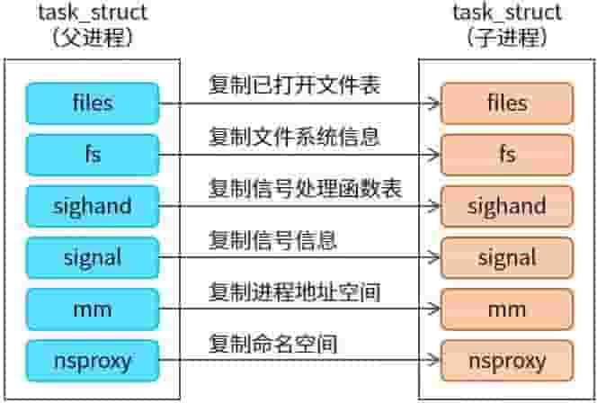
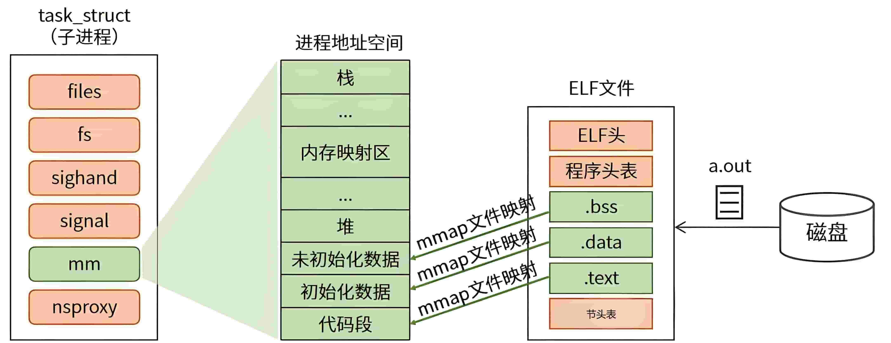

# 从 ELF 文件到 Linux 进程

Linux 创建新进程需要两个步骤：

1. **父进程通过克隆方式创建子进程**（`fork`）
2. **子进程加载 ELF 文件生成新的进程地址空间**（`execve`）

对于用户程序，实现以上步骤需要调用 `fork` 和 `execve` 两个系统调用。

Linux 子进程的创建必须由父进程完成，由此形成类似家族关系的进程树，所有进程的共同祖先是 1 号进程（`init`）。

子进程创建时继承父进程的关键信息，但这只能保证子进程按父进程的方式工作。当子进程需要执行特定任务时，必须加载 ELF 文件，替换继承的旧信息，生成独立的进程地址空间。


## fork 创建子进程

用户程序调用 `fork` 系统调用后，内核主要完成两部分工作：

1. 创建子进程并克隆关键信息
2. 将子进程插入 CPU 就绪队列，等待调度

### fork 内核流程

`fork()` 调用触发 `kernel_clone()`，主要流程如下：

```
fork()
  └── kernel_clone() —— 克隆子进程
        └── copy_process() —— 复制流程
              ├── copy_files()      —— 复制已打开文件表
              ├── copy_fs()         —— 复制文件系统信息
              ├── copy_sighand()    —— 复制信号处理函数表
              ├── copy_signal()     —— 复制信号信息
              ├── copy_mm()         —— 复制进程地址空间
              └── copy_namespaces() —— 复制命名空间
        └── wake_up_new_task() —— 子进程插入 CPU 就绪队列
```

### 子进程继承的信息



子进程从父进程继承以下关键信息：

| 字段 | 说明 |
|------|------|
| `files` | 已打开文件表，父子进程可操作相同文件 |
| `fs` | 文件系统信息 |
| `sighand` | 信号处理函数表，父子进程处理信号方式相同 |
| `signal` | 信号信息 |
| `mm` | 进程地址空间。**注意：虚拟地址和内存内容相同，但物理地址不同** |
| `nsproxy` | 命名空间 |

> **注意**：`mm` 表示虚拟地址空间相同，实际物理地址通过写时复制（Copy-On-Write）机制独立。

`fork` 创建完子进程后，若子进程不需要执行特定任务，此时已可正常工作。若需执行特定任务，则需将任务编译为 ELF 文件，再加载至子进程。

## execve 加载 ELF 文件

`execve` 系统调用的主要工作是**替换进程地址空间（`mm`）**，需要用到编译好的 ELF 文件。由于替换时原继承信息已无用，过程需要清理旧信息。

### execve 内核流程

```
fork()
  └── kernel_clone() —— 克隆子进程
        └── copy_process() —— 复制流程
              ├── copy_files()      —— 复制已打开文件表
              ├── copy_fs()         —— 复制文件系统信息
              ├── copy_sighand()    —— 复制信号处理函数表
              ├── copy_signal()     —— 复制信号信息
              ├── copy_mm()         —— 复制进程地址空间
              └── copy_namespaces() —— 复制命名空间
        └── wake_up_new_task() —— 子进程插入 CPU 就绪队列
```

### ELF 文件加载详细流程

用户程序调用 `execve` 后：

1. 根据文件路径在磁盘中找到 ELF 文件
2. 打开文件（`open`），读取内容（`read`）
3. ELF 文件从磁盘读入内存
4. 按 ELF 格式解析文件
5. 将 `.bss`、`.data`、`.text` 以文件映射（`mmap`）方式映射至进程地址空间



**文件映射的优势**：
- 减少内存拷贝，提高访问效率
- 按需加载页面，节省内存
- 多个进程共享同一文件映射，节省物理内存

### 加载后的进程地址空间

| 区域 | 来源 | 说明 |
|------|------|------|
| 栈 | 内核分配 | 用户栈，存放局部变量、函数参数等 |
| 内存映射区 | `mmap` | 动态库、共享内存等映射区域 |
| 堆 | 运行时扩展 | 动态分配的内存（`malloc`） |
| 未初始化数据 | ELF `.bss` | `mmap` 文件映射，不占用文件空间 |
| 初始化数据 | ELF `.data` | `mmap` 文件映射 |
| 代码段 | ELF `.text` | `mmap` 文件映射，只读可执行 |

## 总结

| 阶段 | 系统调用 | 核心操作 |
|------|----------|----------|
| 创建子进程 | `fork` | 克隆父进程 `task_struct`，继承地址空间、文件表、信号处理等 |
| 加载程序 | `execve` | 打开 ELF 文件，解析结构，通过 `mmap` 映射到进程地址空间 |
| 运行程序 | — | 从 ELF 入口地址开始执行 |

