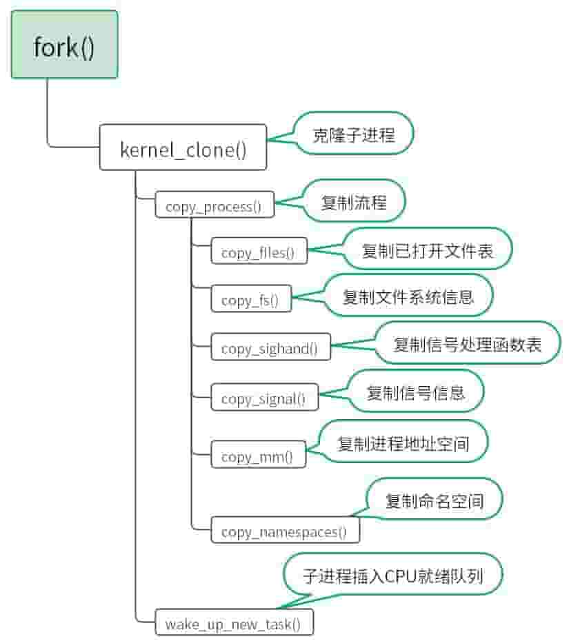

# 从ELF文件到Linux进程

Linux创建一个新的进程需要经过两个步骤：

- 父进程通过克隆方式创建子进程。
- 子进程加载ELF文件生成新的进程地址空间。

对于用户程序来说，实现以上两个步骤需要调用`fork`和`execve`两个系统调用。

Linux子进程的创建必须由父进程完成，因为这样的一个约束，Linux进程之间形成了类似于家族关系的进程关系，而所有进程的共同祖先就是1号进程（init）。

子进程创建时需要继承父进程的关键信息才能正常工作，从父进程继承而来的信息只能保证子进程按照父进程的方式去工作。当子进程有特定的任务需要执行，此时从父进程继承的信息就没有意义了。子进程如果需要执行特定的任务，需要加载ELF文件，替换掉子进程从父进程继承的旧信息，生成新的进程信息，这样子进程就能独立工作了。

## fork创建子进程

 如下图所示，用户程序调用fork系统调用后，内核主要完成两部分工作：

- 创建子进程并克隆关键信息。
- 将子进程插入CPU就绪队列，等待CPU调度。

具体流程已在图中详细展示，这里不再赘述。

Linux内核克隆子进程是一个很复杂的过程，这里我们保留一些关键流程，我们来看一下子进程从父进程继承了哪些信息：

- files：已打开文件表，子进程和父进程拥有相同的已打开文件表，父子进程可以操作相同的文件。
- fs：文件系统信息。
- sighand：信号处理函数表，子进程和父进程处理信号的方式相同。
- signal：信号信息，同上。
- mm：进程地址空间，子进程和父进程的代码，数据相同。**需要注意：数据相同表示虚拟地址和内存存储内容相同，而实际的物理地址则不相同。**
- nxproxy：命名空间。

fork创建完子进程，如果子进程不需要执行特定的任务，此时子进程已经可以工作。如果子进程需要执行特定的任务，那么我们需要将任务编译成ELF文件，再通过ELF文件加载至子进程。

## execve加载ELF文件

如下图所示，execve系统调用主要工作就是替换进程地址空间（mm），而替换进程地址空间需要用到编译好的ELF文件。由于进程地址空间替换时，原来从父进程继承的信息已经没有用，所以替换的过程需要清理旧信息。

进程地址空间替换内核流程如下图：

具体流程已经在图中详细展示，这里也不再赘述。

如下图所示，我们来看一下ELF文件转变成Linux进程的详细流程，用户程序调用execve系统调用后，首先会根据文件路径在磁盘中找到ELF文件，找到文件后打开文件（open），读取文件内容（read）。

此时ELF文件已经从磁盘读入内存，接着execve系统调用按照ELF文件格式解析ELF文件，解析出.bss，.data，.text将三者以文件映射方式映射至进程地址空间。文件映射可以减少拷贝，提高访问效率。

