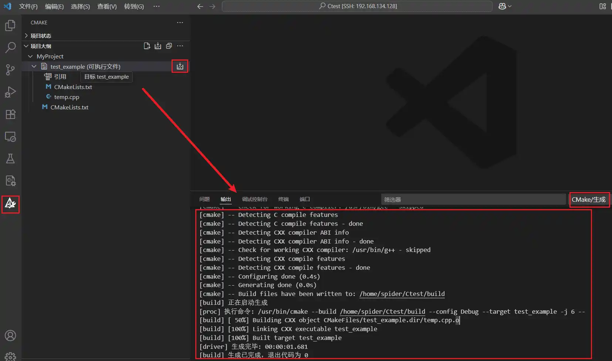

# VsCode进行Cmake调试

## 安装必要工具

在开始之前，确保您已经在系统中安装了**CMake**，以及一个C++编译器，如**GCC**、**Clang**或**MSVC**。还要确保VSCode中安装了**CMake Tools**和**C/C++扩展**。

## 创建基础项目结构

CMakeLists.txt：

```cmake
cmake_minimum_required(VERSION 3.26.5)
project(MyProject)

# 指定 gtest 的路径（如果已经安装）或构建目录路径
set(GTEST_DIR ../googletest/)  # 如果已经安装，则使用 CMake 的 find_package() 查找 gtest。否则，直接指定路径。
include_directories(${GTEST_DIR}/googletest/include/gtest)  # 包含 gtest 的头文件路径。
link_directories(${GTEST_DIR}/googletest/build)  # 链接库的路径，通常是构建目录。

aux_source_directory(. SRC_LIST)
add_executable(test_example ${SRC_LIST}) # 添加测试程序。

target_link_libraries(test_example gtest gtest_main)  # 链接 gtest 和 gmock 库。
```

temp.cpp：

```cpp
#include <gtest/gtest.h>
TEST(HelloTest, BasicAssertions) {
    EXPECT_STRNE("hello", "world");
    EXPECT_EQ(7 * 6, 42);
}
```

## 配置VSCode的CMake Tools

打开VSCode，在**命令面板**中运行“CMake: Configure”，这将使用CMakeLists.txt中的指令生成编译系统。接着，运行“CMake: Build”，这将编译您的项目，并生成目标可执行文件。



## 配置VSCode调试环境

您需要创建并配置.vscode/launch.json**和**.vscode/tasks.json两个文件，以设置调试会话。

首先在.vscode**文件夹下创建**tasks.json，这是一个例子：

```json
{
    "version": "2.0.0",
    "tasks": [
        {
            "label": "CMake Build",
            "type": "shell",
            "command": "cmake --build ."
        }
    ]
}
```

然后创建`launch.json`以配置调试选项，示例：

```json
{
    "version": "0.2.0",
    "configurations": [
        {
            "name": "(gdb) Launch",
            "type": "cppdbg",
            "request": "launch",
            "program": "${workspaceFolder}/build/test_example",
            "args": [],
            "stopAtEntry": false,
            "cwd": "${workspaceFolder}",
            "environment": [],
            "externalConsole": false,
            "MIMode": "gdb",
            "miDebuggerPath": "gdb",
            "setupCommands": [
                {
                    "description": "Enable pretty-printing for gdb",
                    "text": "-enable-pretty-printing",
                    "ignoreFailures": true
                }
            ]
        }
    ]
}
```

