# vscode远程连接linux进行开发

Remote-ssh是vscode提供的ssh服务插件，基于此插件可以实现在windows平台下远程连接linux平台进行软件开发

## 软件安装步骤

### 配置Remote-SSH

安装完成后会出现一个远程资源管理器图标，其中可以选择SSH Targets。

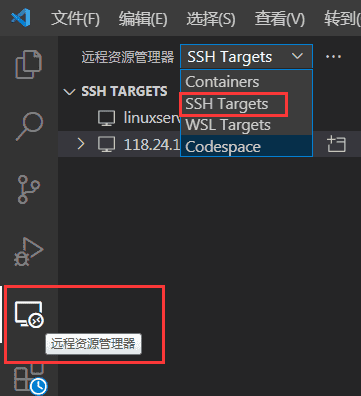

然后点击配置，并在右侧的命令窗口中选择第一个配置文件。

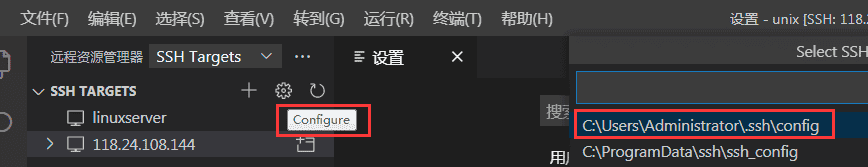

配置文件如下所示，其中Host是名字（随便写），HostName 是需要远程连接的ip，User 是远程用户名，正确设置后保存关闭即可。

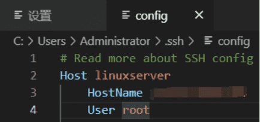

配置文件中一组信息（host-hostname-user）对应着一个连接目标，会在ssh targets下显示对应目标。可以选择一个目标，进行远程连接。

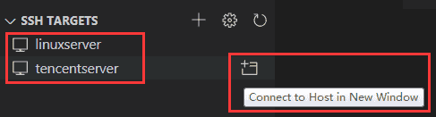

选择远程平台为linux

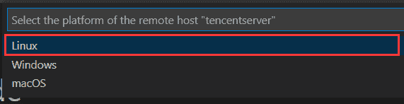

输入前面配置文件中user用户对应的登录密码

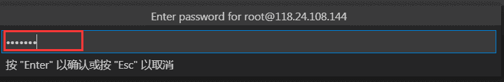

连接成功之后可以在左下角看到连接标识。

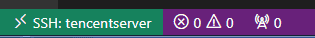

若不想每次远程连接时都要输入用户密码，可以设置免密登录方式，不过这样可能在安全性方面有所欠缺，需要自己权衡考虑。

### 安装远程插件

远程连接成功建立后，在扩展商店中可以看到本地和远程主机安装的所有插件，如下所示：

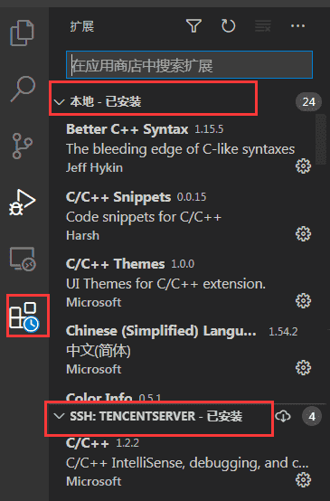

为了便于进行c++开发，需要安装c/c++插件和C++ Intellisense插件，安装时需要选择在远程主机进行安装，避免错误安装到本地。

### 简单小测试

点击左侧资源管理器，选择打开文件夹，可以打开远程主机的文件夹，然后在某个文件夹下新建.cpp文件进行简单练习。

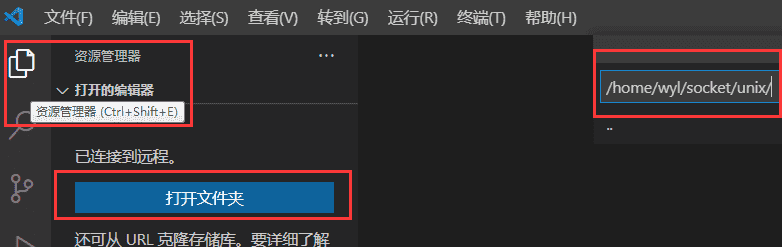

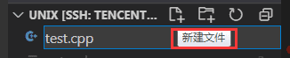

点击左侧资源管理器，选择打开文件夹，可以打开远程主机的文件夹，然后在该文件夹下新建.cpp文件进行简单练习，可以发现**c语言内置的类型int,string等会有类型提示和自动补全，但是stl中的类型没有自动提示**。虽然可以实现程序的编写，但还是不太方便，接下来将详细介绍如果通过配置文件配置高效的开发环境。

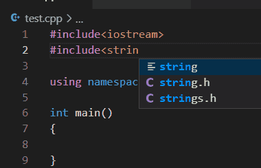

## 配置vscode开发环境

### 默认设置、用户设置、远程设置和工作区设置

vscode设置分为默认设置、用户设置、远程设置和工作区设置四种级别，位于后面级别的设置自动继承前面级别设置的内容；并且后面级别的设置可以修改继承的内容，完成各个模块个性化的调整。

默认设置是defaultSettings.json文件，该文件**只读不能进行修改**；VScode安装后即有的配置文件，包含VScode的所有设置项，**后面的所有设置更改，都将会覆盖这个文件中对应的设置项**。可以通过左下角的管理打开命令面板，在命令面板中输入setting进行搜索，找到defaultSettings.json文件进行打开，查看默认设置内容。

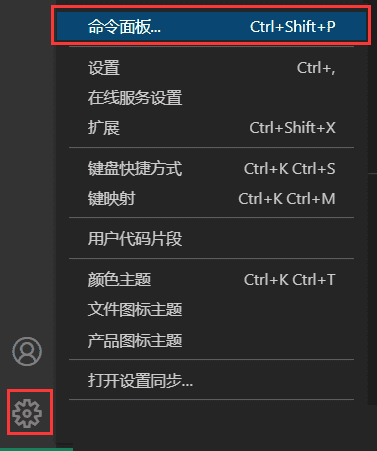

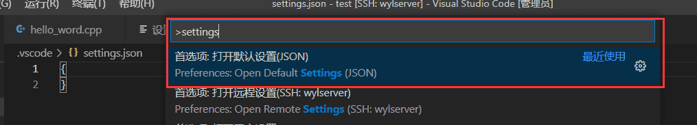

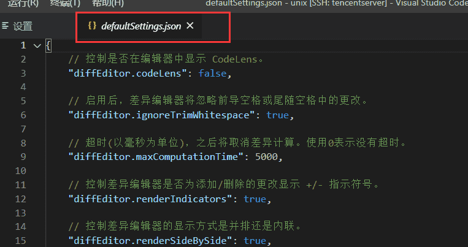

可以通过左下角管理按钮打开vscode设置界面，当通过vscode将windows远程连接到linux主机时，可以看到**用户设置、远程设置和工作区设置三种类型，用户设置对于当前登录windows的用户创建的所有本地vscode项目均生效，远程设置对于vscode远程连接登录的linux用户创建的所有远程vscode项目生效，工作区设置只对当前打开的项目（文件夹）生效**。

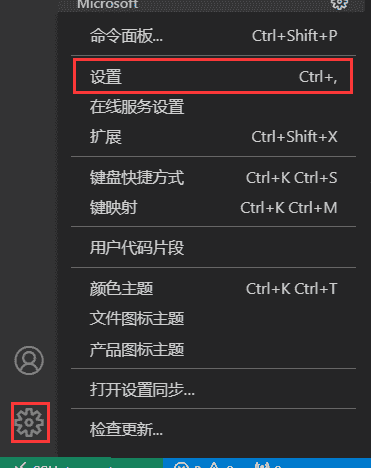

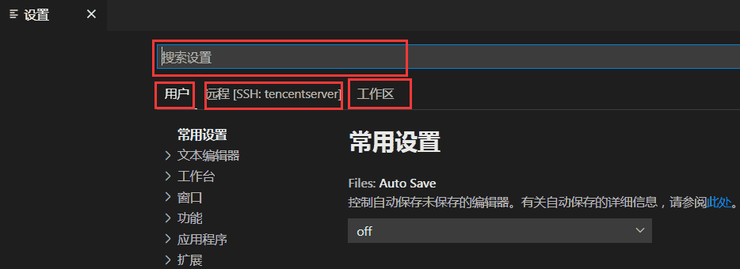

要修改某个具体选项时，可以在命令行搜索相关选项名进行快速查找，如下所示。

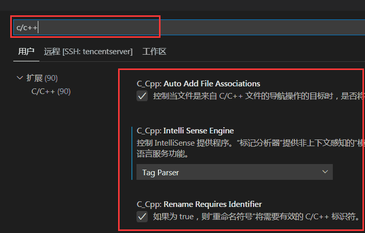

不论是用户、远程还是工作区设置，除了通过UI界面进行编辑修改之外，还可以通过json文件进行编辑修改。选择某种类型的设置，在右上角可以通过打开设置按钮打开对应json文件。设置文件上方会显示设置文件所在路径，修改设置文件的内容，即可完成设置编辑。

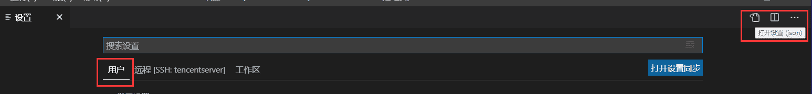

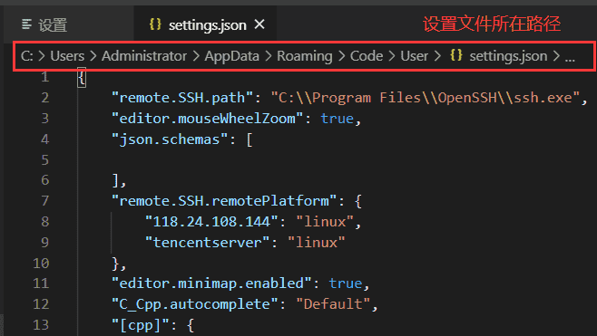

三种设置的对应设置文件路径一般如下所示：

-   Windows：%APPDATA%CodeUsersettings.json
-   Linux：$HOME/.config/Code/User/settings.json

工作空间设置的文件保存在当前目录的.vscode文件夹下。

其中若当前项目中不存在.vscode文件夹时，第一次打开工作区的设置文件时，会自动创建.vscode和setting文件。

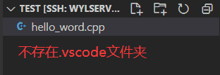

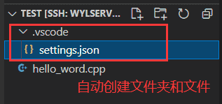

### c++开发设置

针对vscode远程连接linux服务器进行c++开发的情况，一般常用的是采用c_cpp_properties.json，tasks.json和launch.json进行环境配置。

#### a).c_cpp_properties.json

c_cpp_properties.json文件可以通过ctrl+shift+P打开命令面板，然后点击c/c++编辑配置即可打开。首次打开时，会在.vscode文件夹自动创建该文件。

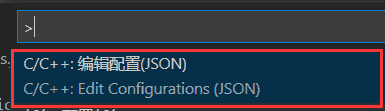

`c_cpp_properties.json`文件是c/c++插件对应的配置文件，允许用户更改前面设置中的部分选项，例如编译器的路径，包含路径，C ++标准（默认为C ++ 17）等，我配置的c_cpp_ properties.json文件内容如下，其中includePath字段新增了“/usr/include/**”路径，这个路径中放置了linux系统常见的头文件，包括c++相关头文件，便于实现项目开发。编译器采用的是g++，若linux系统中未安装g++，则要先进行安装。

```json
{
    "configurations": [
        {
            "name": "Linux",
            "includePath": [             //搜索头文件时的路径
                "${workspaceFolder}/**", //默认路径
                "/usr/include/**"        //新增路径
            ],
            "defines": [],
            "compilerPath": "/usr/bin/g++", //编译器路径
            "cStandard": "c99",             //编译时采用的c标准
            "cppStandard": "c++14",         //编译时采用的c++标准
            "intelliSenseMode": "gcc-x64"   //智能模式
        }
    ],
    "version": 4
}
```

#### b).tasks.json

tasks.json文件来告诉VS Code如何构建（编译）程序。可以在命令面板中点击任务：配置任务按钮，然后选择g++编译的方式（和c_cpp文件中指定的编译器匹配）打开tasks.json文件。首次打开时，会在.vscode文件夹自动创建该文件。

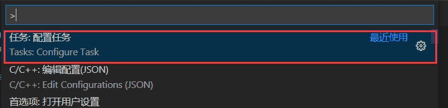

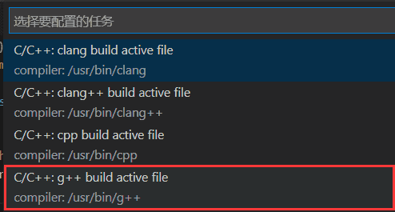

tasks.json文件的内容如下所示：

```json
{
	"version": "2.0.0",
	"tasks": [
		{
			"type": "cppbuild",                       //编译类型
			"label": "C/C++: g++ build active file",  //标签，用于区分不同任务
			"command": "/usr/bin/g++",                //编译命令
			"args": [                                 //参数
				"-g",
				"${file}",                            //表示当前项目中的所有活动文件
				"-o",
				"${fileDirname}/${fileBasenameNoExtension}"  //表示在当前项目文件夹下生成与活动文件同名但没有扩展名的可执行文件
			],
			"options": {
				"cwd": "${workspaceFolder}"
			},
			"problemMatcher": [
				"$gcc"
			],
			"group": "build",
			"detail": "compiler: /usr/bin/g++"
		}
	]
}
```

tasks.json文件设置完成之后，可以在命令面板点击任务：运行任务按钮，并选择执行刚刚设置的任务（通过任务标签进行区分）。任务执行编译时会在下方终端窗口显示编译结果，注意由于tasks.json中编译命令指定的是活动文件，所以在执行任务时必须将要编译的cpp文件打开。

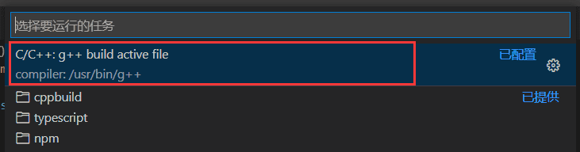

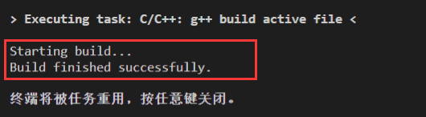

tasks.json文件可以进行修改，一种常见修改如下：

```json
{
	"version": "2.0.0",
	"tasks": [
		{
			"type": "cppbuild",                       //编译类型
			"label": "C/C++: g++ build active file",  //标签，用于区分不同任务
			"command": "/usr/bin/g++",                //编译命令
			"args": [                                 //参数
				"-g",
				"${workspaceFolder}/*.cpp",           //表示当前项目中的cpp文件
				"-o",
				"hello_word"  //生成指定文件名的可执行文件
			],
			"options": {
				"cwd": "${workspaceFolder}"
			},
			"problemMatcher": [
				"$gcc"
			],
			"group": "build",
			"detail": "compiler: /usr/bin/g++"
		}
	]
}
```

#### c).launch.json

**launch.json文件用以配置VS Code以在按F5调试程序时启动GDB****调试器****。若linux系统中未安装gdb，则要先进行安装**。在左侧主菜单中，选择“运行和调试”，然后点击蓝色按钮，选择“ C ++（GDB / LLDB）”，此时vscode自动打开launch.json文件。首次打开时，会在.vscode文件夹自动创建该文件。

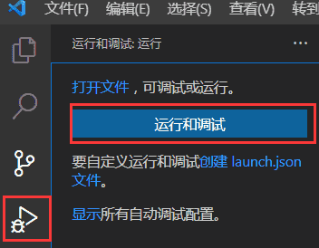

launch.json文件内容示例如下。

```json
{
    // 使用 IntelliSense 了解相关属性。
    // 悬停以查看现有属性的描述。
    // 欲了解更多信息，请访问: https://go.microsoft.com/fwlink/?linkid=830387
    "version": "0.2.0",
    "configurations": [

        {
            "name": "(gdb) 启动",   //名称随便取
            "type": "cppdbg",       //正在使用的调试器,使用Visual Studio Windows时必须为cppvsdbg,使用GDB或LLDB时必须为cppdbg
            "request": "launch",    //表示此配置是用于启动程序还是附加到已运行的实例上
            "program": "${workspaceFolder}/hello_word",   //要执行的可执行文件的完整路径
            "args": [],
            "stopAtEntry": false,
            "cwd": "${workspaceFolder}",          //可执行程序完整路径（不包含程序名称）
            "environment": [],
            "externalConsole": false,
            "MIMode": "gdb",
            "setupCommands": [
                {
                    "description": "为 gdb 启用整齐打印",
                    "text": "-enable-pretty-printing",
                    "ignoreFailures": true
                }
            ]
        }
    ]
}
```

设置完成之后，在程序指定位置添加断点，并在“运行和调试”界面开启调试即可进行程序调试。

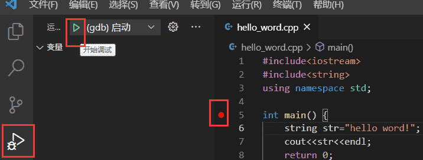

调试时在编辑器的顶部，将显示一个调试控制面板，可以进行单步、多步调试控制，同时在编辑器左侧会显示局部变量、监视的变量和程序调用堆栈等信息。

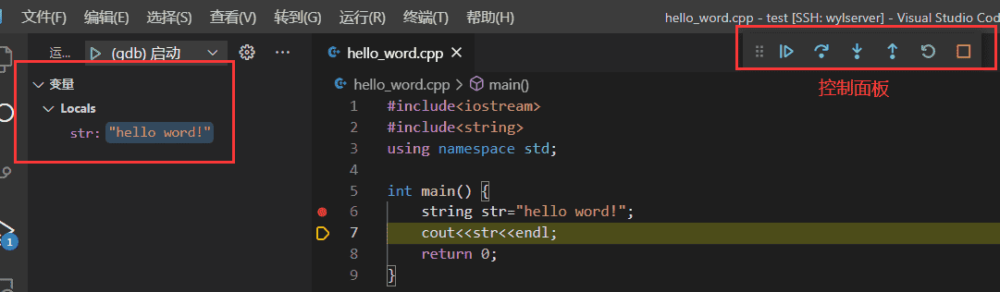
