# GDB调试原理

在使用gcc编译时，可以使用-g选项在可执行文件中嵌入更多的调试信息，那么具体嵌入了哪些调试信息？这些调试信息是如何与二进制的指令之间进行相互交互？在调试的时候，调试信息中是如何获取函数调用栈中的上下文信息？

## GDB调试模型

GDB调试包括2个程序：gdb程序和被调试程序。根据这2个程序是否运行在同一台电脑中，可以把GDB的调试模型分为2种：

1.  本地调试
2.  远程调试

本地调试：调试程序和被调试程序运行在同一台电脑中。


远程调试：调试程序运行在一台电脑中，被调试程序运行在另一台电脑中。

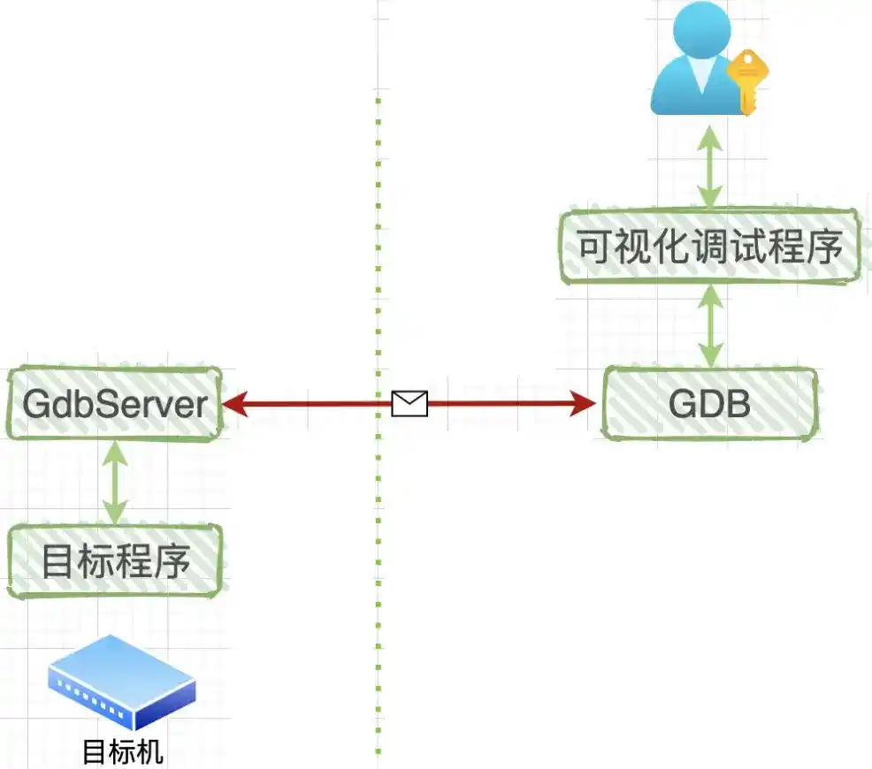

与本地调试相比，远程调试中多了一个GdbServer程序，它和目标程序都是运行在目标机中。图中的红线表示GDB与GdbServer之间通过网络或者串口进行通讯。既然是通讯，那么肯定需要一套通讯协议：RSP协议，全称是：GDB Remote Serial Protocol(GDB远程通信协议)。

关于通讯协议的具体格式和内容，我们不需要关心，只需要知道：它们都是字符串，有固定的开始字符('$')和结束字符('#')，最后还有两个十六进制的ASCII字符作为校验和，了解这么多就足够了。

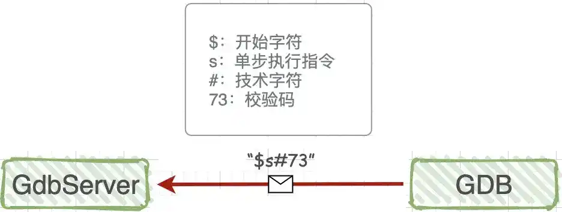

## GDB与被调试程序之间的关系

启用gdb调试运行`gdb ./test`的时候，在操作系统里发生了很多复杂的事情，系统首先会启动gdb进程，这个进程会调用系统函数fork()来创建一个子进程，这个子进程做两件事情：

-   调用系统函数`ptrace(PTRACE_TRACEME，[其他参数])`；

-   通过exec来加载、执行可执行程序test，那么test程序就在这个子进程中开始执行了。

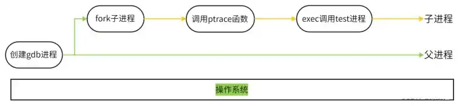

## GDB如何调试已经执行的服务进程

可以通过gdb attach pid来调试一个运行的进程，gdb将对指定进程执行`ptrace(PTRACE_ATTACH, pid, 0, 0)`操作。

如果想对一个已经执行的进程B进行调试，那么就要在gdb这个父进程中调用`ptrace(PTRACE_ATTACH, [其他参数])`，此时，gdb进程会`attach(绑定)`到已经执行的进程B，gdb把进程B收养成为自己的子进程，而子进程B的行为等同于它进行了一次`PTRACE_TRACEME`操作。此时gdb进程会发送SIGSTO信号给子进程B，子进程B接收到SIGSTOP信号后，就会暂停执行进入TASK_STOPED状态，表示自己准备好被调试了。

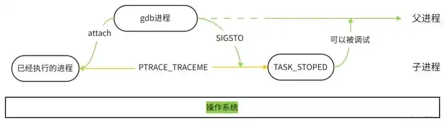

需要注意的是，当我们attach一个进程id时候，可能会报如下错误：

```
Attaching to process 28849
ptrace: Operation not permitted.
```

这是因为没有权限进行操作，可以根据启动该进程用户下或者root下进行操作。

所以，不论是调试一个新程序，还是调试一个已经处于执行中状态的服务程序，通过ptrace系统调用，最终的结果都是：gdb程序是父进程，被调试程序是子进程，子进程的所有信号都被父进程gdb来接管，并且父进程gdb可查看、修改子进程的内部信息，包括：堆栈、寄存器等。

关于绑定，有几个限制需要了解一下：不予许自我绑定，不允许多次绑定到同一个进程，不允许绑定1号进程。

## gdb系统调用ptrace原型

gdb 通过系统调用 `ptrace` 来接管一个进程的执行。ptrace 系统调用提供了一种方法使得父进程可以观察和控制其它进程的执行，检查和改变其核心映像以及寄存器。它主要用来实现断点调试和系统调用跟踪。

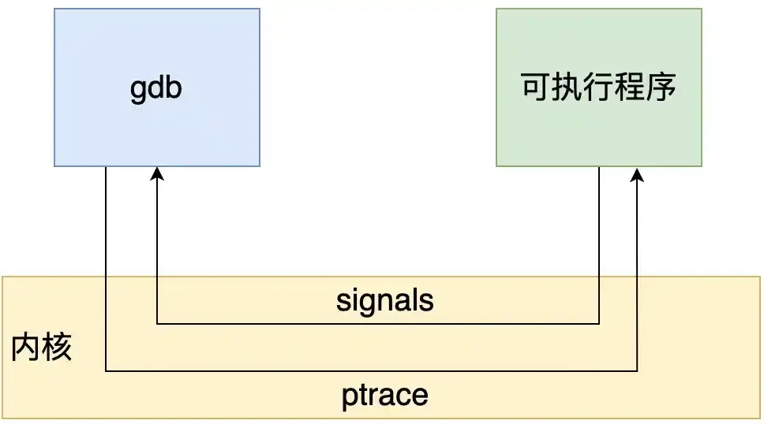

```c
#include <sys/ptrace.h>
long ptrace(enum __ptrace_request request, pid_t pid, void *addr, void *data);
```

ptrace系统函数是Linux内核提供的一个用于进程跟踪的系统调用，通过它，一个进程(gdb)可以读写另外一个进程(test)的指令空间、数据空间、堆栈和寄存器的值。而且gdb进程接管了test进程的所有信号，也就是说系统向test进程发送的所有信号，都被gdb进程接收到，这样一来，test进程的执行就被gdb控制了，从而达到调试的目的。

下面对各个参数进行解释：

1、`enum __ptrace_request request`：是一个枚举类型，用于指定要执行的操作类型。这个参数告诉 ptrace 函数将要对进程进行何种跟踪操作，例如读取寄存器、写型，其定义了一系列跟踪请求类型的常量。request的主要类型如下：

-   `PTRACE_TRACEME`：用于将当前进程标记为被跟踪的目标。调用进程使用这个类型请求后，它的父进程可以使用 PTRACE_ATTACH 来附加到它，对其进行调试和跟踪。此进程将被父进程跟踪，任何信号（除了 `SIGKILL`）都会暂停子进程，接着阻塞于 `wait()` 等待的父进程被唤醒。子进程内部对 `exec()` 的调用将发出 `SIGTRAP` 信号，这可以让父进程在子进程新程序开始运行之前就完全控制它
-   `PTRACE_ATTACH`：用于将一个进程附加到另一个进程上进行调试和跟踪，而子进程的行为等同于它进行了一次 PTRACE_TRACEME 操作。调试器进程可以使用这个类型请求，通过指定目标进程ID来附加到目标进程。需要注意的是，虽然当前进程成为被跟踪进程的父进程，但是子进程使用 `getppid()` 的到的仍将是其原始父进程的pid
-   `PTRACE_DETACH`：用于从一个已经被附加和调试的进程上分离调试器。这个请求会停止对目标进程的跟踪，并将其恢复为正常运行状态。
-   `PTRACE_PEEKDATA`：用于从目标进程的内存中读取数据。可以使用该请求来读取目标进程的内存值，例如寄存器、栈帧等。
-   `PTRACE_POKEDATA`：用于向目标进程的内存中写入数据。可以使用该请求来修改目标进程的内存值，例如修改寄存器、改变变量值等。
-   `PTRACE_GETREGS`：用于获取目标进程的寄存器值。通过这个请求，可以获得目标进程的 CPU 寄存器的当前值，用于调试和跟踪。
-   `PTRACE_SETREGS`：用于设置目标进程的寄存器值。通过这个请求，可以将特定的寄存器值设置为目标进程中的特定值。
-   `PTRACE_CONT`：继续运行之前停止的子进程，可同时向子进程交付指定的信号。调试器进程可以使用这个请求来继续目标进程的执行，直到下一个断点或者其他事件触发。

2、`pid_t pid`：是一个整数类型，表示要操作的目标进程的进程ID（PID）。pid指定了要对哪个进程进行跟踪操作，可以是当前进程、正在运行的其他进程或子进程等。

3、`void *addr`：是一个指针类型，用于指定监控的内存地址，具体用途根据不同的request参数而定。例如，对于一些读写内存的请求，addr指定了要读取或写入的内存地址。

4、`void *data`：是一个指针类型，用于传递数据，具体用途也根据不同的request参数而定。对于一些读写内存或寄存器的请求，data指定了要读取或写入的数据存储位置。

ptrace函数返回一个long类型值，表示操作的结果或错误码。通常情况下，返回值大于等于0表示成功，小于0表示发生错误。

如果没有gdb调试，操作系统与目标进程之间是直接交互的；如果使用gdb来调试程序，那么操作系统发送给目标进程的信号就会被gdb截获，gdb根据信号的属性来决定：在继续运行目标程序时是否把当前截获的信号转交给目标程序，如此一来，目标程序就在gdb发来的信号指挥下进行相应的动作。

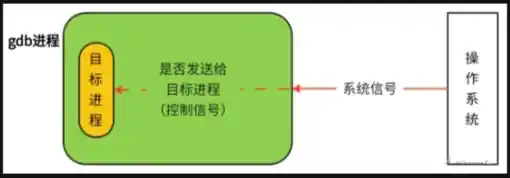

## 探索GDB如何实现断点指令

-   **实现原理**：当我们通过b或者break设置断点时候，就是在指定位置插入断点指令，当被调试的程序运行到断点的时候，产生SIGTRAP信号。该信号被gdb捕获并进行断点命中判断。
-   **设置原理**：在程序中设置断点，就是先在该位置保存原指令，然后在该位置写入int 3。当执行到int 3时，发生软中断，内核会向子进程发送SIGTRAP信号。当然，这个信号会转发给父进程。然后用保存的指令替换int 3并等待操作恢复。
-   **命中判断**：gdb将所有断点位置存储在一个`链表`中。命中判定将被调试程序的当前停止位置与链表中的断点位置进行比较，以查看断点产生的信号。
-   **条件判断**：在断点处恢复指令后，增加了一个条件判断。如果表达式为真，则触发断点。由于需要判断一次，添加条件断点后，是否触发条件断点，都会影响性能。在 x86 平台上，部分硬件支持硬件断点。不是在条件断点处插入 int 3，而是插入另一条指令。当程序到达这个地址时，不是发出int 3信号，而是进行比较。特定寄存器的内容和某个地址，然后决定是否发送int 3。因此，当你的断点位置被程序频繁“通过”时，尽量使用硬件断点，这将有助于提高性能。

大道理已经讲完了，这里我们通过设置断点(break)这个调试指令，来偷窥一下 gdb 内部的调试机制。

示例代码：

```c
#include<stdio.h>

int main(int argc, char *argv[]) {
    int a = 1;
    int b = 2;
    int c = a + b;
    printf("c = %d \n", c);
    return 0;
}
```

来看一下编译出来的反汇编代码是什么样的，编译指令：

```apl
$ gcc -S test.c;
$ cat test.s
        .file   "test.c"
        .text
        .section        .rodata
.LC0:
        .string "c = %d \n"
        .text
        .globl  main
        .type   main, @function
main:
.LFB0:
        .cfi_startproc
        pushq   %rbp
        .cfi_def_cfa_offset 16
        .cfi_offset 6, -16
        movq    %rsp, %rbp
        .cfi_def_cfa_register 6
        subq    $32, %rsp
        movl    %edi, -20(%rbp)
        movq    %rsi, -32(%rbp)
        movl    $1, -4(%rbp)
        movl    $2, -8(%rbp)
        movl    -4(%rbp), %edx
        movl    -8(%rbp), %eax
        addl    %edx, %eax
        movl    %eax, -12(%rbp)
        movl    -12(%rbp), %eax
        movl    %eax, %esi
        movl    $.LC0, %edi
        movl    $0, %eax
        call    printf
        movl    $0, %eax
        leave
        .cfi_def_cfa 7, 8
        ret
        .cfi_endproc
.LFE0:
        .size   main, .-main
        .ident  "GCC: (GNU) 11.5.0 20240719 (Red Hat 11.5.0-5)"
        .section        .note.GNU-stack,"",@progbits
```

上面说到，在执行`gdb ./test`之后，gdb就会fork出一个子进程，这个子进程首先调用`ptrace`然后执`test`程序，这样就准备好调试环境了。

我们把源码和汇编代码放在一起，方便理解：

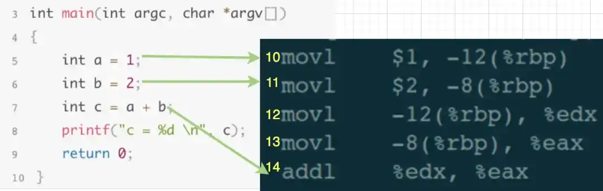

在调试窗口输入设置断点指令“`break 5`”，此时gdb做2件事情：

1.  对第5行源码所对应的第10行汇编代码存储到断点链表中。
2.  在汇编代码的第10行，插入中断指令INT3，也就是说：汇编代码中的第10行被替换为INT3。

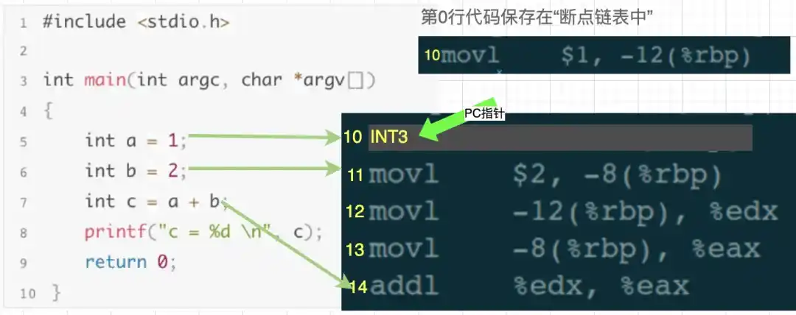

然后，在调试窗口继续输入执行指令“run”(一直执行，直到遇到断点就暂停)，汇编代码中PC指针(一个内部指针，指向即将执行的那行代码)执行第10行时，发现是INT3指令，于是操作系统就发送一个SIGTRAP信号给test进程。

此刻，第10行汇编代码被执行过了，PC指针就指向第11行了。

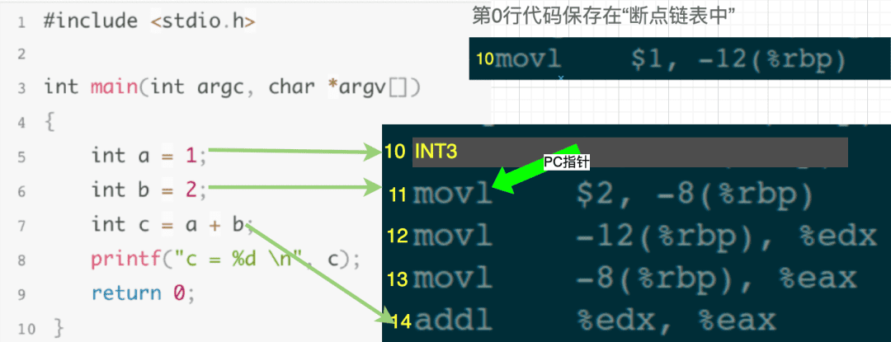

上面已经说过，操作系统发给test的任何信号，都被gdb接管了，也就是说gdb会首先接收到这SIGTRAP个信号，gdb发现当前汇编代码执行的是第10行，于是到断点链表中查找，发现链表中存储了第10行的代码，说明第10行被设置了断点。于是gdb又做了2个操作：

1.  把汇编代码中的第10行"INT3"替换为断点链表中原来的代码。
2.  把 PC 指针回退一步，也即是设置为指向第10 行。

然后，gdb继续等待用户的调试指令。

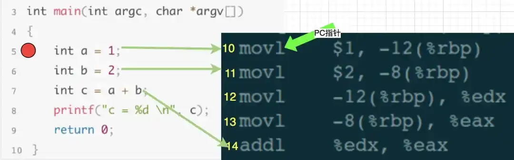

此刻，就相当于下一条执行的指令是汇编代码中的第10行，也就是源码中的第5行。从我们调试者角度看，就是被调试程序在第5行断点处暂停了下来，此时我们可以继续输入其他调试指令来debug，比如：查看变量值、查看堆栈信息、修改局部变量的值等等。

## 探索GDB如何实现单步指令next

可以通过ptrace(PTRACE_SINGLESTEP, pid,...)调用来实现单步。

```c
printf("attaching to PID %d\n", pid);
if (ptrace(PTRACE_ATTACH, pid, 0, 0) != 0) {
    perror("attach failed");
}
int waitStat = 0;
int waitRes = waitpid(pid, &waitStat, WUNTRACED);
if (waitRes != pid || !WIFSTOPPED(waitStat)) {
    printf("unexpected waitpid result!\n");
    exit(1);
}

int64_t numSteps = 0;
while (true) {
    auto res = ptrace(PTRACE_SINGLESTEP, pid, 0, 0);
}
```

上述代码，首先接收一个pid，然后对其进行attach，最后调用ptrace进行单步调试。

【示例】还是以刚才的源代码和汇编代码为例，假设此时程序停止在源码的第6行，即汇编代码的第11行：

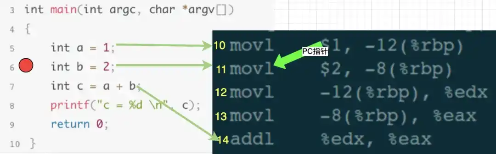

在调试窗口输入单步执行指令next，我们的目的是执行一行代码，也就是把源码中第6行代码执行完，然后停止在第7行。gdb在接收到next执行时，会计算出第7行源码，应该对应到汇编代码的第14行，于是gdb就控制汇编代码中的PC指针一直执行，直到第13行执行结束，也就是PC指向第14行时，就停止下来，然后继续等待用户输入调试指令。

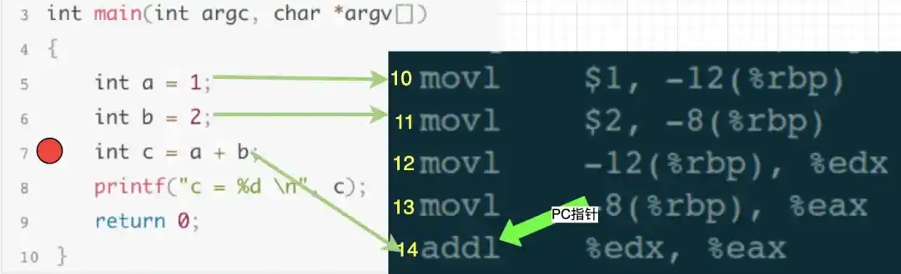

