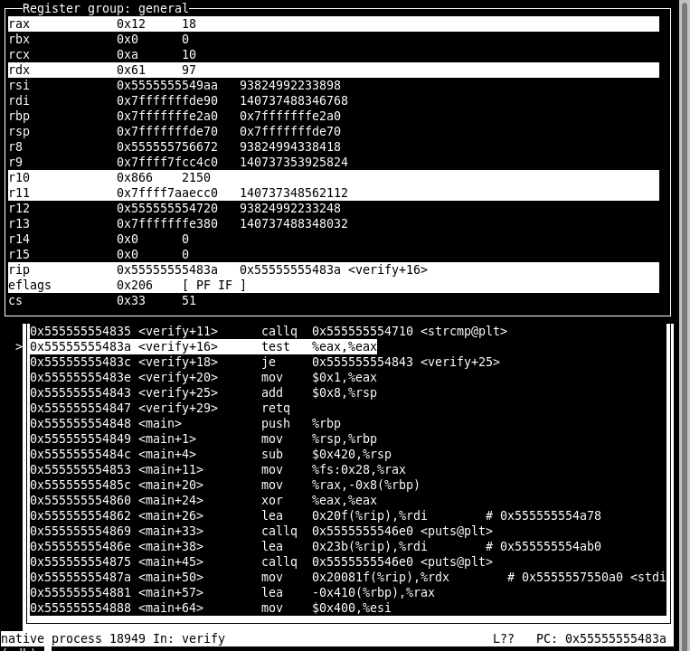

# gdb 调试器快速指南

## 启动调试器

在终端中，使用"文本用户界面"运行`gdb`

```apl
#使用文本用户界面启动gdb调试程序puzzlebox
> gdb -tui ./puzzlebox
```

### TUI模式（推荐）

可以通过使用`-tui`选项运行`gdb`来启用文本用户界面（TUI）。它显示：

-   命令和历史记录在底部
-   源代码位置在顶部

屏幕偶尔会显示"混乱"，可以通过按`Control-L`来纠正，这将强制重绘终端屏幕。

### 普通模式

这与`gdb`的普通模式不同，普通模式不会显示任何源代码，除非发出`list`命令。大多数人发现这种模式更难使用，除非他们将其作为另一个编辑器（如`emacs`）的子进程运行。

### 切换模式

如果处于普通模式，可以通过以下命令进入TUI模式：

```apl
tui enable
```

切换到普通模式可通过以下命令完成：

```apl
tui disable
```

## `puzzlebox`的典型启动

下面在`gdb`中的示例运行说明了在调试器中运行`puzzlebox`的基础知识。有关`next/run/break`等命令的详细信息，请参见下一节。

```oz
> gdb -tui ./puzzlebox                                ## 使用文本用户界面在puzzlebox上启动gdb
GNU gdb (GDB) 8.1
...
Reading symbols from ./puzzlebox...done.
(gdb) set args input.txt                              ## 设置命令行参数为input.txt
(gdb) run                                             ## 运行程序
Starting program: puzzlebox input.txt
UserID 'kauf0095' accepted: hash value = 1397510491   ## 程序输出
PHASE 1: A puzzle you say? Challenge accepted!

Ah ah ah, you didnt say the magic word...
Failure: Double debugger burger, order up!

  * Score: 0 / 50 pts *
[Inferior 1 (process 27727) exited normally]          ## gdb指示程序已结束

(gdb) break phase01                                   ## 在函数phase01()处设置断点
Breakpoint 1 at 0x55555555551a: file puzzlebox.c, line 220.
(gdb) run
Starting program: puzzlebox input.txt
UserID 'kauf0095' accepted: hash value = 1397510491
PHASE 1: A puzzle you say? Challenge accepted!

Breakpoint 1, phase01 () at puzzlebox.c:220           ## 命中断点
220   int a = atoi(next_input());                 ## 在此代码行停止
(gdb) step                                            ## 前进一行代码
next_input () at puzzlebox.c:197                      ## 步入函数next_input()
197   input_idx++;
(gdb) step                                            ## 再次步进
198   int ret = fscanf(input_fh, "%s", inputs[input_idx]);
(gdb) finish                                          ## 乏味：完成此函数
Run till exit from #0  next_input () at puzzlebox.c:198
0x0000555555555524 in phase01 () at puzzlebox.c:220
220   int a = atoi(next_input());                 ## 回到phase01()
Value returned is $1 = 0x555555758380 <inputs+128> "1"
(gdb) step                                            ## 前进
221   int b = atoi(next_input());
(gdb) next                                            ## 越过next_input()调用
222   int c = atoi(next_input());
(gdb) next                                            ## 再次越过：此阶段需要3个输入
224   a += hash % 40;                             ## 根据随机哈希值对a进行某些操作...
(gdb) print a                                         ## 显示a发生了什么
$2 = 12                                               ## 现在值为12
(gdb) n                                               ## 'next'的缩写
225   if (a<b && b>c && a<c) {                    ## 对a、b、c的一些检查，它们是输入
(gdb) next
228   failure("Double debugger burger, order up!"); ## 即将失败，一定需要不同的输入
(gdb) kill                                              ## 终止程序
Kill the program being debugged? (y or n) y

## 现在编辑input.txt以获取不同的值

(gdb) run                                             ## 重新运行程序
Starting program: puzzlebox input.txt
UserID 'kauf0095' accepted: hash value = 1397510491
PHASE 1: A puzzle you say? Challenge accepted!

Breakpoint 1, phase01 () at puzzlebox.c:220           ## 再次命中断点
220   int a = atoi(next_input());

(gdb) info break                                      ## 显示有关哪些断点处于活动状态的信息
Num     Type           Disp Enb Address            What
1       breakpoint     keep y   0x000055555555551a in phase01 at puzzlebox.c:220
 breakpoint already hit 1 time

(gdb) break puzzlebox.c:225                           ## 不想继续单步执行：在前面的几行设置断点
Breakpoint 2 at 0x555555555583: file puzzlebox.c, line 225.

(gdb) info break                                      ## 显示活动断点的信息
Num     Type           Disp Enb Address            What
1       breakpoint     keep y   0x000055555555551a in phase01 at puzzlebox.c:220
 breakpoint already hit 1 time
2       breakpoint     keep y   0x0000555555555583 in phase01 at puzzlebox.c:225

(gdb) continue                                        ## 继续执行直到下一个断点
Continuing.

Breakpoint 2, phase01 () at puzzlebox.c:225           ## 命中第二个断点
225   if (a<b && b>c && a<c) {
(gdb) print a                                         ## a的值
$3 = 21
(gdb) next                                            ## 看看这是否有效
228   failure("Double debugger burger, order up!"); ## 不行
(gdb) print b                                          ## 查看b
$4 = 2                                                 ## 可能需要增大它以满足a<b
```

## 标准`gdb`命令

与大多数调试器一样，`gdb`提供了多种控制程序执行和检查值的方法。以下是总结，但`gdb`自身广泛的`help`提供了更多详细信息。

### 在`gdb`中设置断点

`断点`表示调试器将在程序中停止执行的位置。可以通过多种方式创建断点，并在不再需要时删除它们。

| 命令                    | 效果                                   | 注释                     |
| :---------------------- | :------------------------------------- | :----------------------- |
| `break main`            | 在`main()`的开头停止运行               |                          |
| `break phase01`         | 在phase01函数的开头停止运行            |                          |
| `break puzzlebox.c:100` | 在`puzzlebox.c`的第100行停止运行       |                          |
| `break`                 | 在当前行停止运行                       | 用于在重新运行时停止     |
| `info breakpoint`       | 显示所有断点的位置                     |                          |
| `disable 2`             | 不在断点#2处停止，但保留它             |                          |
| `enable 2`              | 再次在断点#2处停止                     |                          |
| `clear phase01`         | 移除`phase01()`的断点                  |                          |
| `clear puzzlebox.c:100` | 移除`puzzlebox.c`第100行的断点         |                          |
| `delete 2`              | 移除断点#2                             |                          |
| `break *0x1248f2`       | 在特定指令地址处设置断点               | 参见二进制文件部分的信息 |
| `break *func+24`        | 在标签偏移24字节的指令处设置断点       |                          |
| `break *func+0x18`      | 在标签偏移十六进制0x18的指令处设置断点 |                          |

### 参数和运行

加载程序并设置一两个断点后，通常需要运行它。命令行参数通常也是必要的。

| 命令                | 效果                       | 注释                                                      |
| :------------------ | :------------------------- | :-------------------------------------------------------- |
| `set args hi bye 2` | 设置命令行参数为`hi bye 2` | `puzzlebox`的命令行需要是`input.txt`                      |
| `show args`         | 显示当前命令行参数         | 更改参数需要`kill/run`才能生效                            |
| `run`               | 从头开始运行程序           | 除非设置了断点，否则将运行到完成                          |
| `kill`              | 终止正在运行的程序         | 通常在遇到失败前重新`run`程序                             |
| `file program`      | 加载`program`并开始调试    | 重新编译后重新加载，对`puzzlebox`不必要，但对正确调试有用 |
| `quit`              | 退出调试器                 |                                                           |

### 单步执行

当命中断点时，可以在调试器中单步向前，以跟踪执行路径。使用`step`逐行进入函数，使用`next`留在当前函数中越过函数调用。

| 命令                | 效果                     | 注释                                     |
| :------------------ | :----------------------- | :--------------------------------------- |
| `step`              | 向前执行一行代码         | 必须正在运行；通常在命中断点后执行此操作 |
| `step 4`            | 向前执行4行代码          | `step`会进入函数                         |
| `next` / `next 4`   | 步进但越过函数调用       | `next`不会进入函数                       |
| `stepi`             | 向前执行一条汇编指令     | `stepi`会进入函数                        |
| `nexti`             | 越过函数执行一条汇编指令 | `nexti`不会进入函数                      |
| `finish`            | 完成执行当前函数         | 完成函数时显示函数的返回值               |
| `continue` / `cont` | 继续运行到下一个断点     |                                          |

### 打印内存和栈中的值

检查值通常是必要的，以了解程序中发生的情况。调试器可以以各种格式显示数据，包括不符合给定变量C类型的格式。

还包括打印由寄存器（如栈指针寄存器`rsp`）指向的内存位置的命令。这对于检查可能被推入栈中并被操作的值很有用。

| 命令           | 效果                                               | 注释                 |
| :------------- | :------------------------------------------------- | :------------------- |
| `print a`      | 打印变量`a`的值，必须在当前函数中                  | 根据其C类型格式化`a` |
| `print/x a`    | 将`a`的值打印为十六进制数                          |                      |
| `print/o a`    | 将`a`的值打印为八进制数                            |                      |
| `print/t a`    | 将`a`的值打印为二进制数（显示所有位）              |                      |
| `print/s a`    | 将`a`的值打印为字符串，即使它不是字符串            |                      |
| `print arr[2]` | 根据其C类型打印`arr[2]`的值                        |                      |
| `print 0x4A25` | 打印十六进制常量`0x4A25`的十进制值，即18981        |                      |
| `x a`          | 检查由`a`指向的内存                                | 假设`a`是一个指针    |
| `x/d a`        | 将由`a`指向的内存打印为十进制整数                  |                      |
| `x/s a`        | 将由`a`指向的内存打印为字符串                      |                      |
| `x/s (a+4)`    | 将由`a+4`指向的内存打印为字符串                    |                      |
| `x $rax`       | 打印由寄存器`rax`指向的内存                        |                      |
| `x $rax+8`     | 打印寄存器`rax`指向的位置上方8字节的内存           |                      |
| `x /wx $rax`   | 以十六进制格式打印32位"字"数                       |                      |
| `x /gx $rax`   | 以十六进制格式打印64位"巨大"数                     |                      |
| `x /5gd $rax`  | 从`rax`指向的位置开始打印5个64位数；使用十进制格式 |                      |
| `x /3wd $rsp`  | 打印栈顶（从`rsp`开始）的3个32位数                 |                      |

### TUI模式下的命令历史和屏幕管理

在gdb中，基本的编辑规则很有用。文本用户界面`-tui`模式会改变按键，使箭头键无法正常工作。但是，TUI模式在终端的上部区域显示源代码位置，大多数人认为这很有帮助。

| 命令/按键         | TUI `-tui`模式                       | 普通模式                       |
| :---------------- | :----------------------------------- | :----------------------------- |
| `Ctrl-l`（控制L） | 重绘屏幕以移除杂乱（经常执行此操作） | 清除屏幕                       |
| `Ctrl-p`（控制P） | 上一个命令，重复查看历史             | 相同                           |
| `Ctrl-n`（控制N） | 如果在之前的位置，则下一个命令       | 相同                           |
| `Ctrl-r`（控制R） | 交互式向后搜索                       | 相同                           |
| `Ctrl-b`（控制B） | 将光标向后（左）移动一个字符         | 相同                           |
| `Ctrl-f`（控制F） | 将光标向前（右）移动一个字符         | 相同                           |
| 上/下箭头         | 上下移动源代码窗口                   | 上一个/下一个命令              |
| 左/右箭头         | 左右移动源代码窗口                   | 左/右移动光标                  |
| `list`            | 无效果，源代码始终显示在顶部面板     | 显示当前执行点周围的10行源代码 |

### 其他资源

## 在GDB中调试汇编

### 概述

当包含汇编代码或只有二进制可执行文件时，GDB可以毫无困难地处理汇编代码。以下命令对此很有用。

| 命令/按键              | TUI `-tui`模式                       | 普通模式                           |
| :--------------------- | :----------------------------------- | :--------------------------------- |
| `Ctrl-l`（控制L）      | 重绘屏幕以移除杂乱（经常执行此操作） | 清除屏幕                           |
| `layout asm`           | 如果当前未显示，则显示汇编代码窗口   | 无效果                             |
| `layout reg`           | 显示包含寄存器内容的窗口             | 无效果                             |
| `winheight regs +2`    | 使寄存器窗口增大2行                  | 无效果                             |
| `winheight regs -1`    | 使寄存器窗口减小1行                  | 无效果                             |
| `info reg`             | 在命令窗口中显示寄存器的内容         | 相同                               |
| `list`                 | 无效果                               | 显示一些汇编代码行                 |
| `disassemble`或`disas` | 无效果                               | 显示二进制中的汇编行，包括指令地址 |

在TUI模式下使用命令`layout asm`和`layout reg`，可以获得一个用于调试汇编的人性化界面布局，如下所示。



### 编译和运行汇编文件（源代码可用）

使用调试标志编译汇编文件将使gdb在TUI源窗口中默认显示汇编代码，并使`step`命令一次移动一条指令。

```
> gcc -g collatz.s              ## 使用调试符号编译汇编代码
> gdb ./a.out                   ## 在可执行文件上运行gdb
gdb> tui enable                 ## 启用文本用户界面模式
gdb> break main                 ## 在main处设置断点
gdb> run                        ## 运行到断点
gdb> step                       ## 步进几次以查看汇编中的位置
gdb> s                          ## step的简写
gdb> layout regs                ## 开始显示寄存器
gdb> step                       ## 步进以查看寄存器中的变化
gdb> break collatz.s:15         ## 在另一个源行设置断点
gdb> continue                   ## 运行到源行
gdb> step                       ## 步进
gdb> winheight regs +2          ## 显示更多寄存器窗口以查看eflags
gdb> quit                       ## 退出调试器
```

### 调试二进制文件（无源代码可用）

没有调试符号，`gdb`不知道要显示什么源代码。由于二进制文件对应于汇编，可以始终使用`layout asm`在TUI中让调试器显示汇编代码。此外，应使用`stepi`命令一次执行一条汇编指令，因为`step`可能会尝试确定要执行的C语言级别的操作，这可能是几条汇编指令。

```
> gcc collatz.s                 ## 不带调试符号编译汇编代码
> gdb ./a.out                   ## 在可执行文件上运行gdb
gdb> tui enable                 ## 启用文本用户界面模式

gdb> layout asm                 ## 在源窗口中显示汇编代码

gdb> break main                 ## 在main处设置断点
gdb> run                        ## 运行到断点

gdb> stepi                      ## 步进单个汇编指令
gdb> si                         ## stepi的简写

gdb> layout regs                ## 开始显示寄存器
gdb> stepi                      ## 步进以查看寄存器中的变化
gdb> break *main + 14           ## 在main后14字节的指令处设置断点
gdb> continue                   ## 运行到源行
gdb> stepi                      ## 步进
gdb> winheight regs +2          ## 显示更多寄存器窗口以查看eflags
gdb> quit                       ## 退出调试器
```

### 其他TUI命令

```
gdb` TUI命令和配置的官方列表在这里：`https://sourceware.org/gdb/current/onlinedocs/gdb/TUI.html
```

文档中包括：

-   调整窗口高度
-   显示其他窗口
-   循环浏览窗口，使用上/下箭头滚动
-   单键模式，按`i`或`s`向前步进一条指令，让人感觉非常酷

## 二进制文件中的断点

使用C和汇编源文件设置断点可以通过文件/行号轻松完成。但是，如果没有可用的源代码，就变得有点棘手，因为必须基于其他标准设置断点。以下是一些技巧。

### 在函数符号/标签处断点

在汇编级别，高级语言中的函数名仍然作为"符号"存在。可以使用二进制工具如`objdump -t a.out`或`nm a.out`查看这些符号。标记为`T`的任何内容都是"程序文本"。在这些位置设置断点很常见。

```
> nm bomb                            ## 显示二进制bomb中的符号
...                                  ## 用"T"标记的函数
0000000000400df6 T main              ## 有一个main函数
...
0000000000400f2d T phase_1           ## 有phase函数
0000000000400f49 T phase_2
...
> gdb ./bomb                         ## 在调试器中运行二进制
...
Reading symbols from bomb...done.

(gdb) break main                     ## 在到达符号"main"时设置断点
Breakpoint 1 at 0x400df6: file bomb.c, line 37.

(gdb) break phase_1                  ## 在到达符号"phase_1"时设置断点
Breakpoint 2 at 0x400f2d             ## 显示phase_1开始的指令内存地址

(gdb) run                            ## 运行
Starting program: bomb
Breakpoint 1, main (argc=1, argv=0x7fffffffe6a8) at bomb.c:37    ## main中的第一个断点
37      {

(gdb) cont                           ## 继续
Continuing.
...
Breakpoint 2, 0x0000000000400f2d in phase_1 () ## phase_1中的第二个断点，注意内存地址

(gdb)
```

### 在特定指令地址处断点

由于二进制文件没有行号，因此无法在特定行号设置断点。但是，二进制文件中的所有指令都有一个指令地址。可以在特定指令地址设置断点，这样当指令指针寄存器（`rip`）到达这些地址时，调试器将停止执行。这种语法有点奇怪：

```
## 注意每种情况下使用*

(gdb) break *0x1248f2    ## 在地址0x1248f2的指令处设置断点

(gdb) break *func+24     ## 在标签func + 24字节处设置断点

(gdb) break *func+0x18   ## 在标签func + 24字节处设置断点（0x18 == 24）
```

下面是一个示例，展示了在指令地址设置断点的典型用途。请注意，`disas`命令用于在`gdb`中显示当前函数中的反汇编代码，它方便地提供了从最近标签到即将到来的指令地址的一些偏移量。在TUI模式下，这些信息可能已经存在，无需使用`disas`。

```
Breakpoint 2, 0x0000000000400f2d in phase_1 ()

(gdb) disas                     ## 显示汇编代码和当前位置
Dump of assembler code forfunction phase_1:
=> 0x0000000000400f2d <+0>:     sub    $0x8,%rsp
   0x0000000000400f31 <+4>:     mov    $0x402710,%esi
   0x0000000000400f36 <+9>:     callq  0x401439 <strings_not_equal>
   0x0000000000400f3b <+14>:    test   %eax,%eax
   0x0000000000400f3d <+16>:    je     0x400f44 <phase_1+23>
   0x0000000000400f3f <+18>:    callq  0x401762 <explode_bomb>
   0x0000000000400f44 <+23>:    add    $0x8,%rsp
   0x0000000000400f48 <+27>:    retq
End of assembler dump.

(gdb) break *0x400f36           ## 在特定指令地址设置断点
Breakpoint 3 at 0x400f36
(gdb) cont                      ## 继续执行
Continuing.

Breakpoint 3, 0x0000000000400f36 in phase_1 ()  ## 注意停止地址与断点匹配
(gdb) disas                     ## 显示汇编代码和当前位置
Dump of assembler code forfunction phase_1:
   0x0000000000400f2d <+0>:     sub    $0x8,%rsp
   0x0000000000400f31 <+4>:     mov    $0x402710,%esi
=> 0x0000000000400f36 <+9>:     callq  0x401439 <strings_not_equal>
   0x0000000000400f3b <+14>:    test   %eax,%eax
   0x0000000000400f3d <+16>:    je     0x400f44 <phase_1+23>
   0x0000000000400f3f <+18>:    callq  0x401762 <explode_bomb>
   0x0000000000400f44 <+23>:    add    $0x8,%rsp
   0x0000000000400f48 <+27>:    retq
End of assembler dump.

(gdb) break *phase_1+18         ## 在标签偏移量处设置断点
Breakpoint 4 at 0x400f3f        ## 注意地址

(gdb) cont                      ## 继续执行
Continuing.

Breakpoint 4, 0x0000000000400f3f in phase_1 () ## 注意地址

(gdb) disas                     ## 显示汇编代码和当前位置
Dump of assembler code forfunction phase_1:
   0x0000000000400f2d <+0>:     sub    $0x8,%rsp
   0x0000000000400f31 <+4>:     mov    $0x402710,%esi
   0x0000000000400f36 <+9>:     callq  0x401439 <strings_not_equal>
   0x0000000000400f3b <+14>:    test   %eax,%eax
   0x0000000000400f3d <+16>:    je     0x400f44 <phase_1+23>
=> 0x0000000000400f3f <+18>:    callq  0x401762 <explode_bomb>
   0x0000000000400f44 <+23>:    add    $0x8,%rsp
   0x0000000000400f48 <+27>:    retq
End of assembler dump.
```

## 处理二进制文件的其他有用工具

以下程序在大多数Unix系统上可用，在处理二进制文件时可能有用。除了GDB，它们还可以提供一些关于要查找的内容的信息。

| 命令                | 效果                                                  |
| :------------------ | :---------------------------------------------------- |
| `objdump -d file.o` | 显示从编译文件反编译的汇编                            |
| `objdump -t file.o` | 显示文件中定义的符号（函数/全局变量）                 |
| `nm file.o`         | 简称"names"，类似于`objdump -t`但省略了符号的一些细节 |
| `strings file.o`    | 查找并显示文件中存在的ASCII字符串                     |

