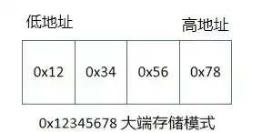
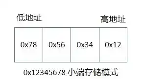
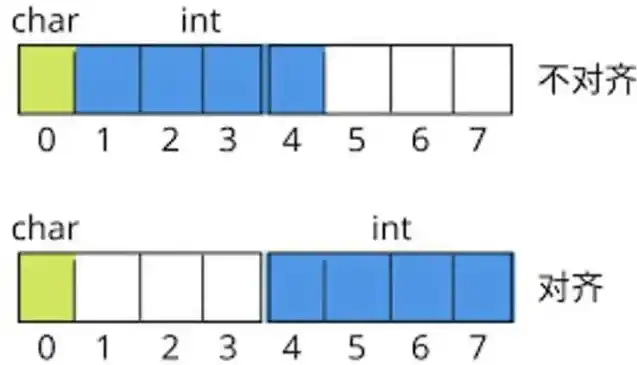

# 基础C语法

## static的作用

在C语言中，关键字static有三个明显的作用：

-   在函数体修饰变量：一个被声明为静态的变量在这一函数被调用过程中维持其值不变。
-   在模块内（但在函数体外）修饰变量：一个被声明为静态的变量可以被模块内所用函数访问，但不能被模块外其它函数访问。它是一个本地的全局变量。
-   在模块内修饰函数：一个被声明为静态的函数只可被这一模块内的其它函数调用。那就是，这个函数被限制在声明它的模块的本地范围内使用。

## const的作用

下面的声明都是什么意思：

```c
const int a;
int const a;
const int *a;
int * const a;
int const * a const;
```

-   前两个的作用是一样，a是一个常整型数。
-   第三个意味着a是一个指向常整型数的指针（也就是，整型数是不可修改的，但指针可以）。
-   第四个意思a是一个指向整型数的常指针（也就是说，指针指向的整型数是可以修改的，但指针是不可修改的）。
-   最后一个意味着a是一个指向常整型数的常指针（也就是说，指针指向的整型数是不可修改的，同时指针也是不可修改的）。

## volatile的作用

volatile是C和C++中的一个关键字，它的作用是告知编译器，被该关键字修饰的变量可能会在程序的外部被改变，因此编译器在优化代码时不能对该变量进行一些可能导致错误的优化操作，具体如下：

（1）确保对变量的每次访问都是从内存中读取

编译器通常会将频繁访问的变量缓存到寄存器中，以提高访问速度。但对于volatile修饰的变量，编译器会每次都从内存中读取其值，而不是使用寄存器中的缓存值。

例如，在多线程程序中，一个线程修改了volatile修饰的变量，其他线程能立即读取到最新值，而不是旧的缓存值。

（2）禁止编译器对代码进行优化重排

编译器为了提高程序的执行效率，可能会对代码进行优化重排，改变语句的执行顺序。但对于volatile变量的读写操作，编译器不会将其与其他指令重排，以保证程序按照代码的书写顺序来访问volatile变量。

具体来说，`volatile`有以下几个主要用途：

-   硬件寄存器访问：在访问硬件寄存器时，由于硬件可能随时改变寄存器的值，所以需要用`volatile`来确保每次读取或写入都是从实际的硬件寄存器而不是可能被优化过的缓存中进行。例如在嵌入式系统开发中，当与外设进行交互时，外设的状态寄存器可能会被硬件随时更新，使用`volatile`可以确保程序正确地读取到最新的状态。
-   多线程编程：在多线程环境中，如果一个变量可能被多个线程同时访问和修改，而没有使用合适的同步机制，那么这个变量就可能在不同的线程中被意外地改变。将这个变量声明为`volatile`可以提醒编译器不要对该变量进行过度的优化，从而避免一些难以调试的错误。例如，一个标志变量被一个线程设置为某个特定值以通知另一个线程执行特定的操作，这个标志变量就应该被声明为`volatile`。
-   中断处理：在处理中断服务程序时，被中断服务程序修改的变量应该被声明为`volatile`。因为中断可能在任何时候发生，并且中断服务程序可能会修改这些变量的值，所以编译器不能对这些变量进行优化，必须每次都从内存中读取它们的值。

其他疑问：

1.  一个参数既可以是const还可以是volatile吗？解释为什么。
2.  一个指针可以是volatile 吗？解释为什么。
3.  下面的函数有什么错误：

```c
int square(volatile int *ptr) {
    return *ptr * *ptr;
}
```

下面是答案：

1.  是的。一个例子是只读的状态寄存器。它是volatile因为它可能被意想不到地改变。它是const因为程序不应该试图去修改它。
2.  是的。尽管这并不很常见。一个例子是当一个中服务子程序修该一个指向一个buffer的指针时。

3.  这段代码的有个恶作剧。这段代码的目的是用来返指针 *ptr 指向值的平方，但是，由于 *ptr 指向一个volatile型参数，编译器将产生类似下面的代码：

```c
/* 这里参数应该申明为引用，不然函数体里只会使用副本，外部没法更改 */
int square(volatile int *ptr) {
    int a, b;
    a = *ptr;
    b = *ptr;
    return a * b;
}
```

由于*ptr的值可能在两次取值语句之间发生改变，因此a和b可能是不同的。结果，这段代码可能返回的不是你所期望的平方值！正确的代码如下：

```c
long square(volatile int *ptr) {
    int a;
    a = *ptr;
    return a * a;
}
```

>   volatile只能保证可见性，不能保证原子性。

## volatile关键字在中断服务中的应用？

（1）保证变量的可见性

在多任务或中断驱动的系统中，全局变量可能会被中断服务程序和其他任务同时访问。如果没有volatile关键字，编译器可能会对变量的访问进行优化，将变量的值缓存到寄存器中，导致在中断服务程序中对变量的修改在其他任务中不能及时被感知。

使用volatile关键字可以告诉编译器，该变量可能会在意外的情况下被修改，每次访问该变量时都要从内存中读取最新的值，而不是使用寄存器中的缓存值，从而保证了变量在不同任务和中断服务程序之间的可见性。

（2）防止编译器优化导致的错误

编译器在优化代码时，可能会根据程序的执行路径和变量的使用情况，对代码进行重新排序或省略一些看似不必要的操作。

对于可能在中断服务中被修改的变量，如果没有volatile关键字，编译器的优化可能会导致程序出现错误。

例如，在一段代码中，如果编译器认为某个变量在当前函数中没有被修改，可能会将对该变量的多次读取优化为只读取一次。但如果在这期间中断服务程序修改了该变量的值，那么程序就会出现错误的结果。

使用volatile关键字可以阻止编译器进行这样的优化，确保程序按照预期的方式访问变量。

## 分析以下代码中`volatile`的作用

```c
volatile int status;
int main(void) {
    while (1) {
        if (status) {
            printf("status = 1\n");
            status = 0;
        }
    }
}

void isr_fun(void) {
    status = 1;
}
```

在这段代码中，`status`是一个全局变量。在主函数`main`中，不断检查`status`的值。`isr_fun`是一个中断服务函数，会修改`status`的值。如果`status`没有使用`volatile`修饰，主函数在第一次读取`status`的值后，可能会一直使用寄存器中缓存的旧值，即使`isr_fun`已经修改了`status`的值。使用`volatile`修饰后，主函数每次都会从内存中读取`status`的值，从而能够正确地响应`isr_fun`对`status`的修改。

## `volatile` 能完全保证多线程环境下数据的一致性吗？

volatile 只能保证每次读取变量时都是从内存中读取最新的值，但它不能保证复杂操作（如读 - 改 - 写操作）的原子性。在多线程环境下，如果多个线程同时对一个 volatile 变量进行操作，可能会出现数据不一致的情况。因此，还需要配合互斥锁、信号量等同步机制来保证多线程环境下数据的一致性。

## 在多线程编程中，volatile能否替代互斥锁等同步机制？为什么？

答案：volatile不能替代互斥锁等同步机制。volatile只能保证变量的可见性，但不能保证原子性操作和互斥性。在多线程环境下，对共享资源的复杂操作（如读 - 改 - 写）需要使用互斥锁等同步机制来确保数据的一致性和正确性。

## 解释为什么使用volatile关键字不能完全解决多线程竞争条件问题？

答案：volatile关键字只能确保每次读取变量时都是从内存中读取最新的值，但它不能保证多个线程对共享变量的操作是原子性的。例如，两个线程同时对一个volatile整数变量进行递增操作，可能会导致结果小于预期值，因为递增操作不是原子性的，可能会被其他线程中断。

## 在嵌入式系统开发中，volatile关键字的重要性体现在哪些方面？

答案：在嵌入式系统中，与硬件设备交互频繁，硬件设备可能随时改变寄存器的值。使用volatile关键字可以确保程序正确地读取和写入这些可能被外部因素改变的变量，避免出现错误的行为。例如，在读取传感器数据或控制硬件设备状态时，volatile关键字可以确保程序获取到最新的、正确的值。

## 解释register关键字的作用？

在C语言中，register关键字用于建议编译器将变量存储在寄存器中，而不是常规的内存中。其作用主要有以下几点：

（1）提高访问速度：寄存器是CPU内部的高速存储单元，对寄存器的访问速度远远快于对内存的访问速度。将频繁使用的变量声明为register，可以让编译器优先将其存储在寄存器中，这样在程序运行时，对该变量的读写操作就能更快地完成，从而提高程序的执行效率。

（2）减少内存访问：对于一些需要频繁读写的变量，如循环变量，使用register关键字可以减少对内存的访问次数，降低内存总线的负载，同时也有助于提高整个系统的性能。

不过，register只是一个建议，编译器可以根据实际情况决定是否将变量放入寄存器。例如，当寄存器资源紧张或者变量的使用方式不适合放在寄存器中时，编译器可能会忽略这个建议。另外，register变量不能取地址，因为它可能没有存储在内存中固定的地址上。

## 简述sizeof和strlen的区别？

-   sizeof是运算符，用于计算数据类型、变量、数组等占用的内存空间大小，以字节为单位。
-   strlen是函数，用于计算字符串中有效字符的个数，不包括字符串结束符'\0'。

参数类型方面

-   sizeof的参数可以是各种数据类型、变量、数组名、指针等。例如sizeof(int)、sizeof(char)、sizeof(arr)（arr是数组）、sizeof(ptr)（ptr是指针）等。

-   strlen的参数必须是字符指针，且指向的内存空间中存储的是合法的以'\0'结尾的字符串。

计算时机方面

-   sizeof是在编译阶段确定结果，编译器根据数据类型的定义就能知道其占用的字节数，不依赖程序运行时的状态。

-   strlen是在运行阶段计算，它需要从给定的字符指针开始，逐个字符地遍历字符串，直到遇到'\0'，统计字符个数。

返回值方面

-   sizeof的返回值是size_t类型，是一个无符号整数，表示对象或类型占用的字节数。对于数组，返回整个数组的字节数；对于指针，返回指针本身的字节数（32位系统通常是4字节，64位系统通常是8字节）。

-   strlen的返回值也是size_t类型，表示字符串中字符的个数。例如strlen("abc")返回3。

## 简述指针和引用的区别？

（1）定义与性质

指针：是一个变量，其值为另一个变量的地址，通过访问指针所存储的地址来间接访问它所指向的变量。可以被赋值为不同的地址，从而指向不同的变量，并且可以为空指针NULL。

引用：是一个已存在变量的别名，它和被引用的变量在内存中具有相同的地址，从本质上讲，它就是被引用的变量本身，不占用额外的内存空间来存储地址，且必须在定义时初始化，之后不能再引用其他变量。

（2）操作符

指针：使用*运算符来访问指针所指向的变量的值，称为解引用操作。例如*p表示访问指针p所指向的变量。另外，使用&运算符可以获取变量的地址，用于给指针赋值。

引用：在定义引用时使用&符号，但在使用引用时，直接使用引用名就可以访问其所引用的变量，不需要额外的操作符来解引用。

（3）内存分配与释放

指针：可以动态地分配和释放内存，通过malloc、calloc等函数分配内存，使用free函数释放内存。如果指针指向的内存没有被正确释放，会导致内存泄漏。

引用：本身不涉及内存的分配和释放，它只是对已存在变量的别名，其生命周期与被引用的变量相同，由系统自动管理内存。

（4）作为函数参数

指针：将指针作为函数参数时，传递的是变量的地址。在函数内部可以通过修改指针所指向的内容来改变实参的值，但如果不小心修改了指针本身的值（即改变了它所指向的地址），不会影响到实参指针变量的值。

引用：作为函数参数时，传递的是变量本身的别名。在函数内部对引用的操作等同于对实参变量的操作，任何对引用的修改都会直接反映到实参上。

## typedef与define的区别

（1）#define之后不带分号，typedef之后带分号。

（2）#define可以使用其他类型说明符对宏类型名进行扩展，而 typedef 不能这样做。如：

```c
#define INT1 int
unsigned INT1 n;  //没问题
typedef int INT2;
unsigned INT2 n;  //有问题
```

INT1可以使用类型说明符unsigned进行扩展，而INT2不能使用unsigned进行扩展。

（3）在连续定义几个变量的时候，typedef 能够保证定义的所有变量均为同一类型，而 #define 则无法保证。如：

```c
#define PINT1 int*;
P_INT1 p1,p2;  //即int *p1,p2;
typedet int* PINT2;
P_INT2 p1,p2;  //p1、p2 类型相同
```

PINT1定义的p1与p2类型不同，即p1为指向整形的指针变量，p2为整形变量；PINT2定义的p1与p2类型相同，即都是指向 int 类型的指针。

## 指针函数和函数指针有什么区别？

（1）定义与本质

指针函数：本质是一个函数，函数的返回值是一个指针。其定义形式为type *function_name(parameters)，type是返回指针所指向的数据类型。

例如，int *func(int a, int b)是一个指针函数，它返回一个指向int类型数据的指针。

函数指针：本质是一个指针，该指针指向一个函数。其定义形式为type (*pointer_name)(parameters)，type是函数返回值的类型。

例如，int (*ptr)(int a, int b)定义了一个函数指针ptr，它可以指向返回值为int类型，参数为两个int类型的函数。

（2）用途

-   指针函数：常用于需要返回一个内存地址，或者返回一个动态分配内存的结果等场景。比如，在内存管理相关函数中，可能会返回一个指向新分配内存空间的指针。
-   函数指针：常用于回调函数、函数指针数组等场景。通过函数指针，可以在程序运行时根据不同的条件来调用不同的函数，实现程序的动态调度和灵活性。

（3）调用方式

-   指针函数：调用方式和普通函数类似，通过函数名和参数列表进行调用，如int *p = func(1, 2)。
-   函数指针：需要先将函数指针指向一个具体的函数，然后通过指针来调用函数，如ptr = func; int result = ptr(1, 2)。

## C语言中数组指针和指针数组有什么区别？函数指针和指针函数又有什么区别？

（1）数组指针和指针数组

**数组指针**：是一个指针变量，它指向一个数组。其定义形式为type (*pointer_name)[array_size]，其中type是数组元素的类型，array_size是数组的大小。

例如，int (*p)[5]表示p是一个指向包含5个int类型元素的数组的指针。数组指针在访问数组元素时，可以通过指针运算来实现。

**指针数组**：是一个数组，数组中的每个元素都是一个指针。其定义形式为type *pointer_array_name[array_size]。

例如，int *p[5]表示p是一个包含5个int型指针的数组。指针数组常被用于处理多个字符串或动态分配的内存块。

（2）函数指针和指针函数

函数指针：是一个指针变量，它指向一个函数。其定义形式为return_type (*function_pointer_name)(parameter_list)。

例如，int (*p)(int, int)表示p是一个指向函数的指针，该函数接受两个int型参数并返回一个int型值。函数指针可以用于回调函数、函数指针数组等场景，方便在程序运行时根据不同的条件调用不同的函数。

指针函数：是一个函数，它的返回值是一个指针。其定义形式为return_type *function_name(parameter_list)。

例如，int *func(int a, int b)表示func是一个指针函数，它接受两个int型参数并返回一个int型指针。指针函数常用于动态分配内存并返回指向该内存的指针，或者返回指向某个数据结构的指针。

## union和struct存储的区别？

（1）内存占用

-   struct：结构体中的每个成员都有独立的内存空间，其占用的内存大小是所有成员变量大小之和，可能会存在内存对齐的情况，以满足硬件对数据存储的要求。
-   union：联合的所有成员共享同一块内存空间，其占用的内存大小是其最大成员变量的大小。

（2）数据存储方式

struct：可以同时存储多个不同类型的数据成员，每个成员都有自己独立的存储空间，互不影响。

例如，可以定义一个结构体来存储学生的姓名、年龄和成绩等信息，每个成员都可以独立地进行赋值和访问。

union：在同一时刻只能存储一个成员的值，当给联合的一个成员赋值时，会覆盖其他成员的值。

例如，可以定义一个联合来存储一个整数或者一个浮点数，但是不能同时存储这两个值。

以下是一个简单的示例代码来展示它们的区别：

```
// 定义结构体
struct DataStruct {
    int num;
    char ch;
    float f;
};
// 定义联合
union DataUnion {
    int num;
    char ch;
    float f;
};

int main() {
    struct DataStruct s;
    union DataUnion u;
    s.num = 10;
    s.ch = 'A';
    s.f = 3.14;
    u.num = 10;

    printf("Size of struct: %lu\n", sizeof(s));
    printf("Size of union: %lu\n", sizeof(u));
    printf("Struct values: %d, %c, %f\n", s.num, s.ch, s.f);

    u.ch = 'B';
    u.f = 2.71;

    printf("Union value: %f\n", u.f);
    return 0;
}
```

在这个示例中，结构体DataStruct的大小是其所有成员大小之和，而联合DataUnion的大小是其最大成员float的大小。同时，结构体可以同时存储和访问多个成员的值，而联合在同一时刻只能存储和访问一个成员的值。

## 大端模式和小端模式的区别？

（1）数据存储顺序

大端模式：也叫大端序或大字节序。数据的高位字节存于低地址，低位字节存于高地址。



比如对于 32 位整数0x12345678，高位字节0x12存于内存低地址，接着依次是0x34 0x56 0x78存于更高地址，就像按从左到右（高位在前）的顺序存储。常用于网络协议、一些文件格式等。

小端模式：也称小端序或小字节序。与大端模式相反，数据的低位字节存于低地址，高位字节存于高地址。



对于0x12345678，在小端模式下，0x78存于内存低地址，接着是0x56 0x34 0x12存于更高地址，如同从右到左（低位在前）存储。在x86架构的计算机中通常采用小端模式。

（2）数据读取方式

大端模式：按字节读取数据时，先读取到数据高位部分，符合人类正常思维习惯，先看到数据高位，像读取整数时先读到代表更大数值的高位字节。

小端模式：按字节读取时先读取到低位部分，在处理多字节数据时，需额外转换操作来将字节顺序调整为符合常规理解的顺序，不过在某些硬件实现上，小端模式可能更利于数据处理，因为CPU按字节读取内存时从小地址开始，先读取到数据低位，可直接处理，无需额外转换。

## 怎么判断处理器大小端？

（1）联合类型判断法

使用C语言中的联合类型（union），联合的所有成员共享同一块内存空间。可以定义一个包含int类型和char数组类型的联合，然后将一个整数赋值给int成员，通过检查char数组中元素的值来判断大小端。

（2）指针强制类型转换判断法

通过将一个指向整数的指针强制转换为指向字符的指针，然后检查该字符指针所指向的第一个字节的值来判断大小端。

## 什么是内存对齐？



>   （1）基本原理
>

现代计算机的内存通常按字节编址，但在访问数据时，并非以单个字节为单位进行读写，而是以一定的块大小（如4字节、8字节等）进行操作。内存对齐就是让数据的存储地址满足特定的对齐要求，通常是数据类型大小的整数倍。

>   （2）对齐规则
>

不同的数据类型有不同的对齐要求。例如，在32位系统中，char类型通常对齐到1字节边界，int类型对齐到4字节边界，double类型对齐到8字节边界。

对于结构体和类，其成员变量的存储也遵循内存对齐规则。结构体的大小是其最大成员变量对齐值的整数倍，并且每个成员变量的偏移量（相对于结构体起始地址的距离）必须是其自身对齐值的整数倍。

>   （3）作用
>

提高访问效率：当数据按照对齐规则存储时，CPU可以一次性读取到完整的数据，减少内存访问次数，提高数据访问效率。

例如，一个int型数据若存储在4字节对齐的地址上，CPU可以在一次读取操作中获取该数据；若未对齐，可能需要两次读取操作，并进行额外的合并处理。

硬件要求：某些硬件平台（如ARM、x86等）对于不对齐的访问可能会引发异常或者降低性能。

保证平台兼容性：不同的硬件平台对内存访问的要求可能不同。遵循内存对齐规则可以确保程序在各种平台上都能正确运行，避免因内存访问方式不一致导致的错误。

>   （4）如何进行显式对齐操作？

进行显式对齐操作可以使用预编译指令或者编译器选项：例如，在C/C++中使用#pragma pack(n) 或者 attribute((packed))来设置结构体或变量的对齐方式。其中n表示所需字节对齐数，通常为2、4、8等。

## 结构体对齐

（1）结构体对齐的原因

提高内存访问效率：现代计算机的内存访问通常是以特定的字节数为单位进行的，例如 4 字节或 8 字节。如果结构体的成员变量没有按照合适的方式对齐，可能会导致内存访问的效率降低。例如，如果一个结构体的成员变量跨越了两个内存页，那么在访问这个成员变量时可能需要进行两次内存访问，从而降低程序的性能。

与硬件架构的兼容性：不同的硬件架构可能对内存访问有不同的要求。例如，某些处理器可能要求特定类型的变量必须存储在特定地址上，以提高访问效率。结构体对齐可以确保结构体在不同的硬件架构上都能正确地被访问。

（2）结构体对齐的规则

基本对齐原则：结构体的成员变量按照其类型的大小进行对齐。例如，一个 char 类型的变量通常占用 1 个字节的内存空间，而一个 int 类型的变量通常占用 4 个字节的内存空间。因此，一个 char 类型的变量可以存储在任何地址上，而一个 int 类型的变量通常需要存储在 4 的倍数的地址上。

结构体的对齐：结构体本身也需要按照一定的规则进行对齐。通常情况下，结构体的大小是其成员变量中最大对齐值的整数倍。例如，如果一个结构体包含一个 char 类型的变量和一个 int 类型的变量，那么这个结构体的大小应该是 4 的倍数，因为 int 类型的变量需要按照 4 字节对齐。

填充字节：为了满足结构体的对齐要求，可能需要在结构体中插入一些填充字节。这些填充字节不会被直接访问，但它们可以确保结构体的成员变量按照正确的方式对齐。例如，如果一个结构体包含一个 char 类型的变量和一个 int 类型的变量，那么在 char 类型的变量后面可能会插入 3 个填充字节，以确保 int 类型的变量能够存储在 4 的倍数的地址上。

（3）结构体对齐的影响

结构体的大小：结构体对齐可能会导致结构体的实际大小大于其成员变量的总大小。这是因为为了满足对齐要求，可能需要在结构体中插入一些填充字节。例如，如果一个结构体包含一个 char 类型的变量和一个 int 类型的变量，那么这个结构体的大小可能是 8 个字节，而不是 5 个字节（1 个字节用于 char 类型的变量，4 个字节用于 int 类型的变量）。

内存访问效率：结构体对齐可以提高内存访问效率，因为它可以确保结构体的成员变量按照硬件架构的要求进行存储。这样可以减少内存访问的次数，提高程序的性能。

跨平台兼容性：不同的编译器和硬件架构可能对结构体对齐有不同的要求。因此，在编写跨平台的程序时，需要注意结构体对齐的问题，以确保程序在不同的平台上都能正确地运行。

（4）如何控制结构体对齐

使用编译器指令：许多编译器提供了一些指令，可以用来控制结构体的对齐方式。例如，在 C 和 C++ 中，可以使用 #pragma pack 指令来指定结构体的对齐方式。例如，#pragma pack(1) 可以将结构体的对齐方式设置为 1 字节对齐，即不进行任何填充。

使用位域：位域是一种特殊的结构体成员变量类型，可以用来节省内存空间。位域的大小通常是 1 位或几位，可以用来存储一些标志位或小的整数。由于位域的大小通常比较小，因此它们可以减少结构体的大小，并且不需要进行对齐。

手动调整结构体的成员变量顺序：通过调整结构体的成员变量顺序，可以减少结构体的填充字节数量，从而减小结构体的大小。例如，如果一个结构体包含一个 char 类型的变量和一个 int 类型的变量，那么将 char 类型的变量放在 int 类型的变量前面，可以减少填充字节的数量，从而减小结构体的大小。

## const和define的区别？

（1）定义方式

-   const是关键字，用于声明常量，如const int num = 10;
-   define是预处理指令，用于进行文本替换，如#define NUM 10；

（2）类型检查

-   const声明的常量具有类型，编译器会进行严格的类型检查。
-   define只是简单的文本替换，没有类型概念，不进行类型检查。

（3）作用域

-   const声明的常量有明确的作用域，如在函数内声明的const常量仅在该函数内有效。
-   define定义的常量作用域从定义处到文件结束，若想限制其作用域，需通过#undef来终止。

（4）内存分配

-   const声明的常量会在内存中分配空间，可将其视为只读变量。
-   define定义的常量在预处理阶段进行替换，不会在内存中分配专门的空间。

（5）调试

-   const常量在调试时可以在调试器中看到其名称和值，方便调试。
-   define常量在预处理后就被替换了，调试时看到的是替换后的结果，不利于调试。

（6）灵活性

-   const常量在定义后不能被修改，更具安全性和稳定性。
-   define可以通过重新定义来改变其值，在某些情况下更灵活，但也可能导致代码逻辑混乱。

## 如果堆栈溢出怎么办？

（1）检查递归调用

-   原因：递归函数若缺少正确的终止条件，或递归层数过深，易导致堆栈溢出。
-   解决方法：仔细检查递归函数，确保有合理的终止条件。可考虑增加递归深度的限制，或使用迭代方式替代递归。

（2）优化局部变量使用

-   原因：函数中定义的大量局部变量会占用栈空间，当函数调用层次较多时，可能引发栈溢出。
-   解决方法：尽量减少不必要的局部变量，对于占用空间较大的局部变量，可考虑将其定义为动态分配的内存（如使用malloc或new），以避免占用栈空间。

（3）调整堆栈大小

-   原因：默认的堆栈大小可能无法满足程序的需求，尤其是在处理大量数据或复杂的函数调用关系时。
-   解决方法：在编译器或链接器中设置更大的堆栈空间。例如，在GCC中可使用-Wl,--stack选项来指定栈大小。但要注意，设置过大可能会浪费内存。

## C语言函数返回值类型由什么决定？

C语言函数返回值类型由函数定义时指定的返回值类型决定。

在C语言中，函数定义的一般形式为**返回值类型 函数名(参数列表)**，其中返回值类型明确规定了函数返回值的类型。

它可以是基本数据类型，如int、char、float、double等，也可以是指针类型、结构体类型、枚举类型等。函数在执行过程中遇到return语句时，会将return后面的值转换为函数定义时指定的返回值类型，并返回给调用者。

例如：

```c
int add(int a, int b) {
   return a + b;  // 返回值类型为int，与函数定义的返回值类型一致
}

float divide(int a, int b) {
   return (float)a / b;  // 将结果转换为float类型返回
}
```

如果函数没有返回值，那么返回值类型应定义为void。此时，函数中可以没有return语句，或者使用return;来提前结束函数执行。

## C语言变量有几种储存方式？

⑴自动存储（Automatic storage）

通常指局部变量，存储在栈（stack）上。作用域仅限于定义它的代码块（如函数内部、循环体等）。当代码块执行完毕后，这些变量所占用的内存会自动被释放。例如：

```c
void function() {
    int a = 10; // 自动存储的局部变量
}
```

⑵静态存储（Static storage）

可以是全局变量或用static关键字修饰的局部变量和函数内的静态变量。存储在静态存储区（通常是数据段）。全局变量在程序的整个生命周期内都存在，而静态局部变量在函数第一次调用时初始化，之后在程序运行期间一直存在，不会随着函数的调用和退出而分配和释放。例如：

```c
int global_variable; // 全局变量，静态存储
void function() {
	static int static_local_variable = 0; // 静态局部变量
}
```

⑶动态存储（Dynamic storage）

通过动态内存分配函数（如malloc、calloc、realloc等）在堆（heap）上分配的内存空间。需要程序员手动管理内存的分配和释放，否则可能会导致内存泄漏。例如：

```c
     int *ptr = (int *)malloc(sizeof(int)); // 动态分配内存
     free(ptr); // 释放动态分配的内存
```

⑷寄存器存储（Register storage）

使用register关键字声明的变量可能会存储在寄存器中，以提高访问速度。不过，编译器可以自行决定是否真的将变量存储在寄存器中，因为寄存器数量有限。例如：

```c
     register int r_variable;
```

## 变量未初始化值是多少？

局部变量：在未初始化的情况下，局部变量的值是随机的，因为其对应的内存空间在被分配给该变量之前，可能已经被其他程序使用过，操作系统回收该内存空间时并不清空遗留的数据，所以里面是一个随机的垃圾值。具体的随机值取决于编译器和运行环境等因素。例如，在某些环境下可能会出现类似-858993460（即0xcccccccc）这样的填充值。

全局变量和静态全局变量：这两种变量在未初始化时默认值为0。

静态局部变量：和全局变量类似，静态局部变量在未初始化时也默认值为0。
