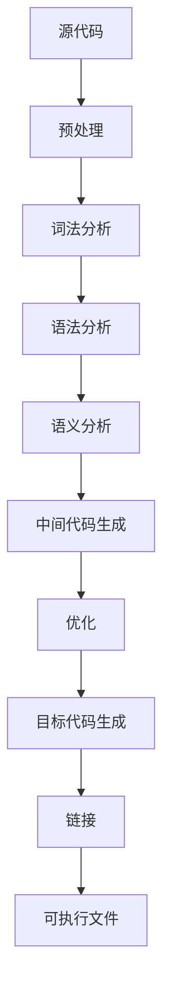

# 开发面试题目

## 一、判断题

### 为使得函数具有可重入性应使用static修饰局部变量？

为使得函数具有可重入性不应使用 `static` 修饰局部变量。相反，应该遵循以下原则：

>   可重入函数的定义

可重入函数可以被多个线程或中断安全地同时调用，而不会导致数据不一致或其他问题。

>   可重入函数的特性

- **不使用全局变量或静态变量**：这些变量可能会在函数执行过程中被其他线程或进程修改。
- **不依赖于不可重入函数**：如 `malloc`、`printf` 等。
- **所有数据都来自参数传入，或位于栈上**：局部变量通常是栈上的，因此是安全的。
- **避免使用不可重入的库函数**：这些函数在多线程环境中可能不安全。

>   如何实现可重入函数

- **使用局部变量**：局部变量存储在栈上，每次函数调用都有自己独立的副本，不会互相干扰。
- **保护全局变量**：如果必须使用全局变量，应通过互斥锁或其他同步机制来保护它们。

使用 `static` 修饰局部变量会使得函数在多次调用间保持状态，这反而可能降低函数的可重入性，增加数据不一致的风险。因此，为了确保函数的可重入性，应避免使用 `static` 修饰局部变量，并遵循上述原则来设计和实现函数。

### 动态申请的内存和非动态申请的内存都是由内存分配器管理的，但是释放非动态申请的内存可能导致拒绝服务，甚至产生更严重的安全事故。

理解题目：题目指出动态与非动态申请的内存都由内存分配器管理，但释放非动态申请的内存（如栈内存、全局/静态内存等）可能引发拒绝服务或更严重的安全问题。

分析原因：非动态申请的内存（例如局部变量、全局变量）的生命周期由编译器自动管理，若手动释放（例如对栈上的地址调用free或delete），会破坏内存分配器的内部数据结构，导致堆损坏、程序崩溃或被利用进行攻击。

结论：必须区分动态与非动态内存，仅对通过malloc、calloc、realloc、new等动态申请的内存使用对应的free或delete释放，避免对非动态内存进行手动释放操作。

代码示例（C++，展示正确与错误做法）：
```cpp
#include <cstdlib>

int main() {
    // 动态申请的内存 - 正确释放
    int* dynamicMemory = (int*)malloc(sizeof(int));
    if (dynamicMemory) {
        free(dynamicMemory); // 正确：释放动态内存
    }

    // 非动态申请的内存（栈上） - 错误做法：切勿释放
    int nonDynamicMemory = 42;
    // int* ptr = &nonDynamicMemory;
    // free(ptr); // 错误：释放非动态内存会导致严重问题

    return 0;
}
```

### 如何区分动态申请和非动态申请的内存？

明确动态与非动态内存的定义：动态内存是通过程序运行时显式申请（如 malloc/new），需手动释放；非动态内存由编译器自动管理（如栈上的局部变量、全局/静态变量）。

区分方式：
- 动态内存：使用 malloc/calloc/realloc（C）、new（C++）申请，需对应 free/delete 释放，地址通常来自堆。
- 非动态内存：包括栈内存（如局部变量）、全局/静态内存（如全局变量、static 变量），其生命周期由作用域或程序决定，无需也不允许手动释放。

判断依据：看内存是否由程序员显式调用动态申请函数获得，若是，则为动态内存；否则一般为非动态内存。

代码示例（C++，展示如何区分）：
```cpp
#include <cstdlib>

int main() {
    // 动态申请的内存（需手动管理）
    int* 动态内存 = new int(10);     // C++ 动态申请
    int* 动态内存2 = (int*)malloc(sizeof(int));  // C 动态申请
    delete 动态内存;                 // 正确释放
    free(动态内存2);                 // 正确释放

    // 非动态申请的内存（自动管理，不可手动释放）
    int 栈变量 = 20;                 // 栈上局部变量
    static int 静态变量 = 30;        // 静态变量
    // int* 错误指针 = &栈变量；
    // delete 错误指针;              // 错误！不可释放非动态内存

    return 0;
}
```

### 如何检测程序中是否存在非动态内存被错误释放的情况？

理解问题：非动态内存（如栈变量、全局/静态变量）的地址被传递给 free 或 delete 进行释放，会导致未定义行为，可能引发程序崩溃或安全漏洞。

检测方法：
- 代码审查：人工检查所有 free/delete 调用，确认其操作对象确实是由 malloc/new 动态申请的。
- 静态分析工具：使用专业工具（如 Clang Static Analyzer、Cppcheck、PVS-Studio）扫描代码，自动检测对非动态内存的错误释放。
- 动态检测工具：在运行时使用 AddressSanitizer（ASan）等内存检测工具，监控非法内存释放行为，精准定位问题代码位置。

推荐实践：结合静态分析与动态检测，同时在编码规范中明确禁止对栈或全局变量等非动态内存进行释放操作。

代码示例（配合 AddressSanitizer 检测）：
```cpp
#include <cstdlib>

int main() {
    int 栈变量 = 42;
    int* 非法指针 = &栈变量；

    // 错误：尝试释放非动态内存（运行时 ASan 会报错）
    // free(非法指针);  // 若启用 ASan，将检测到非法释放

    int* 动态内存 = (int*)malloc(sizeof(int));
    if (动态内存) {
        free(动态内存);  // 正确：释放动态内存
    }

    return 0;
}
```
使用方法：编译时加上 ASan 检测选项，如 gcc/clang 使用 `-fsanitize=address`，运行程序即可自动检测非法释放。

## 二、填空题

### 以下代码段在设计上有什么缺陷

```c
#define NULL ((void *)0)
struct sample {
    int type;
    size_t len;
    unsigned char data[];
};

struct sample *func(int type, unsigned char *msg, size_t length) {
    struct sample *ss = NULL;
    if (msg == NULL) {
        return NULL;
    }
    ss = malloc(sizeof(struct sample) + length);
    if (ss == NULL) {
        return NULL;
    }
    ss->type = type;
    (void) memcpy_s(ss->data, length, msg, length);
    return ss;
}
```

**整数溢出**、**缓冲区溢出**、**未受控的内存分配**

### 计算下题结果

```c
{
    char *ss = "0123456789";
    printf("%llu %llu\n", sizeof(ss), sizeof(*ss));
}
{
    char ss[] = "0123456789";
    printf("%llu %llu\n", sizeof(ss), sizeof(*ss));
}
{
    char q[] = "abc";
    char p[] = "a\n";
    printf("%llu %llu\n", sizeof(q), sizeof(p));
    printf("%llu %llu\n", strlen(q), strlen(p));
}
```

 输出：

```v
```

## 三、简答题

### 关键字 static的作用是什么？

`static` 是编程语言中常用的关键字，其作用因语言和应用场景而异，但核心功能主要围绕**生命周期、作用域和共享性**展开。以下是其在C/C++、Java等语言中的主要作用及典型应用场景：

>   一、核心作用

1.  **改变变量的生命周期**
    -   静态变量在程序启动时分配内存，直到程序结束才释放，与普通局部变量（函数结束时销毁）或动态分配变量（手动释放）不同。
    -   例如：C/C++中静态局部变量在函数调用间保持值不变，Java中静态变量属于类而非实例，程序启动时初始化。
2.  **限制作用域**
    -   **隐藏性**：在C/C++中，修饰全局变量或函数时，限制其仅在当前源文件内可见，避免与其他文件的同名符号冲突。
    -   **类作用域**：Java中静态成员属于类而非对象，可通过类名直接访问。
3.  **共享数据**
    -   静态变量被所有实例共享。例如Java中多个对象共享同一静态变量，修改后所有对象可见；C++中静态成员变量属于类而非单个对象。

>   二、具体应用场景

1. **静态变量**

-   计数器/全局状态：如记录函数调用次数（C/C++）或对象实例数（Java）。
-   配置常量：Java中常用`static final`定义全局常量（如数学常数）。

2. **静态方法**

-   工具类：如Java的`Math.sqrt()`，无需实例化即可调用。
-   工厂方法：通过静态方法创建对象（如`Person.createPerson()`）。
-   限制：不能访问实例成员（非静态变量/方法），无`this`指针。

3. **静态代码块（Java特有）**

-   初始化静态资源：如加载配置文件、数据库连接池，在类加载时执行一次。

4. **静态内部类（Java）**

-   单例模式：通过静态内部类实现线程安全的单例。
-   减少依赖：不依赖外部类实例即可创建。

>   三、语言差异与注意事项

-   **C/C++**：
    -   静态局部变量默认初始化为0，函数内静态变量作用域限于函数但生命周期全局。
    -   静态函数仅当前文件可见，避免命名冲突。
-   **Java**：
    -   静态成员属于类，通过`类名.成员`访问。
    -   静态代码块、变量、方法的执行顺序由代码位置决定。
    -   需注意线程安全问题（如多线程修改静态变量）。

>   四、总结

| 特性             | 作用                    | 典型场景           |
| ---------------- | ----------------------- | ------------------ |
| **延长生命周期** | 变量/数据在程序全程存在 | 计数器、全局配置   |
| **限制作用域**   | 隐藏符号或限定类内访问  | 模块化编程、工具类 |
| **共享数据**     | 类/文件内共享同一数据   | 单例模式、全局状态 |

合理使用`static`可提升代码效率（如减少内存占用）和模块化程度，但过度使用可能破坏封装性（如Java中直接暴露静态变量）。

### 堆和栈的区别是什么？

堆（Heap）和栈（Stack）是计算机内存管理中两种核心的数据存储区域，它们在分配方式、生命周期、效率及使用场景等方面存在显著差异。以下是两者的主要区别及联系：

>   一、核心区别

| **特性**     | **栈（Stack）**                                              | **堆（Heap）**                                               |
| ------------ | ------------------------------------------------------------ | ------------------------------------------------------------ |
| **分配方式** | 由编译器/操作系统自动分配和释放（如局部变量、函数调用信息）。 | 需程序员手动申请（如 `malloc`、`new`）和释放（如 `free`、`delete`）。 |
| **生命周期** | 变量随作用域结束自动销毁（如函数返回时局部变量释放）。       | 需显式释放，否则持续到程序结束或手动释放。                   |
| **内存大小** | 固定且较小（通常几MB），易发生栈溢出。                       | 动态扩展，受系统可用内存限制，可分配更大空间。               |
| **访问速度** | 更快（连续内存、CPU缓存友好）。                              | 较慢（需动态查找内存块，可能产生碎片）。                     |
| **数据结构** | 线性结构，遵循后进先出（LIFO）原则。                         | 树形结构（如二叉堆），支持动态分配。                         |
| **线程安全** | 每个线程有独立栈空间，无需同步。                             | 共享内存，需同步机制避免竞争。                               |
| **内存碎片** | 无（连续分配）。                                             | 可能产生碎片（频繁分配/释放）。                              |
| **生长方向** | 向低地址扩展（高地址→低地址）。                              | 向高地址扩展（低地址→高地址）。                              |

>   二、典型应用场景

1.  **栈**
    -   存储局部变量、函数参数、返回地址等短期数据。
    -   适合递归调用、快速访问的小型数据（如基本类型）。
2.  **堆**
    -   存储动态分配的对象（如数组、类实例）、大型数据结构。
    -   需跨作用域共享或生命周期不确定的数据。

>   三、优缺点对比

| **维度**     | **栈的优点**             | **栈的缺点**       | **堆的优点**     | **堆的缺点**            |
| ------------ | ------------------------ | ------------------ | ---------------- | ----------------------- |
| **管理效率** | 自动管理，无需手动干预。 | 大小固定，易溢出。 | 灵活分配大内存。 | 手动管理易泄漏/野指针。 |
| **性能**     | 高速访问（硬件支持）。   | 不适合存储大数据。 | 支持动态扩展。   | 分配/释放慢，碎片化。   |
| **安全性**   | 线程独立，安全性高。     | —                  | 可共享数据。     | 需同步机制。            |

>   四、总结

-   **选择依据**：优先使用栈处理生命周期短、速度敏感的数据；堆适用于动态、大型或需跨作用域的数据。
-   **注意事项**：堆需谨慎管理内存泄漏，栈需避免溢出（如递归过深）。

### 函数指针和指针函数？函数指针的使用场景有什么？

在C语言中，**函数指针**和**指针函数**是两个容易混淆但完全不同的概念，它们的核心区别在于**本质**和**用途**。以下是详细解析：

==核心区别==

| **特性**     | **指针函数（Pointer Function）**                             | **函数指针（Function Pointer）**                             |
| ------------ | ------------------------------------------------------------ | ------------------------------------------------------------ |
| **本质**     | 是一个函数，返回值类型为指针（如 `int* func()`）。           | 是一个指针变量，指向函数的地址（如 `int (*ptr)(int, int)`）。 |
| **语法**     | `返回类型* 函数名(参数列表)`（如 `int* getArray(int size)`）。 | `返回类型 (*指针名)(参数列表)`（如 `int (*fp)(int, int)`）。 |
| **用途**     | 返回动态分配的内存地址或数据结构的指针（如数组、结构体）。   | 动态调用函数、实现回调机制或策略模式。                       |
| **调用方式** | 直接调用函数，返回值是指针（如 `int* p = func()`）。         | 通过指针调用函数（如 `fp(3, 5)` 或 `(*fp)(3, 5)`）。         |

==函数指针的使用场景==

函数指针的核心价值在于**动态性和灵活性**，常见于以下场景：

>   回调函数（Callback）

将函数指针作为参数传递给其他函数，实现事件处理或异步逻辑。例如标准库

```
qsort
```

中的比较函数：

```
int compare(const void *a, const void *b) { return *(int*)a - *(int*)b; }
qsort(arr, n, sizeof(int), compare);  // 传入函数指针
```

>   动态函数选择

根据条件选择不同的函数执行。例如状态机或策略模式：

```
int (*operation)(int, int) = (condition ? add : subtract);
int result = operation(5, 3);  // 动态调用
```

>   函数指针数组

将多个函数指针存储在数组中，实现批量调用或菜单驱动系统：

```
void (*menu[])() = {func1, func2, func3};
menu[user_choice]();  // 根据用户输入调用对应函数
```

>   面向对象模拟

在C语言中通过函数指针实现多态行为，例如虚函数表（VTable）。

>   库函数扩展

允许用户自定义函数被库函数调用，如排序算法中的自定义比较规则。

==注意事项==

-   **指针函数**需注意返回的指针有效性（如避免返回局部变量地址，应使用`static`或动态内存）。
-   **函数指针**需确保类型匹配（参数和返回值类型必须一致），否则可能导致未定义行为。

==总结==

-   **指针函数**：用于**返回地址**，常见于内存管理和数据结构操作。
-   **函数指针**：用于**动态调用函数**，提升代码灵活性和可扩展性，是高级编程（如回调、多态）的关键工具。

### Const修饰指针在不同部位时的区别是什么？

`const` 修饰指针时，根据其位置不同，含义也不同，主要分为以下三种情况：

> `const` 在 `*` 左侧（修饰指向的数据）

**形式：** `const T* ptr` 或 `T const* ptr`

**含义：** 指针指向的数据是常量，**不可通过该指针修改指向的值**，但**指针本身可以指向其他地址**。

**示例：**

```cpp
int a = 10;
const int* p = &a;// 指向的数据不可修改
// *p = 20; // 错误！不能通过 p 修改 a 的值
int b = 30;
p = &b; // 合法，指针可以指向其他地址
```

>   `const` 在 `*` 右侧（修饰指针本身）

**形式：** `T* const ptr`

**含义：** 指针本身是常量，**指针的指向不可更改**，但**可以通过指针修改指向的数据**。

**示例：**

```cpp
int a = 10;
int* const p = &a;// 指针本身不可修改
*p = 20;// 合法，可以修改 a 的值
// p = nullptr; // 错误！不能改变指针的指向
```

>   `const` 在 `*` 左右都有（数据与指针都不可变）

**形式：** `const T* const ptr` 或 `T const* const ptr`
**含义：** 指针本身不可更改（不能指向其他地址），同时**也不能通过该指针修改指向的数据**。
**示例：**

```cpp
int a = 10;
const int* const p = &a;// 指针和指向的数据都不可修改
// *p = 20; // 错误！不能修改数据
// p = nullptr; // 错误！不能修改指针指向
```

总结（口诀）：

- **const 在 * 左** → **数据不可变**（值不能改，指针可换）
- **const 在 * 右** → **指针不可变**（指向固定，值可改）
- **const 在 * 两边** → **全都不能变**（指针和值都固定）

### 重复释放内存会造成什么影响？

在C语言中，**重复释放内存（Double Free）**是一种严重的内存管理错误，指对同一块动态分配的内存多次调用`free()`函数。这种行为会导致程序出现不可预测的后果，甚至可能被恶意利用。以下是其具体影响及技术原理：

>   核心危害

1.  **程序崩溃或异常终止**
    -   重复释放会破坏堆（Heap）的内存管理数据结构（如空闲链表或位图），导致内存管理器无法正常运作，触发段错误（Segmentation Fault）或断言失败（Assertion Failed）。
2.  **堆内存破坏（Heap Corruption）**
    -   现代内存管理器（如glibc的`ptmalloc`）会在释放内存时检查特定模式（如头部/尾部标记）。二次释放可能破坏这些标记，引发后续`malloc/free`操作的连锁错误。
3.  **安全漏洞风险**
    -   攻击者可利用重复释放构造**Use-After-Free**或**堆喷射（Heap Spraying）**攻击，通过精心控制内存布局执行任意代码（如浏览器漏洞利用）。
4.  **不可预测的行为**
    -   不同环境（如操作系统、编译器版本）下表现可能不同，例如：某些系统可能直接崩溃，而另一些可能暂时运行但后续出现数据损坏。

>   技术原理分析

1.  **堆管理器的内部机制**
    -   动态内存分配器（如malloc/free）依赖元数据（如块大小、空闲状态）管理堆内存。重复释放会导致元数据不一致，例如：
        -   同一内存块被标记为“空闲”两次，可能被错误地合并或分配给其他请求。
2.  **悬空指针（Dangling Pointer）问题**
    -   首次释放后，指针仍保留原内存地址（悬空指针）。二次释放时，若该内存已被重新分配，可能错误释放其他数据。
3.  **调试困难**
    -   重复释放的错误可能在释放点之后很久才显现（如后续内存操作触发崩溃），难以通过常规调试工具定位。

>   典型场景与示例

**直接重复释放**

```
int *p = malloc(sizeof(int));
free(p);
free(p);  // 错误：二次释放
```

**指针别名导致的重复释放**

```
int *p1 = malloc(sizeof(int));
int *p2 = p1;  // p1和p2指向同一内存
free(p1);
free(p2);      // 错误：通过别名二次释放[2](@ref)[5](@ref)
```

**函数嵌套释放**

```
void free_mem(int *ptr) { free(ptr); }

int main() {
    int *p = malloc(sizeof(int));
    free_mem(p);
    free(p);  // 错误：函数内外重复释放
}
```

>   预防与解决方案

**释放后置空指针**

```
free(p);
p = NULL;  // 后续free(NULL)是安全的
```

**使用智能指针（C++）或RAII模式**

如`std::unique_ptr`或`std::shared_ptr`自动管理生命周期（C++中适用）。

**静态分析工具**

使用Valgrind、Coverity等工具检测重复释放和内存泄漏。

**代码规范与审查**

明确指针所有权，避免多个指针指向同一内存。

**自定义内存池**

减少直接调用`malloc/free`，通过内存池统一管理分配/释放。

>   总结

重复释放内存的后果从程序崩溃到安全漏洞不等，其根本原因在于破坏了堆管理器的内部一致性。通过规范编程习惯、工具辅助和设计模式（如RAII），可有效规避此类问题。

### 整数溢出会造成什么影响？

在C/C++语言中，整数溢出（Integer Overflow）是指整数运算的结果超出了该数据类型所能表示的范围，导致结果异常或未定义行为。其影响因数据类型（有符号/无符号）和上下文环境而异，可能引发逻辑错误、安全漏洞甚至程序崩溃。以下是具体影响及案例分析：

>   有符号整数溢出的影响

有符号整数（如`int`、`short`）的溢出属于**未定义行为（Undefined Behavior, UB）**，具体表现因编译器和平台而异，常见后果包括：

**回绕（Wrap-around）**

 大多数现代编译器采用补码表示有符号整数，溢出后可能回绕到最小值。例如：

```c
int a = INT_MAX;  // 2147483647 (32位)
a += 1;           // 溢出后可能变为 -2147483648
```

这种回绕可能导致逻辑错误，如正数相加结果为负数。

**编译器优化导致的意外行为**

未定义行为允许编译器进行激进优化，可能删除溢出检查代码或引发不可预测的崩溃。

**安全漏洞**

缓冲区溢出：若溢出值用于内存分配或数组索引，可能触发越界访问。例如：

```c
int len = INT_MAX + 1;  // 可能变为负数
char *buf = malloc(len); // 分配极小或无效内存
```

绕过安全检查：攻击者可利用溢出绕过条件判断（如`if (len < MAX_LEN)`）。

>   无符号整数溢出的影响

无符号整数（如`unsigned int`）的溢出是**定义良好行为**，结果会按模运算回绕：

```c
unsigned char x = 255;  // 0xFF
x += 1;                // 结果为 0 (256 mod 256)
```

尽管行为明确，但仍可能导致以下问题：

1.  **逻辑错误**
    -   循环条件失效：如`for (unsigned i = 10; i >= 0; i--)`会因回绕变为无限循环。
    -   计算错误：如`malloc(len + 10)`中若`len`接近`UINT_MAX`，回绕后分配过小内存。
2.  **安全风险**
    -   内存分配不足：如`size_t len = UINT_MAX; buf = malloc(len + 1);`实际分配0字节。
    -   数据截断：大数被截断后可能用于越界操作。

>   典型危害场景

**缓冲区溢出**

-   整数溢出可能导致`memcpy`、`strncpy`等函数复制超量数据，覆盖相邻内存。

-   示例：

    ```
    int len = -1;  // 转换为size_t后变为极大值
    memcpy(dest, src, len);  // 触发缓冲区溢出[3](@ref)
    ```

**死循环或逻辑失效**

-   溢出导致循环条件永远满足（如`while (len < MAX_LEN)`中`len`溢出）。

**算术运算错误**

-   乘法溢出：如`int a = 100000; int b = a * a;`可能得到负数。
-   位移溢出：左移超过位数导致未定义行为。

>   解决方案与最佳实践

1.  **选择合适的数据类型**
    -   使用`long long`或`uint64_t`等更大范围的类型。
2.  **显式检查溢出**
    -   加法检查：`if (b > 0 && a > INT_MAX - b) { /* 溢出处理 */ }`
    -   乘法检查：`if (a > 0 && b > 0 && a > INT_MAX / b) { /* 溢出处理 */ }`
3.  **使用安全库函数**
    -   GCC的`__builtin_add_overflow`或Boost库的`cpp_int`（支持任意精度整数）。
4.  **编译器警告与静态分析**
    -   启用`-Woverflow`等编译选项检测潜在溢出。

>   总结

| **类型**       | **行为**               | **主要影响**             | **典型案例**         |
| -------------- | ---------------------- | ------------------------ | -------------------- |
| **有符号整数** | 未定义行为（可能回绕） | 逻辑错误、安全漏洞、崩溃 | 缓冲区溢出、算术错误 |
| **无符号整数** | 定义良好（模运算回绕） | 逻辑失效、内存分配错误   | 死循环、截断         |

**建议**：在安全关键代码中优先使用无符号类型（明确行为），并通过静态分析和运行时检查规避风险。

### Linux 使用 chmod 750 /home/test，请问750分别代表什么意思？

在Linux中，`chmod 750 /home/test`命令用于设置目录`/home/test`的权限，其中数字`750`分别代表不同用户群体的权限组合。具体含义如下：

>   权限数字分解

`750`是一个三位八进制数，每位对应不同的用户角色，权限通过数字相加（读`r=4`、写`w=2`、执行`x=1`）计算得出：

1.  第一位 `7`：文件/目录**所有者（User）**的权限，`7 = 4 (r) + 2 (w) + 1 (x)`，即所有者拥有**读、写、执行**权限（`rwx`）。
2.  第二位 `5`：与所有者同组的**组用户（Group）**的权限，`5 = 4 (r) + 1 (x)`，即组用户拥有**读和执行**权限（`r-x`），但**不可写**。
3.  第三位 `0`：**其他用户（Other）**的权限，`0`表示**无任何权限**（`---`），即其他用户无法访问该目录。

>   权限的实际效果

**对于目录`/home/test`**：

-   **所有者**：可进入目录（`x`）、查看内容（`r`）、创建/删除文件（`w`）。
-   **组用户**：可进入目录（`x`）和查看内容（`r`），但无法修改目录内文件（无`w`）。
-   **其他用户**：无法进入目录或查看内容（无任何权限）。

**与文件的区别**：目录的执行权限（`x`）表示“可进入”，而文件的执行权限表示“可运行”。因此，目录必须设置`x`权限才能被访问。

>   典型应用场景

**安全隔离**：适用于需要限制非授权用户访问的场景（如数据库目录`/opt/mysql/data`），仅允许所有者完全控制，组用户只读，其他用户无权访问。

1.  **团队协作**：若目录由特定组（如开发团队）共享，组用户可查看但不可修改，避免误操作。
2.  **递归设置需谨慎**：使用`-R`递归时，需注意文件是否需要执行权限（如配置文件通常无需`x`），建议分开处理目录和文件权限。

>   符号模式对照

`750`等效于符号模式：

```
chmod u=rwx,g=rx,o= /home/test
```

-   `u=rwx`：所有者赋权`rwx`
-   `g=rx`：组用户赋权`r-x`
-   `o=`：其他用户无权限

>   总结

`chmod 750`是一种**平衡安全与协作**的权限设置，适合需要严格控制访问但允许部分用户查看的场景。实际使用时需结合具体需求调整，避免过度开放（如`777`）或过度限制（如`700`）。

### 什么是线程安全？通过哪些方式可以实现线程安全？你所了解的线程安全函数有哪些？

>   一、线程安全的定义

**线程安全（Thread Safety）** 是指在多线程环境下，当多个线程并发访问共享资源（如变量、数据结构、文件等）时，程序能够保证数据的正确性和一致性，不会因线程调度的不确定性导致数据污染、竞态条件（Race Condition）或程序崩溃。核心要求包括：

1.  **原子性**：操作不可分割，要么全部执行，要么完全不执行（如`AtomicInteger`的CAS操作）。
2.  **可见性**：线程对共享数据的修改对其他线程立即可见（通过`volatile`或锁机制实现）。
3.  **有序性**：禁止指令重排序优化，确保操作按预期顺序执行（遵循happens-before规则）。

>   二、C/C++中实现线程安全的方式

1、**同步机制**

-   互斥锁（Mutex）：如`std::mutex`或`pthread_mutex_t`，确保同一时间只有一个线程访问临界区。

-   读写锁（Read-Write Lock）：允许多线程并发读，写操作独占资源（如`pthread_rwlock_t`）。

2、**原子操作**

使用`std::atomic`或编译器内置原子指令（如`__atomic_fetch_add`），避免锁开销。

```
std::atomic<int> counter(0);
counter.fetch_add(1, std::memory_order_relaxed);
```

3、**线程局部存储（Thread Local Storage, TLS）**

通过thread_local或pthread_key_t为每个线程创建独立变量副本。

```
thread_local int thread_specific_var;
```

4、**不可变对象（Immutable Objects）**

对象创建后状态不可修改（如`const`修饰的变量或纯函数）。

5.、**条件变量（Condition Variable）**

配合互斥锁实现线程间同步（如`std::condition_variable`）。

>   常见的线程安全函数与类

1.  **C标准库**
    -   部分函数如`strtok`是非线程安全的，需使用`strtok_r`（带重入版本）。
    -   线程安全函数通常以`_r`后缀标识（如`asctime_r`）。
2.  **C++标准库**
    -   **容器**：`std::vector`等非线程安全，需手动加锁；`ConcurrentHashMap`（第三方库）为线程安全。
    -   **原子类**：`std::atomic<int>`、`std::atomic_flag`。
3.  **操作系统API**
    -   POSIX线程库中的`pthread_mutex_lock`、`pthread_cond_wait`等。

>   线程安全与性能权衡

-   **优点**：保证数据一致性，减少竞态条件风险。

-   **缺点**：同步机制可能降低性能（锁竞争、上下文切换）。

-   最佳实践：优先使用原子操作或无锁数据结构（如无锁队列）。
-   缩小锁粒度（仅保护必要代码段）。

>   总结

| 方法         | 适用场景                     | 示例                            |
| ------------ | ---------------------------- | ------------------------------- |
| 互斥锁       | 高频写操作或复杂临界区       | `std::mutex`、`pthread_mutex_t` |
| 原子操作     | 简单变量操作（如计数器）     | `std::atomic<int>`              |
| 不可变对象   | 只读数据或配置信息           | `const`修饰的全局变量           |
| 线程局部存储 | 线程独立状态（如日志上下文） | `thread_local`                  |

在C/C++中，线程安全的实现需结合具体场景选择策略，并通过工具（如Valgrind、TSan）检测潜在问题。

### 进程间通讯的方式有哪些？

进程间通信（IPC，InterProcess Communication）是操作系统中的重要机制，用于不同进程之间的数据交换和同步。以下是常见的进程间通信方式及其特点：

>   管道（Pipe）

-   **匿名管道**：用于具有亲缘关系的进程（如父子进程）之间的通信，数据单向流动。
-   **命名管道（FIFO）**：允许无亲缘关系的进程通过文件系统中的命名管道文件进行通信。
-   **特点**：半双工通信，数据以字节流形式传输，适用于小规模数据交换。

>   消息队列（Message Queue）

-   进程通过发送和接收格式化的消息进行通信，消息包含消息头和消息体。
-   支持直接通信（指定接收进程ID）和间接通信（通过信箱）。
-   **优点**：解耦性强，支持异步通信，可用于分布式系统。
-   **缺点**：系统复杂性增加，性能开销较大。

>   共享内存（Shared Memory）

-   多个进程映射同一块物理内存，实现高效数据共享。
-   **特点**：最快的IPC方式，但需手动管理同步（如信号量）。
-   **适用场景**：高性能计算、实时数据处理。

>   信号量（Semaphore）

-   用于进程同步和互斥，控制对共享资源的访问。
-   **P/V操作**：P（等待）减少信号量，V（释放）增加信号量。
-   **类型**：二进制信号量（0或1）和计数信号量（多值）。

>   信号（Signal）

-   用于通知进程某个事件已发生（如中断、异常）。
-   **特点**：轻量级，但信息量有限，主要用于进程控制。

>   套接字（Socket）

-   支持不同主机间的进程通信，基于TCP/UDP协议。
-   **适用场景**：网络通信、分布式系统。

>   文件读写

-   进程通过读写同一文件进行数据交换。
-   **特点**：简单易用，但效率较低，适合小规模数据共享。

>   其他方式

-   **阻塞队列**：用于线程间通信，控制资源访问。
-   **循环栅栏/计数屏障**：协调多个线程的同步执行。

>   总结

不同的IPC方式适用于不同场景：

-   **高性能需求**：共享内存。
-   **解耦与异步**：消息队列。
-   **同步控制**：信号量。
-   **简单通信**：管道或文件。

### 编译过程分那几个步骤？分别都做了那些事情？

编译过程是将高级语言源代码转换为可执行目标代码的过程，通常分为多个阶段，每个阶段完成特定的任务。以下是编译过程的主要步骤及其功能：

>   预处理（Preprocessing）

-   **任务**：处理源代码中的预处理指令（如`#include`、`#define`、`#ifdef`等）。

-   具体操作：

    -   展开宏定义（宏替换）。
    -   包含头文件（将`#include`的文件内容插入到源文件中）。
    -   条件编译（根据条件选择性地编译代码块）。

-   **输出**：生成一个经过预处理的源代码文件（通常以`.i`或`.ii`为扩展名）。

>   词法分析（Lexical Analysis）

-   **任务**：将源代码的字符流转换为有意义的词法单元（Token）序列。

-   具体操作：

    -   识别关键字（如`int`、`if`）、标识符（如变量名）、运算符（如`+`、`=`）、常量等。
    -   过滤空格、注释等无关字符。

-   **输出**：Token流（如`<KEYWORD, "int">, <ID, "a">`）。

>   语法分析（Syntax Analysis）

-   **任务**：根据语言的语法规则，将Token序列组织成语法结构（如表达式、语句）。

-   具体操作：

    -   构建抽象语法树（AST，Abstract Syntax Tree），表示程序的层次结构。
    -   检查语法错误（如缺少分号、括号不匹配）。

-   **输出**：AST（例如，`a = 10 + 5`对应的树状结构）。

>   语义分析（Semantic Analysis）

-   **任务**：检查程序的语义正确性（如类型匹配、变量声明）。

-   具体操作：

    -   类型检查（如`int a = "hello";`会报错）。
    -   作用域分析（变量是否在有效范围内使用）。
    -   填充符号表（记录变量、函数等的信息）。

-   **输出**：带有语义信息的AST和符号表。

>   中间代码生成（Intermediate Code Generation）

-   **任务**：将AST转换为与机器无关的中间表示（IR）。

-   具体操作：

    -   生成三地址码、四元式等低级表示（如`t1 = 10 + 5; a = t1`）。

-   **输出**：中间代码（便于后续优化和跨平台移植）。

>   代码优化（Code Optimization）

-   **任务**：对中间代码进行优化，提高程序效率或减少代码体积。

-   具体操作：

    -   常量折叠（如`10 + 5`直接替换为`15`）。
    -   死代码消除（删除未使用的变量或函数）。
    -   循环优化（减少循环内的冗余计算）。

-   **输出**：优化后的中间代码。

>   目标代码生成（Target Code Generation）

-   **任务**：将优化后的中间代码转换为目标机器的机器码或汇编代码。

-   具体操作：

    -   指令选择（选择适合的机器指令）。
    -   寄存器分配（优化寄存器使用）。
    -   生成目标文件（如`.o`、`.obj`）。

-   **输出**：目标代码（特定平台的二进制指令）。

>   链接（Linking）

-   **任务**：将多个目标文件和库合并为可执行文件。

-   具体操作：

    -   解析符号引用（如函数调用）。
    -   地址重定位（调整代码和数据的绝对地址）。
    -   链接静态库或动态库。

-   **输出**：可执行文件（如`.exe`、`.out`）。

>   总结

编译过程的核心阶段可分为**前端**（词法分析、语法分析、语义分析、中间代码生成）和**后端**（优化、目标代码生成、链接）。前端关注源代码的解析和语义验证，后端关注机器相关的代码生成和优化。

**流程图示例**：



### 什么是内存泄露？通常采用哪些方法来避免和减少这类错误？

#### 什么是内存泄露？

**内存泄露（Memory Leak）** 是指程序在运行过程中动态分配的内存（如使用 `malloc`、`new` 等）未被正确释放，导致这部分内存无法被系统回收，从而造成可用内存逐渐减少的现象。

##### 核心特征

1.  **动态分配的内存未被释放**：程序通过 `malloc`/`new` 申请内存后，未调用 `free`/`delete` 释放。
2.  **程序失去对内存的控制**：指针丢失、引用未清除，导致无法访问或释放该内存。
3.  **长期运行后系统资源耗尽**：如服务器、嵌入式设备等长时间运行的程序，内存泄露会累积直至崩溃。

##### 常见原因

-   **忘记释放内存**：如 `malloc` 后未 `free`，或 `new` 后未 `delete`。
-   **指针覆盖或丢失**：指针被重新赋值，导致原内存地址无法访问。
-   **循环引用**：对象相互引用，垃圾回收机制（如 Java 的 GC）无法回收。
-   **资源未关闭**：文件句柄、数据库连接等未释放，间接导致内存泄露。

#### 如何避免和减少内存泄露？

##### 遵循内存管理规范

-   C/C++：确保每次malloc/new都有对应的free/delete，并在释放后将指针置为NULL 。

-   Java/Python：虽然自动垃圾回收（GC）可管理内存，但仍需避免无效对象引用（如静态集合长期持有对象）。

##### 使用智能工具

-   智能指针（C++）：如std::unique_ptr、std::shared_ptr，自动释放内存 。

-   内存分析工具：

    -   **C/C++**：Valgrind、Dr. Memory。
    -   **Java**：VisualVM、MAT（Memory Analyzer Tool）。

##### 优化编程习惯

-   **避免全局变量和静态集合**：长期持有的引用会阻止垃圾回收。
-   **及时释放资源**：文件、数据库连接等使用后立即关闭（如 Java 的 `try-with-resources`）。
-   **使用弱引用（Weak Reference）**：如 Java 的 `WeakHashMap`，避免循环引用。

##### 设计模式与架构优化

-   **RAII（资源获取即初始化）**：C++ 中通过对象生命周期管理资源（如文件句柄在析构时自动关闭）。
-   **对象池技术**：复用大对象减少频繁分配/释放。
-   **Arena 内存池**：统一分配和释放内存（如 LevelDB 的实现）。

##### 测试与监控

-   **压力测试**：长时间运行程序，观察内存增长趋势。
-   **代码审查**：检查动态内存分配和释放的匹配性。

#### 总结

| 方法                    | 适用场景     | 示例                        |
| ----------------------- | ------------ | --------------------------- |
| 手动管理（C/C++）       | 需高性能控制 | `malloc/free`、`new/delete` |
| 智能指针（C++）         | 简化内存管理 | `std::shared_ptr`           |
| 垃圾回收（Java/Python） | 自动内存管理 | 避免循环引用                |
| 工具检测                | 排查泄露点   | Valgrind、MAT               |

内存泄露的防范需结合语言特性、工具辅助和编程规范，尤其在长期运行的系统（如服务器、嵌入式设备）中需严格监控。

### C/C++中定义的局部变量能不能很大，比如1MB/2MB？为什么？

在C/C++中，**局部变量不能直接定义很大的内存空间（如1MB/2MB）**，主要原因与栈内存的分配机制和限制有关。以下是具体分析：

>   局部变量的存储位置与限制

**栈内存的默认大小有限**

局部变量存储在栈（Stack）中，而栈的大小由操作系统和编译器预先设定，通常较小：

-   **Windows系统**：默认栈大小为1MB或2MB。
-   **Linux系统**：默认栈大小为8MB。

若定义的局部变量超过栈剩余空间（如声明`int arr[256000]`，约1MB），会导致栈溢出（Stack Overflow）。

**栈的动态分配与静态限制**

-   栈空间是连续的，且分配和释放由编译器自动管理。
-   栈的容量在编译时确定，无法动态扩展（除非修改链接器或系统配置）。

>   为什么全局变量可以定义大数组？

全局变量存储在**静态区（数据段）**，其空间仅受系统可用虚拟内存限制（通常远大于栈），因此可以定义大数组（如`int arr[10000000]`）而不会溢出。

>   解决方案：如何安全使用大内存？

若需在函数内使用大内存，应避免直接定义局部大数组，改用以下方法：

**动态分配堆内存**

使用`malloc`/`new`或容器（如`std::vector`），堆（Heap）空间仅受系统内存限制。

```c++
void func() {
    int* bigArray = new int[1000000]; // 堆上分配
    delete[] bigArray; // 手动释放
}
```

**调整栈大小（不推荐）**

可通过编译器选项（如Windows的`/STACK`或Linux的`ulimit -s`）增大栈空间，但可能引发其他问题（如递归调用深度增加导致溢出）。

**使用静态局部变量**

静态局部变量存储在全局区，但需注意其生命周期和线程安全问题。

```c++
void func() {
    static int bigArray[1000000]; // 全局区分配
}
```

>   关键区别总结

| 特性     | 局部变量（栈） | 全局变量/动态分配（堆/静态区）              |
| -------- | -------------- | ------------------------------------------- |
| 空间限制 | 小（1MB~8MB）  | 大（仅受系统内存限制）                      |
| 分配方式 | 自动分配/释放  | 手动分配/释放（堆）或程序生命周期（静态区） |
| 适用场景 | 小型临时数据   | 大型或长期存在的数据                        |

### 请比较sizeof和strlen，说出至少3点不同。

`sizeof` 和 `strlen` 是 C/C++ 中用于获取数据大小的两个不同工具，它们在用途、行为和实现上有显著差异。以下是至少 **3 点主要区别**：

>   本质不同：运算符 vs 函数

`sizeof`是编译时运算符，用于计算变量或数据类型在内存中占用的字节数，其结果在编译时确定 。

**`strlen`** 是 **运行时库函数**（需包含 `<string.h>`），用于计算以 `\0` 结尾的字符串的实际字符数（不包括 `\0`），需遍历字符串直到遇到 `\0`。

>   计算对象与范围

`sizeof`

-   适用于**任何数据类型或变量**（如数组、结构体、指针等）。
-   计算的是 **内存占用总大小**，包括字符串末尾的 `\0`（如果是字符数组）。

```c
char str[] = "Hello";
sizeof(str);  // 返回 6（5 字符 + 1 个 '\0'）
```

`strlen`

-   **仅适用于以 `\0` 结尾的字符串**（`char*` 或字符数组）。
-   返回 **有效字符数**，忽略 `\0`，若字符串未以 `\0` 结尾，可能导致越界访问或未定义行为。

```c
strlen("Hello");  // 返回 5
```

>   参数处理与退化行为

`sizeof`

-   **数组不退化为指针**：直接传入数组名时，计算整个数组的大小（如 `sizeof(arr)` 返回数组总字节数）。
-   可接受 **类型或变量** 作为参数（如 `sizeof(int)` 或 `sizeof(a)`）。

`strlen`

-   **数组退化为指针**：传入数组名时，实际按指针处理，仅计算从该地址开始的字符数。
-   **必须传入字符串指针**，且要求字符串以 `\0` 结尾。

>   其他关键区别

-   **编译时 vs. 运行时**：`sizeof` 在编译时计算，`strlen` 在运行时遍历字符串。
-   **安全性**：`strlen` 可能因未终止的字符串导致越界，而 `sizeof` 无此风险。

示例对比

```
#include <stdio.h>
#include <string.h>
int main() {
    char str[] = "Hello";
    printf("sizeof: %zu\n", sizeof(str));  // 输出 6（包含 '\0'）
    printf("strlen: %zu\n", strlen(str));  // 输出 5（仅字符）
    return 0;
}
```

**总结**：`sizeof` 关注内存占用，`strlen` 关注字符串长度，两者不可互换，需根据场景选择。

### c/c++不能做switch()参数类型的有哪些？

在C/C++中，`switch()`语句对参数类型有严格限制，以下是**不能作为`switch()`参数的类型**及其原因：

>   浮点类型（float、double、long double）

原因：浮点数在计算机中存储为近似值，存在精度误差（如3.14可能与3.1400001不相等），无法精确匹配case标签的常量值，编译器直接禁止。

```
float f = 3.14f;
switch (f) { ... } // 编译错误：表达式类型无效
```

>   字符串类型（C风格字符串、std::string）

原因：字符串本质是字符数组或指针，比较需遍历内容而非地址，且case标签要求编译时常量（字符串字面量除外）。

```
std::string str = "hello";
switch (str) { ... } // 编译错误
```

>   布尔类型（bool）

原因：尽管布尔值可隐式转换为int（true=1，false=0 ），但C++标准明确禁止直接使用bool 类型 。

```
bool b = true;
switch (b) { ... } // 编译错误
```

>   指针类型（非整型指针）

原因：指针比较的是内存地址而非值，且case标签需为整型常量。部分编译器可能允许`char *`，但不符合标准 。

```
int* ptr = nullptr;
switch (ptr) { ... } // 编译错误
```

>   自定义类型（结构体、类、联合体）

原因：非枚举的自定义类型无法隐式转换为整型，且缺乏编译时可确定的常量值。

```c
struct Point { int x, y; };
Point p = {1, 2};
switch (p) { ... } // 编译错误
```

>   例外说明

-   **枚举类型（enum）**：允许使用，因为枚举值本质是整型常量。
-   **强类型枚举（enum class）**：需手动转换为整型后才能使用。

>   允许的类型总结

| **有效类型**            | **示例**                         |
| ----------------------- | -------------------------------- |
| 整型（`int`、`char`等） | `switch(a)`（`a`为`int`）        |
| 枚举（`enum`）          | `switch(color)`（`color`为枚举） |

**注意**：不同编译器可能对某些边缘类型（如`bool`）有扩展支持，但依赖此类特性会降低代码可移植性。
