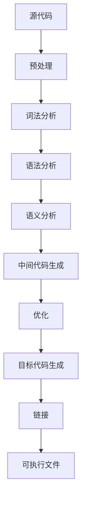

# 开发面试题目

## 一、判断题

### 为使得函数具有可重入性应使用static修饰局部变量？

为使得函数具有可重入性不应使用 `static` 修饰局部变量。相反，应该遵循以下原则：

> **可重入函数的定义**

可重入函数可以被多个线程或中断安全地同时调用，而不会导致数据不一致或其他问题。

> **可重入函数的特性**

- **不使用全局变量或静态变量**：这些变量可能会在函数执行过程中被其他线程或进程修改。
- **不依赖于不可重入函数**：如 `malloc`、`printf` 等。
- **所有数据都来自参数传入，或位于栈上**：局部变量通常是栈上的，因此是安全的。
- **避免使用不可重入的库函数**：这些函数在多线程环境中可能不安全。

> **如何实现可重入函数**

- **使用局部变量**：局部变量存储在栈上，每次函数调用都有自己独立的副本，不会互相干扰。
- **保护全局变量**：如果必须使用全局变量，应通过互斥锁或其他同步机制来保护它们。

使用 `static` 修饰局部变量会使得函数在多次调用间保持状态，这反而可能降低函数的可重入性，增加数据不一致的风险。因此，为了确保函数的可重入性，应避免使用 `static` 修饰局部变量，并遵循上述原则来设计和实现函数。

### 动态申请的内存和非动态申请的内存都是由内存分配器管理的，但是释放非动态申请的内存可能导致拒绝服务，甚至产生更严重的安全事故。

理解题目：题目指出动态与非动态申请的内存都由内存分配器管理，但释放非动态申请的内存（如栈内存、全局/静态内存等）可能引发拒绝服务或更严重的安全问题。

分析原因：非动态申请的内存（例如局部变量、全局变量）的生命周期由编译器自动管理，若手动释放（例如对栈上的地址调用free），会破坏内存分配器的内部数据结构，导致堆损坏、程序崩溃或被利用进行攻击。

结论：必须区分动态与非动态内存，仅对通过malloc、calloc、realloc等动态申请的内存使用free释放，避免对非动态内存进行手动释放操作。

```c
#include <stdlib.h>

int main() {
    // 动态申请的内存 - 正确释放
    int *dynamicMemory = (int *)malloc(sizeof(int));
    if (dynamicMemory) {
        free(dynamicMemory);  // 正确：释放动态内存
    }

    // 非动态申请的内存（栈上） - 错误做法：切勿释放
    int stackVar = 42;
    int *ptr = &stackVar;
    // free(ptr);  // 错误：释放非动态内存会导致严重问题

    return 0;
}
```

### 如何区分动态申请和非动态申请的内存？

明确动态与非动态内存的定义：动态内存是通过程序运行时显式申请（如 malloc/new），需手动释放；非动态内存由编译器自动管理（如栈上的局部变量、全局/静态变量）。

区分方式：
- **动态内存**：使用 malloc/calloc/realloc（C）、new（C++）申请，需对应 free/delete 释放，地址通常来自堆。
- **非动态内存**：包括栈内存（如局部变量）、全局/静态内存（如全局变量、static 变量），其生命周期由作用域或程序决定，无需也不允许手动释放。

```c
#include <stdlib.h>

int main() {
    // 动态申请的内存（需手动管理）
    int *heapVar = (int *)malloc(sizeof(int));  // 堆上分配
    int *heapArray = (int *)calloc(10, sizeof(int));  // 堆上分配
    free(heapVar);   // 正确释放
    free(heapArray);  // 正确释放

    // 非动态申请的内存（自动管理，不可手动释放）
    int stackVar = 20;           // 栈上局部变量
    static int staticVar = 30;   // 静态变量
    // free(&stackVar);  // 错误！不可释放非动态内存

    return 0;
}
```

### 如何检测程序中是否存在非动态内存被错误释放的情况？

理解问题：非动态内存（如栈变量、全局/静态变量）的地址被传递给 free 进行释放，会导致未定义行为，可能引发程序崩溃或安全漏洞。

检测方法：
- **代码审查**：人工检查所有 free 调用，确认其操作对象确实是由 malloc 动态申请的。
- **静态分析工具**：使用专业工具（如 Clang Static Analyzer、Cppcheck、PVS-Studio）扫描代码，自动检测对非动态内存的错误释放。
- **动态检测工具**：在运行时使用 AddressSanitizer（ASan）等内存检测工具，监控非法内存释放行为，精准定位问题代码位置。

```c
#include <stdlib.h>

int main() {
    int stackVar = 42;
    int *illegalPtr = &stackVar;

    // 错误：尝试释放非动态内存（运行时 ASan 会报错）
    // free(illegalPtr);  // 若启用 ASan，将检测到非法释放

    int *validPtr = (int *)malloc(sizeof(int));
    if (validPtr) {
        free(validPtr);  // 正确：释放动态内存
    }

    return 0;
}
```

使用方法：编译时加上 ASan 检测选项，如 `gcc -fsanitize=address -o program program.c`，运行程序即可自动检测非法释放。

## 二、填空题

### 以下代码段在设计上有什么缺陷

```c
#define NULL ((void *)0)

struct sample {
    int type;
    size_t len;
    unsigned char data[];
};

struct sample *func(int type, unsigned char *msg, size_t length) {
    struct sample *ss = NULL;
    if (msg == NULL) {
        return NULL;
    }
    ss = malloc(sizeof(struct sample) + length);
    if (ss == NULL) {
        return NULL;
    }
    ss->type = type;
    (void)memcpy_s(ss->data, length, msg, length);
    return ss;
}
```

**缺陷分析**：

1. **整数溢出**：如果 `length` 极大，`sizeof(struct sample) + length` 可能发生整数溢出，导致分配过小的内存。

2. **缓冲区溢出**：`memcpy_s(ss->data, length, msg, length)` 中，如果 `msg` 实际长度小于 `length`，会导致未定义行为。

3. **未受控的内存分配**：没有对 `length` 进行上限检查，可能导致分配过大内存耗尽系统资源。

**改进方案**：

```c
#define MAX_MSG_LEN (1024 * 1024)  // 1MB上限

struct sample *func(int type, unsigned char *msg, size_t length) {
    if (msg == NULL || length == 0 || length > MAX_MSG_LEN) {
        return NULL;
    }

    struct sample *ss = malloc(sizeof(struct sample) + length);
    if (ss == NULL) {
        return NULL;
    }
    ss->type = type;
    ss->len = length;
    memcpy(ss->data, msg, length);
    return ss;
}
```

### 计算下题结果

```c
// 题目1
{
    char *ss = "0123456789";
    printf("%zu %zu\n", sizeof(ss), sizeof(*ss));
    // 输出: 8 1 (64位系统) 或 4 1 (32位系统)
    // sizeof(ss) = 指针大小
    // sizeof(*ss) = char大小 = 1
}

// 题目2
{
    char ss[] = "0123456789";
    printf("%zu %zu\n", sizeof(ss), sizeof(*ss));
    // 输出: 11 1
    // sizeof(ss) = 数组总大小 = 11 (10字符 + 1个\0)
    // sizeof(*ss) = char大小 = 1
}

// 题目3
{
    char q[] = "abc";
    char p[] = "a\n";
    printf("%zu %zu\n", sizeof(q), sizeof(p));
    // sizeof(q) = 4 (3字符 + 1个\0)
    // sizeof(p) = 3 (1字符 + 1个换行符 + 1个\0)
    printf("%zu %zu\n", strlen(q), strlen(p));
    // strlen(q) = 3 (有效字符数)
    // strlen(p) = 2 (换行符算一个字符)
}
```

**完整输出**：
```
8 1      (或4 1，取决于系统位数)
11 1
4 3
3 2
```

## 三、简答题

### 关键字static的作用是什么？

`static` 是C/C++中常用的关键字，其核心功能主要围绕**生命周期、作用域和共享性**展开。以下是其在C语言中的主要作用及典型应用场景：

> **一、核心作用**

1. **改变变量的生命周期**
   - 静态变量在程序启动时分配内存，直到程序结束才释放，与普通局部变量（函数结束时销毁）或动态分配变量（手动释放）不同。

2. **限制作用域**
   - **隐藏性**：修饰全局变量或函数时，限制其仅在当前源文件内可见，避免与其他文件的同名符号冲突。

3. **共享数据**
   - 静态变量被所有函数共享。例如函数调用计数器，静态局部变量在函数调用间保持值不变。

> **二、具体应用场景**

| 场景 | 说明 | 示例 |
|------|------|------|
| 函数调用计数器 | 静态局部变量记录调用次数 | `static int count = 0; count++;` |
| 单例模式 | 静态局部变量实现线程安全的单例 | `static T *instance = NULL;` |
| 模块内全局变量 | 限制仅当前文件访问 | `static int module_var;` |
| 模块内函数 | 限制函数仅当前文件可见 | `static void helper(void);` |

> **三、C语言中的注意事项**

- 静态局部变量默认初始化为0
- 静态局部变量作用域限于函数但生命周期全局
- 静态函数仅当前文件可见，避免命名冲突

### 堆和栈的区别是什么？

堆（Heap）和栈（Stack）是计算机内存管理中两种核心的数据存储区域，它们在分配方式、生命周期、效率及使用场景等方面存在显著差异。

> **核心区别**

| **特性** | **栈（Stack）** | **堆（Heap）** |
|----------|----------------|----------------|
| **分配方式** | 由编译器/操作系统自动分配和释放（如局部变量、函数调用信息） | 需程序员手动申请（如 `malloc`、`free`）和释放 |
| **生命周期** | 变量随作用域结束自动销毁（如函数返回时局部变量释放） | 需显式释放，否则持续到程序结束或手动释放 |
| **内存大小** | 固定且较小（通常几MB），易发生栈溢出 | 动态扩展，受系统可用内存限制，可分配更大空间 |
| **访问速度** | 更快（连续内存、CPU缓存友好） | 较慢（需动态查找内存块，可能产生碎片） |
| **数据结构** | 线性结构，遵循后进先出（LIFO）原则 | 树形结构（如二叉堆），支持动态分配 |
| **线程安全** | 每个线程有独立栈空间，无需同步 | 共享内存，需同步机制避免竞争 |
| **内存碎片** | 无（连续分配） | 可能产生碎片（频繁分配/释放） |
| **生长方向** | 向低地址扩展（高地址→低地址） | 向高地址扩展（低地址→高地址） |

> **典型应用场景**

- **栈**：存储局部变量、函数参数、返回地址等短期数据，适合递归调用、快速访问的小型数据（如基本类型）。
- **堆**：存储动态分配的对象（如数组）、大型数据结构，需跨作用域共享或生命周期不确定的数据。

> **优缺点对比**

| **维度** | **栈的优点** | **栈的缺点** | **堆的优点** | **堆的缺点** |
|----------|-------------|-------------|-------------|-------------|
| **管理效率** | 自动管理，无需手动干预 | 大小固定，易溢出 | 灵活分配大内存 | 手动管理易泄漏/野指针 |
| **性能** | 高速访问（硬件支持） | 不适合存储大数据 | 支持动态扩展 | 分配/释放慢，碎片化 |
| **安全性** | 线程独立，安全性高 | — | 可共享数据 | 需同步机制 |

### 函数指针和指针函数？函数指针的使用场景有什么？

在C语言中，**函数指针**和**指针函数**是两个容易混淆但完全不同的概念。

> **核心区别**

| **特性** | **指针函数（Pointer Function）** | **函数指针（Function Pointer）** |
|----------|----------------------------------|--------------------------------|
| **本质** | 是一个函数，返回值类型为指针（如 `int* func()`） | 是一个指针变量，指向函数的地址（如 `int (*ptr)(int, int)`） |
| **语法** | `返回类型* 函数名(参数列表)` | `返回类型 (*指针名)(参数列表)` |
| **用途** | 返回动态分配的内存地址或数据结构的指针 | 动态调用函数、实现回调机制或策略模式 |
| **调用方式** | 直接调用函数，返回值是指针 | 通过指针调用函数 |

> **函数指针的使用场景**

1. **回调函数（Callback）**

将函数指针作为参数传递给其他函数，实现事件处理或异步逻辑。例如标准库 `qsort` 中的比较函数：

```c
int compare(const void *a, const void *b) {
    return *(int*)a - *(int*)b;
}
qsort(arr, n, sizeof(int), compare);  // 传入函数指针
```

2. **动态函数选择**

根据条件选择不同的函数执行。例如状态机或策略模式：

```c
int (*operation)(int, int) = (condition ? add : subtract);
int result = operation(5, 3);  // 动态调用
```

3. **函数指针数组**

将多个函数指针存储在数组中，实现批量调用或菜单驱动系统：

```c
void (*menu[])() = {func1, func2, func3};
menu[user_choice]();  // 根据用户输入调用对应函数
```

4. **面向对象模拟**

在C语言中通过函数指针实现多态行为，例如虚函数表（VTable）。

5. **库函数扩展**

允许用户自定义函数被库函数调用，如排序算法中的自定义比较规则。

> **注意事项**

- **指针函数**需注意返回的指针有效性（如避免返回局部变量地址，应使用`static`或动态内存）。
- **函数指针**需确保类型匹配（参数和返回值类型必须一致），否则可能导致未定义行为。

### const修饰指针在不同部位时的区别是什么？

`const` 修饰指针时，根据其位置不同，含义也不同：

> **const在`*`左侧（修饰指向的数据）**

**形式**：`const T* ptr` 或 `T const* ptr`

**含义**：指针指向的数据是常量，**不可通过该指针修改指向的值**，但**指针本身可以指向其他地址**。

```c
int a = 10;
const int* p = &a;  // 指向的数据不可修改
// *p = 20;  // 错误！不能通过 p 修改 a 的值
int b = 30;
p = &b;  // 合法，指针可以指向其他地址
```

> **const在`*`右侧（修饰指针本身）**

**形式**：`T* const ptr`

**含义**：指针本身是常量，**指针的指向不可更改**，但**可以通过指针修改指向的数据**。

```c
int a = 10;
int* const p = &a;  // 指针本身不可修改
*p = 20;  // 合法，可以修改 a 的值
// p = &b;  // 错误！不能改变指针的指向
```

> **const在`*`左右都有（数据与指针都不可变）**

**形式**：`const T* const ptr` 或 `T const* const ptr`

```c
int a = 10;
const int* const p = &a;  // 指针和指向的数据都不可修改
// *p = 20;  // 错误！不能修改数据
// p = &b;   // 错误！不能修改指针指向
```

> **记忆口诀**

- **const在`*`左** → **数据不可变**（值不能改，指针可换）
- **const在`*`右** → **指针不可变**（指向固定，值可改）
- **const在`*`两边** → **全都不能变**

### 重复释放内存会造成什么影响？

**重复释放内存（Double Free）**是一种严重的内存管理错误，指对同一块动态分配的内存多次调用`free()`函数。

> **核心危害**

1. **程序崩溃或异常终止**
   - 重复释放会破坏堆（Heap）的内存管理数据结构（如空闲链表或位图），导致内存管理器无法正常运作，触发段错误（Segmentation Fault）或断言失败。

2. **堆内存破坏（Heap Corruption）**
   - 现代内存管理器（如glibc的`ptmalloc`）会在释放内存时检查特定模式。二次释放可能破坏这些标记，引发后续`malloc/free`操作的连锁错误。

3. **安全漏洞风险**
   - 攻击者可利用重复释放构造**Use-After-Free**或**堆喷射（Heap Spraying）**攻击，通过精心控制内存布局执行任意代码。

4. **不可预测的行为**
   - 不同环境下表现可能不同，某些系统可能暂时运行但后续出现数据损坏。

> **典型场景与示例**

```c
// 直接重复释放
int *p = malloc(sizeof(int));
free(p);
free(p);  // 错误：二次释放

// 指针别名导致的重复释放
int *p1 = malloc(sizeof(int));
int *p2 = p1;  // p1和p2指向同一内存
free(p1);
free(p2);      // 错误：通过别名二次释放

// 函数嵌套释放
void free_mem(int *ptr) { free(ptr); }

int main() {
    int *p = malloc(sizeof(int));
    free_mem(p);
    free(p);  // 错误：函数内外重复释放
}
```

> **预防与解决方案**

1. **释放后置空指针**

```c
free(p);
p = NULL;  // 后续free(NULL)是安全的
```

2. **使用静态分析工具**

使用Valgrind、Coverity等工具检测重复释放和内存泄漏。

3. **代码规范与审查**

明确指针所有权，避免多个指针指向同一内存。

### 整数溢出会造成什么影响？

**整数溢出（Integer Overflow）**是指整数运算的结果超出了该数据类型所能表示的范围，导致结果异常或未定义行为。

> **有符号整数溢出**

有符号整数（如`int`、`short`）的溢出属于**未定义行为（Undefined Behavior, UB）**：

**回绕（Wrap-around）**

```c
int a = INT_MAX;  // 2147483647 (32位)
a += 1;           // 溢出后可能变为 -2147483648
```

**安全漏洞**

```c
int len = INT_MAX + 1;  // 可能变为负数
char *buf = malloc(len); // 分配极小或无效内存
```

> **无符号整数溢出**

无符号整数（如`unsigned int`）的溢出是**定义良好行为**，结果会按模运算回绕：

```c
unsigned char x = 255;  // 0xFF
x += 1;                 // 结果为 0 (256 mod 256)
```

但仍可能导致：
- 循环条件失效：`for (unsigned i = 10; i >= 0; i--)`会因回绕变为无限循环
- 内存分配不足：`malloc(len + 10)`中若`len`接近`UINT_MAX`，回绕后分配过小内存

> **典型危害场景**

1. **缓冲区溢出**：整数溢出可能导致`memcpy`复制超量数据
2. **死循环**：循环条件溢出导致条件永远满足
3. **算术运算错误**：乘法溢出可能得到负数

> **解决方案与最佳实践**

1. **选择合适的数据类型**：使用`long long`或`uint64_t`等更大范围的类型
2. **显式检查溢出**：

```c
// 加法检查
if (b > 0 && a > INT_MAX - b) { /* 溢出处理 */ }

// 乘法检查
if (a > 0 && b > 0 && a > INT_MAX / b) { /* 溢出处理 */ }
```

3. **使用安全库函数**：GCC的`__builtin_add_overflow`或Boost.Multiprecision

### Linux使用chmod 750 /home/test，请问750分别代表什么意思？

在Linux中，`chmod 750 /home/test`命令用于设置目录`/home/test`的权限，其中数字`750`分别代表不同用户群体的权限组合。

> **权限数字分解**

`750`是一个三位八进制数，每位对应不同的用户角色，权限通过数字相加（读`r=4`、写`w=2`、执行`x=1`）计算得出：

| 位 | 用户 | 权限计算 | 权限 |
|----|------|---------|------|
| 第一位 `7` | 所有者（User） | 4+2+1 | `rwx` 读、写、执行 |
| 第二位 `5` | 组用户（Group） | 4+0+1 | `r-x` 读、执行 |
| 第三位 `0` | 其他用户（Other） | 0+0+0 | `---` 无权限 |

> **权限的实际效果**

- **所有者**：可进入目录（`x`）、查看内容（`r`）、创建/删除文件（`w`）
- **组用户**：可进入目录（`x`）和查看内容（`r`），但无法修改目录内文件（无`w`）
- **其他用户**：无法进入目录或查看内容（无任何权限）

> **等效符号模式**

```bash
chmod u=rwx,g=rx,o= /home/test
```

### 什么是线程安全？通过哪些方式可以实现线程安全？你所了解的线程安全函数有哪些？

> **一、线程安全的定义**

**线程安全（Thread Safety）**是指在多线程环境下，当多个线程并发访问共享资源时，程序能够保证数据的正确性和一致性，不会因线程调度的不确定性导致数据污染、竞态条件或程序崩溃。

核心要求包括：
1. **原子性**：操作不可分割，要么全部执行，要么完全不执行
2. **可见性**：线程对共享数据的修改对其他线程立即可见
3. **有序性**：禁止指令重排序优化，确保操作按预期顺序执行

> **二、C语言中实现线程安全的方式**

1. **同步机制**
   - 互斥锁（Mutex）：确保同一时间只有一个线程访问临界区
   - 读写锁（Read-Write Lock）：允许多线程并发读，写操作独占资源

2. **原子操作**

```c
#include <stdatomic.h>
atomic_int counter = ATOMIC_VAR_INIT(0);
atomic_fetch_add(&counter, 1);
```

3. **线程局部存储（Thread Local Storage, TLS）**

```c
#include <threads.h>
thread_local int thread_specific_var;
```

4. **不可变对象**

对象创建后状态不可修改（如`const`修饰的变量或只读数据）。

> **三、常见的线程安全函数**

1. **C标准库**
   - `strtok_r` — 线程安全版的`strtok`
   - `localtime_r` — 线程安全版的`localtime`
   - `asctime_r` — 线程安全版的`asctime`

2. **POSIX线程库**
   - `pthread_mutex_lock`、`pthread_mutex_unlock`
   - `pthread_cond_wait`、`pthread_cond_signal`

> **线程安全与性能权衡**

| 方法 | 适用场景 | 示例 |
|------|---------|------|
| 互斥锁 | 高频写操作或复杂临界区 | `pthread_mutex_t` |
| 原子操作 | 简单变量操作（如计数器） | `atomic_int` |
| 不可变对象 | 只读数据或配置信息 | `const`修饰的全局变量 |
| 线程局部存储 | 线程独立状态（如错误码） | `thread_local` |

### 进程间通讯的方式有哪些？

进程间通信（IPC，InterProcess Communication）是操作系统中的重要机制。

> **管道（Pipe）**

- **匿名管道**：用于具有亲缘关系的进程（如父子进程）之间的通信，数据单向流动
- **命名管道（FIFO）**：允许无亲缘关系的进程通过文件系统中的命名管道文件进行通信

> **消息队列（Message Queue）**

- 进程通过发送和接收格式化的消息进行通信
- 支持直接通信（指定接收进程ID）和间接通信（通过信箱）

> **共享内存（Shared Memory）**

- 多个进程映射同一块物理内存，实现高效数据共享
- 最快的IPC方式，但需手动管理同步（如信号量）

> **信号量（Semaphore）**

- 用于进程同步和互斥，控制对共享资源的访问
- **P/V操作**：P（等待）减少信号量，V（释放）增加信号量

> **信号（Signal）**

- 用于通知进程某个事件已发生（如中断、异常）
- 轻量级，但信息量有限，主要用于进程控制

> **套接字（Socket）**

- 支持不同主机间的进程通信，基于TCP/UDP协议
- 适用场景：网络通信、分布式系统

> **总结对比**

| IPC方式 | 速度 | 数据量 | 场景 |
|---------|------|--------|------|
| 管道/命名管道 | 快 | 有限 | 有亲缘关系进程、简单通信 |
| 消息队列 | 中等 | 中等 | 解耦与异步通信 |
| 共享内存 | 最快 | 大 | 高性能数据共享 |
| 信号量 | — | 仅同步 | 进程同步互斥 |
| 信号 | 最快 | 单一通知 | 进程控制 |
| Socket | 较慢 | 任意 | 网络、分布式系统 |

### 编译过程分那几个步骤？分别都做了哪些事情？

编译过程是将高级语言源代码转换为可执行目标代码的过程，通常分为以下阶段：

> **1. 预处理（Preprocessing）**

处理源代码中的预处理指令（如`#include`、`#define`、`#ifdef`等）。

- 展开宏定义（宏替换）
- 包含头文件（将`#include`的文件内容插入到源文件中）
- 条件编译（根据条件选择性地编译代码块）

**输出**：生成`.i`文件

> **2. 词法分析（Lexical Analysis）**

将源代码的字符流转换为有意义的词法单元（Token）序列。

- 识别关键字（如`int`、`if`）、标识符、运算符、常量等
- 过滤空格、注释等无关字符

**输出**：Token流（如`<KEYWORD, "int">, <ID, "a">`）

> **3. 语法分析（Syntax Analysis）**

根据语言的语法规则，将Token序列组织成语法结构。

- 构建抽象语法树（AST）
- 检查语法错误（如缺少分号、括号不匹配）

**输出**：AST

> **4. 语义分析（Semantic Analysis）**

检查程序的语义正确性。

- 类型检查（如`int a = "hello";`会报错）
- 作用域分析（变量是否在有效范围内使用）
- 填充符号表（记录变量、函数等的信息）

**输出**：带有语义信息的AST和符号表

> **5. 中间代码生成（Intermediate Code Generation）**

将AST转换为与机器无关的中间表示（IR）。

- 生成三地址码、四元式等（如`t1 = 10 + 5; a = t1`）

**输出**：中间代码（便于后续优化和跨平台移植）

> **6. 代码优化（Code Optimization）**

对中间代码进行优化。

- 常量折叠（如`10 + 5`直接替换为`15`）
- 死代码消除（删除未使用的变量或函数）
- 循环优化（减少循环内的冗余计算）

**输出**：优化后的中间代码

> **7. 目标代码生成（Target Code Generation）**

将优化后的中间代码转换为目标机器的机器码或汇编代码。

- 指令选择、寄存器分配
- 生成目标文件（如`.o`）

**输出**：目标代码（`.o`文件）

> **8. 链接（Linking）**

将多个目标文件和库合并为可执行文件。

- 解析符号引用（如函数调用）
- 地址重定位（调整代码和数据的绝对地址）
- 链接静态库或动态库

**输出**：可执行文件（如`.exe`、`.out`）

> **流程图**



### 什么是内存泄露？通常采用哪些方法来避免和减少这类错误？

> **什么是内存泄露？**

**内存泄露（Memory Leak）**是指程序在运行过程中动态分配的内存（如使用 `malloc` 等）未被正确释放，导致这部分内存无法被系统回收。

**核心特征**

1. **动态分配的内存未被释放**：程序通过 `malloc` 申请内存后，未调用 `free` 释放
2. **程序失去对内存的控制**：指针丢失、引用未清除，导致无法访问或释放该内存
3. **长期运行后系统资源耗尽**：如服务器、嵌入式设备等长时间运行的程序

**常见原因**

- 忘记释放内存（如 `malloc` 后未 `free`）
- 指针覆盖或丢失（指针被重新赋值，导致原内存地址无法访问）
- 循环引用（相互引用导致无法回收）

> **如何避免和减少内存泄露？**

1. **遵循内存管理规范**

```c
#include <stdlib.h>

int main() {
    int *p = (int *)malloc(sizeof(int));
    if (p) {
        // 使用p
        free(p);   // 对应malloc
        p = NULL;  // 避免悬空指针
    }
    return 0;
}
```

2. **使用内存分析工具**

- **Valgrind**：检测内存泄漏和无效内存访问
- **Dr. Memory**：Windows平台的内存检测工具

3. **优化编程习惯**

- 避免全局变量长期持有动态内存的指针
- 使用完毕后立即释放资源

4. **设计模式与架构**

- **RAII（Resource Acquisition Is Initialization）**：C语言中可通过函数封装分配和释放
- **内存池技术**：统一分配和释放内存，减少碎片

5. **测试与监控**

- 压力测试：长时间运行程序，观察内存增长趋势
- 代码审查：检查动态内存分配和释放的匹配性

> **总结**

| 方法 | 适用场景 | 示例 |
|------|---------|------|
| 手动管理 | 需高性能控制 | `malloc/free` |
| 工具检测 | 排查泄露点 | Valgrind |

### C语言中定义的局部变量能不能很大，比如1MB/2MB？为什么？

在C语言中，**局部变量不能直接定义很大的内存空间（如1MB/2MB）**，主要原因与栈内存的分配机制和限制有关。

> **局部变量的存储位置与限制**

**栈内存的默认大小有限**

局部变量存储在栈（Stack）中，而栈的大小由操作系统和编译器预先设定：

| 系统 | 默认栈大小 |
|------|-----------|
| Windows | 1MB或2MB |
| Linux | 8MB |

若定义的局部变量超过栈剩余空间（如声明`int arr[256000]`，约1MB），会导致栈溢出（Stack Overflow）。

> **为什么全局变量可以定义大数组？**

全局变量存储在**静态区（数据段）**，其空间仅受系统可用虚拟内存限制（通常远大于栈），因此可以定义大数组（如`int arr[10000000]`）而不会溢出。

> **解决方案：如何安全使用大内存？**

1. **动态分配堆内存**

```c
#include <stdlib.h>

void func() {
    int *bigArray = (int *)malloc(1024 * 1024 * sizeof(int));  // 堆上分配
    if (bigArray) {
        // 使用bigArray
        free(bigArray);  // 手动释放
    }
}
```

2. **使用静态局部变量**

```c
void func() {
    static int bigArray[1024 * 1024];  // 静态区分配，非栈
    // 使用bigArray
}
```

> **关键区别总结**

| 特性 | 局部变量（栈） | 全局变量/动态分配（堆/静态区） |
|------|---------------|--------------------------------|
| 空间限制 | 小（1MB~8MB） | 大（仅受系统内存限制） |
| 分配方式 | 自动分配/释放 | 手动分配/释放（堆）或程序生命周期（静态区） |
| 适用场景 | 小型临时数据 | 大型或长期存在的数据 |

### 请比较sizeof和strlen，说出至少3点不同。

`sizeof` 和 `strlen` 是 C/C++ 中用于获取数据大小的两个不同工具，它们在用途、行为和实现上有显著差异。

> **本质不同：运算符 vs 函数**

| 特性 | sizeof | strlen |
|------|--------|--------|
| 类型 | 编译时运算符 | 运行时库函数 |
| 头文件 | 无需头文件 | 需要`<string.h>` |

> **计算对象与范围**

| 特性 | sizeof | strlen |
|------|--------|--------|
| 参数类型 | 任意数据类型或变量 | 必须是字符指针 |
| 适用范围 | 数组、结构体、指针等 | 仅限字符串 |
| 是否含\0 | 字符数组包含\0 | 不包含\0 |

```c
char str[] = "Hello";
sizeof(str);  // 返回 6（5字符 + 1个\0）
strlen(str);  // 返回 5（仅字符）
```

> **数组退化行为**

| 特性 | sizeof | strlen |
|------|--------|--------|
| 数组名 | 不退化，返回数组总大小 | 退化为指针，按指针处理 |
| 指针 | 返回指针本身大小 | 计算字符串长度 |

```c
char arr[] = "test";
char *p = arr;

sizeof(p);    // 8或4（指针大小）
sizeof(arr);  // 5（数组大小）
strlen(p);   // 4（字符串长度）
```

> **安全性**

- `strlen` 可能因未终止的字符串导致越界（缓冲区溢出）
- `sizeof` 无此风险，结果在编译时确定

> **计算时机**

- `sizeof`：编译时计算
- `strlen`：运行时遍历字符串

### C语言不能做switch()参数类型的有哪些？

在C语言中，`switch()`语句对参数类型有严格限制。

> **不能作为switch参数的类型**

1. **浮点类型（float、double、long double）**

浮点数在计算机中存储为近似值，存在精度误差，无法精确匹配case标签的常量值。

```c
float f = 3.14f;
// switch (f) { ... }  // 编译错误：表达式类型无效
```

2. **字符串类型（C风格字符串、std::string）**

字符串本质是字符数组或指针，比较需遍历内容而非地址。

```c
char *str = "hello";
// switch (str) { ... }  // 编译错误
```

3. **布尔类型（bool）**（C语言不行，C++可以但也不推荐）

```c
bool b = true;
// switch (b) { ... }  // 编译错误
```

4. **指针类型（非整型指针）**

指针比较的是内存地址而非值。

```c
int *ptr = NULL;
// switch (ptr) { ... }  // 编译错误
```

5. **自定义类型（结构体、联合体）**

非枚举的自定义类型无法隐式转换为整型。

```c
struct Point { int x, y; };
// switch (point) { ... }  // 编译错误
```

> **允许的类型**

| 类型 | 示例 | 说明 |
|------|------|------|
| 整型 | `int`, `char`, `short`, `long` | 可直接使用 |
| 枚举 | `enum color { RED, GREEN, BLUE }` | 枚举值本质是整型常量 |
| char | `char c = 'A'; switch(c)` | 字符本质上也是整型 |

> **char作为switch参数的示例**

```c
char grade = 'B';
switch (grade) {
    case 'A':
        printf("Excellent!\n");
        break;
    case 'B':
    case 'C':
        printf("Good\n");
        break;
    case 'D':
        printf("Passed\n");
        break;
    default:
        printf("Failed\n");
}
```
