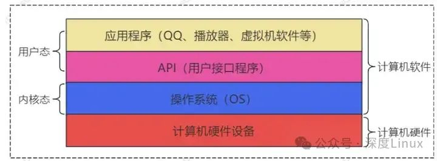
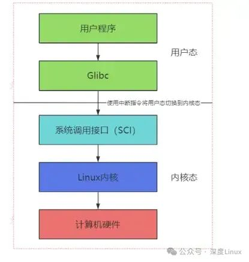

# Linux 系统面试题汇总

本文档汇总了 Linux 系统相关的核心面试知识点，涵盖系统调用、内存管理、进程管理、中断机制、文件系统、同步机制等关键领域。适合用于面试复习和系统知识梳理。

## 一、系统调用

### read() / write() 系统调用内核做了什么

#### read() 系统调用处理流程

**参数验证与文件定位**

- **文件描述符检查**：验证文件描述符是否有效，确认对应文件结构体存在于进程的文件描述符表中
- **当前文件位置确定**：查看文件结构体中的文件偏移量（f_pos），确定读取起始位置
- **访问权限检查**：检查进程是否有读取权限，无权限则返回 `-EACCES`

**根据文件类型进行读取操作**

| 文件类型 | 处理流程 |
| :------- | :------- |
| 普通文件 | 通过文件系统超级块和 inode 确定数据存储位置，利用块设备驱动读取数据到内核缓冲区，再复制到用户空间 |
| 设备文件 | 调用相应设备驱动的 read 操作函数，从设备输入缓冲区读取数据 |

**更新文件位置和返回结果**

- 更新文件偏移量（f_pos += 实际读取字节数）
- 返回值：实际读取字节数；0 表示文件末尾；负数表示错误

#### write() 系统调用处理流程

**参数验证与文件定位**

与 read() 类似，检查文件描述符、确定文件位置、验证写入权限。

**根据文件类型进行写入操作**

| 文件类型 | 处理流程 |
| :------- | :------- |
| 普通文件 | 数据从用户空间复制到内核缓冲区，通过文件系统确定存储位置，利用块设备驱动写入磁盘 |
| 设备文件 | 调用设备驱动的 write 操作函数，将数据写入设备输出缓冲区 |

**更新文件位置和返回结果**

- 更新文件偏移量
- 返回值：实际写入字节数；小于请求值表示部分写入；负数表示错误

## 二、内存管理

### 内存碎片解决办法

#### 内存碎片的类型

| 类型 | 产生原因 | 典型场景 |
| :--- | :------- | :------- |
| 内部碎片 | 分配的内存空间大于实际需求，剩余空间无法被利用 | 固定分区分配、页式存储管理（最后一页未用完） |
| 外部碎片 | 动态分配后产生大量小空闲分区，总和足够但无法满足大块分配需求 | 动态分区分配 |

#### 解决内存碎片的方法

**针对内部碎片**

- **调整页面大小**：平衡内部碎片和地址转换开销
- **段页式存储管理**：根据程序逻辑结构划分段，段内采用页式管理

**针对外部碎片**

| 方法 | 原理 | 特点 |
| :--- | :--- | :--- |
| 紧凑技术（Compaction） | 移动内存中的进程，合并空闲分区 | 开销大，需停止所有进程 |
| 伙伴系统（Buddy System） | 按 2 的幂次方划分内存块，分配时拆分，释放时合并 | 分配释放高效，减少外部碎片 |
| 分页虚拟内存 + 页面置换 | 通过页面置换算法将不常用页面换出到磁盘 | 灵活管理物理内存布局 |

## 三、操作系统特征

### 操作系统四大特征

| 特征 | 说明 |
| :--- | :--- |
| **并发性** | 多个程序在宏观上同时运行 |
| **共享性** | 资源可被多个进程同时访问（同时访问或互斥共享） |
| **虚拟性** | 通过技术手段将物理资源抽象为逻辑资源（硬件虚拟化、存储虚拟化等） |
| **异步性** | 进程执行走走停停，以不可预知的速度推进 |



## 四、内核态与用户态

### 内核态与用户态的区别

| 维度 | 用户态 | 内核态 |
| :--- | :----- | :----- |
| **权限** | 只能执行用户级指令，不能直接访问硬件 | 可执行所有 CPU 指令，包括特权指令 |
| **资源访问** | 只能访问用户空间内存 | 可访问整个系统物理内存 |
| **运行程序** | 用户应用程序 | 操作系统内核代码、设备驱动 |
| **切换方式** | 通过系统调用或硬件中断进入内核态 | 内核处理完成后恢复用户上下文 |

## 五、用户态切换到内核态方式

### 三种切换方式

| 方式 | 触发条件 | 特点 |
| :--- | :------- | :--- |
| **异常和中断处理** | 硬件中断、程序异常 | 被动触发 |
| **系统调用（System Call）** | 用户程序主动请求内核服务 | 主动触发 |
| **处理器陷阱（Trap）指令** | 执行特权操作 | 主动触发 |



## 六、线程和协程

### 线程和协程的区别

#### 基本概念

- **线程**：操作系统能够进行运算调度的最小单位，包含在进程中，共享进程资源，有独立栈空间
- **协程**：用户态的轻量级执行单元，由程序自己控制调度，而非操作系统内核

#### 核心区别

| 维度 | 线程 | 协程 |
| :--- | :--- | :--- |
| **调度方式** | 内核调度，使用调度策略决定执行顺序 | 用户态调度，程序主动让出执行权 |
| **上下文切换开销** | 大（需进入内核态，保存/恢复寄存器、程序计数器等） | 小（用户态完成，仅保存程序计数器、局部变量等） |
| **资源占用** | 较多（独立栈空间、线程控制块 TCB） | 少（动态分配栈，通常几百字节到几 KB） |
| **并发性能** | 可利用多核实现真正并行 | 单线程内并发，适合 I/O 密集型任务 |

#### 使用场景

| 场景 | 推荐选择 | 原因 |
| :--- | :------- | :--- |
| 多核并行计算 | 线程 | 真正利用多核 CPU |
| I/O 密集型任务 | 协程 | 高效切换，减少等待时间 |
| 异步编程/事件驱动 | 协程 | 配合异步 I/O 实现非阻塞 |

## 七、中断

### 中断上下文为什么不能睡眠

中断上下文属于**非抢占式**执行环境，不会被其他任务或中断打断。若在中断处理程序中调用可能导致睡眠的函数，会阻塞整个系统。

**替代方案**：使用定时器、延迟处理机制、工作队列等异步方式完成延迟或等待操作。

### 硬件中断处理流程

```
中断触发 → 中断控制器通知（APIC/IOAPIC）→ 中断向量分配 → 中断请求处理程序 → 上下文切换 → ISR 执行操作 → 处理完毕和结束
```

### 中断现场保存位置

在 x86 架构中，发生硬件中断或异常时：

1. CPU 自动将当前指令位置和相关寄存器值保存到栈
2. 切换到特权级别高的内核模式（Ring 0）
3. 调用与中断类型相关的处理函数
4. Linux 内核使用 `struct pt_regs` 数据结构保存被中断进程或内核线程的上下文

```c
/*
 * 中断帧数据结构，用于保存被中断的进程或内核线程的上下文信息
 */
struct pt_regs {
    unsigned long bx;
    unsigned long cx;
    unsigned long dx;
    unsigned long si;
    unsigned long di;
    unsigned long bp;
    unsigned long ax;
    unsigned short ds;
    unsigned short __dsh;
    unsigned short es;
    unsigned short __esh;
    unsigned short fs;
    unsigned short __fsh;
    unsigned short gs;
    unsigned short __gsh;
    unsigned long orig_ax;
    unsigned long ip;
    unsigned short cs;
    unsigned short __csh;
    unsigned long flags;
    unsigned long sp;
    unsigned short ss;
    unsigned short __ssh;
};
```

### 软中断和工作队列的作用

| 机制 | 作用 |
| :--- | :--- |
| **软中断** | 异步事件处理机制，用于处理延迟执行任务 |
| **工作队列** | 任务调度机制，将需要在后台执行的任务安排到适当时机运行 |

## 八、文件系统

### 嵌入式常用文件系统

| 文件系统 | 特点 | 适用场景 |
| :------- | :--- | :------- |
| **FAT** | 兼容性好，实现简单 | 移动存储设备、兼容性要求高的场景 |
| **EXT 系列** | 稳定可靠，功能丰富 | 通用 Linux 系统 |
| **JFFS2** | 日志结构，适合闪存 | NOR Flash 设备 |
| **YAFFS** | 专为 NAND Flash 设计 | NAND Flash 设备 |

## 九、同步机制

### 为什么 spinlock 临界区不能睡眠

**Spinlock** 是采用忙等待模式的同步原语，获取锁时不断循环检测锁是否可用。若在临界区内睡眠，会导致：

- 持有锁的进程睡眠，其他等待该锁的进程持续忙等待（空转）
- 造成 CPU 资源浪费，甚至死锁

### Kdump 工作原理

Kdump 是 Linux 系统的崩溃转储机制，在系统产生严重错误或崩溃时将内存转储保存到磁盘。

**工作流程**：

```
配置和启动 → 保留空间 → 崩溃触发 → 内核切换 → 转储生成 → 转储保存 → 重启系统
```

### printk 输出等级

| 等级 | 宏定义 | 说明 |
| :--- | :----- | :--- |
| 0 | `KERN_EMERG` | 紧急 |
| 1 | `KERN_ALERT` | 警报 |
| 2 | `KERN_CRIT` | 临界 |
| 3 | `KERN_ERR` | 错误 |
| 4 | `KERN_WARNING` | 警告 |
| 5 | `KERN_NOTICE` | 注意 |
| 6 | `KERN_INFO` | 信息 |
| 7 | `KERN_DEBUG` | 调试 |

### CMWQ 机制

**CMWQ（Concurrent Multiple Work Queue）** 是用于动态管理工作线程池的机制，主要特点：

- **多工作队列**：包含多个工作队列，每个队列可由多个消费者线程同时访问
- **动态调整线程数**：根据系统负载和任务需求动态增减工作线程
- **任务分配**：使用调度策略（轮询、随机选择等）将任务分配到合适队列
- **监控与反馈**：追踪队列任务数、线程状态、系统负载，及时调整
- **优先级与公平性**：支持任务优先级调度，避免饥饿现象

### 信号量与互斥锁的选择

| 场景 | 推荐选择 | 原因 |
| :--- | :------- | :--- |
| 保护共享数据，保证独占访问 | 互斥锁（Mutex） | 开销低，专为互斥设计 |
| 控制有限数量资源的访问 | 信号量（Semaphore） | 支持计数，适合生产者-消费者模型 |
| 同一线程多次获取同一把锁 | 可重入互斥锁 | 避免死锁 |

### 内存屏障的使用场景

**内存屏障（Memory Barrier）** 用于控制 CPU 及其缓存对内存访问的顺序。

| 场景 | 使用原因 |
| :--- | :------- |
| **多线程/多处理器环境** | 确保特定读/写操作在其他核心上可见 |
| **同步原语实现** | 保证锁的状态变化被所有线程正确感知 |
| **中断处理** | 确保 ISR 中的数据修改能被主程序正确识别 |
| **外设 I/O 操作** | 确保 CPU 与外设之间的数据传输按特定顺序执行 |
| **非原子性操作** | 保障检查和设置等操作之间的顺序关系 |

### ARM64 独占访问内存实现

| 方法 | 说明 |
| :--- | :--- |
| **原子操作** | `LDAR`（加载-链接）和 `STLR`（存储-条件）指令组合 |
| **锁机制** | 自旋锁、互斥锁，使用原子操作管理 |
| **MMU 和页表** | 配置内存管理单元控制访问权限 |
| **信号量和条件变量** | 限制同时访问资源的线程数量 |
| **禁用中断** | 实时系统中临时禁用中断确保独占权（谨慎使用） |

### 原子操作函数

#### atomic_cmpxchg()

**功能**：比较并交换。比较内存位置的当前值与预期值，相等则更新为新值。

```c
T atomic_cmpxchg(T *ptr, T expected, T desired);
```

- 返回：目标地址原有的值
- 使用场景：实现锁、无锁数据结构

#### atomic_xchg()

**功能**：原子交换。直接将目标地址的值替换为新值，返回旧值。

```c
T atomic_xchg(T *ptr, T new_value);
```

- 返回：目标地址之前的旧值
- 与 `cmpxchg` 区别：不执行比较，每次调用都成功交换

#### atomic_try_cmpxchg()

**功能**：尝试原子比较交换，非阻塞版本。

- 与 `atomic_cmpxchg()` 区别：更轻量，快速尝试，行为可能因库而异

## 十、进程间通信

### 用户进程通信方式

| 方式 | 特点 | 适用场景 |
| :--- | :--- | :--- |
| **管道（Pipes）** | 单向数据流，无名管道限于父子进程，命名管道（FIFO）可无亲缘关系 | 简单数据传输 |
| **消息队列** | 以消息为单位异步通信 | 结构化消息传递 |
| **信号量** | 控制资源访问，可同步可互斥 | 资源计数、同步 |
| **共享内存** | 多个进程访问同一块物理内存，速度快 | 大数据量交换 |
| **套接字（Sockets）** | 支持本地和网络通信 | 分布式应用 |
| **文件映射（mmap）** | 通过内存映射文件共享数据 | 大块数据传输 |

## 十一、进程调度

### 并发与并行的区别

| 概念 | 定义 | 特点 |
| :--- | :--- | :--- |
| **并发（Concurrency）** | 同一时间段内处理多个任务 | 单核 CPU 通过时间片轮转实现，任务交替执行 |
| **并行（Parallelism）** | 同一时刻同时执行多个任务 | 需要多核 CPU 或多台机器，真正同时执行 |

### 进程调度策略

| 策略 | 描述 | 优点 | 缺点 |
| :--- | :--- | :--- | :--- |
| **FCFS** | 先来先服务 | 实现简单，公平 | 可能导致短任务饥饿 |
| **SJF** | 短作业优先 | 减少平均等待时间 | 难以预测运行时间 |
| **优先级调度** | 按优先级调度 | 灵活 | 低优先级可能饥饿 |
| **轮转法（RR）** | 固定时间片轮流执行 | 适合分时系统 | 时间片大小影响性能 |
| **多级队列** | 不同类型进程划分到不同队列 | 适应性强 | 复杂性高 |
| **多级反馈队列** | 动态调整进程优先级 | 灵活，平衡长短作业 | 实现复杂 |
| **CFS** | 完全公平调度器（Linux） | 公平分配 CPU 时间 | - |

### 进程调度设计指标

| 指标 | 说明 |
| :--- | :--- |
| **CPU 利用率** | CPU 处于执行状态的时间比例 |
| **周转时间** | 进程提交到完成的总时间 |
| **等待时间** | 进程在就绪队列中等待的时间 |
| **响应时间** | 用户请求到系统开始处理的时间 |
| **吞吐量** | 单位时间内完成的进程数 |
| **公平性** | 所有进程获得合理的 CPU 机会 |
| **实时性** | 满足特定任务的期限要求 |

### 多线程模型

| 模型 | 映射关系 | 优点 | 缺点 |
| :--- | :--- | :--- | :--- |
| **多对一** | 多个用户级线程映射到一个内核级线程 | 线程切换快，实现简单 | 一个线程阻塞导致所有阻塞，无法利用多核 |
| **一对一** | 每个用户级线程对应一个内核级线程 | 并发性能好，可利用多核 | 资源消耗大，线程切换开销大 |
| **多对多** | 多个用户级线程映射到多个内核级线程 | 兼具高效性和并发性 | 实现复杂 |

## 十二、内存相关机制

### 申请大块内核内存的方法

| 函数 | 适用场景 | 特点 |
| :--- | :--- | :--- |
| `kmalloc()` | 小块内存（通常 < 几千字节） | 物理连续，速度快 |
| `vmalloc()` | 大块连续虚拟地址 | 物理不连续，速度较慢 |
| `__get_free_pages()` | 页大小倍数的内存 | 返回页框号 |
| `dma_alloc_coherent()` | DMA 操作 | 分配可直接用于 DMA 的连续内存 |

### 伙伴系统相关函数

| 函数 | 功能 |
| :--- | :--- |
| `kmalloc()` / `kfree()` | 分配/释放内存 |
| `__get_free_pages()` / `free_pages()` | 申请/释放连续物理页面 |
| `get_free_page()` | 获取单个自由页（通常 4KB） |

### SLAB 分配器相关函数

| 函数 | 功能 |
| :--- | :--- |
| `kmem_cache_create()` | 创建 SLAB 缓存 |
| `kmem_cache_alloc()` | 从缓存中申请对象 |
| `kmem_cache_free()` | 释放对象回缓存 |
| `kmem_cache_destroy()` | 销毁缓存 |

### SLAB 与 SLUB 分配器对比

| 维度 | SLAB | SLUB |
| :--- | :--- | :--- |
| **引入版本** | Linux 2.6 之前 | Linux 2.6.24 |
| **设计理念** | 使用缓存管理内存，针对特定对象优化 | 简化设计，减少锁竞争 |
| **数据结构** | 每种对象类型有专用缓存，包含多个 slabs | 不使用 slabs，直接管理分配请求，引入 per-cpu caches |
| **性能** | 高并发下可能遇到性能瓶颈 | 更好的并发性能 |
| **配置调试** | 相对复杂 | 更容易配置和调试 |

### 写时复制（Copy-on-Write, COW）

**原理**：多个对象共享同一块内存，仅在需要修改时才复制数据。

**应用场景**：

| 场景 | 说明 |
| :--- | :--- |
| **虚拟内存管理** | `fork()` 时父子进程共享内存，写入时复制 |
| **数据库事务** | 实现版本控制，保证并发事务的一致性视图 |
| **文件系统** | Btrfs、ZFS 使用 COW 支持快照和回滚 |
| **不可变数据结构** | 某些编程语言中优化结构体拷贝 |

### 内存泄漏诊断

**常见原因**：

- 未释放动态分配的内存（`malloc`/`calloc` 后未 `free`）
- 全局变量/静态变量管理不当
- 线程间共享数据未妥善处理
- 文件描述符未关闭

**诊断工具**：

| 工具 | 用途 |
| :--- | :--- |
| **Valgrind** | 检测内存泄漏 |
| **GDB** | 调试，设置断点检查堆栈 |
| **AddressSanitizer** | 检测缓冲区溢出、使用后释放等问题 |
| **静态分析工具** | `cppcheck`、Clang Static Analyzer |

### 交换空间（Swap Space）

**作用**：

- 缓解内存压力，将不活跃数据移到磁盘
- 支持更多并发任务
- 保证系统稳定性
- 支持休眠功能

**配置建议**：通常建议为物理内存大小的 1-2 倍，现代大内存系统可酌情减少。

### TLB（Translation Lookaside Buffer）

**作用**：加速虚拟地址到物理地址的转换。

- 缓存最近使用的页面映射
- 减少访问页表的次数
- 提高系统整体性能
- 支持多级页表结构

### 页面大小

**默认页面大小**：4KB（4096 字节）

**选择 4KB 的原因**：

- 平衡性能与空间
- 硬件原生支持（x86 架构）
- 减少外部碎片
- 简化分页管理
- 提高 TLB 命中率

**大页选项**：2MB、1GB，适用于需要大量连续物理内存的应用。

### 地址类型区别

| 类型 | 定义 | 特点 |
| :--- | :--- | :--- |
| **物理地址** | 实际内存（RAM）中的具体位置 | 硬件层面可见的真实地址 |
| **虚拟地址** | 程序生成的内存地址 | 每个进程独立，由操作系统映射到物理地址 |
| **逻辑地址** | 编译时生成的程序地址 | 可视为虚拟地址的一种形式 |

### 文件映射（mmap）

**功能**：将文件或设备内容映射到内存，创建内存镜像。

```c
void *mmap(void *addr, size_t length, int prot, int flags, int fd, off_t offset);
```

**应用场景**：

- 高效读写大文件
- 实现进程间共享内存
- 懒加载（Lazy Loading）
- 数据库缓存机制
- 设备寄存器快速访问

### 页面异常（Page Fault）

**定义**：程序试图访问不在物理内存中的页时触发的事件。

**类型**：

| 类型 | 说明 |
| :--- | :--- |
| **缺页异常** | 请求的页面不在物理内存中，需从磁盘加载 |
| **保护错误** | 以不被允许的方式访问页面（如写入只读页） |

**常见原因**：

- 数据尚未加载到物理内存
- 页面被换出到磁盘
- 映射错误（越界访问）
- 共享库延迟加载
- 非法地址引用

### 页表与页框

| 概念 | 定义 | 功能 |
| :--- | :--- | :--- |
| **页表（Page Table）** | 映射虚拟地址与物理页框的数据结构 | 将虚拟地址转换为物理地址 |
| **页框（Page Frame）** | 物理内存中的固定大小区域 | 实际存储进程数据和代码 |

### 页面置换算法

| 算法 | 策略 | 特点 |
| :--- | :--- | :--- |
| **OPT（最佳）** | 替换未来最久未使用的页面 | 理论最优，难以实现 |
| **LRU（最近最少使用）** | 替换最近最少被访问的页面 | 性能较好，实现复杂 |
| **FIFO（先进先出）** | 按顺序替换最早进入的页面 | 实现简单，可能出现 Belady 异常 |
| **NRU（最近未使用）** | 根据引用和修改位分类，随机选择替换 | 实现简单 |
| **时钟算法** | 维护指针循环查找，未引用则替换 | 比 FIFO 更有效 |

### 内存池、进程池、线程池

| 类型 | 定义 | 优点 |
| :--- | :--- | :--- |
| **内存池** | 预先分配大块内存，内部管理小块分配 | 减少系统调用，降低碎片 |
| **进程池** | 预先创建多个进程处理任务 | 资源管理，负载均衡，隔离性强 |
| **线程池** | 预先创建多个线程处理任务 | 快速响应，低开销，共享资源 |

## 十三、其他重要概念

### GCC "O0" 优化选项优势

| 优势 | 说明 |
| :--- | :--- |
| **便于调试** | 代码与源代码结构相似，易于跟踪；变量保留在栈上 |
| **简化分析** | 行为可预测，减少编译器优化导致的意外结果 |
| **易于追踪错误** | 崩溃、死锁等问题定位更容易 |
| **增强日志记录** | 确保日志语句不被编译器移除 |
| **快速迭代** | 编译时间更短，适合开发初期 |

### 寻址方式

| 方式 | 定义 | 特点 |
| :--- | :--- | :--- |
| **直接寻址** | 指令中包含操作数的真实内存地址 | 简单直接，缺乏灵活性 |
| **间接寻址** | 指令中包含指向操作数地址的指针 | 灵活性高，增加间接性 |
| **基址寻址** | 基址寄存器内容 + 指令偏移量 = 操作数地址 | 便于程序重定位，兼顾灵活性和安全性 |

### MOV 与 LEA 指令区别

| 维度 | MOV | LEA |
| :--- | :--- | :--- |
| **功能** | 数据传输 | 计算地址 |
| **操作** | 复制数据值 | 加载有效地址 |
| **使用场景** | 复制变量内容 | 获取内存地址、计算数组索引 |

```asm
section .data
    var db 10

section .text
    mov rax, [var]   ; 将 var 的内容（10）移动到 rax
    lea rbx, [var]   ; 将 var 的地址加载到 rbx
```

### 死锁与重定位

#### 死锁（Deadlock）

**定义**：两个或多个进程因争夺资源而互相等待，无法继续执行。

**Coffman 四条件**：

1. 互斥条件
2. 占有且等待
3. 不可剥夺
4. 循环等待

#### 重定位（Relocation）

**定义**：将程序从编译/链接位置转移到运行时地址空间。

| 类型 | 说明 |
| :--- | :--- |
| **静态重定位** | 编译时确定内存地址，载入后不再变化 |
| **动态重定位** | 运行时动态获取地址，通过虚拟内存管理实现 |

### 运行地址、链接地址、加载地址

| 类型 | 定义 | 时间点 |
| :--- | :--- | :--- |
| **运行地址** | 程序实际执行时使用的物理地址 | 运行期 |
| **链接地址** | 静态链接阶段生成的虚拟地址 | 编译期 |
| **加载地址** | 程序被加载到内存的起始位置 | 加载期 |

### 硬件中断号与 IRQ 号映射

| 概念 | 说明 |
| :--- | :--- |
| **硬件中断号** | 硬件设备发送中断请求时的唯一标识符 |
| **IRQ 号** | Linux 内核用于标识和管理中断请求的机制 |

**映射关系**：

- 传统外设通常一对一映射
- 复杂设备可能多对一映射
- Linux 内核提供抽象层，驱动程序通过 API 注册 ISR
- PCI/PCIe 设备使用 MSI/MSI-X 机制

### Linux 内核模式与用户模式

| 模式 | 定义 | 权限 | 运行代码 |
| :--- | :--- | :--- | :--- |
| **用户模式** | 限制性执行环境 | 只能访问用户空间内存 | 普通应用程序 |
| **内核模式** | 特权执行环境 | 可访问所有资源 | 操作系统核心、驱动程序 |

**模式切换**：用户程序通过系统调用进入内核模式，内核处理完成后返回用户模式。

### 虚拟内存

**定义**：内存管理技术，使程序能够使用比物理内存更大的逻辑地址空间。

**优势**：

- 扩展可用内存
- 进程隔离和保护
- 简化编程

**实现机制**：

- 分页（Paging）
- 分段（Segmentation）
