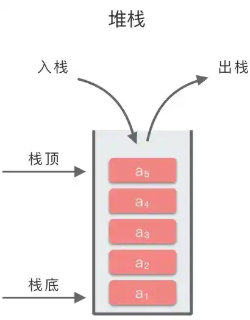

# 经典问题

## volatile是否可以修饰const

在 C 和 C++ 语言中，volatile可以修饰const变量。从语法角度来看，这是完全合法的组合。例如：volatile const int num = 10;这样的代码是可以编译通过的。

-   const关键字的语义：const修饰的变量表示常量，即其值在初始化后不能被程序通过常规的赋值操作改变。它主要用于告诉编译器这个变量的值是固定的，编译器可以利用这个信息进行一些优化。例如，如果一个函数参数是const类型，编译器就知道这个参数在函数内部不会被修改，可能会避免一些不必要的存储操作。
-   volatile关键字的语义：volatile关键字用于告诉编译器，被修饰的变量可能会在程序的控制流之外被改变。这通常用于和硬件交互或者多线程、中断等场景。例如，一个变量可能会被硬件设备（如定时器、传感器等）修改，或者在一个多线程程序中被其他线程修改，那么这个变量就应该被声明为volatile。这样编译器就不会对这个变量进行一些可能会导致错误的优化，比如缓存变量的值。
-   volatile const组合的语义：当volatile和const同时修饰一个变量时，这个变量的值本身不能被程序通过常规赋值操作改变（因为const的限制），但是这个变量的值可能会被程序控制流之外的因素改变（因为volatile的特性）。例如，一个内存映射的硬件寄存器，其值可能会被硬件随时修改，同时程序也不应该去修改这个寄存器的值，就可以用`volatile const`来声明。

假设我们有一个嵌入式系统，其中有一个只读的硬件寄存器，这个寄存器的内容可能会被硬件设备自身的状态变化而更新。在程序中，我们需要读取这个寄存器的值，但是不能修改它。可以这样声明这个寄存器对应的变量：

```c
volatile const uint32_t * const hardware_register = (volatile const uint32_t *)0x12345678;
```

这里volatile表示这个寄存器的值可能会被硬件修改，const表示程序不能通过常规的赋值操作修改这个变量（因为它是只读寄存器），第二个const用于表示指针本身也是常量，即指针不能指向其他的地址。在程序中可以通过*hardware_register来读取这个寄存器的值，但是编译器不会对这个读取操作进行可能导致错误的优化。

## 如何快速一行代码操作硬件寄存器

直接操作硬件寄存器的代码通常依赖于特定平台和编程语言。在 C 或 C++ 中，常见的方法是使用指针来访问内存地址。以下是一个基本示例，假设你知道要操作的寄存器的地址：

```
#define REG_ADDRESS 0x12345678 // 假设这是硬件寄存器的地址
*(volatile int *)REG_ADDRESS = 0x1; // 将值 0x1 写入寄存器
```

在这个例子中：

-   REG_ADDRESS 是寄存器的地址。
-   使用 (volatile int *) 强制转换为指向 volatile int 类型的指针，以确保编译器不会优化掉对这个变量的访问。
-   *(...) 解引用这个指针，从而可以直接读写该地址上的数据。

注意事项：

-   权限：在某些系统上，你可能需要特权（如操作系统内核模式）才能直接访问硬件寄存器。
-   平台依赖性：不同的硬件架构和开发环境会有不同的方法来访问寄存器，因此确保参考相关文档。
-   类型安全性：根据具体应用选择合适的数据类型，以避免潜在的问题。

## 如何最快比较两组寄存器里有多少位不同

要比较两组寄存器的位差异，可以使用按位异或（XOR）操作。通过将两个寄存器的值进行异或运算，结果中的每一位都可以指示这两个值在相应位置上是否不同。然后，统计结果中“1”的数量即为不同位的数量。

下面是一个使用 C 或 C++ 实现的简单示例：

```c++
#include <stdio.h>

// 计算二进制中 1 的个数
int countSetBits(unsigned int n) {
    int count = 0;
    while (n) {
        count += n & 1; // 每次检查最低位
        n >>= 1;        // 右移一位
    }
    return count;
}

int main() {
    unsigned int regA = 0b11001100; // 假设第一个寄存器的值
    unsigned int regB = 0b10101010; // 假设第二个寄存器的值

    unsigned int diff = regA ^ regB; // 按位异或运算

    int numDifferences = countSetBits(diff); // 统计不同位数
    printf("Different bits: %d\n", numDifferences);
    return 0;
}
```

示例说明：

-   countSetBits 函数用于计算给定整数中二进制表示中“1”的数量。
-   regA 和 regB 是要比较的两个寄存器值。
-   使用异或运算符 ^ 来获取不同位的信息。
-   最后输出不同位的数量。

## 堆栈的区别？内存不free会怎么样？

>   堆栈的区别
>



（1）存储方式：栈由编译器自动分配和释放，存放函数的参数值、局部变量等，遵循后进先出原则；堆由程序员手动分配和释放，用于动态内存分配，如通过malloc、new等操作获取内存，分配方式灵活，不遵循特定顺序。

（2）空间大小：栈的空间一般较小，且在程序运行前就确定，不同系统和编译器设定不同；堆的空间相对较大，理论上可使用系统剩余的所有可用内存。

（3）生长方向：栈的生长方向是从高地址向低地址延伸；堆的生长方向是从低地址向高地址扩展。

>   内存不free的后果
>

（1）内存泄漏：程序持续运行会不断申请内存却不释放，未被使用的内存无法被系统回收，导致可用内存逐渐减少，最终可能耗尽系统内存，使程序崩溃，甚至影响其他正常运行的程序。

（2）性能下降：内存不释放会使系统内存碎片增多，在分配较大连续内存块时，尽管总空闲内存足够，但因碎片原因可能无法分配成功，还会增加内存管理开销，导致程序运行速度变慢。

（3）资源浪费：占用的内存无法被其他程序或本程序其他部分使用，造成资源浪费，降低系统整体资源利用率。

## 堆和栈在内存中的分配方式有何区别？

分配方式：

-   堆：堆是由程序员手动分配和释放的，通过动态内存分配函数（如malloc、new）从操作系统获取一块连续的内存空间。
-   栈：栈是编译器自动管理的，通过编译器在函数调用过程中进行自动分配和释放。

分配速度：

-   堆：堆的分配速度相对较慢，因为需要在运行时从操作系统申请内存，并且可能存在内存碎片问题。
-   栈：栈的分配速度较快，只需简单地移动指针来改变栈顶位置。

内存大小：

-   堆：堆通常具有较大的可用内存空间，取决于操作系统允许的总体堆大小和当前堆中已使用的部分。
-   栈：栈通常具有固定大小，并且比堆小得多。每个线程都拥有自己独立的栈空间。

分配方式：

-   堆：堆上的内存可以手动进行动态分配和释放，需要注意及时释放不再使用的内存以避免内存泄漏。
-   栈：栈上的内存是自动管理的，在函数调用结束后会自动释放。

内存访问：

-   堆：对堆上的内存可以在全局范围内进行访问，并且可以通过指针引用来共享数据。
-   栈：栈上的内存只能在其作用域内访问，不可跨函数或线程共享。

## 为什么栈的访问速度比堆快？

-   内存分配方式：栈上的内存分配是按照一种后进先出（LIFO）的方式进行的，分配和释放内存都只需调整栈指针，非常高效。而堆上的内存分配涉及到动态内存管理，需要通过堆指针维护已分配和未分配的内存块，相对来说会慢一些。
-   缓存局部性：栈上的数据具有很好的局部性特点。当函数调用时，在栈上分配的变量和函数参数在物理上相互靠近，这样可以利用处理器缓存的局部性原理，提高访问速度。而堆上的数据则没有这种连续性特点，可能会散布在不同的内存区域中。
-   编译器优化：编译器对于栈上数据访问可以进行更多优化操作。由于栈空间大小在编译时可知，编译器可以对变量访问进行更精确的定位和优化处理。而堆空间大小在运行时动态确定，对于编译器来说难以进行完全优化。

## 如何用C语言实现大小端

在C语言中，可以使用联合体（union）来实现大小端的转换。

首先，定义一个32位无符号整型数（例如uint32_t），然后定义一个联合体，该联合体包含一个该类型的成员和一个4字节大小的字符数组。如下所示：

```c
#include <stdio.h>
#include <stdint.h>

typedef union {
    uint32_t value;
    unsigned char bytes[4];
} EndianConverter;
```

接下来，我们可以编写函数来判断当前系统是大端还是小端。在小端系统中，最低有效字节存储在最低地址上；而在大端系统中，最高有效字节存储在最低地址上。

```c
int isLittleEndian() {
    EndianConverter converter;
    converter.value = 1;
    return converter.bytes[0] == 1; // 如果第一个字节为1，则为小端
}
```

你也可以编写函数来进行大小端转换：

```c
uint32_t swapEndian(uint32_t value) {
    EndianConverter converter;
    converter.value = value;

    unsigned char temp = converter.bytes[0];
    converter.bytes[0] = converter.bytes[3];
    converter.bytes[3] = temp;

    temp = converter.bytes[1];
    converter.bytes[1] = converter.bytes[2];
    converter.bytes[2] = temp;

    return converter.value;
}
```

这样就可以通过调用 isLittleEndian() 函数来判断系统是否为小端，并且通过调用 swapEndian() 函数来实现大小端之间的转换。

## 在C语言中，通过指针访问栈地址还是堆地址快？

在C语言中，通过指针访问**栈地址**通常比访问**堆地址**更快，主要原因包括硬件优化、内存管理机制和缓存局部性等因素。以下是具体分析：

### 硬件与内存管理机制

**栈的访问优势**：

-   **自动分配与连续内存**：栈由编译器自动管理，内存分配和释放通过简单的指针移动（如栈顶指针`esp`/`rsp`）完成，且栈内存是连续的，无需复杂的内存查找。
-   **寄存器支持**：栈操作（如压栈/出栈）有专用寄存器支持，指令效率极高。
-   **预映射物理内存**：栈内存通常在程序启动时已映射到物理内存，首次访问无需处理缺页中断。

**堆的访问劣势**：

-   **动态分配开销**：堆内存需通过`malloc`/`free`手动管理，分配时需搜索空闲内存块并维护链表，释放时可能合并碎片，这些操作均增加时间成本。
-   **非连续内存**：堆内存块可能分散在物理内存中，访问时需多次寻址，易引发缓存未命中（Cache Miss）。

### 缓存局部性（Cache Locality）

**栈的缓存友好性**：

-   栈内存通常位于CPU缓存的热点区域，因其连续性和高频访问特性，数据更易被缓存命中。
-   函数调用的局部变量和参数集中在栈帧中，缓存预取（Prefetching）效率高。

**堆的缓存问题**：

-   堆内存分散性导致缓存利用率低，频繁访问不同堆块可能触发缓存行替换，增加延迟。
-   大块堆内存（如动态数组）可能跨多个缓存行，按行访问时仍需处理缓存未命中。

### 总结与建议

| 特性         | 栈地址访问                 | 堆地址访问               |
| ------------ | -------------------------- | ------------------------ |
| **速度**     | 更快（硬件优化、缓存友好） | 较慢（动态管理、碎片化） |
| **适用场景** | 局部变量、短生命周期数据   | 动态数据结构、跨函数数据 |

编程建议：

-   优先使用栈存储高频访问的小数据（如循环变量、函数参数）。
-   堆适合存储大对象或需灵活管理的数据（如链表、动态数组），但需注意性能损耗和内存管理。

## 什么时候会用到do{}while(0)

`do { } while (0)` 这种结构在C和C++编程中常用于宏定义或控制流的上下文。它看似冗余，但有一些特定的用例，这里是几个主要场景：

### 宏定义

使用 `do { } while (0)` 可以确保宏在被调用时表现得像一个单一语句。这避免了因缺少分号或其他语法问题导致的不良效果。

示例：

```c
#define LOG_ERROR(msg) do { \
    fprintf(stderr, "Error: %s\n", msg); \
} while (0)
```

在这个例子中，无论在什么样的上下文中调用 `LOG_ERROR`，都不会因为缺失分号而导致错误。例如：

```c
if (condition)
    LOG_ERROR("Something went wrong");
else
    do_something();
```

### 单一代码块

`do { } while (0)` 也可以用来创建一个逻辑上独立的代码块，在其中可以使用 `break`、`continue` 或者 `return` 等控制流语句，而不会影响外部的控制流。

示例：

```c
void someFunction() {
    // ...
    do {
        // 一些复杂逻辑
        if (some_condition) {
            return; // 仅返回该函数，不会影响外层循环或条件结构。
        }
        // 更多逻辑...
    } while (0);
}
```

### 提高可读性和维护性

当你需要将多个语句放入一个可控的结构中，并且希望未来可能会修改这个结构（例如添加更多条件），使用这种模式可以提高代码的可读性和一致性。

## delay和sleep的区别

⑴功能目的

delay：主要用于在程序执行过程中产生一个短时间的延迟，通常用于精确控制时间间隔，比如在微控制器编程中控制硬件设备的时序，像在驱动 LED 闪烁时，控制亮灭之间的时间间隔。

sleep：目的是让执行线程或进程暂停执行一段时间，更侧重于让程序在一段时间内进入休眠状态，以释放 CPU 资源或等待某些条件满足，例如在一个多任务系统中，让一个进程暂停运行，使其他任务可以占用 CPU。

⑵应用场景

delay：常见于嵌入式系统和硬件相关的编程，特别是对时间精度要求较高的操作，如控制电机的转速、产生特定频率的脉冲信号等。也用于一些简单的顺序程序中，在两个操作之间插入短暂延迟，实现简单的时间控制。

sleep：多用于操作系统环境下的多任务编程。例如，在服务器程序中，让一个不需要一直占用 CPU 的任务进入睡眠状态，等待客户端请求到来；或者在命令行工具中，让程序暂停执行，模拟长时间运行任务中的等待阶段。

⑶实现方式和对系统的影响

delay：实现方式可能因平台而异，在一些简单的微控制器中，通过循环等待系统时钟计数达到一定值来实现，这种方式会占用 CPU 资源，在延迟期间 CPU 无法执行其他任务。但在某些具有硬件定时器支持的系统中，它可以利用定时器来实现，此时 CPU 可以在延迟期间执行其他任务。

sleep：在操作系统中，会使调用它的线程或进程进入阻塞状态，操作系统会调度其他就绪的任务运行。当睡眠时间结束，线程或进程会重新进入就绪状态，等待系统调度执行。它是一种基于操作系统调度机制的暂停方式，对系统的资源管理和任务调度有着良好的支持。

## 如何合理高效静态分配内存

静态分配内存是指在程序编译时就确定了内存的大小和位置，这种方法通常用于确定不会在运行时改变大小的数据结构。合理高效的静态分配内存可以帮助提高程序性能并减少运行时错误。以下是一些建议：

### 数据结构设计

-   选择合适的数据结构：根据应用需求选择最适合的数据结构（例如，数组、结构体等）。
-   避免过度设计：尽量简化数据结构，确保其只包含必要的信息。

### 内存划分

-   合理划分模块：将不同功能的变量和数据放置在不同的区域，以提高可读性和维护性。
-   常量与全局变量：使用常量来替代不需要更改的值，并将全局变量限制到最低限度，以减少潜在冲突。

### 类型与大小

-   精确类型选择：根据实际需求选择数据类型。例如，如果只需要表示0到255之间的整数，可以使用uint8_t而不是int。
-   预留冗余空间：在某些情况下，适当预留额外的空间可以避免频繁地重新定义内存大小，如为数组添加一个元素以便后续扩展或处理边界情况。

### 编译器优化

-   利用编译器特性：许多现代编译器提供了优化选项，可以通过指定不同的优化级别来改善生成代码的性能。
-   内联函数：对于频繁调用的小函数，可以考虑使用内联函数来减少函数调用带来的开销。

### 确保可移植性

平台独立性：尽量避免依赖特定平台的实现细节，比如直接操作硬件地址，而应通过标准API进行交互。

示例代码

```c
#include <stdint.h>

#define MAX_ITEMS 100

typedef struct {
    uint8_t id;
    char name[50];
} Item;

static Item inventory[MAX_ITEMS]; // 静态分配内存

// 函数声明
void addItem(uint8_t id, const char* name);
void printInventory(void);

// 添加物品到库存
void addItem(uint8_t id, const char* name) {
    static int count = 0; // 计数器，静态保存状态
    if (count < MAX_ITEMS) {
        inventory[count].id = id;
        strncpy(inventory[count].name, name, sizeof(inventory[count].name) - 1);
        count++;
    }
}

// 打印库存内容
void printInventory(void) {
    for (int i = 0; i < MAX_ITEMS; i++) {
        if (inventory[i].id != 0) { // 假设0表示未用物品
            printf("ID: %d, Name: %s\n", inventory[i].id, inventory[i].name);
        }
    }
}
```

注意事项

-   调试信息记录：静态分配可能导致难以排查的问题，特别是在复杂系统中。适当记录调试信息，有助于后期维护。
-   资源管理：虽然静态分配不会出现动态分配中的泄漏问题，但也要注意防止超出所定义界限访问内存。
-   跨平台兼容性：如果打算让程序支持多种硬件或操作系统，要仔细审视各种边界条件下如何管理这些静态资源。

## 正常非掉电重启是否要释放内存

在正常的非掉电重启（例如软件重启或系统重启）中，操作系统通常会进行一定的内存清理和资源释放。这是因为：

-   内存管理：大多数现代操作系统在启动时会重新初始化其内存管理子系统，包括清除和重新分配内存。在这个过程中，之前申请的动态内存会被标记为未使用，并可以被新的进程或线程重新利用。
-   资源回收：当操作系统重启时，它会关闭所有正在运行的程序并释放它们所占用的资源，包括打开的文件、网络连接等。这有助于防止资源泄漏和保持系统稳定性。
-   数据一致性：在某些情况下，应用程序可能存在未保存的数据或状态。重启时，这些数据应该适当地处理，以确保数据一致性。例如，有些应用程序可能需要在退出前保存其状态或设置。

需要注意的事项

-   应用程序行为：对于特定的应用程序，如果它们没有正确地处理资源释放（如没有实现析构函数或者清理代码），那么在正常重启后这些资源仍然可能没有被释放。因此，设计良好的应用程序应确保在停止时能够妥善管理其使用的资源。
-   临时文件与缓存：如果你的应用使用了临时文件或缓存，这些也应该在重启过程中得到妥善处理。尽量避免不必要的数据保留，以免影响下次启动时的性能。
-   整体设计考虑：虽然操作系统会自动处理很多内存和资源管理，但对于特定类型的嵌入式系统或者特殊环境（例如实时操作系统），开发者可能需要自行编写代码以确保彻底释放某些关键资源，以避免潜在的问题。

## 正常掉电关机流程是否要释放内存

正常掉电关机流程中，操作系统不会有机会主动释放内存或进行资源清理。这是因为掉电关机（如断电、拔掉插头等）会导致操作系统无法执行其关闭程序，因此可能会出现以下情况：

-   数据丢失：如果应用程序正在使用的内存中有未保存的数据，它们将会丢失。尤其是在没有及时写入磁盘的情况下，临时文件和缓冲区中的数据可能不会被保存。
-   文件系统损坏：由于没有适当关闭，文件系统可能会处于不一致状态，导致下次启动时出现错误或者需要进行修复。例如，如果某个进程正在写入文件而突然断电，该文件可能损坏。
-   资源泄漏：某些资源，如打开的文件句柄、网络连接等，在掉电前并未得到正确释放，从而可能影响下一次重启后的运行状态。

如何减轻风险

为了减轻掉电关机对系统的影响，可以采取以下措施：

-   频繁保存状态：对于关键应用，建议实现自动保存功能，将重要数据定期写入磁盘，以减少因意外关机导致的数据丢失。
-   使用UPS（不间断电源）：对于需要高可用性的设备，可以考虑使用UPS设备。当发生停电时，UPS可以提供备用电力，让系统完成正常关机流程。
-   增强容错性：设计应用时应考虑到突发情况，例如编写代码以处理异常和恢复工作状态。确保应用能够从上一次的已知良好状态继续运行，而不是完全依赖于每次干净的关闭过程。
-   数据完整性检查：在启动过程中，对关键数据和配置文件进行完整性检查，如有问题则提示用户修复或恢复备份版本，以保证系统稳定运行。

## 非掉电异常如何处理

非掉电异常（如操作系统崩溃、程序异常终止或其他硬件故障等）对系统的影响可能与掉电关机类似，但可以采取一些措施来缓解这些问题。以下是一些处理非掉电异常的建议：

### 异常捕获和处理

使用异常处理机制：在编程语言中，利用try-catch块（或相似机制）来捕获运行时错误，防止程序崩溃。通过适当的错误处理，可以执行清理任务，比如释放资源、记录日志等。

全局异常处理：对于未捕获的异常，可以设置全局异常处理器，这样即使个别部分出现问题，也能保证程序不会立即崩溃，并能够执行某些清理操作。

### 定期保存状态

自动保存功能：对于用户交互性较强的应用，提供定期自动保存功能，以减少数据丢失的风险。例如，在文本编辑器中，每隔一定时间保存当前文档的副本。

检查点机制：在长时间运行的进程中，可以引入检查点机制定期保存状态，当程序发生异常时可以从最近一次检查点恢复，而不必从头开始。

### 日志记录

详细日志记录：实现全面的日志记录，包括正常操作日志和错误日志。在应用出现故障后，通过分析日志帮助开发人员快速定位问题根源。

监控工具：使用监控工具实时跟踪系统性能和状态，及时发现潜在的问题并进行预警。

### 恢复策略

重试逻辑：对于可恢复性的操作，如网络请求或数据库事务，可以实现重试机制。如果第一次尝试失败，可以在稍后重新尝试该操作。

回滚策略：对关键交易或变更实施回滚策略，在出现问题时将系统还原到上一个已知良好的状态。这通常在数据库事务中应用广泛。

### 测试和验证

单元测试和集成测试：确保代码质量，通过持续集成/持续部署（CI/CD）流程自动化测试，提高软件在各种情况下的健壮性。

压力测试：模拟极端负载情况，观察系统行为，以发现潜在瓶颈和脆弱环节，进行改进以提高稳定性。

### 定期备份

数据备份方案：为重要数据制定定期备份方案，确保即使发生非掉电异常，也能通过备份恢复数据。

## 非正常掉电如何保护

⑴硬件层面的保护措施

-   使用 UPS（不间断电源）：UPS 是一种能够在市电断电时，为设备提供临时电力支持的设备。它包含电池、充电器、逆变器等组件。当市电正常时，UPS 对电池进行充电，并将市电稳压后供给设备；当市电断电时，UPS 的逆变器将电池的直流电转换为交流电，继续为设备供电。这样可以为系统提供一定时间的电力，让系统有足够的时间进行正常关机或数据保存操作。UPS 的容量（以伏安或瓦特为单位）决定了它能为设备供电的时长，在选择 UPS 时，需要根据设备的功率和所需的备用时间来确定合适的型号。

-   添加硬件看门狗电路：硬件看门狗是一个定时器电路，它需要在规定的时间间隔内被复位，否则会产生一个复位信号。在系统正常运行时，软件会定期地复位看门狗。当发生非正常掉电时，如果软件无法正常工作，看门狗定时器会超时并产生复位信号，使系统重新启动。一些复杂的看门狗电路还可以在复位后检测系统状态，例如判断是因为电源故障还是软件故障导致的复位，并且可以采取一些相应的恢复措施，如加载默认配置等。

-   采用非易失性存储设备备份关键数据：对于一些关键数据，可以使用非易失性存储设备进行备份。例如，EEPROM（电可擦除可编程只读存储器）或闪存（Flash Memory）。在系统运行过程中，定期将重要的数据（如设备的配置参数、运行状态记录等）写入这些非易失性存储设备。当发生掉电后，这些数据不会丢失，在系统重新上电后，可以从这些存储设备中读取数据，恢复系统的部分功能。同时，在向非易失性存储设备写入数据时，要注意数据的完整性和正确性，例如采用校验和或纠错码等方式。

⑵软件层面的保护策略

**数据备份与恢复机制**：设计合理的数据备份策略，例如，对于数据库系统，可以采用事务日志的方式。在每个事务操作过程中，将操作记录到事务日志中，这些日志存储在非易失性存储介质上。当发生掉电后，在系统重新启动时，可以根据事务日志来恢复数据库的状态，确保数据的一致性。对于其他类型的应用程序，可以定期将数据的关键部分（如内存中的缓存数据、用户的操作记录等）保存到文件中。在恢复时，通过读取这些备份文件来重新构建系统的状态。

还可以采用数据镜像或冗余存储的方式。例如，在分布式系统中，将数据同时存储在多个节点上，当一个节点因掉电而丢失数据时，可以从其他节点获取数据进行恢复。这种方式可以提高系统的可靠性，但也增加了数据管理的复杂性和存储成本。

**异常处理与状态记录**：在软件中加入完善的异常处理机制，当检测到电源故障信号（如某些硬件平台会提供电源故障中断）时，尽可能地保存当前系统的状态信息。例如，记录正在执行的任务、打开的文件列表、内存中的重要变量值等。这些状态信息可以帮助在系统重新启动后，快速地定位问题并恢复到一个相对合理的工作状态。同时，对于一些无法完成的操作（如正在进行的文件写入操作），要进行适当的回滚或标记，避免数据损坏。

可以利用日志系统来记录系统的运行状态和重要事件。在发生掉电后，通过分析日志来了解系统在掉电前的状态，判断是否有数据丢失或系统损坏的风险。日志可以存储在本地的非易失性存储设备上，也可以发送到远程服务器进行存储，以提高日志的安全性。

**系统检查点机制**：建立系统检查点是一种有效的保护方法。在系统运行过程中，定期设置检查点，将系统的关键状态（包括内存数据、进程状态、设备状态等）保存到非易失性存储介质中。当发生掉电后，系统可以从最近的检查点恢复。这种机制类似于游戏中的存档功能，通过合理设置检查点的间隔和内容，可以在保证系统性能的前提下，最大程度地减少掉电造成的损失。在实现检查点机制时，需要考虑数据的一致性和完整性，避免在保存检查点数据的过程中出现新的问题。

## 如果确定一段程序运行所需要的堆栈大小？

确定一段程序运行所需的堆栈大小需要结合静态分析、动态测试和系统工具监控。以下是具体方法和步骤：

### 静态分析：代码结构与变量计算

局部变量与函数调用深度：

-   统计每个函数的局部变量（尤其是大数组或结构体）占用的栈空间，例如：

    ```
    void func() {
        int buffer[1024]; // 占用 4KB 栈空间（假设int为4字节）
    }
    ```

-   递归函数的栈需求 = 单次调用栈帧大小 × 最大递归深度。

参数传递：指针参数仅占4/8字节（32/64位系统），但传递结构体时会拷贝整个结构到栈中。

### 动态测试：运行时监控

栈指针差值法：

-   在程序入口和最深调用处记录栈指针差值（需内联汇编或编译器扩展）：

    ```
    size_t get_stack_usage() {
        void *start, *end;
        __asm__ volatile ("mov %%rsp, %0" : "=r"(start)); // 记录起始栈指针
        recursive_func(); // 触发最深调用
        __asm__ volatile ("mov %%rsp, %0" : "=r"(end));
        return (size_t)start - (size_t)end; // 栈向下增长时计算差值
    }
    ```

调试工具：

-   GDB：通过`backtrace`和栈帧信息观察调用深度。
-   Valgrind：使用`--tool=callgrind`分析调用关系。

## 多线程环境下野指针的典型风险是什么？

多线程中，若一个线程释放内存后未置空指针，另一个线程可能访问到已释放的内存。例如：

```c
int *ptr = new int(10);
// 线程1
delete ptr;
ptr = nullptr; // 正确操作可避免野指针

// 线程2（若线程1未置空）
if (ptr != nullptr) *ptr = 20; // 可能访问已释放内存
```

**解决方法**：使用互斥锁（std::mutex）同步内存访问，或通过原子操作（std::atomic）确保指针释放与置空的原子性。
